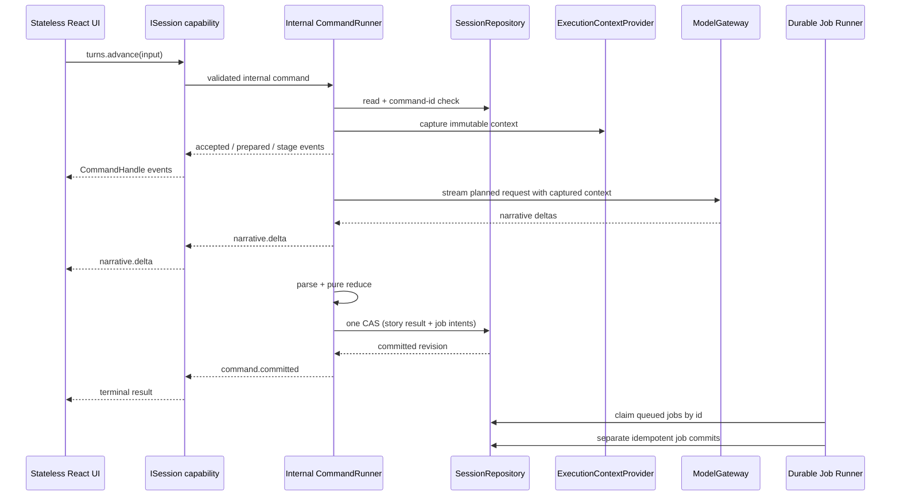

# IKernel Ideal Refactor & Optimization Plan

**Status:** architecture plan, not implementation

**Scope:** production runtime, kernel contract, session persistence, execution workflow, UI projection, device preferences, saves, and host capabilities

**Method:** source inspection, kernel-relevant extraction from the supplied third-party frontend review, plus `$taste-check`; no build or test was run while writing this plan

## 1. Executive decision

Keep the parts that already have real value:

- one asynchronous command entry;
- command identity and idempotent retry;
- revision/CAS at the durable session boundary;
- explicit cancellation owned by the running command;
- fail-fast schema ingress.

Replace the architecture around that core. The target is a **wide but shallow application kernel**: root capabilities are explicit, story operations are scoped through an opened session, and every public method represents a typed use case. Interface minimalism is not a goal; authority clarity is.

The refactor is successful only when all of the following are true:

1. `SessionRepository` is the only writer of durable story state.
2. Device preferences, secrets, content libraries, story state, command process state, and UI-local state are different types with different repositories.
3. React never uploads a reconstructed runtime graph to the kernel.
4. A command captures one immutable execution configuration at start; neither commit, rejection, cancellation, reroll, load, nor projection can write that configuration back.
5. `IKernel` exposes typed capability groups such as sessions, saves, device preferences, content, diagnostics, cloud, and host operations. It never exposes repositories, arbitrary preference keys, internal modules, or a generic service locator.
6. The UI is stateless with respect to game state: it renders kernel projections and sends intents, but never owns or reconstructs a formal domain slice.
7. The UI consumes presentation-facing clients and projections, never the composition root, kernel ports, domain state, or workflow modules.
8. A completed core turn is not kept open while optional background work finishes.
9. Every migrated slice deletes its old write path in the same cutover. There is no dual-write bridge or permanent compatibility adapter.

This is a breaking redesign. A sequence of small live patches would preserve the authority problem and should not be treated as completion.

## 2. Taste check of the current architecture

### 【品味评分】

🔴 Architecture requires a rewrite. The command/CAS core is useful, but the surrounding data structures force callers to compensate with special cases.

### 【致命问题】

1. **The data model lies about ownership.** `RuntimeGameState` claims to be a complete kernel-owned game graph while containing API secrets, model routing, theme, worldbooks, and mixed `游戏设置`. React also reconstructs and checkpoints that graph. Two writers are inevitable.
2. **The public abstraction points inward.** `IKernel.services` exposes dozens of internal modules and `IKernel.saves`/preference methods expose unrelated application capabilities. Callers must understand implementation topology instead of stable use cases.
3. **Legacy mutation was moved behind an adapter, not removed.** `BrowserTurnEngine` manufactures a setter-heavy `RuntimeDraftState` so the 3,000-line `sendWorkflow` can mutate state as before. This is a compatibility shell around the old workflow, not a clean kernel application service.

### 【代码异味】

#### 防御性代码

- [x] Runtime consumers use optional/default fallback logic because validation and migration are not confined to one boundary.
- [x] `游戏设置` contains optional legacy fields and multiple unrelated ownership classes.
- [x] UI recovery code repeatedly reasserts “live preferences” after applying a session projection.

#### 后置修改

- [x] `createDraftState` creates an object, then dozens of setters mutate it during workflow execution.
- [x] React setters apply a returned `SessionView` field by field, including fields unrelated to the command.

#### 字符串拼接

- [ ] Not a kernel-boundary blocker. Prompt composition should be reviewed inside the later workflow decomposition, not used to distract from ownership.

#### 函数职责

- [x] `hooks/useGame.ts` combines command creation, revision tracking, cancellation, projection, persistence, save conversion, UI cleanup, and error reporting.
- [x] `sendWorkflow.ts` combines request planning, retrieval, model IO, parsing, reduction, background jobs, queueing, and UI callbacks.
- [x] `NativeKernel` dispatches use cases while also proxying saves, preferences, and a service locator.

#### 缩进层级

- [x] Workflow complexity is controlled with flags, callbacks, and nested phases instead of explicit typed stages.

#### 特殊情况

- [x] Continue and Load preserve preferences, apply a session projection, then reapply preferences.
- [x] Every game command first performs `session.checkpoint` to reconcile React with the kernel.
- [x] `cancel` throws for a missing command while `cancelAndWait` silently succeeds.
- [x] `prepared` exists mainly for reroll display, while other real process states are invisible.

#### 死代码 / obsolete scaffolding

- [x] “Phase 1”, “legacy formal-commit boundary”, and old bridge comments remain in production paths after the claimed native cutover.
- [x] `KernelServices` plus `BrowserKernelServices.makeAsync` adds ceremony without enforcing a boundary.

### 【改进建议】

- Fix the types and authorities first. Downstream code becomes simpler only after impossible mixed states are removed.
- Replace generic runtime upload with semantic commands and kernel-owned reducers.
- Replace the mutable setter emulation with explicit workflow stages and pure state transitions.
- Move unrelated host capabilities beside the kernel, not through it.
- Make process events complete enough that React does not infer execution status from `loading`, stale hints, and a global streaming string.

### 【重构优先级】

1. Split state planes and remove secrets/preferences from session persistence and projection.
2. Replace the current service-locator surface with a session-scoped capability facade; remove checkpoint/reset graph injection and composition-root bypasses.
3. Rewrite turn/reroll execution and UI projection around typed events and one formal writer.
4. Split background jobs and decompose the legacy workflow.
5. Delete obsolete facades, setters, comments, and compatibility code; then optimize cloning and render subscriptions.

### Third-party frontend audit: kernel-relevant extract

The supplied third-party review correctly distinguishes pure UI state from component-owned game behavior. Codex verified the representative production paths against the current tree. The useful finding is the classification, not the supplied percentages: the current tree has 116 `getAdaptationServices()` call sites across 24 component files and 30 direct `setPreference()` call sites across 19 component files, but those calls include both legitimate host tools and genuine story-authority bypasses.

#### Story/session bypasses that become `ISession` use cases

| Current component behavior | Verified examples | Target session capability |
| --- | --- | --- |
| Generate a phone reply, write immediate memory, compress memory/NPC ledgers, then manually fan results back into React | `PhoneModal.tsx` | `session.phone.sendMessage()` as one workflow command |
| Generate an image, create/commit an album entry, bind a display slot, update traveler/NPC projections, or delete entries and bindings | `AlbumWorkspace.tsx` | `session.album.generate()`, `bindSlot()`, `deleteEntries()` |
| Change or awaken a path by calling domain helpers and then invoke React setters | `PathPanel.tsx`, `PathAwakeningInvitation.tsx`, `PathDebugView.tsx` | `session.paths.setPrimary()`, `rejectInvitation()`, `awaken()` |
| Decompose story segments while manually writing processing/success/failure state | `PlotPanel.tsx` | `session.plot.decomposeSegment()` / `decomposeBatch()` |
| Generate story-bound skill drafts or opening data directly from components | `SkillPanel.tsx`, `NewGameWizard.tsx` | `session.skills.generateDraft()` or root `onboarding` capability before session creation |
| Invoke memory operations and then call component callbacks to install results | `MemorySystemPanel.tsx`, `CompanionPanel.tsx` | `session.memory.*` / `session.companions.*` |

These are not merely “service calls from React”. Each component currently owns workflow ordering, partial-failure behavior, retry display, and multi-slice writeback. Moving the service function alone is insufficient; the complete transaction and process state must move behind the session capability and its `CommandHandle`.

#### Direct persistence that must not become checkpoint

The review also identifies direct `setPreference()` calls in Zhiku, plot, star-map, album, and settings components. The observation is useful, but the suggested checkpoint remedy is rejected:

- story-specific mutation becomes a semantic `ISession` command;
- reusable Zhiku/story/prompt content becomes a typed `kernel.content` use case;
- API, execution, theme, and display settings become typed `kernel.device` use cases;
- no component writes arbitrary preference keys;
- no preference operation uploads or checkpoints `StoryState`.

#### Legitimate non-session tools

Connection tests/model discovery, desktop filesystem/update operations, API error-report management, and cloud account operations do not mutate story state. They may remain component-triggered, but only through focused root capabilities such as `kernel.device.connections`, `kernel.host.storage`, `kernel.diagnostics`, and `kernel.cloud`—never through `getAdaptationServices()`.

Component size reduction is a useful consequence: Phone/Album/Plot components lose orchestration and manual writeback code. It is not the architectural goal, and CSS/style findings from the supplied review remain outside this kernel plan.

## 3. Concrete before/after contracts

### Current shape to delete

```ts
interface IKernel {
  readonly saves: SaveCatalogPort;
  readonly services: KernelServices;
  execute(command: CommandEnvelope): AsyncIterable<ExecutionFrame>;
  getPreference<T>(key: string): Promise<T | null>;
  setPreference(key: string, value: unknown): Promise<void>;
}

type CheckpointSession = {
  type: 'session.checkpoint';
  runtime: RuntimeGameState;
};
```

The checkpoint is the architectural bug in executable form: any React field can overwrite any committed session field.

### Target state planes

```ts
type StoryState = Readonly<{
  traveler: TravelerState;
  world: WorldState;
  conversation: ConversationState;
  memory: MemoryState;
  characters: CharacterState;
  systems: StorySystemsState;
  turn: TurnState;
  jobs: JobState;
}>;

type DevicePreferences = Readonly<{
  apiProfiles: ApiProfileSet;
  executionPolicy: ExecutionPolicy;
  appearance: AppearancePreferences;
  diagnostics: DiagnosticsPreferences;
}>;

type ExecutionContext = Readonly<{
  commandId: CommandId;
  capturedAt: number;
  modelRoutes: ResolvedModelRoutes;
  promptPolicy: PromptPolicySnapshot;
  content: ResolvedContentSnapshot;
}>;
```

`ExecutionContext` is ephemeral. It may contain secrets and therefore must never be placed in a command envelope, session state, command receipt, log, projection, save, or export.

### Target public kernel

```ts
interface IKernel {
  readonly sessions: SessionDirectory;
  readonly saves: SaveUseCases;
  readonly device: DeviceUseCases;
  readonly content: ContentLibraryUseCases;
  readonly onboarding: OnboardingUseCases;
  readonly diagnostics: DiagnosticsUseCases;
  readonly cloud: CloudSaveUseCases;
  readonly host: HostUseCases;
}

interface SessionDirectory {
  exists(sessionId: SessionId): Promise<boolean>;
  open(sessionId: SessionId): Promise<ISession>;
  create(seed: NewStorySeed): CommandHandle<SessionEvent, SessionCommit>;
}

interface ISession {
  readonly id: SessionId;
  readonly projection: SessionProjectionReader;
  readonly turns: TurnUseCases;
  readonly phone: PhoneUseCases;
  readonly memory: MemoryUseCases;
  readonly companions: CompanionUseCases;
  readonly album: AlbumUseCases;
  readonly paths: PathUseCases;
  readonly plot: PlotUseCases;
  readonly skills: SkillUseCases;
  readonly inventory: InventoryUseCases;
  readonly jobs: SessionJobUseCases;
  close(options: Readonly<{ activeCommand: 'detach' | 'cancel-and-wait' }>): Promise<void>;
}

interface CommandHandle<Event, Result> {
  readonly commandId: CommandId;
  readonly events: MulticastEventStream<Event>;
  readonly result: Promise<CommandTerminal<Result>>;
  cancelAndWait(): Promise<CommandTerminal<Result>>;
}

interface MulticastEventStream<Event> extends AsyncIterable<Event> {
  subscribe(listener: (event: Event) => void): Unsubscribe;
}

interface SessionProjectionReader {
  current(): Promise<GameProjection>;
  subscribe(listener: ProjectionListener): Unsubscribe;
  resync(): Promise<GameProjection>;
}
```

The facade is intentionally broader than `execute/query/cancel`. Breadth is safe because each capability exposes application use cases and projection DTOs, not raw implementations. `ISession` binds session identity, revision tracking, command identity, event continuity, and cancellation so components cannot assemble envelopes incorrectly.

Internally, every state-changing method delegates to one private `CommandRunner`. Capability groups do not implement their own lifecycle, CAS, retry, or cancellation machinery.

`CommandHandle` semantics are exact:

- command execution starts eagerly when the use case returns the handle;
- `result` settles exactly once even when no event consumer is attached;
- multiple subscribers observe the same ordered sequence;
- detaching or returning from an event iterator never cancels the command;
- cancellation occurs only through `cancelAndWait()`;
- the event stream is hot and does not pretend to be durable history; a late subscriber first calls `session.projection.current()`/`resync()` and then follows new sequence numbers;
- `ISession.close({ activeCommand: 'detach' })` releases the presentation handle without changing command state, while `cancel-and-wait` has explicit destructive intent toward active work;
- opening the same session twice creates two handles over the same repository authority, never two session states.

Examples:

```ts
interface TurnUseCases {
  advance(input: AdvanceTurnInput): CommandHandle<TurnEvent, TurnCommit>;
  reroll(input: RerollTurnInput): CommandHandle<TurnEvent, TurnCommit>;
  restartOpening(): CommandHandle<SessionEvent, SessionCommit>;
}

interface DeviceUseCases {
  projection(): Promise<DeviceProjection>;
  subscribe(listener: DeviceProjectionListener): Unsubscribe;
  applyApiProfile(profileId: ApiProfileId): Promise<DeviceProjection>;
  updateAppearance(input: AppearanceUpdate): Promise<DeviceProjection>;
  readonly connections: ConnectionTestUseCases;
}
```

`device`, `content`, `saves`, `cloud`, and `host` may live under the application-kernel root while retaining independent authorities. A session command cannot call their writers unless the use case contract explicitly coordinates them, and a session projection never contains their private state.

### Target event protocol

```ts
type EventMeta = Readonly<{
  commandId: CommandId;
  sequence: number;
}>;

type GameEvent = EventMeta & (
  | { type: 'command.accepted' }
  | { type: 'turn.prepared'; view: TurnDraftProjection }
  | { type: 'stage.changed'; stage: TurnStage }
  | { type: 'stage.retrying'; stage: TurnStage; attempt: number; limit: number }
  | { type: 'narrative.delta'; text: string }
  | { type: 'assistant.ready'; message: MessageProjection }
  | { type: 'command.committed'; revision: Revision; changes: ProjectionChanges }
  | { type: 'command.rejected'; error: GameError }
);
```

Exactly one terminal event is emitted. `assistant.ready` transfers display ownership from the stream to the formal assistant message without an empty loading frame. A rejection restores only command-scoped draft projection; it never reapplies device configuration.

## 4. Ownership model

| Plane | Examples | Authority | Persistence | May enter `SessionView` |
| --- | --- | --- | --- | --- |
| Story state | traveler, world, conversation, NPC, memories, phone state, plot, album bindings, turn count | `SessionRepository` through kernel commands | durable, revisioned | yes, as projection DTOs |
| Device preferences | API profiles, keys, endpoint, model routes, theme, font size, streaming/retry policy | `PreferenceRepository` | durable, non-revisioned by story commands | no |
| Content library | worldbook bodies, prompt presets, Zhiku corpus, imported reusable content | `ContentLibraryRepository` | durable, content-addressed/versioned | references or safe display metadata only |
| Per-session content state | enabled content IDs, trigger/cooldown state, story-specific imported plot | `SessionRepository` | durable, revisioned | yes |
| Execution context | resolved API routes, prompt/content snapshots for one command | `ExecutionContextProvider` | never | no |
| Process state | current stage, retries, stream delta, provisional display | command event stream / projection store | ephemeral | temporary projection only |
| UI-local state | modal open, draft input, selected tab, hover | React | ephemeral | no |
| Saves | portable `StoryState` package plus explicitly embedded safe content | `SaveRepository` application service | durable catalog/package | loaded through a validated use case |

### Mandatory split of `游戏设置`

Do not rename the current interface and keep all fields together. Classify every field once:

- `ExecutionPolicy`: narrative generation toggles, provider behavior, retry/stream settings, prompt selection, AI feature routing.
- `AppearancePreferences`: theme and visual text settings.
- `ContentLibrary`: prompt modules, ST presets, worldbook bodies, image prompt/rule libraries.
- `StoryState`: only data whose history belongs to this story, such as worldbook trigger state, active plot state, story-specific navigation additions, and durable background job state.
- `SavePolicy`: autosave behavior; this belongs to the save client, not story state.

The field inventory is an explicit deliverable. A field cannot remain “temporarily in both”.

## 5. Fine-grained kernel state machines

The kernel must not represent lifecycle with unrelated booleans such as `loading`, `pendingVariable`, `workflowStatus`, and an optional abort ref. Each machine is a discriminated union with one legal transition function. Invalid transitions are programming errors and fail fast.

### 5.1 Command lifecycle machine

```ts
type CommandScope = Readonly<{
  command: ValidatedCommand;
  base: CommandBase;
  context: ExecutionContext | null;
}>;

type CommandMachine =
  | { phase: 'registered'; envelope: DecodedCommand; fingerprint: CommandFingerprint }
  | { phase: 'validated'; command: ValidatedCommand; base: CommandBase }
  | { phase: 'context-captured'; command: ValidatedCommand; base: CommandBase; context: ExecutionContext }
  | { phase: 'executing'; scope: CommandScope; stage: ExecutionStage; attempt: AttemptState }
  | { phase: 'reducing'; scope: CommandScope; result: DomainResult }
  | { phase: 'committing'; scope: CommandScope; candidate: StoryState }
  | { phase: 'terminal'; outcome: CommittedOutcome | RejectedOutcome }
  | { phase: 'faulted'; invariant: KernelInvariantError };
```

Legal transition table:

| From | Trigger | To | Durable write allowed |
| --- | --- | --- | --- |
| unregistered | decoded command accepted | `registered` | no |
| `registered` | schema, identity, revision, idempotency valid | `validated` | no |
| `registered` | invalid input / missing session / stale revision | `terminal.rejected` | receipt only when appropriate |
| `validated` | execution context captured | `context-captured` | no |
| `validated` | command needs no external context | `executing` | no |
| `context-captured` | use case starts | `executing` | no |
| `executing` | stage advances/retries | `executing` | no formal story write |
| `executing` | domain output complete | `reducing` | no |
| `executing` | operational failure or pre-commit cancellation | `terminal.rejected` | no story write |
| `reducing` | pure reducer returns exact candidate | `committing` | no |
| `reducing` | invariant/domain rejection | `terminal.rejected` | no story write |
| `committing` | CAS wins | `terminal.committed` | exactly one story write + receipt |
| `committing` | CAS loses | `terminal.rejected(revision_conflict)` | no story write |
| any non-terminal | impossible transition/invariant violation | `faulted` | no further write |

Rules:

- Every command has a normalized payload fingerprint. Reusing a `commandId` with the same fingerprint returns the stored terminal receipt; reusing it with a different fingerprint fails loudly.
- A command emits `command.accepted` only after registration succeeds.
- Public event `sequence` starts at zero and increases by one per command. Duplicate sequence numbers are idempotently ignored by the projector; a gap triggers a projection resync; an event after terminal is an invariant error.
- Operational failures become typed rejected terminals. Programming/invariant failures enter internal `faulted`, settle the running registry in `finally`, surface through the fatal-error boundary, and force a fresh query. They are not disguised as `unknown` User errors.
- `cancelAndWait` is the only cancel API and is idempotent. It returns the already-known terminal outcome when a command is missing because it already settled.

### 5.2 Cancellation and commit race

Cancellation has one linearization rule: **the SessionRepository CAS is the commit point**.

| Race | Required result |
| --- | --- |
| abort observed before CAS begins | `rejected(cancelled)`, no story revision |
| abort arrives while external IO is running | abort IO, drain it, `rejected(cancelled)` |
| abort arrives after candidate reduction but before CAS | check signal, `rejected(cancelled)`, no CAS |
| CAS commits before abort wins | `committed`; cancellation cannot invent an undo |
| abort and CAS overlap after CAS invocation | repository result is final: `committed` or `revision_conflict`; abort cannot reinterpret it |
| cancel called after terminal | return stored terminal outcome, no throw |

The UI does not restore state by hand. It applies the terminal event for the active command. A stale terminal from another command is ignored by command identity and sequence, then the client queries if continuity is uncertain.

### 5.3 Turn execution machine

```text
accepted
  -> preparing-player-message
  -> resolving-content
  -> retrieving-context
  -> planning-request
  -> generating(attempt n)
  -> parsing
  -> assistant-ready
  -> reducing
  -> committing
  -> committed
```

Any pre-commit stage may transition to `retrying(stage, attempt, limit)`, then back only to that same stage. Retry counters are stage-scoped; an auxiliary retrieval retry cannot be displayed as a main-model retry. Exhaustion transitions once to a typed rejection.

Stage guarantees:

- `preparing-player-message` emits the draft projection exactly once.
- `generating` owns narrative deltas and is the only stage allowed to emit them.
- `assistant-ready` contains the complete parsed display message and permanently hands display ownership away from the streaming buffer.
- `reducing` is pure and cannot call a model, clock, random generator, preference store, or repository.
- `committing` emits no progress and accepts no new side effect.
- Optional work never appears in this machine after core commit; it belongs to the job machine.

### 5.4 UI projection machine

```ts
type ProjectionMachine =
  | { phase: 'stable'; session: GameProjection }
  | { phase: 'prepared'; session: GameProjection; commandId: CommandId; draft: TurnDraftProjection }
  | { phase: 'streaming'; session: GameProjection; commandId: CommandId; draft: TurnDraftProjection; text: string }
  | { phase: 'assistant-ready'; session: GameProjection; commandId: CommandId; draft: TurnDraftProjection; message: MessageProjection }
  | { phase: 'resyncing'; lastRevision: Revision };
```

Projection rules:

- Only kernel events reduce this machine; React does not patch formal fields after reduction.
- `command.committed` replaces affected projection slices and returns to `stable`.
- `command.rejected` discards only the active draft and returns to the last stable session.
- A revision jump, sequence gap, or unknown active command enters `resyncing` and performs one authoritative query.
- Device preferences are read by separate stores and are absent from every state above, so projection recovery cannot overwrite them.
- `loading`, workflow copy, retry copy, and stream ownership are derived from the union phase rather than stored as additional mutable flags.

#### Stateless UI contract

“Stateless UI” means stateless with respect to application/domain truth, not that every component is forbidden from using `useState`.

Allowed local React state:

- unsent text input;
- modal/drawer/tab visibility;
- hover, focus, scroll, animation, and transient selection;
- an unsubmitted settings-form draft clearly distinguished from persisted preference.

Forbidden local React state:

- traveler, world, chat history, NPC, memory, album, phone, plot, jobs, turn count, or any other `StoryState` slice;
- a second copy of command loading/stage/retry/progress state;
- API/profile/theme values treated as authoritative after `kernel.device` has persisted them;
- optimistic domain mutations invented by components.

The presentation path is strictly one-way:

```text
User event -> ISession typed use case -> CommandHandle
                                       -> ordered session event stream
                                       -> SessionProjectionStore
                                       -> selector snapshot
                                       -> React render
```

Implementation rules:

- `SessionProjectionStore` lives outside React and is the only presentation cache of `ISession.projection` output.
- React subscribes with `useSyncExternalStore` plus feature selectors; components receive immutable DTOs and intent callbacks.
- The store records `{ sessionId, revision, activeCommandId, lastSequence }` and applies events through one exhaustive reducer.
- UI remount does not reconstruct state. It queries the kernel and receives the same projection.
- There is no `set旅人`, `setChatHistory`, `setNPC`, `set相册`, or equivalent domain setter in a component/hook return type.
- There is no `applySessionView` setter fan-out. One kernel event updates the projection store atomically.
- Optimistic UX, when desired, must be a kernel-emitted `prepared` projection carrying command identity. Components cannot fabricate a formal outcome.
- Preferences use the same follower pattern through `kernel.device`/`DeviceProjectionStore`; they are inside the application-kernel facade but outside every `ISession` and story projection.
- After an intent is submitted, forms display pending/confirmed/rejected state from the relevant client event rather than assuming a setter succeeded.

This makes React replaceable. Rebuilding or remounting the UI cannot alter game state, and a stale render cannot become a write merely because another command begins.

### 5.5 Durable job machine

```text
queued -> claimed(lease) -> running(attempt)
running -> succeeded
running -> retry-wait(nextAt) -> claimed
running -> failed-terminal
claimed/running -> queued          (expired lease recovery)
queued/retry-wait -> cancelled     (only when job policy permits)
```

Job rules:

- The turn CAS creates job intent and stable job ID atomically.
- A claim uses a lease and compare-and-swap; process death cannot leave a permanent `running` job.
- Each job result is idempotent by `(jobId, sourceRevision, resultKind)`.
- Story-mutating jobs for one session are serialized. Different sessions and explicitly read-only jobs may run concurrently.
- A retry reads the latest allowed base and recomputes its candidate; it never replays a stale whole-story snapshot.
- Terminal job failure is projected as job state, not as a rejected parent turn.

### 5.6 Session lifecycle machine

```text
absent -> creating -> active(revision n)
active -> replacing-from-save -> active(revision n+1)
active -> deleting -> absent
```

- Creation accepts a validated `NewStorySeed`, not arbitrary `StoryState` supplied by React.
- Save replacement accepts a validated/migrated `PortableStoryPackage`, performs one atomic replacement command, and retains a command receipt.
- Only one foreground story-mutating command may be active per session. Reads are concurrent. Background writers obey the serialized job rule above.
- Revision is monotonic within a session identity. Loading a save does not import its old live revision as the current repository revision.

### 5.7 State-machine implementation constraints

- One reducer per machine owns all legal transitions; callers cannot assign `.phase` directly.
- Transition functions are pure. Effects are executed by application orchestration only after a transition returns an explicit effect description.
- State-specific data lives only on the state that can use it: execution context is unavailable before capture and absent after settlement; commit candidates exist only in `committing`.
- Clocks, IDs, and retry schedules come from ports, making transitions deterministic.
- There is no generic `setStatus(string)`, optional bag of phase fields, or boolean matrix.
- All unions are exhaustively matched with `never`; unsafe casts are not used to dispatch commands or events.

## 6. Ideal command transaction



Rules:

- Validate command shape and expected revision before external IO.
- Capture execution configuration once, after the command is accepted and before the first model call.
- Plan requests from `(StoryState, ExecutionContext, command)` with pure functions.
- Network progress never mutates formal state.
- Parse and reduce into one `StoryState` candidate; perform one CAS for the core command.
- Commit required turn facts and durable job intents together.
- Run optional image/news/archive work as separately identified jobs. Their failure cannot turn an already committed narrative into a rejected command.
- A required precondition job is awaited or rejects before the model call; it is not disguised as optional background work.
- Reroll uses an explicit turn journal/base revision owned by the session domain, not a snapshot hidden inside a chat message.

## 7. Target boundaries and directories

Keep the existing top-level kernel directory, but make each layer honest:

```text
src/kernel/
  contract/          # stable commands, events, query/projection DTOs, typed errors
  application/       # use cases and transaction orchestration
  domain/            # pure state, invariants, reducers, planning
  ports/             # repositories, clock, id generator, model/content/context ports
  adapters/          # IndexedDB and browser implementations only
  composition/       # the sole object graph / app container

src/adaptations/
  session/           # React bindings/selectors over ISession projections
  device/            # React bindings/selectors over kernel.device
  saves/             # React bindings over kernel.saves
  content/           # React bindings over kernel.content
  host/              # desktop/web host bindings over kernel.host
  cloud/             # cloud-save bindings over kernel.cloud
```

Dependency direction:

```text
React -> ISession/root capability DTOs -> kernel application -> domain
                                         |                 |
                                         v                 v
                                     outbound ports <- infrastructure adapters
```

Forbidden imports are easier to enforce than review repeatedly:

- `hooks/`, `components/`, and `App.tsx` may not import `kernel/domain`, `kernel/ports`, `kernel/workflows`, or the composition root.
- domain may not import React, browser APIs, IndexedDB, old `services/*`, or presentation DTOs.
- application may depend on domain and ports, never concrete adapters.
- adapters may not contain game orchestration.
- only composition may instantiate concrete adapters.

## 8. Migration plan

Each phase is a merge gate. Temporary compile breakage is acceptable inside a working phase; dual authority at the phase exit is not.

### Phase 0 — Authority specification and safety baseline

Deliverables:

- Inventory every `RuntimeGameState` and `游戏设置` field into the ownership table above.
- Inventory every production writer and reader, including React setters, preference writes, session writes, save conversion, workflow draft setters, and desktop/cloud mirrors.
- Classify every component-side service/persistence call using the verified third-party-audit categories: session mutation, device/content mutation, or legitimate host/tool operation.
- Record current IndexedDB/session/save schemas and take a real local backup before schema migration.
- Write architecture dependency rules and measurable exit queries.
- Capture the API-switch-during-request cancellation scenario as a mandatory behavior check.

Exit gate:

- No unclassified field.
- Every durable field has exactly one named repository.
- Every command has a declared transaction boundary and cancellation behavior.

### Phase 1 — Split the data model and migrate persistence

Deliverables:

- Replace `RuntimeGameState` with `StoryState`; remove `apiSettings`, device-level `gameSettings`, theme, reusable content bodies, and all secrets.
- Split `游戏设置` into explicit types; move story-specific fields into domain state.
- Introduce one exact new session schema and a single boundary migration from the current schema.
- Make migration strip device fields from session rows and formal session exports.
- Define a portable save schema independently of the live repository record.
- Move turn rollback data from chat-message payloads into an explicit `TurnJournal` or turn record.

Migration policy:

- Existing device preference is authoritative.
- Old session API data is never silently used to overwrite device preference.
- If device configuration is absent, recovery of old credentials requires an explicit one-time User action; otherwise setup is required.
- After successful migration, the new session row and exports contain no credentials.
- Validation occurs once at repository/import ingress. Downstream code receives exact types and does not repeat legacy defaults.

Exit gate:

- Searching session types, stored records, projections, and export packages finds no API key, endpoint, model route, theme, or device preference type.
- Old records either migrate deterministically or fail with a typed, actionable migration error.
- Current story data round-trips without preferences.

### Phase 2 — Introduce the session-scoped application facade and composition

Deliverables:

- Replace public `execute/query/cancel` minimalism with the typed root capabilities and `SessionDirectory`/`ISession` interfaces defined above.
- Implement one private `CommandRunner`; all state-changing session capability methods return `CommandHandle` backed by that runner.
- Delete `IKernel.services`, the raw `SaveCatalogPort` property, arbitrary preference methods, `KernelServices`, and `BrowserKernelServices`.
- Introduce explicit outbound ports: `ModelGateway`, `ExecutionContextProvider`, `SessionRepository`, `ContentResolver`, `Clock`, `IdGenerator`, and `JobRepository`.
- Implement typed root capability use cases for device preferences, saves, content, onboarding, diagnostics, cloud, and host operations while keeping their repositories independent.
- Move root-kernel construction to one composition module; React receives the facade through one provider/bootstrap seam.
- Replace untyped `KernelError.details` with discriminated error payloads.
- Keep command envelopes internal and redesign them so the private runner does not require repeated unsafe casts.
- Specify `CommandHandle` as eager, single-terminal, cancellable, and safe when its event stream has zero or multiple presentation subscribers.

Exit gate:

- root-kernel construction has one production import: composition/bootstrap/provider.
- `KernelServices`, `BrowserKernelServices`, and generic `makeAsync` do not exist.
- Every `IKernel`/`ISession` property exposes use cases or projections, never a repository, service module, IndexedDB facade, or arbitrary key/value store.
- Components cannot construct session IDs, revisions, command envelopes, or command IDs for ordinary use cases.
- Unknown commands are impossible in typed internal dispatch; malformed imported/external payloads fail at decode ingress.

### Phase 3 — Make the kernel the only story writer

Deliverables:

- Add semantic commands for every story mutation currently performed by React or setter-based workflow code.
- Replace verified component bypasses in Phone, Album, Path, Plot, Memory, Companion, Skill, and New Game flows with the corresponding `ISession` or root onboarding capability.
- Replace `session.checkpoint` and UI-supplied `session.reset` with use cases such as `kernel.sessions.create()`, `kernel.saves.restoreIntoSession()`, and domain-specific `ISession` methods.
- Move command ID creation, revision bookkeeping, envelope creation, conflict refresh, and cancellation into `ISession` plus the private runner.
- Replace `snapshotRuntimeState` and `applySessionView` with a read-only `SessionProjectionStore` using selector subscriptions.
- Make all game-facing hooks selector/action adapters over `ISession`; hooks expose immutable projection DTOs and typed use cases, never domain setters.
- Keep only form drafts and UI ephemera in React. Settings forms call `kernel.device` and then follow `DeviceProjectionStore`; story panels call `ISession` capabilities.
- Load/Continue query the current story projection. Neither path preserves/reapplies preferences because preferences never appear in the projection.

Cutover rule:

- Migrate by coherent domain slice if necessary, but delete that slice's React writer and checkpoint participation in the same change.
- No generic `session.patch`, path-based update command, or arbitrary state replacement is allowed; those merely rename checkpoint.

Exit gate:

- `session.checkpoint`, `snapshotRuntimeState`, `applySessionView`, runtime preference overlays, and domain React setters are gone.
- React cannot construct `StoryState` or call `SessionRepository`.
- React owns zero `StoryState` slices and zero copies of the command state machine; remounting the game UI performs a query, not hydration from component state.
- A rejected or cancelled command changes no committed story projection and no device preference.

### Phase 4 — Rewrite turn and reroll as explicit application workflows

Deliverables:

- Replace `BrowserTurnEngine -> RuntimeDraftState -> sendWorkflow` with an application-owned turn pipeline.
- Split the pipeline into named stages: validate, prepare context, retrieve, plan request, stream, parse, reduce, commit, enqueue jobs.
- Convert complex calculations into pure functions with exact input/output types.
- Emit typed process events for player-message preparation, retrieval, retries, stream progress, assistant readiness, commit, and rejection.
- Make reroll select an explicit turn base, emit a prepared projection, and commit one replacement turn.
- Remove callback observers such as `onWorkflowSettled` and all setter emulation.

Taste constraints:

- Application use-case functions under 100 lines; aim below 50.
- Nesting at most three levels.
- No post-return mutation, large IIFE, implicit fallback selection, or catch-and-continue for invalid state.
- One pure reducer produces the candidate state; one repository CAS commits it.

Exit gate:

- `RuntimeDraftState`, `createDraftState`, `snapshotDraftState`, `BrowserTurnEngine`, and legacy bridge observers are deleted.
- `sendWorkflow.ts` is deleted, not retained as a “temporary” alternate entry.
- User input appears at `turn.prepared`; stream hands off at `assistant.ready`; terminal commit does not flicker through an empty loading state.
- API changes during a running request affect only the next command. Cancelling the current request cannot roll them back.

### Phase 5 — Durable background jobs and secondary model actions

Deliverables:

- Classify memory, Yiting, Zhiku, phone, news, image, archive, and variable work as core, required precondition, or optional job.
- Commit optional job intents with the turn, then execute them through an idempotent durable job runner.
- Give each job a stable ID, source revision, retry policy, cancellation policy, and typed result command.
- Route regenerate-image and queue retry through the same context capture and commit rules.
- Ensure job progress is projected without holding the narrative command open.

Exit gate:

- A successful narrative cannot later be reported as a failed turn because an optional job failed.
- Refresh/restart resumes queued work without duplicate effects.
- Job retries display their own attempt counts; the main response is not labelled as retrying when only a secondary job is retrying.

### Phase 6 — Saves, content, preferences, and host capabilities

Deliverables:

- Implement `kernel.saves` use cases over story projections/packages; autosave subscribes to committed session events rather than reading a raw save port.
- Validate and migrate saves once at import. Load becomes a kernel use case that atomically installs validated `StoryState`.
- Keep reusable content in `ContentLibrary`; saves embed only explicitly selected safe content needed for portability.
- Keep API profiles and all credentials solely in `PreferenceRepository`/secure host storage.
- Expose desktop and cloud functions through focused `kernel.host` and `kernel.cloud` use cases, not a kernel service bag.
- Redact credentials from diagnostics, error reports, command receipts, and export metadata.

Exit gate:

- Normal saves and formal session exports share a documented story-only security invariant.
- Save/load cannot mutate API, theme, model routes, or content libraries accidentally.
- No component can reach `dbService`, IndexedDB adapters, or a generic service module through the kernel.

### Phase 7 — Delete scaffolding and optimize hot paths

Deliverables:

- Delete obsolete phase comments, old adapters, dead command types, bridge callbacks, compatibility branches, and redundant clones.
- Replace full-graph projection replacement with selector-based `ProjectionChanges` and stable feature DTOs.
- Use structural copying in pure reducers so unchanged branches retain identity; deep clone only at trust/persistence boundaries.
- Stop serializing the full story for progress events and UI status changes.
- Split `useGame.ts` into a thin client hook plus feature actions; split `useGameState.ts` into projection subscription and UI-local state.
- Enforce dependency direction with a source-level import check.

Exit gate:

- No production file refers to the migration phases or “legacy kernel bridge”.
- No application function exceeds 100 lines without an explicit reviewed justification.
- Progress emission does not clone/persist story state.
- Feature selectors prevent unrelated UI panels from rerendering on every stream delta or command status update.

## 9. Files expected to be deleted or fundamentally replaced

Delete after their replacement is live:

- `src/kernel/ports/KernelServices.ts`
- `src/kernel/adapters/browser/BrowserKernelServices.ts`
- `src/kernel/adapters/browser/BrowserTurnEngine.ts`
- `src/kernel/adapters/browser/BrowserRuntimeActionEngine.ts`
- `src/kernel/application/checkpointSession.ts`
- `src/kernel/domain/session/runtimeState.ts`
- `src/kernel/workflows/sendWorkflow.ts`
- current generic `src/adaptations/services.ts`

Fundamentally replace:

- `src/kernel/contract/IKernel.ts`
- `src/kernel/contract/commands.ts`
- `src/kernel/contract/frames.ts`
- `src/kernel/contract/projections.ts`
- `src/kernel/NativeKernel.ts`
- `src/kernel/appKernel.ts`
- `src/kernel/domain/session/types.ts`
- `src/kernel/domain/session/schema.ts`
- `src/kernel/ports/SessionRepository.ts`
- `hooks/useGame.ts`
- `hooks/useGameState.ts`

The exact file count is not a success metric. Deleting an old path is more important than minimizing the diff.

## 10. Verification matrix

Tests are supporting evidence, not proof of architecture. Every phase must combine production-source inspection, type/static checks, and behavior evidence.

| Invariant | Static/source evidence | Behavior evidence |
| --- | --- | --- |
| One story writer | no React/domain setter or checkpoint path | concurrent command conflict leaves one revision |
| Stateless follower UI | no React-owned domain slice; one projection reducer | remount/query reproduces the same game view without a write |
| Preferences outside session | type/import scan and serialized row inspection | switch API during request, cancel, next request uses new API |
| Immutable per-command config | context captured once; no preference writes in kernel command | mid-stream API switch does not change current request |
| Typed session facade | no raw port/service exposure; one private runner | Phone/Album/Path use cases share lifecycle and remain session-scoped |
| Exact terminal protocol | event reducer exhaustiveness | success, reject, cancel, retry each emits one terminal event |
| No stream handoff flicker | event/store source inspection | stream becomes assistant message without empty placeholder |
| Optional work isolated | turn CAS precedes job runner | image/news failure does not reject committed narrative |
| Save security | package schema plus secret scan | exported packages contain no API key/endpoint |
| Crash recovery | repository/job transaction inspection | restart resumes jobs without duplicate turn/job effects |

Required end-to-end scenarios:

1. Start a request on API A, apply API B while streaming, cancel; UI and preference remain B, and the next command captures B.
2. Start on API A, apply B while streaming, let A finish; committed story appears, preferences remain B, next command uses B.
3. Reroll while an old assistant message is visible; prepared projection removes the old turn before streaming and restores it only on rejection.
4. Main response commits, optional image/news job fails; narrative remains committed and the job is independently retryable.
5. Load a story save created under a different API/theme; story changes, device preferences do not.
6. Export both a save and a formal session package; automated and manual inspection find no secret or device configuration.

## 11. Quantitative completion queries

The final tree should satisfy all of these searches:

```text
root-kernel construction imports outside composition/bootstrap/provider: 0
KernelServices / BrowserKernelServices references: 0
component getAdaptationServices calls: 0
component direct setPreference calls: 0
session.checkpoint commands: 0
RuntimeGameState references: 0
RuntimeDraftState and setter-emulation references: 0
apiSettings/theme inside session schema, projection, CAS, save, export: 0
hooks/components imports from kernel/domain, kernel/ports, kernel/workflows: 0
React domain setters and component-owned StoryState slices: 0
component/public raw CommandRunner or command-envelope calls: 0
generic session.patch or arbitrary runtime replacement commands: 0
legacy bridge / Phase-N production comments: 0
```

Additional targets:

- one CAS per core story command;
- one immutable execution context capture per external-IO command;
- one terminal event per command;
- zero preference writes from command rejection/recovery/projection code;
- application functions ideally below 50 lines and always below 100 unless reviewed;
- maximum nesting of three levels in new application code.

## 12. Risks and deliberate non-goals

### Main risks

- `游戏设置` and reusable content are deeply mixed; incorrect classification can lose story-specific state or make portable saves incomplete.
- The current workflow's hidden setter ordering may encode behavior not documented anywhere. Stage extraction must preserve observable behavior before optimization.
- Schema migration touches secret-bearing old rows; backup, redaction, and failure handling must be designed before writing.
- Splitting background jobs changes timing. Required dependencies for the next turn must be explicitly gated.

### Non-goals

- No event-sourced database rewrite. Snapshot + revisioned CAS + command receipts is sufficient for this local game.
- No microservices, plugin container, generic command bus framework, or dependency-injection library.
- No generic “async wrapper” around synchronous modules.
- No API configuration copied into commands for convenience.
- No long-lived compatibility mode, feature-flag dual writer, or `LegacyKernelAdapter`.
- No line-count reduction that drops game features.

## 13. Recommended execution discipline

1. Work on one breaking architecture branch with a verified backup of local session data.
2. Treat each phase exit as a hard review gate; do not advance with a known dual writer.
3. For each migrated slice, show the new authority, the removed old writer, the resulting import graph, and the serialized data shape.
4. Prefer production source and real serialized artifacts as evidence. Use regression scripts for repeatability, not as substitutes for inspection.
5. Run a fresh `$taste-check` after Phases 3, 4, and 7. Its job is to delete compatibility ceremony and special cases introduced during migration.
6. Commit plans separately from implementation only if User explicitly requests it; this repository's guidance excludes local planning documents from normal commits.

The decisive design test is simple: if a future bug can be “fixed” by reapplying a live preference after a session projection, the refactor is not finished. In the ideal architecture, that code is unrepresentable because the session projection has never contained the preference.
