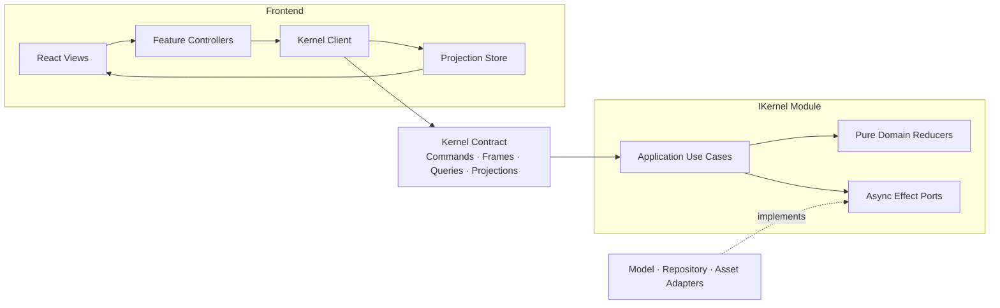

# IKernel 渐进式重构方案

> 状态：面向 Grok Root Agent 与其 Subagents 的逐 Phase 重构操作手册  
> 日期：2026-07-15  
> 依据：User 提供的 PathAufCalls 依赖与调用路径清单、前述 IKernel 架构判断、独立 Subagent 审判意见，以及本轮补充约束。  
> 证据边界：本文没有读取或验证清单所指向的实现文件；文件归属、接口形态和阶段工作均是待代码验证的设计假设。

## 0. Grok 执行协议：最高优先级

本节是给 **Grok Root Agent** 的强制操作协议，不是建议。后续所有 Phase 和 Stage 都必须在本协议下执行。

Grok 应假设：

- 自身速度快，但容易扩大范围、跳步、把推测当事实；
- 自身不适合直接完成跨文件重构；
- Subagent 才是代码修改的唯一执行者；
- Codex 是每个 Phase 结束后的独立代码审查者和 commit 执行者；
- User 是唯一能够授权开始下一 Phase 的人。

### 0.1 角色分工

| 角色 | 必须做 | 严禁做 |
|---|---|---|
| User | 指定要执行的 Phase/Stage；决定是否继续 | 不需要替 Grok 补全技术步骤 |
| Grok Root Agent | 读取本 Phase；拆成有边界的 Subagent 任务；派工；查看 diff；运行少量指定检查；汇报 | 修改文件、写代码、修测试、格式化、重命名、安装依赖、stage、commit、擅自进入下一 Phase |
| Grok Subagent | 在被授权范围内检查代码、实现、补测试、运行定向验证并报告 | 越过 Phase 范围、处理无关问题、stage、commit、擅自开启后续 Stage |
| Codex | Phase 完成后独立审查 diff；必要时修复；执行适当验证；commit | 在 Grok 尚未完成当前 Phase 时替它继续下一 Phase |

### 0.2 Root Grok 的绝对禁止事项

无论修改多小，Root Grok 都不得亲自：

- 使用 `apply_patch` 或任何写文件工具；
- 创建、删除、移动或重命名源码文件；
- 修改测试、配置、依赖或文档；
- 运行 formatter 并让 formatter 改写文件；
- “顺手修复”Subagent 留下的问题；
- stage 或 commit；
- 要求 Subagent commit；
- 在一个 Phase 完成后自动开始下一 Phase；
- 把“看起来能过”报告成“已验证正确”。

如果只剩一行错误，Root Grok 仍必须把修复重新委派给 Subagent。没有可用 Subagent 时，Root Grok 必须报告 `BLOCKED`，不能接管实现。

### 0.3 Root Grok 允许进行的简单检查

Root Grok 只能进行只读或不改源码的轻量核验：

- `git status --short`；
- `git diff --stat`；
- `git diff --check`；
- 查看本 Phase 产生的 diff；
- 检查 changed files 是否越界；
- 运行 Phase 明确要求的单个或少量定向测试；
- 运行现有的 dependency/source guard，但不得把它当作充分行为测试；
- 对照 Exit Gate 做逐项勾选；
- 把失败信息原样反馈给 Subagent。

Root Grok 不得运行 build、dev server、全量重构命令或无关测试，除非 User 在当前指令中明确授权。

### 0.4 每次只执行一个 Phase

Root Grok 只有在 User 使用下列形式明确授权后才能开始：

```text
按照 IKernelRefac.md，只执行 Phase N。
```

如果 Phase 内明确要求按 Stage 分开，则 User 使用：

```text
按照 IKernelRefac.md，只执行 Stage N.M。
```

Root Grok 必须把“只执行”理解为硬边界：

- 不提前准备下一 Phase；
- 不顺便清理下一 Phase 的依赖；
- 不因为当前修改触及邻近文件就扩大目标；
- 不把多个 Phase 合成一个“大改更省事”的任务；
- 不擅自改变本文的目标架构。

### 0.5 Phase 状态机

每个 Phase 只能按以下状态流转：

```text
WAITING_FOR_USER
  → SCOPING
  → DELEGATED
  → SUBAGENT_IMPLEMENTING
  → GROK_LIGHT_CHECK
  → READY_FOR_CODEX_REVIEW
  → STOPPED
```

失败路径：

```text
SUBAGENT_IMPLEMENTING / GROK_LIGHT_CHECK
  → NEEDS_SUBAGENT_FIX
  → SUBAGENT_IMPLEMENTING
```

无法修复：

```text
NEEDS_SUBAGENT_FIX
  → BLOCKED
  → STOPPED
```

不存在：

```text
GROK_LIGHT_CHECK → GROK_FIXES_CODE
READY_FOR_CODEX_REVIEW → NEXT_PHASE
```

### 0.6 Grok 的固定执行循环

每次收到 Phase 指令后，Root Grok 必须严格执行：

1. 只读取本 Phase、它依赖的前置 Contract 和 Exit Gate；
2. 用 5-10 行复述本 Phase 的范围、禁止范围和完成条件；
3. 检查前一 Phase 是否已由 User 确认完成 Codex review/commit；
4. 查看工作区状态，识别并保护 User 的无关改动；
5. 将本 Phase 拆成一个或多个顺序明确、互不重叠的 Subagent 任务；
6. 一次只允许一个 Subagent 修改同一组文件；
7. 明确告诉 Subagent：不得 commit、不得越界、必须运行哪些定向验证；
8. 等待 Subagent 完成；
9. Root Grok 只做第 0.3 节允许的简单检查；
10. 检查失败时，把具体证据重新委派给 Subagent；
11. Exit Gate 满足后，输出固定 Phase 完成报告；
12. 明确告诉 User：下一步应让 Codex 审查代码并 commit；
13. 立即停止，不开始下一 Phase。

### 0.7 Subagent 派工模板

Root Grok 必须使用接近以下结构的任务，不得只说“完成 Phase N”：

```text
任务：实现 IKernelRefac.md 的 Phase N / Stage N.M。

允许范围：
- [明确文件或 module]
- [明确行为]

禁止范围：
- 不进入后续 Phase/Stage
- 不做无关清理、命名统一或格式化
- 不改变本文已确定的 IKernel Interface，除非发现阻塞证据
- 不 stage，不 commit
- 不隐藏失败，不使用 fallback 让测试假通过

必须先做：
- 检查范围内的真实实现和调用者
- 记录与本文假设不一致的事实
- 保护现有无关 worktree 修改

必须实现：
- [逐项列出本 Stage 产物]

必须验证：
- [行为测试]
- [定向 adapter/integration test]
- [必要的 dependency guard]

完成报告：
- changed files
- observable behavior
- tests/checks 与精确结果
- 未解决风险
- 是否满足本 Stage Exit Gate
```

### 0.8 Root Grok 的检查边界

Root Grok 的检查目标不是重新做一次代码审查，而是发现明显越界和机械错误：

- Subagent 是否只修改授权范围；
- 是否出现意外删除或大规模格式化；
- 是否存在未解决 merge marker、空文件或 diff whitespace error；
- 指定测试是否实际运行并通过；
- 新 Kernel public calls 是否全部 async；
- 是否出现直接双写、散落 feature flag 或 Root 未授权的新 abstraction；
- Exit Gate 是否有可引用证据。

深入的正确性、代码品味、隐藏回归和 commit 组织留给 Codex。

### 0.9 Phase 完成后的固定输出

Root Grok 必须使用以下格式结束，不能说“接下来继续 Phase N+1”：

```text
IKernel Phase N 已由 Subagent 完成实现。

Grok Root 仅执行了简单检查：
- changed-file scope: PASS/FAIL
- git diff --check: PASS/FAIL
- targeted tests: [命令与结果]
- Phase Exit Gate: PASS/FAIL/PARTIAL

未提交事项与风险：
- [...]

Grok Root 没有修改代码，没有 stage，也没有 commit。
请 User 现在让 Codex 审查本 Phase 的代码；由 Codex 处理必要修复、执行审查所需验证并 commit。
下一 Phase 尚未开始。
```

如果未满足 Exit Gate，必须输出 `BLOCKED` 或 `PARTIAL`，不能使用“基本完成”“应该没问题”等模糊措辞。

### 0.10 Codex 审查是 Phase 间硬门

在 User 明确表示以下事项完成前，Root Grok 不得开始下一 Phase：

- Codex 已审查当前 Phase diff；
- 必要修复已经完成；
- Codex 已完成或明确豁免相应验证；
- 当前 Phase 已由 Codex commit；
- User 明确授权下一 Phase。

如果 User 直接要求执行下一 Phase，但没有说明前一 Phase 的 Codex review/commit 状态，Root Grok 必须先询问或报告前置条件不明确，不能自行假设已经完成。

## 1. 执行摘要

本次重构采用：

> **清理辅助、分离主导、分批迁移、每批删除旧路径。**

不进行一次性全仓切割，也不先做无边界的全面清理。重构始终围绕一条主线推进：

> **除 IKernel 外，没有任何模块能够提交游戏状态。**

最终目标不是把现有 `services/**`、`models/**`、`utils/**`、`data/**` 和 `prompts/**` 合并成一个大目录，而是建立一个深 Module：调用者只需要学习很小的 Interface，复杂的 Turn 编排、状态归约、AI 调用、持久化和失败处理都被隐藏在实现内部。

迁移先建立逻辑 seam，再逐步迁移实现，最后才决定是否进行 Web Worker、Tauri IPC 或远程 Cloud Host 的物理分离。第一阶段只有一个宿主，不提前设计三套对等部署协议。

## 2. 已知问题与量化基线

依赖清单给出的结构基线：

| 指标 | 当前清单值 | 目标值 |
|---|---:|---:|
| UI → Kernel 候选模块运行时依赖 | 217 | 0 |
| UI → `dbService` | 21 | 0 |
| Components → 私有 hooks | 7 | 0 |
| Components → Kernel 候选模块总边数 | 242 | 只允许 Contract/Client |
| `models/settings.ts` 的 UI importers | 34 | 0 个 UI 依赖 Kernel Settings 实现 |
| 单次 Turn 正式状态提交次数 | 未由清单证明 | 1 |
| Kernel domain → React/DOM/HTTP/IndexedDB/Tauri | 待验证 | 0 |

这些数字只描述静态依赖，不能证明：

- 动态调用和全局状态读写；
- 副作用发生顺序；
- 存档的公开兼容要求；
- Tauri、Cloudflare 或外部消费者的隐含契约；
- reroll 是否存在不可逆外部副作用。

因此每个迁移 Stage 都必须先验证实际调用，再修改；不能仅凭路径名称删除行为。

## 3. 不可妥协的原则

### 3.1 单一状态权威

游戏正式状态只能由 IKernel 提交。React state、UI store、组件、hooks、AI adapter 和持久化 adapter 都不能直接修改正式游戏状态。

UI 只能拥有：

- modal、tab、hover、draft 等表现状态；
- 当前 Projection；
- 尚未提交的流式 progress；
- 请求状态与错误展示。

### 3.2 所有跨 Kernel seam 的调用必须 async

所有公共 Kernel Interface 和所有副作用 Port 必须使用 `Promise` 或 `AsyncIterable`：

- `IKernel.execute(...)`：`AsyncIterable<ExecutionFrame>`；
- `IKernel.read(...)`：`Promise<QueryResult>`；
- Repository、Model、Asset 等 Port：全部异步；
- Kernel factory：异步创建。

领域内部的纯归约函数不是“跨 Kernel 调用”，必须保持同步。把纯计算强行标记为 `async` 只会制造虚假调度、模糊错误边界，因此禁止：

```ts
// 正确：跨 seam 的调用是 async
const view = await kernel.read(query);

for await (const frame of kernel.execute(command)) {
  consume(frame);
}

// 正确：Kernel 内部纯函数保持同步
const decision = reduceTurn(snapshot, actions);
```

### 3.3 progress 与 committed 严格分离

- `progress` 是临时显示，不是正式游戏状态；
- 只有 `committed` 能替换正式 Projection；
- `rejected` 后正式状态必须保持不变；
- UI 不得把流式文本直接写进正式 Session；
- 一个成功命令只能产生一个正式 commit。

### 3.4 边界验证前移

命令和外部数据在 Kernel 入口解码、验证一次。进入 application/domain 后，数据类型必须完整；不得到处使用 `?`、fallback 和重复运行时检查。

### 3.5 不建立假 seam

只有真实变化点才建立 Port：

- AI 模型：生产 adapter + 测试 fake，是真 seam；
- Session 持久化：IndexedDB adapter + in-memory adapter，是真 seam；
- Asset 存储：浏览器/桌面 adapter + in-memory adapter，是真 seam。

`Clock`、`IdGenerator`、`ContentCatalog` 等只有在出现确定性测试需求、第二实现或环境差异时才建立 Port，不能照搬六边形架构模板。

### 3.6 临时兼容层必须可删除

允许存在 `LegacyKernelAdapter`，但它只是绞杀式迁移工具：

- 不允许暴露旧实现类型；
- 不允许使用 `call(methodName, args)` 之类万能转发；
- 不承载新业务规则；
- 每迁移一个命令，就删除对应旧映射；
- Phase 结束必须有明确删除条件；
- 不得成为永久 Facade。

### 3.7 不做双写

旧实现和新 Kernel 不得同时提交同一份正式状态。双写会制造两个权威并使回滚不可证明。

允许：

- 测试环境中对固定输入进行新旧行为对照；
- 生产环境中对只读、无外部费用的纯计算执行 shadow compare；
- 在组合根一次性选择 legacy 或 native 实现。

禁止：

- 同一个命令同时写旧数据库和新 Repository；
- 生产环境为了比较而重复调用非确定性或计费 AI；
- 在不同组件内各自判断 feature flag。

## 4. 目标架构



### 4.1 Frontend 责任

- 渲染 Projection；
- 将 User intent 翻译为 Command；
- 消费 `progress/committed/rejected`；
- 管理纯表现状态；
- 不直接访问数据库、AI、Kernel model、Kernel utils 或内部 workflow。

### 4.2 Kernel application 责任

- 实现完整用例；
- 读取 base snapshot；
- 调用异步 Port；
- 将外部结果转换成领域动作；
- 调用纯 reducer；
- 验证不变量；
- 原子提交；
- 生成窄 Projection。

### 4.3 Kernel domain 责任

- 领域数据结构；
- 纯状态转换；
- 领域不变量；
- 不引用 React、DOM、fetch、IndexedDB、Tauri、Cloudflare；
- 不创建 adapter；
- 不直接持久化。

### 4.4 Host/Composition Root 责任

- 选择 Legacy 或 Native Kernel；
- 创建并注入 adapter；
- 处理部署环境；
- 后续如有证据，再负责 Worker、IPC 或 HTTP transport；
- 不包含领域规则。

## 5. 目标目录：先逻辑分离，不先搬成 Monorepo

```text
src/
  ui/
    kernelClient/
    projections/
    features/

  kernel/
    contract/
      commands.ts
      frames.ts
      queries.ts
      projections.ts
      errors.ts

    domain/
      session/
      turn/
      variables/

    application/
      executeTurn.ts
      rerollTurn.ts
      loadSession.ts

    ports/
      ModelGateway.ts
      SessionRepository.ts
      AssetStore.ts

    adapters/
      ai/
      indexeddb/
      assets/
      legacy/

    createKernel.ts
```

只有当物理部署边界已经由实际需求证明后，才考虑拆为 `apps/*`、`packages/*`。目录移动不是当前成功指标，依赖方向才是。

## 6. IKernel Contract

### 6.1 基础类型

目标文件：`src/kernel/contract/commands.ts`

```ts
export type CommandId = string & { readonly __brand: "CommandId" };
export type SessionId = string & { readonly __brand: "SessionId" };
export type Revision = number & { readonly __brand: "Revision" };

export type AdvanceTurn = Readonly<{
  type: "turn.advance";
  input: Readonly<{
    text: string;
  }>;
}>;

export type RerollTurn = Readonly<{
  type: "turn.reroll";
  turnId: string;
}>;

export type SessionCommand = AdvanceTurn | RerollTurn;

export type SessionCommandEnvelope = Readonly<{
  protocolVersion: 1;
  commandId: CommandId;
  sessionId: SessionId;
  expectedRevision: Revision;
  command: SessionCommand;
}>;

export type CreateSessionEnvelope = Readonly<{
  protocolVersion: 1;
  commandId: CommandId;
  command: Readonly<{
    type: "session.create";
    presetId: string;
  }>;
}>;

export type CommandEnvelope =
  | CreateSessionEnvelope
  | SessionCommandEnvelope;
```

`CreateSessionEnvelope` 和 `SessionCommandEnvelope` 分开，避免让 `sessionId`、`expectedRevision` 变成可选字段。

### 6.2 ExecutionFrame

目标文件：`src/kernel/contract/frames.ts`

```ts
import type { CommandId, Revision } from "./commands";
import type { SessionView } from "./projections";
import type { KernelError } from "./errors";

export type ExecutionFrame =
  | Readonly<{
      type: "progress";
      commandId: CommandId;
      delta: Readonly<{
        kind: "narrative";
        text: string;
      }>;
    }>
  | Readonly<{
      type: "committed";
      commandId: CommandId;
      revision: Revision;
      view: SessionView;
    }>
  | Readonly<{
      type: "rejected";
      commandId: CommandId;
      error: KernelError;
    }>;
```

Interface 不提供全局 `subscribe(cursor)`。`execute` 的事件流只属于一个命令，因此没有事件顺序、重放位置和断线语义的额外负担。未来只有在远程多客户端实时同步成为真实需求后，才设计独立的 watch Interface。

### 6.3 Queries 与 Projections

目标文件：`src/kernel/contract/queries.ts`

```ts
import type { SessionId } from "./commands";

export type KernelQuery =
  | Readonly<{
      type: "session.read";
      sessionId: SessionId;
    }>
  | Readonly<{
      type: "settings.read";
      sessionId: SessionId;
    }>;
```

目标文件：`src/kernel/contract/projections.ts`

```ts
import type { Revision, SessionId } from "./commands";

export type SessionView = Readonly<{
  sessionId: SessionId;
  revision: Revision;
  turns: readonly TurnView[];
}>;

export type TurnView = Readonly<{
  id: string;
  playerText: string;
  narrativeText: string;
}>;

export type SettingsView = Readonly<{
  sessionId: SessionId;
  revision: Revision;
}>;

export type QueryResult = SessionView | SettingsView;
```

这些只是 Contract 形状示例。实际 Projection 字段必须根据 UI 的真实读取需求定义，不能把完整 Kernel state 原样暴露出去，也不能制造一个包含所有页面字段的万能 Projection。

### 6.4 IKernel

目标文件：`src/kernel/contract/IKernel.ts`

```ts
import type { CommandEnvelope } from "./commands";
import type { ExecutionFrame } from "./frames";
import type { KernelQuery } from "./queries";
import type { QueryResult } from "./projections";

export interface IKernel {
  execute(command: CommandEnvelope): AsyncIterable<ExecutionFrame>;
  read(query: KernelQuery): Promise<QueryResult>;
}
```

Interface 的隐含契约同样属于 Interface：

1. 每个 `execute` 必须产生零个或多个 `progress`，随后恰好一个 terminal frame；
2. terminal frame 只能是 `committed` 或 `rejected`；
3. `committed` 后不能再产生 frame；
4. expected domain/infrastructure failures转换为 `rejected`；
5. 未预期的编程错误允许 iterator 抛出，以便 fail fast；
6. 提前关闭 iterator 表示请求取消，但不保证能够撤销已经提交的事务；
7. 相同 `commandId` 的重试必须具备明确的幂等语义。

## 7. 核心状态与 Turn 事务

### 7.1 不采用 revision tree

第一目标只需要线性、单调 revision：

```ts
export type SessionSnapshot = Readonly<{
  sessionId: SessionId;
  revision: Revision;
  state: GameState;
}>;
```

每个修改命令携带 `expectedRevision`。Repository 以 compare-and-swap 方式提交：

```ts
export type CommitResult =
  | Readonly<{
      type: "committed";
      snapshot: SessionSnapshot;
    }>
  | Readonly<{
      type: "conflict";
      actualRevision: Revision;
    }>;
```

Reroll 记录或恢复相应 Turn 的 `baseRevision`，从该 base snapshot 重新执行，并替换当前后继。只有产品明确需要浏览、切换或合并多时间线时，才升级为 revision tree。

### 7.2 Turn 的唯一合法路径

```text
AdvanceTurn
  → 验证 CommandEnvelope
  → Repository.read(base revision)
  → 纯函数构造模型输入
  → ModelGateway 输出 provisional progress
  → Parser 生成领域动作
  → 纯 reducer 生成 next snapshot
  → 验证完整不变量
  → Repository.compareAndSwap(revision + 1)
  → 返回 committed Projection
```

### 7.3 纯 reducer

目标文件：`src/kernel/domain/turn/reduceTurn.ts`

```ts
export type TurnDecision = Readonly<{
  nextState: GameState;
  events: readonly DomainEvent[];
  assetEffects: readonly AssetEffect[];
}>;

export function reduceTurn(
  state: GameState,
  actions: readonly DomainAction[],
): TurnDecision {
  const nextState = actions.reduce(applyDomainAction, state);
  assertGameState(nextState);

  return {
    nextState,
    events: deriveDomainEvents(state, nextState),
    assetEffects: deriveAssetEffects(state, nextState),
  };
}
```

返回值是最终值，不允许调用者在返回后执行 `decision.nextState.xxx = ...`。

## 8. Async Ports

### 8.1 ModelGateway

目标文件：`src/kernel/ports/ModelGateway.ts`

```ts
export type ModelFrame =
  | Readonly<{ type: "delta"; text: string }>
  | Readonly<{ type: "completed"; text: string }>;

export interface ModelGateway {
  complete(request: ModelRequest): AsyncIterable<ModelFrame>;
}
```

低层模型 client、retry、provider policy 和 vendor proxy 属于 adapter implementation。Phone、News、Variable、Story Weaving 等领域用例不能成为 ModelGateway 的方法；它们应在 application 中组合同一个深 ModelGateway。

### 8.2 SessionRepository

目标文件：`src/kernel/ports/SessionRepository.ts`

```ts
export interface SessionRepository {
  read(sessionId: SessionId): Promise<SessionSnapshot>;

  compareAndSwap(input: Readonly<{
    sessionId: SessionId;
    expectedRevision: Revision;
    nextState: GameState;
    commandId: CommandId;
  }>): Promise<CommitResult>;
}
```

Repository 同时负责 commandId 幂等记录，避免异步重试造成重复 Turn。

### 8.3 AssetStore

目标文件：`src/kernel/ports/AssetStore.ts`

```ts
export interface AssetStore {
  put(asset: AssetWrite): Promise<AssetRef>;
  read(ref: AssetRef): Promise<Uint8Array>;
  remove(ref: AssetRef): Promise<void>;
}
```

Asset 写入必须区分 staging 与 committed reference。正式状态只保存已提交引用；失败 Turn 的 staging asset 由清理策略回收。

## 9. Phase 0 — 建立真实回归基线

目标：在移动行为之前，获得能够证明行为的测试面。

### Stage 0.1 — 把 `scripts/*.mjs` 正确降级为结构守卫

现有 source-level regression 可以保留，但必须改称或认知为：

- dependency guard；
- protocol marker guard；
- source-shape check；
- migration guard。

它们不能证明：

- Turn 真实执行结果；
- 异步时序；
- 状态是否被部分提交；
- IndexedDB/Tauri adapter 是否工作；
- reroll 是否恢复全部状态；
- stream 失败后是否污染正式状态。

因此 `scripts/*.mjs` 不能作为 Phase Gate 的唯一证据。

### Stage 0.2 — 建立 Interface 行为测试

计划新增真正测试目录：

```text
tests/
  kernel/
    contract/
      executionFrames.test.ts
      atomicCommit.test.ts
      revisionConflict.test.ts
    characterization/
      advanceTurn.legacy.test.ts
    adapters/
      indexeddbSessionRepository.test.ts
```

测试 runner 应能执行 TypeScript 行为测试。若需要新增依赖，必须遵守项目的供应链要求：所选版本及新增传递依赖至少发布 7 天；否则等待或固定到满足条件的版本。

Interface contract suite 示例：

```ts
export function runKernelContractSuite(
  createHarness: () => Promise<KernelHarness>,
): void {
  it("does not commit progress frames", async () => {
    const harness = await createHarness();
    const before = await harness.repository.read(harness.sessionId);

    const iterator = harness.kernel.execute(harness.advanceTurn()).iterator();
    const first = await iterator.next();

    expect(first.value.type).toBe("progress");
    expect(await harness.repository.read(harness.sessionId)).toEqual(before);
  });

  it("emits exactly one terminal frame", async () => {
    const harness = await createHarness();
    const frames = await collectAsync(
      harness.kernel.execute(harness.advanceTurn()),
    );

    const terminals = frames.filter(
      frame => frame.type === "committed" || frame.type === "rejected",
    );

    expect(terminals).toHaveLength(1);
    expect(frames.at(-1)).toEqual(terminals[0]);
  });
}
```

注：实际 runner 的 import 和 matcher 以落地时选择为准；这里定义的是测试形状，不假装当前仓库已经具备该 runner。

### Stage 0.3 — 记录最小 Characterization 场景

首批只记录与 `AdvanceTurn` 有关的可观察结果：

1. User 输入如何进入 Turn；
2. progress 的显示顺序；
3. 成功后的消息与 revision；
4. AI 失败后的状态；
5. 变量输出非法时的状态；
6. 保存后重新读取的结果。

测试使用固定 Model fake 或已脱敏录制响应，不在测试中调用真实 AI。

#### Phase 0 Exit Gate

- 至少一个旧 AdvanceTurn 路径拥有可重复的行为测试；
- 测试会真实调用 Interface，而不是搜索源码字符串；
- progress、commit、reject 三种语义被测试；
- 结构脚本不再被当作完整测试套件。

## 10. Phase 1 — 建立外部 seam 与临时 Legacy Adapter

目标：让 UI 开始依赖稳定 Interface，但不立即重写全部内部行为。

### Stage 1.1 — 落地 Contract

创建第 6 节中的 `commands/frames/queries/projections/errors/IKernel`。Contract 不导入任何旧 model、service、hook 或 UI 类型。

### Stage 1.2 — 实现 LegacyKernelAdapter

目标文件：`src/kernel/adapters/legacy/LegacyKernelAdapter.ts`

```ts
export class LegacyKernelAdapter implements IKernel {
  constructor(private readonly legacy: LegacyKernelDependencies) {}

  async *execute(
    envelope: CommandEnvelope,
  ): AsyncIterable<ExecutionFrame> {
    switch (envelope.command.type) {
      case "turn.advance":
        yield* this.executeAdvanceTurn(envelope);
        return;
      case "turn.reroll":
        yield* this.executeReroll(envelope);
        return;
      case "session.create":
        yield* this.executeCreateSession(envelope);
        return;
    }
  }

  async read(query: KernelQuery): Promise<QueryResult> {
    return this.legacy.readProjection(query);
  }

  private async *executeAdvanceTurn(
    envelope: AdvanceTurnEnvelope,
  ): AsyncIterable<ExecutionFrame> {
    // 只做旧 workflow → 新 frame 的翻译。
    // 不在这里增加新业务规则。
    yield* this.legacy.advanceTurn(envelope);
  }
}
```

虽然该 Adapter 在迁移初期可能较浅，但它必须通过删除测试：删除它后，旧调用复杂性会重新泄漏到大量 UI callers；迁移结束后 Native Kernel 接管复杂性，它就应被彻底删除。

### Stage 1.3 — 建立异步 KernelClient

目标文件：`src/ui/kernelClient/consumeExecution.ts`

```ts
export async function consumeExecution(
  kernel: IKernel,
  command: CommandEnvelope,
  sink: ExecutionSink,
): Promise<void> {
  for await (const frame of kernel.execute(command)) {
    switch (frame.type) {
      case "progress":
        sink.showProgress(frame.delta);
        break;
      case "committed":
        sink.replaceProjection(frame.view);
        break;
      case "rejected":
        sink.showError(frame.error);
        break;
    }
  }
}
```

`sink.showProgress` 只能更新临时缓冲；`sink.replaceProjection` 才能更新正式 Projection Store。

### Stage 1.4 — 组合根单点切流

目标文件：`src/kernel/createKernel.ts`

```ts
export type KernelMode = "legacy" | "native-turn";

export async function createKernel(
  mode: KernelMode,
  dependencies: KernelDependencies,
): Promise<IKernel> {
  switch (mode) {
    case "legacy":
      return new LegacyKernelAdapter(dependencies.legacy);
    case "native-turn":
      return new NativeKernel(dependencies.native);
  }
}
```

唯一 feature flag 位于 composition root。组件、hook、domain 和 adapter 内部不得出现 `if (useNewKernel)`。

#### Phase 1 Exit Gate

- 至少一个真实 UI intent 通过 `IKernel.execute`；
- UI 不知道该命令由 legacy 还是 native 执行；
- 所有公共调用均为 async；
- Legacy Adapter 没有新业务规则；
- 可以在 composition root 一次性回退到 legacy。

## 11. Phase 2 — Native AdvanceTurn 垂直切片

目标：证明最关键 Turn 可以在不污染 UI 和不双写的情况下由 Native Kernel 完整拥有。

### Stage 2.1 — 建立最小真实 Ports

只落地：

- `ModelGateway`；
- `SessionRepository`；
- 如果 AdvanceTurn 必须产生资产，再落地 `AssetStore`，否则延后。

测试提供：

- `ScriptedModelGateway`；
- `InMemorySessionRepository`；
- `InMemoryAssetStore`。

### Stage 2.2 — 提取纯 Turn 规划与归约

候选来源根据清单包括：

- `hooks/useGame/systemPromptBuilder.ts`；
- `hooks/useGame/contextSnapshot.ts`；
- `hooks/useGame/tavernMessageChainBuilder.ts`；
- `services/ai/responseParser.ts`；
- `utils/variableExecutor.ts` 及相关 variable modules。

这不是按文件整体搬迁：

- Prompt/context 构造先进入 application；
- 纯数据规则进入 domain；
- AI transport 进入 adapter；
- UI streaming store 留在 frontend。

### Stage 2.3 — 实现 executeTurn

目标文件：`src/kernel/application/executeTurn.ts`

```ts
export async function* executeTurn(
  envelope: AdvanceTurnEnvelope,
  dependencies: ExecuteTurnDependencies,
): AsyncIterable<ExecutionFrame> {
  const base = await dependencies.sessions.read(envelope.sessionId);

  if (base.revision !== envelope.expectedRevision) {
    yield rejectedRevisionConflict(envelope, base.revision);
    return;
  }

  const request = planTurnRequest(base.state, envelope.command.input);
  let completedText = "";

  for await (const frame of dependencies.model.complete(request)) {
    if (frame.type === "delta") {
      yield narrativeProgress(envelope.commandId, frame.text);
      continue;
    }

    completedText = frame.text;
  }

  const actions = parseNarrativeActions(completedText);
  const decision = reduceTurn(base.state, actions);
  const commit = await dependencies.sessions.compareAndSwap({
    sessionId: envelope.sessionId,
    expectedRevision: envelope.expectedRevision,
    nextState: decision.nextState,
    commandId: envelope.commandId,
  });

  if (commit.type === "conflict") {
    yield rejectedRevisionConflict(envelope, commit.actualRevision);
    return;
  }

  yield committedFrame(
    envelope.commandId,
    commit.snapshot,
    projectSession(commit.snapshot),
  );
}
```

注意：示例省略了错误翻译、取消、staging asset 和分段 parser 的细节。实现时这些必须由行为测试明确，而不是用 catch-all fallback 隐藏。

### Stage 2.4 — NativeKernel 路由

```ts
export class NativeKernel implements IKernel {
  constructor(private readonly dependencies: NativeKernelDependencies) {}

  execute(command: CommandEnvelope): AsyncIterable<ExecutionFrame> {
    switch (command.command.type) {
      case "turn.advance":
        return executeTurn(command, this.dependencies.turn);
      default:
        return this.dependencies.legacy.execute(command);
    }
  }

  async read(query: KernelQuery): Promise<QueryResult> {
    return readProjection(query, this.dependencies);
  }
}
```

这是 Stage 内允许的过渡状态。每增加一个 native command，就从 default legacy fallback 中移出一个明确 command。Phase 结束后删除 legacy dependency；不得长期保持“未知命令自动走旧实现”。

#### Phase 2 Exit Gate

- `AdvanceTurn` 全部由 Native Kernel 执行；
- progress 不写正式状态；
- AI/parse/variable/commit 任一失败时正式状态不变；
- 成功只 commit 一次；
- revision conflict 可重复测试；
- 固定模型响应下，新旧可观察结果已完成对照；
- UI 对相关 `sendWorkflow/dbService/variableExecutor` 的直接运行时依赖已移除。

## 12. Phase 3 — 收回持久化与正式状态所有权

目标：所有正式游戏状态写入都经过 `SessionRepository`，消灭 UI 和 hook 的直接持久化。

### Stage 3.1 — 分解 `dbService` 的责任

根据路径清单，`dbService` 同时被 UI、hooks 和 services 广泛依赖。迁移时按行为拆分，而不是先重命名：

| 旧责任 | 新归属 |
|---|---|
| Session 读取/提交 | `SessionRepository` |
| UI preferences | Frontend preference store |
| Kernel policy | Kernel command + Session state |
| Provider credentials/profile | Host/AI adapter configuration |
| Save export/import | Kernel application use case |
| Desktop filesystem | Desktop adapter |

### Stage 3.2 — CAS 与幂等

In-memory adapter 示例：

```ts
export class InMemorySessionRepository implements SessionRepository {
  private readonly sessions = new Map<SessionId, SessionSnapshot>();
  private readonly commands = new Map<CommandId, SessionSnapshot>();

  async read(sessionId: SessionId): Promise<SessionSnapshot> {
    return structuredClone(requireSession(this.sessions, sessionId));
  }

  async compareAndSwap(input: CommitInput): Promise<CommitResult> {
    const previousCommit = this.commands.get(input.commandId);
    if (previousCommit) {
      return { type: "committed", snapshot: structuredClone(previousCommit) };
    }

    const current = requireSession(this.sessions, input.sessionId);
    if (current.revision !== input.expectedRevision) {
      return { type: "conflict", actualRevision: current.revision };
    }

    const snapshot = createNextSnapshot(current, input.nextState);
    this.sessions.set(input.sessionId, snapshot);
    this.commands.set(input.commandId, snapshot);
    return { type: "committed", snapshot: structuredClone(snapshot) };
  }
}
```

生产 adapter 必须保证 revision 与 commandId 的原子性；不能先写状态再单独记录 commandId。

### Stage 3.3 — UI Projection Store

Frontend store 不再持有可变领域 state：

```ts
export type ProjectionState = Readonly<{
  session: SessionView;
  progress: Readonly<{
    commandId: CommandId;
    narrativeText: string;
  }> | null;
}>;

export function applyExecutionFrame(
  state: ProjectionState,
  frame: ExecutionFrame,
): ProjectionState {
  switch (frame.type) {
    case "progress":
      return appendProgress(state, frame);
    case "committed":
      return { session: frame.view, progress: null };
    case "rejected":
      return { ...state, progress: null };
  }
}
```

#### Phase 3 Exit Gate

- UI → `dbService` 的 21 条边降为 0；
- 任何正式 Session mutation 都能追溯到一个 Command；
- Repository adapter contract tests 通过；
- 重试同一 commandId 不产生重复 Turn；
- UI 刷新通过 `await kernel.read(...)` 恢复 Projection。

## 13. Phase 4 — Reroll、Save、Load 与崩溃恢复

目标：在已证明的原子 Turn 基础上迁移生命周期能力，不引入 revision tree。

### Stage 4.1 — Reroll

```ts
export async function* rerollTurn(
  envelope: RerollTurnEnvelope,
  dependencies: RerollDependencies,
): AsyncIterable<ExecutionFrame> {
  const current = await dependencies.sessions.read(envelope.sessionId);
  const base = findTurnBaseSnapshot(current, envelope.command.turnId);

  const advance = createRerollAdvanceCommand(envelope, base);
  yield* executeTurn(advance, dependencies.turn);
}
```

实际实现必须证明：

- base snapshot 包含所有正式 per-turn state；
- 外部 AI 调用费用不可撤销，但其结果在 commit 前不进入正式状态；
- staging asset 可回收；
- 不发送不可撤销外部通知，或为其建立显式效果账本。

### Stage 4.2 — Save/Load

Save 与 Load 是 Kernel application use case，不是 UI 对数据库的直接调用：

```ts
export interface SavePackagePort {
  export(sessionId: SessionId): Promise<Uint8Array>;
  import(bytes: Uint8Array): Promise<SessionView>;
}
```

只有当 export/import 确实存在第二 adapter 或测试替身需求时，才保留该 Port；否则它们应是 Kernel 内部 application 函数。

### Stage 4.3 — Schema 与回滚

- 每份持久化快照带 schema version；
- migration 在 Repository ingress 执行一次；
- 每次不可逆 schema 切换前创建可恢复备份；
- 旧版本不能读取新 schema 时，composition flag 不得被宣传为无损回滚；
- 不维护无限期双 schema 写入。

#### Phase 4 Exit Gate

- reroll 从 base snapshot 重新执行；
- reroll 不使用全局手工回写链；
- save/load/reroll 的行为测试通过；
- crash 在 commit 前发生时，重新读取仍得到旧 revision；
- crash 在 commit 后发生时，重新读取得到完整新 revision。

## 14. Phase 5 — 按领域批次迁移

每个批次遵循同一循环：

```text
观察旧行为
  → 建立 Interface 测试
  → 定义 Command/Projection
  → 移动纯规则
  → 注入真实副作用 Port
  → composition root 单点切流
  → 验证
  → 删除该批旧入口与 flag 分支
```

不能只复制旧文件后长期保留两份实现。复制仅允许用于短期、只读行为比较，并必须在同一批次删除。

### Stage 5.1 — Variable Engine

候选路径：

- `utils/variableExecutor.ts`；
- `utils/variableFacts.ts`；
- `utils/variableRegistry.ts`；
- `utils/variablePath.ts`；
- `models/variableCommand.ts`；
- `services/ai/variableModel.ts`。

目标：

- AI variable model 只生成候选领域动作；
- Variable reducer 纯同步；
- 所有变量变更随 Turn 原子提交；
- UI Variable Manager 通过 Command/Projection 工作，不直接执行 reducer。

### Stage 5.2 — Narrative、Memory 与 Knowledge

候选路径：

- story weaving / planning / progress；
- memory compression；
- yiting archive/retrieval；
- zhiku retrieval/unlock；
- worldbook、prompt/context 构造。

目标：把“如何构造上下文”和“如何改变状态”放进深 Module；UI 只选择策略 ID、查看 Projection 和发送 Command。

### Stage 5.3 — Phone 与 News

候选路径：

- `services/ai/phoneService.ts`；
- `services/ai/newsModel.ts`；
- 相关 workflow 与 models。

Phone/News 不是独立网络微服务。它们是 Kernel application capability，共享 ModelGateway、SessionRepository 和领域状态。

### Stage 5.4 — Album、Image 与 Assets

候选路径：

- image generation / parse / tokenizer / anchor extraction；
- album actions / object URL / retry；
- desktop asset mirror；
- save asset storage。

目标：

- UI 发送生成、删除、关联等 Command；
- Kernel state 只保存 AssetRef；
- Object URL 属于 frontend adapter，不进入 Kernel domain；
- 资产生成失败不能留下正式半状态。

### Stage 5.5 — Settings 与 Presets

拆解 `models/settings.ts`：

| 新所有者 | 数据 |
|---|---|
| Frontend | theme、布局、纯视觉偏好 |
| Kernel | 游戏规则、故事、记忆、变量等 policy |
| AI Host | endpoint、model、credential、retry policy |
| Storage Host | storage roots、mirror 设置 |
| Content | prompts、presets、worldbooks、canon data |

UI 通过窄 Settings Projection 编辑相应所有者的数据，不再 import 万能 Settings model。

#### 每批 Exit Gate

- 该领域 UI → 旧实现运行时边数为 0；
- Legacy Adapter 中对应分支已删除；
- feature flag 中不再保留该批双路径；
- 行为测试覆盖成功、预期失败、异步失败和 revision conflict；
- 旧代码删除，而不是注释或改名留存。

## 15. Phase 6 — UI 热点收口

依据清单，优先处理的 UI 热点包括：

1. Album / image workspaces；
2. Phone modal；
3. Settings modal 与各 settings tabs；
4. New Game wizard；
5. Plot / Path / Skill / Companion；
6. Cloud save；
7. Chat InputArea、TurnItem、MessageRenderers。

注意：迁移顺序不以 import 数量唯一决定。第一批必须选能够完成垂直用例、验证状态所有权的路径；不能为了容易而先搬一组对架构没有证明力的纯工具函数。

### Stage 6.1 — UI import rule

UI 允许依赖：

- `kernel/contract/**`；
- `ui/kernelClient/**`；
- UI 自己的 modules；
- 外部表现库。

UI 禁止依赖：

- `kernel/domain/**`；
- `kernel/application/**`；
- `kernel/ports/**`；
- `kernel/adapters/**`；
- 旧 `dbService`、domain utils 和内部 workflow。

### Stage 6.2 — App composition root

`App.tsx` 最终只组合：

- UI modules；
- Kernel Provider/Client；
- Projection Store；
- 表现级 error boundary。

它不能直接保存设置、执行故事进度、调用 AI 或修改游戏状态。

### Stage 6.3 — 结构守卫

可以继续使用 `scripts/*.mjs` 或其他静态检查阻止违规 import，但必须命名为 architecture/dependency check，而不是行为测试。

伪代码：

```js
const forbidden = [
  "/kernel/domain/",
  "/kernel/application/",
  "/kernel/ports/",
  "/kernel/adapters/",
];

assertNoImports({
  from: "src/ui",
  targets: forbidden,
});
```

#### Phase 6 Exit Gate

- UI → Kernel 私有实现为 0；
- Components → 私有 hooks 为 0；
- UI → database/AI adapter 为 0；
- `App.tsx` 没有领域行为；
- 静态依赖守卫与真实行为测试都进入常规 preflight。

## 16. Phase 7 — 物理前后端分离（证据驱动）

只有在逻辑 seam 稳定后才进入本 Phase。

### Stage 7.1 — 选择第一个真实 Host

不要同时实现 Worker、Tauri 和 Cloud。根据已验证需求三选一：

| Host | 适用证据 |
|---|---|
| Web Worker | UI 卡顿、需要隔离执行、仍需离线本地状态 |
| Tauri Host | Kernel 必须访问受控本地权限或 Rust 能力 |
| Cloud Host | 需要跨设备权威状态、服务端密钥或多客户端同步 |

如果没有上述证据，in-process Host 就是正确实现，不因“看起来不像后端”而强行网络化。

### Stage 7.2 — Transport Adapter

Transport 只翻译 Contract，不承载业务规则：

```ts
export interface KernelTransport {
  execute(command: CommandEnvelope): AsyncIterable<ExecutionFrame>;
  read(query: KernelQuery): Promise<QueryResult>;
}

export class WorkerKernelTransport implements KernelTransport {
  async *execute(
    command: CommandEnvelope,
  ): AsyncIterable<ExecutionFrame> {
    yield* this.channel.execute(command);
  }

  async read(query: KernelQuery): Promise<QueryResult> {
    return this.channel.read(query);
  }
}
```

### Stage 7.3 — 如果选择 Cloud Host

Cloud 不是 Worker/Tauri 的平移，还必须新增并验证：

- authentication 与 authorization；
- session ownership；
- multi-client concurrency；
- reconnect 与幂等；
- server-side credential governance；
- streaming transport；
- deployment/schema compatibility。

不能因为 Interface 相同就假设这些问题已经解决。

#### Phase 7 Exit Gate

- 只有一个 production Host 被引入；
- 同一 IKernel contract suite 在该 Host adapter 上通过；
- Transport 不包含领域规则；
- 断连、取消、重试和幂等有行为测试；
- in-process 实现是否保留由离线/测试需求决定，而不是默认保留所有实现。

## 17. Phase 8 — 删除 Legacy 与完成收口

### Stage 8.1 — 删除迁移设施

删除：

- `LegacyKernelAdapter`；
- `KernelMode = "legacy"`；
- legacy workflow 路由；
- 已迁移的 direct DB/AI calls；
- 旧 models/utils/services 出口；
- 临时 shadow compare；
- 已无消费者的兼容类型。

### Stage 8.2 — 删除候选的验证规则

`/api/presence` 等清单上没有 FE consumer 的路径只能列为候选。在删除前必须确认：

- 没有动态调用；
- 没有外部客户端；
- 没有部署探针；
- 没有用户或公开协议承诺。

确认后直接删除，不保留永久空壳。

### Stage 8.3 — 最终依赖图

```text
UI
  → Kernel Contract
  → Kernel Client/Transport

Kernel Application
  → Kernel Domain
  → Async Ports

Adapters
  → Async Ports

Composition Root
  → Kernel Application
  → Adapters
```

禁止反向边：

```text
Kernel Domain  -X→ UI / React / adapters / environment
UI             -X→ Kernel implementation / database / AI
Adapter        -X→ UI
Contract       -X→ implementation
```

#### Phase 8 Exit Gate

- Legacy implementation 和 flags 全部删除；
- 所有 UI 调用 Kernel 都是 async；
- 所有正式状态写入都经过 IKernel；
- 真实 Interface 行为测试是发布证据；
- source-level scripts 仅作为补充结构守卫；
- 依赖图满足目标方向；
- 旧代码没有以 deprecated、backup、v1、compat 等名称永久残留。

## 18. 测试战略

### 18.1 测试金字塔

| 层级 | 测试对象 | 允许的替身 | 证明内容 |
|---|---|---|---|
| Domain | 纯 reducer | 无 | 状态转换和不变量 |
| Kernel Interface | IKernel | Model fake、in-memory repositories | progress/commit/reject、原子性、revision |
| Adapter contract | 每个 Port adapter | 对应本地替身/测试环境 | adapter 满足 Port 语义 |
| Integration | Native Kernel + 实际本地 adapter | 只替换真实外部 AI | 持久化与恢复 |
| UI integration | Kernel fake/Native Kernel | 固定 Model fake | Projection 与异步流消费 |
| E2E | 用户主流程 | 尽量少 | 组合根和部署行为 |
| Structure guard | import graph/source shape | 无 | 防止依赖方向倒退 |

### 18.2 必测不变量

1. `progress` 不改变 Repository；
2. 每个命令恰好一个 terminal frame；
3. `rejected` 后 state 与 revision 不变；
4. `committed` 恰好增加一次 revision；
5. 同一 commandId 重试不重复提交；
6. stale expectedRevision 明确冲突；
7. adapter 失败不会留下半提交；
8. Projection 不包含可变 Kernel state 引用；
9. save/load 后可观察状态一致；
10. reroll 从正确 base snapshot 重跑。

### 18.3 新旧行为对照

AI 输出非确定，因此不能生产双跑后直接比较字符串。正确方法：

- 使用固定 Model fake；
- 对相同 base snapshot 和固定模型响应执行 legacy/native；
- 比较语义 Projection 和持久化结果；
- 对已确认的旧 bug，明确决定保留兼容还是按新规范修复；
- 不把 snapshot dump 的逐字符相等当作唯一行为定义。

### 18.4 旧测试删除规则

当新的深 Module Interface 测试已经覆盖相同行为时，删除测试内部实现细节的旧测试。不要在新 Interface 测试上继续叠加一层脆弱的 source-shape 测试来维护同一行为。

## 19. Feature Flag、回滚与提交策略

### 19.1 Flag 生命周期

每个 flag 必须记录：

- owner；
- 创建 Stage；
- 删除 Stage；
- legacy/native 两侧的数据格式；
- 可否无损回滚；
- 清理条件。

flag 只在 composition root 判断一次。

### 19.2 回滚语义

可回滚不等于同时保留双写：

- 行为回滚：切回 Legacy Adapter；
- 数据回滚：依靠 schema-compatible snapshot 或迁移前备份；
- 代码回滚：小批次、独立 commit；
- AI 外部费用不可回滚，只能避免重复执行。

### 19.3 每批提交形状

建议每个迁移批次拆成：

1. 行为测试；
2. Contract/Projection；
3. Native implementation；
4. composition root 切流；
5. UI caller 迁移；
6. 删除 legacy branch；
7. 更新 dependency guard。

不要把测试、移动、行为修改和全局重命名塞进同一提交。

## 20. 明确不做

- 不先全面清理全仓命名、格式或重复代码；
- 不一次迁移几十个文件；
- 不把旧目录简单改名为 `kernel`；
- 不让 Facade 永久转发所有旧函数；
- 不同时建设 Worker、Tauri、Cloud 三宿主；
- 不预先建设全局事件总线、cursor 或 replay；
- 不引入 revision tree；
- 不拆 Phone、News、Variable 等网络微服务；
- 不用 feature flag 维持长期双实现；
- 不把 `scripts/*.mjs` 当作充分行为测试；
- 不用 fallback 隐藏非法数据或 migration 失败；
- 不为了测试暴露 Kernel 内部 seams；
- 不让 UI 直接 import Kernel 私有 models。

## 21. 风险与推翻条件

### 21.1 主要风险

| 风险 | 应对 |
|---|---|
| 隐式全局状态未出现在 import 图 | Phase 0 characterization + 逐批验证 |
| AI 流式结果提前污染正式状态 | progress/committed 双缓冲 + Interface test |
| 旧存档 schema 无法回滚 | migration ingress + 不可逆切换前备份 |
| Legacy Adapter 变永久层 | 每批删除分支 + Phase 8 gate |
| flag 散落 | composition root 单点选择 |
| 双写漂移 | 明令禁止两个状态权威 |
| 大规模 AI 搬运引入逻辑偏差 | 单个垂直切片、小提交、固定响应行为测试 |
| Port 过度抽象 | 只在生产/测试或第二实现成立时建立 seam |

### 21.2 会推翻或修改目标的证据

- 产品明确要求 UI 任意持有和修改完整游戏 state；
- 存在无法延迟到 commit 后执行、也无法补偿的外部副作用；
- 某些公开存档或插件协议要求维持对象级可变引用；
- 远程多客户端并发是当前而非未来需求；
- UI 对 Kernel state 的同步读取是不可协商的性能要求。

出现这些证据时应修改相应 Interface，而不是用隐藏 fallback 维持表面架构。

## 22. Definition of Done

IKernel 重构完成必须同时满足：

- [ ] 除 IKernel 外，没有模块可以提交正式游戏状态；
- [ ] 所有 UI → Kernel 调用均为 async；
- [ ] 所有 I/O Ports 均为 async；
- [ ] Domain reducer 保持同步、纯净、不可变；
- [ ] UI 只依赖 Contract/Client，不依赖 Kernel implementation；
- [ ] UI 不直接访问 database、AI 或 desktop storage；
- [ ] progress/committed/rejected 语义被行为测试覆盖；
- [ ] 一个成功命令只 commit 一次；
- [ ] stale revision 和重复 commandId 有确定行为；
- [ ] Legacy Adapter、flags 和旧入口已删除；
- [ ] `scripts/*.mjs` 只承担结构守卫，不冒充完整测试；
- [ ] 实际 adapter 通过 Port contract tests；
- [ ] save/load/reroll/crash recovery 有行为测试；
- [ ] 没有为了未来假设预建多宿主、全局事件系统或 revision tree；
- [ ] 最终依赖图满足单向规则。

## 23. 现在开始的第一个可执行 Stage

第一步不是挑三个 import 最多的 UI 文件创建 Facade，也不是迁移一组无副作用工具函数。第一步应选择最小但有架构证明力的 `AdvanceTurn` 垂直切片。

执行顺序：

1. 写出 `AdvanceTurn` 的 5-8 个可观察行为场景；
2. 建立可执行的 Interface 测试 runner；
3. 用固定 Model fake 覆盖 success、stream failure、parse failure、revision conflict；
4. 定义最小 `CommandEnvelope/ExecutionFrame/SessionView`；
5. 用 `LegacyKernelAdapter` 让一个真实 UI intent 先跨过 IKernel seam；
6. 实现 Native `executeTurn`；
7. composition root 单点切换；
8. 验证后删除该 Turn 的 legacy branch；
9. 再进入持久化收口和 reroll。

这个 Stage 一旦成立，就同时证明：

- seam 的 Interface 足够深；
- async streaming 语义正确；
- UI 与正式 state 分离；
- Repository 有唯一写入权；
- AI 可以在小范围重构中保持可验证行为；
- 后续模块能够复用同一迁移模式。

这比先迁移“最容易的纯工具函数”更难一点，但它能验证真正的架构，而不是只制造一个看起来整洁的新目录。

## 24. User → Grok 逐 Phase 指挥卡

本节供 User 直接复制指令。每张卡只授权一个 Phase；Grok 必须同时遵守第 0 节。

### 24.1 指挥 Phase 0

User 指令：

```text
Grok，按照 IKernelRefac.md，只执行 Phase 0。

Root Grok 不得修改任何文件。把真实实现、测试和必要配置修改全部委派给 Subagent。Root Grok 只允许检查 diff scope、git diff --check 和 Phase 0 的定向测试结果。

本 Phase 只建立真实回归基线和 Interface 行为测试，不修改生产业务行为，不进入 Contract 落地或 Kernel 迁移。现有 scripts/*.mjs 只能作为结构守卫，不能被报告为充分测试。

完成后停止，不 stage、不 commit。明确告诉 User：应让 Codex 审查 Phase 0 的代码并 commit。
```

Subagent 任务重点：

- 核实当前测试基础设施；
- 建立可运行的行为测试；
- 固定 Model fake/fixture；
- 覆盖 progress、commit、reject 和旧 AdvanceTurn 的 observable behavior；
- 不重构生产流程。

Root Grok 只检查：

- 是否真的执行行为而非搜索源码；
- 是否无生产行为修改；
- 指定测试命令与结果；
- Phase 0 Exit Gate。

### 24.2 指挥 Phase 1

前置条件：User 已确认 Codex review/commit Phase 0。

User 指令：

```text
Grok，按照 IKernelRefac.md，只执行 Phase 1。

所有代码修改必须委派给 Subagent；Root Grok 不得写代码或修小问题。只建立最小 IKernel Contract、LegacyKernelAdapter、异步 KernelClient 和 composition-root 单点切流。

不得实现 Native AdvanceTurn，不得迁移领域逻辑，不得大规模移动目录，不得让 feature flag 散落到组件或 hooks。

完成后只做简单检查并停止，不 stage、不 commit。告诉 User 让 Codex 审查 Phase 1 并 commit。
```

Subagent 任务重点：

- Contract 不泄漏旧实现类型；
- `execute` 使用 `AsyncIterable`，`read` 使用 `Promise`；
- Legacy Adapter 只翻译；
- 一个真实 UI intent 穿过 seam；
- composition root 是唯一选择点。

Root Grok 只检查：

- public Kernel calls 是否全部 async；
- 是否误入 Phase 2；
- legacy/native flag 是否只有一处；
- Phase 1 定向测试和 Exit Gate。

### 24.3 指挥 Phase 2

前置条件：User 已确认 Codex review/commit Phase 1。

User 指令：

```text
Grok，按照 IKernelRefac.md，只执行 Phase 2。

Root Grok 只负责任务拆分、派工和简单检查；Native AdvanceTurn、Ports、reducers、测试及调用迁移必须由 Subagent 实现。

只完成 AdvanceTurn 垂直切片。不得同时迁移 reroll、save/load、Phone、News、Album、全部 Settings 或物理 Host。不得双写旧状态和新 Repository。

完成后停止，不 stage、不 commit。要求 User 让 Codex 深入审查原子性、异步流、错误路径并 commit。
```

建议按顺序委派，不并行写同一组文件：

1. Subagent Stage 2.1：最小 Ports 与测试 adapters；
2. Subagent Stage 2.2：纯 Turn 规划和 reducer；
3. Subagent Stage 2.3/2.4：executeTurn、NativeKernel 路由与 UI cutover；
4. 任一 Stage 的失败必须退回 Subagent 修复。

Root Grok 只检查：

- progress 是否仍是 provisional；
- 是否只有一次 commit；
- 是否有 direct double-write；
- revision conflict 测试；
- UI 是否仍直接调用本次迁移的旧入口；
- Phase 2 Exit Gate。

### 24.4 指挥 Phase 3

前置条件：User 已确认 Codex review/commit Phase 2。

User 指令：

```text
Grok，按照 IKernelRefac.md，只执行 Phase 3。

全部实现委派给 Subagent。Root Grok 不得修改 dbService、Repository、Projection Store 或测试。

本 Phase 只收回持久化和正式状态写入权：SessionRepository、CAS、commandId 幂等、UI Projection Store，以及移除 UI 对 dbService 的直接调用。不得提前实现 reroll/save/load 或迁移其他领域。

完成后停止，不 stage、不 commit。告诉 User 让 Codex 审查数据原子性、幂等、旧存档风险并 commit。
```

Root Grok 只检查：

- UI → `dbService` 是否归零；
- 正式 mutation 是否都有 Command；
- commandId/revision 是否在同一原子提交语义中；
- 是否误把 progress 写入 Session；
- Repository contract tests；
- Phase 3 Exit Gate。

### 24.5 指挥 Phase 4

前置条件：User 已确认 Codex review/commit Phase 3。

User 指令：

```text
Grok，按照 IKernelRefac.md，只执行 Phase 4。

所有 reroll、save/load、schema 和 crash-recovery 修改必须由 Subagent 完成。Root Grok 仅进行简单检查。

使用线性 revision 和 base snapshot，不引入 revision tree、全局事件系统或双 schema 长期写入。不得顺便迁移 Phone、News、Album 或全部 Settings。

完成后停止，不 stage、不 commit。告诉 User 让 Codex 审查状态恢复、schema、失败原子性并 commit。
```

建议顺序：

1. Stage 4.1 reroll；
2. Stage 4.2 save/load；
3. Stage 4.3 schema/crash recovery。

若单个 Stage 的 diff 已明显扩大，应停止在该 Stage，先交 Codex review/commit，再由 User 授权 Phase 4 的下一个 Stage。

### 24.6 指挥 Phase 5

Phase 5 强制按 Stage 5.1–5.5 分开。User 不应只说“执行 Phase 5”，Grok 收到这种模糊指令时也不得一次完成五个领域。

#### Stage 5.1 — Variable Engine

```text
Grok，按照 IKernelRefac.md，只执行 Stage 5.1。

所有实现委派给 Subagent；Root Grok 只检查范围、diff、定向测试和 Exit Gate。只迁移 Variable Engine，不进入 Narrative、Memory、Phone、News、Album 或 Settings。

完成后停止，不 stage、不 commit，并让 User 交给 Codex 审查和 commit。
```

#### Stage 5.2 — Narrative、Memory、Knowledge

```text
Grok，按照 IKernelRefac.md，只执行 Stage 5.2。

所有实现委派给 Subagent。只迁移 Narrative、Memory、Yiting、Zhiku、Worldbook 和 context/prompt 相关的明确用例；不得顺便迁移 Phone、News、Album 或 Settings。

若 Stage 5.2 仍过大，Root Grok 必须先拆成互不重叠的顺序 Subagent 任务，不能自己写 glue code。完成后停止并让 User 交给 Codex 审查和 commit。
```

#### Stage 5.3 — Phone 与 News

```text
Grok，按照 IKernelRefac.md，只执行 Stage 5.3。

所有实现委派给 Subagent。Phone/News 作为 Kernel application capability 迁移，不创建网络微服务，不扩张 ModelGateway 方法，不进入 Album 或 Settings。

完成后停止，不 stage、不 commit，并让 User 交给 Codex 审查和 commit。
```

#### Stage 5.4 — Album、Image、Assets

```text
Grok，按照 IKernelRefac.md，只执行 Stage 5.4。

所有实现委派给 Subagent。只处理 Album、Image 和 Asset lifecycle；Object URL 留在 frontend，正式 state 只保存 committed AssetRef。不得迁移 Settings 或物理 Host。

完成后停止，不 stage、不 commit，并让 User 交给 Codex 审查和 commit。
```

#### Stage 5.5 — Settings 与 Presets

```text
Grok，按照 IKernelRefac.md，只执行 Stage 5.5。

所有实现委派给 Subagent。按 owner 拆分 UI preferences、Kernel policy、AI Host profile、Storage Host profile 和 Content。不得制造新的万能 Settings，也不得开始物理 Host 分离。

完成后停止，不 stage、不 commit，并让 User 交给 Codex 审查和 commit。
```

每个 Stage 5.x 都需要独立的 Codex review/commit 门；前一 Stage 未经 User 确认时不得开始后一 Stage。

### 24.7 指挥 Phase 6

前置条件：User 已确认所有需要的 Stage 5.x 已经 Codex review/commit。

User 指令：

```text
Grok，按照 IKernelRefac.md，只执行 Phase 6。

所有 UI caller 迁移、import 清理和 dependency guard 修改都委派给 Subagent。Root Grok 只查看 changed-file scope、import guard、定向 UI 测试和 Exit Gate。

本 Phase 只关闭剩余 UI → Kernel 私有实现飞线，不改变业务语义，不开始 Worker/Tauri/Cloud Host，不做全仓格式化或命名清理。

完成后停止，不 stage、不 commit。告诉 User 让 Codex 审查 UI 行为、隐藏耦合和 dependency rules 并 commit。
```

如果 UI 热点不能在一个可审查 diff 中完成，Root Grok 必须按功能热点顺序委派并在每个热点后停下交 Codex review，而不是扩大一次性修改。

### 24.8 指挥 Phase 7

前置条件：逻辑 seam 已稳定，且 User 明确选择了一个 Host。

User 指令模板：

```text
Grok，按照 IKernelRefac.md，只执行 Phase 7，并且只实现 [Web Worker / Tauri / Cloud] Host。

所有 Transport/Host 代码和测试必须由 Subagent 完成。Root Grok 只检查 Contract 是否保持不变、Transport 是否无领域规则、定向断连/重试测试和 Exit Gate。

不得同时实现第二种 Host，不得发明全局 subscribe/cursor/replay，除非 User 另行提供当前产品需求并授权修改架构。

完成后停止，不 stage、不 commit。告诉 User 让 Codex 审查 Host 安全性、并发、错误语义并 commit。
```

如果 User 没有明确选择 Host，Grok 必须报告 `BLOCKED: Host choice missing`，不能自行决定。

### 24.9 指挥 Phase 8

前置条件：User 已确认目标 Host 和所有领域迁移均已 Codex review/commit。

User 指令：

```text
Grok，按照 IKernelRefac.md，只执行 Phase 8。

所有 legacy/flag/旧入口删除和最终 dependency guard 修改必须由 Subagent 完成。Root Grok 不得亲自删除文件或修复引用。

删除前逐项证明消费者已经迁移；对 /api/presence 等不确定候选不得只凭静态清单删除。不得保留 deprecated、backup、compat、v1 等永久旧实现。

完成后只做简单检查，不 stage、不 commit。告诉 User 让 Codex 做最终全量代码审查、必要验证和最终 commit。
```

Root Grok 只检查：

- Legacy Adapter 和 flags 是否真正删除；
- 是否存在意外删除；
- UI → Kernel implementation 是否为 0；
- public calls 是否全部 async；
- 结构守卫与指定行为测试结果；
- Definition of Done 是否逐项有证据。

## 25. Grok 看到异常时的唯一处理方式

### 25.1 发现文档假设与代码不符

Root Grok 不得自行改写架构或绕过问题。它必须：

1. 暂停当前 Subagent；
2. 记录具体文件、行为和冲突；
3. 判断是否仍能在当前 Phase 范围内解决；
4. 能解决则将证据委派给 Subagent；
5. 会改变 Interface、状态权威或 Phase 范围则报告 User；
6. 等待 User 或 Codex 决策。

### 25.2 Subagent 修改越界

Root Grok 不得自己回滚文件。它必须要求 Subagent：

- 保留授权范围内的正确修改；
- 恢复越界修改；
- 重新运行定向验证；
- 重新提交 changed-files 报告。

若无法安全分离，报告 `BLOCKED` 并让 Codex/User 处理，不得使用 destructive git 命令。

### 25.3 测试失败

Root Grok 必须把精确命令、错误输出和相关 diff 反馈给 Subagent。不得：

- 修改断言让测试通过；
- 删除失败测试；
- 增加 fallback 掩盖错误；
- 把 source guard 通过当成行为测试通过；
- 报告“可能只是环境问题”后宣布完成。

### 25.4 需要新增依赖

Subagent 必须先报告：

- 为什么现有能力不足；
- 候选依赖及版本；
- 该版本和新增传递依赖的发布时间；
- 是否满足至少发布 7 天；
- 无新增依赖的替代方案。

Root Grok 不得安装依赖。未经 User 明确授权，当前 Phase 报告为 `BLOCKED`。

### 25.5 Phase 看似完成但证据不足

没有行为测试或 Exit Gate 证据时，状态只能是 `PARTIAL`。Root Grok 必须明确列出缺失证据，并停止等待 User/Codex；不能用快速肉眼检查替代独立审查。
