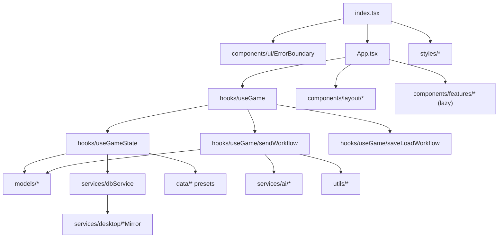
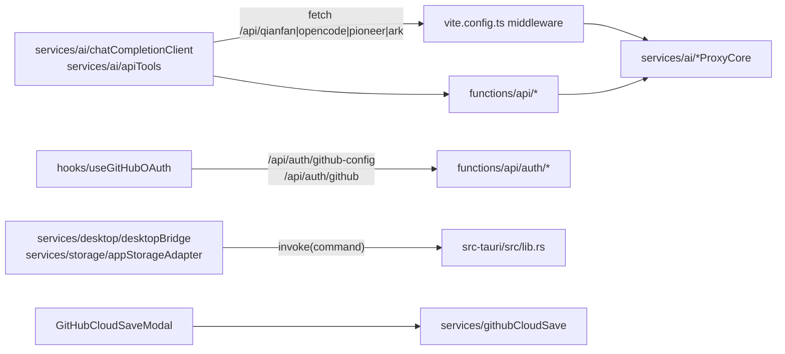

# PathAufCalls — Internal Dependency & Call-Path Inventory

> Generated for Kernel / UI separation planning.  
> **Scope**: internal FE↔FE, BE↔BE, FE↔BE (shared Kernel imports, same-origin `/api/*`, Tauri invoke).  
> **Excluded from primary edges**: npm packages, third-party AI vendor HTTP endpoints, CDN assets.  
> **Alias**: `@/*` → repository root (`tsconfig.json` / `vite.config.ts`).  
> **Extractor**: newline-tolerant static import parser (`scripts/lib/extractInternalImports.mjs`).  
> **Counts**: 1008 primary internal edges; 1026 including scripts; 291 UI/App→Kernel.

---

## 1. Architecture snapshot (separation lens)

| Layer | Directories / files | Role |
|---|---|---|
| **Composition Root** | `App.tsx`, `index.tsx`, `vite.config.ts` | Mounts React tree, wires layout/features to `useGame`, registers Vite local `/api/*` proxies |
| **UI / Presentation** | `components/**`, `styles/**` | Rendering, modals, panels, chat chrome |
| **Orchestration** | `hooks/**` | Runtime state, send/save/reroll workflows; primary UI↔Kernel bridge |
| **Potential Kernel** | `services/**`, `models/**`, `utils/**`, `data/**`, `prompts/**` | Domain shapes, persistence, AI adapters, retrieval, variable pipeline, presets |
| **Backend / Edge** | `functions/api/**`, Cloudflare Pages | Same-origin proxies + OAuth + presence |
| **Desktop Edge** | `src-tauri/src/**` | Tauri commands for FS/storage/updater |
| **Tooling (secondary)** | `scripts/**` | Source-level regressions; not runtime app graph |

### 1.1 Cross-group import matrix (primary source groups)

| From \ To | root | components | hooks | services | models | utils | data | prompts | functions | styles | src-tauri |
|---|---|---|---|---|---|---|---|---|---|---|---|
| **root** | 1 | 35 | 2 | 7 | 15 | 3 | 2 | · | · | 3 | · |
| **components** | · | 58 | 8 | 66 | 141 | 34 | 27 | · | · | 1 | · |
| **hooks** | · | · | 27 | 37 | 103 | 33 | 17 | · | · | 1 | · |
| **services** | · | · | · | 86 | 70 | 29 | 8 | 11 | · | · | · |
| **models** | · | · | · | · | 42 | 2 | 5 | · | · | · | · |
| **utils** | · | · | · | 3 | 53 | 18 | 8 | · | · | · | · |
| **data** | · | · | · | · | 15 | 1 | 12 | 13 | · | · | · |
| **functions** | · | · | · | 4 | · | · | · | · | 7 | · | · |

### 1.2 File counts scanned (code)

| Group | Files |
|---|---|
| `scripts` | 132 |
| `components` | 73 |
| `services` | 51 |
| `utils` | 36 |
| `data` | 27 |
| `models` | 24 |
| `hooks` | 16 |
| `prompts` | 13 |
| `functions` | 8 |
| `root` | 4 |
| `postcss.config.js` | 1 |
| `styles` | 1 |
| `tailwind.config.js` | 1 |

### 1.3 Most imported internal modules (hub targets)

| Importers (unique sources) | Module |
|---|---|
| 80 | `models/settings.ts` |
| 34 | `models/npc.ts` |
| 32 | `services/dbService.ts` |
| 31 | `models/character.ts` |
| 29 | `models/world.ts` |
| 27 | `models/imageGeneration.ts` |
| 25 | `models/chat.ts` |
| 20 | `models/journey.ts` |
| 19 | `models/storyWeaving.ts` |
| 19 | `models/prompts.ts` |
| 18 | `models/zhiku.ts` |
| 17 | `models/phone.ts` |
| 16 | `models/yiting.ts` |
| 15 | `models/news.ts` |
| 15 | `services/ai/chatCompletionClient.ts` |
| 14 | `utils/platform/desktopRuntime.ts` |
| 14 | `utils/albumActions.ts` |
| 14 | `models/worldbook.ts` |
| 13 | `models/memory.ts` |
| 12 | `data/journeyPresets.ts` |
| 12 | `models/path.ts` |
| 12 | `services/ai/retry.ts` |
| 11 | `models/stTypes.ts` |
| 10 | `models/plot.ts` |
| 10 | `data/canonicalCharacters.ts` |
| 10 | `services/ai/apiTools.ts` |
| 9 | `utils/albumObjectUrl.ts` |
| 8 | `data/storyWeavingPreset.ts` |
| 8 | `components/features/GameSystems/album/foundation.ts` |
| 8 | `models/variableCommand.ts` |
| 7 | `models/queueTask.ts` |
| 7 | `functions/api/auth/_shared.ts` |
| 7 | `services/promptModuleScopes.ts` |
| 7 | `services/storage/appStorageAdapter.ts` |
| 6 | `utils/imagePromptRules.ts` |

### 1.4 Highest fan-out sources (outgoing internal imports)

| Outgoing edges | File |
|---|---|
| 63 | `hooks/useGame/sendWorkflow.ts` |
| 59 | `App.tsx` |
| 28 | `hooks/useGameState.ts` |
| 26 | `components/features/Settings/SettingsModal.tsx` |
| 26 | `hooks/useGame/systemPromptBuilder.ts` |
| 25 | `hooks/useGame/contextSnapshot.ts` |
| 24 | `components/features/GameSystems/AlbumPanel.tsx` |
| 21 | `components/features/GameSystems/album/workspaces.tsx` |
| 21 | `hooks/useGame/saveLoadWorkflow.ts` |
| 19 | `data/builtinPromptModules.ts` |
| 19 | `models/settings.ts` |
| 18 | `services/ai/phoneService.ts` |
| 18 | `utils/variableExecutor.ts` |
| 16 | `components/features/Phone/PhoneModal.tsx` |
| 15 | `hooks/useGame.ts` |
| 15 | `services/ai/newsModel.ts` |
| 13 | `components/features/Settings/StorageManager.tsx` |
| 13 | `services/ai/variableModel.ts` |
| 12 | `components/features/NewGame/NewGameWizard.tsx` |
| 12 | `hooks/useGame/turnSnapshot.ts` |
| 12 | `services/dbService.ts` |
| 11 | `components/features/Settings/ApiSettings.tsx` |
| 10 | `services/desktop/desktopDiagnostics.ts` |
| 10 | `utils/variableFacts.ts` |
| 9 | `components/features/Chat/TurnItem.tsx` |
| 9 | `components/features/Settings/PromptModulesTab.tsx` |
| 9 | `models/index.ts` |
| 9 | `services/storyWeaving.ts` |
| 8 | `services/ai/apiTools.ts` |
| 8 | `services/ai/skillGenerator.ts` |

---

## 2. High-level call graphs

### 2.1 App composition (UI shell)



### 2.2 Narrative turn path (orchestration hub)

```text
UI (Chat InputArea / App)
  → hooks/useGame.handleSend
    → hooks/useGame/sendWorkflow.executeSendWorkflow
      → hooks/useGame/systemPromptBuilder, contextSnapshot, tavern*, historyWindow, memoryUtils
      → services/workflowRecovery + utils/visibilityBufferedPublisher
      → services/ai/chatCompletionClient (+ provider proxies via /api/* when needed)
      → services/ai/responseParser, variableModel, newsModel, phoneService, ...
      → utils/variableExecutor (parse/reduce/commit variable protocol)
      → services/dbService / save paths (+ desktop mirrors when desktop)
      → hooks/useGame/turnSnapshot (pre-turn snapshot for reroll)
      → models/* normalizers & domain constructors
```

### 2.3 Internal FE↔BE surfaces



---

## 3. Internal API routes & FE↔BE bridges

### 3.1 Cloudflare Pages Functions (`functions/api/*`)

| Route (URL path) | Implementation file | Internal imports |
|---|---|---|
| `POST/OPTIONS /api/qianfan` | `functions/api/qianfan.ts` | `./auth/_shared` → `../../services/ai/qianfanProxyCore` |
| `POST/OPTIONS /api/opencode` | `functions/api/opencode.ts` | `./auth/_shared` → `../../services/ai/opencodeProxyCore` |
| `POST/OPTIONS /api/pioneer` | `functions/api/pioneer.ts` | `./auth/_shared` → `../../services/ai/pioneerProxyCore` |
| `POST/OPTIONS /api/ark` | `functions/api/ark.ts` | `./auth/_shared` → `../../services/ai/arkProxyCore` |
| `GET/OPTIONS /api/auth/github-config` | `functions/api/auth/github-config.ts` | `./_shared` |
| `POST/OPTIONS /api/auth/github` | `functions/api/auth/github.ts` | `./_shared` |
| `/api/presence` | `functions/api/presence.ts` | `./auth/_shared` (online sessions KV; **frontend call sites currently disabled** per regression `scripts/presence-regression.mjs`) |

Shared BE helper: `functions/api/auth/_shared.ts` (jsonResponse, optionsResponse, env helpers).

Deploy context: `wrangler.toml` → Pages output `dist`, KV binding `ONLINE_SESSIONS_KV` for presence.

### 3.2 Vite dev middleware proxies (`vite.config.ts`)

| Dev path | Handler core (Kernel) |
|---|---|
| `/api/qianfan` | `services/ai/qianfanProxyCore` via `handleQianfanProxyRequest` |
| `/api/opencode` | `services/ai/opencodeProxyCore` via `handleOpenCodeProxyRequest` |
| `/api/pioneer` | `services/ai/pioneerProxyCore` via `handlePioneerProxyRequest` |
| `/api/ark` | `services/ai/arkProxyCore` via `handleArkProxyRequest` |

**Pattern**: Cloudflare functions and Vite middleware share the same Kernel proxy cores under `services/ai/*ProxyCore.ts`. Upstream vendor URLs inside those cores are **external-out-of-scope** (not architecture edges).

### 3.3 Frontend consumers of internal `/api/*`

| Consumer | Internal path(s) | Purpose |
|---|---|---|
| `services/ai/chatCompletionClient.ts` | `/api/ark`, `/api/qianfan`, `/api/pioneer`, `/api/opencode` | Stream/non-stream chat completions via same-origin proxy |
| `services/ai/apiTools.ts` | `/api/opencode`, `/api/pioneer`, `/api/ark`, `/api/qianfan` | Model list / connection helpers |
| `hooks/useGitHubOAuth.ts` | `/api/auth/github-config`, `/api/auth/github` | OAuth client id + code exchange |
| `App.tsx` / Landing | ~~`/api/presence`~~ | **Not called** while online-player system disabled |

Note: string `/api/v3` appearing in settings defaults / ark base URL normalization refers to **external** Volcengine path segments, not an internal app route.

### 3.4 Tauri desktop command bridge

**Defined in** `src-tauri/src/lib.rs` (`tauri::generate_handler!`):

| Command | FE invoke site(s) |
|---|---|
| `desktop_app_info` | `services/desktop/desktopBridge.ts` |
| `write_desktop_probe` | `services/desktop/desktopBridge.ts` |
| `pick_desktop_folder` | `services/desktop/desktopBridge.ts` |
| `set_desktop_storage_roots` | `services/desktop/desktopBridge.ts` |
| `open_desktop_data_dir` | `services/desktop/desktopBridge.ts` |
| `desktop_read_text` | `services/storage/appStorageAdapter.ts` |
| `desktop_write_text` | (registered; adapter uses atomic variant) |
| `desktop_write_text_atomic` | `services/storage/appStorageAdapter.ts` |
| `desktop_write_base64_file` | `services/storage/appStorageAdapter.ts` |
| `desktop_read_base64_file` | `services/storage/appStorageAdapter.ts` |
| `desktop_list` | `services/storage/appStorageAdapter.ts` |
| `desktop_remove` | `services/storage/appStorageAdapter.ts` |

Desktop runtime gate: `utils/platform/desktopRuntime.ts`. Persistence path: UI/settings → `services/dbService` → `services/desktop/*Mirror` / `appStorageAdapter` → Tauri commands.

Entry: `src-tauri/src/main.rs` → `lib::run`.

---

## 4. Observed dependency patterns (Kernel / UI separation)

### 4.1 Quantitative couplings

| Coupling class | Edge count |
|---|---|
| Components → Kernel | 268 |
| App.tsx → Kernel | 23 |
| UI+App → Kernel (combined) | 291 |
| Hooks → Kernel | 190 |
| Components → Hooks | 8 |
| Kernel → Kernel | 376 |
| Components → Components/styles | 59 |
| Root outgoing | 68 |
| Functions → * | 11 |
| **Primary total** | **1008** |

### 4.2 Components/App with heaviest Kernel imports

| Kernel imports | File |
|---|---|
| 23 | `App.tsx` |
| 17 | `components/features/GameSystems/album/workspaces.tsx` |
| 15 | `components/features/Phone/PhoneModal.tsx` |
| 14 | `components/features/GameSystems/AlbumPanel.tsx` |
| 13 | `components/features/Settings/SettingsModal.tsx` |
| 12 | `components/features/NewGame/NewGameWizard.tsx` |
| 12 | `components/features/Settings/StorageManager.tsx` |
| 8 | `components/features/Chat/TurnItem.tsx` |
| 8 | `components/features/Settings/PromptModulesTab.tsx` |
| 7 | `components/features/GameSystems/SkillPanel.tsx` |
| 7 | `components/features/GameSystems/StarMapPanel.tsx` |
| 6 | `components/features/Chat/ChatList.tsx` |
| 6 | `components/features/Chat/MessageRenderers.tsx` |
| 6 | `components/features/GameSystems/CompanionPanel.tsx` |
| 6 | `components/features/GameSystems/PlotPanel.tsx` |
| 6 | `components/features/Path/PathDebugView.tsx` |
| 6 | `components/features/Settings/GameSettings.tsx` |
| 5 | `components/features/Character/TravelerProfileModal.tsx` |
| 5 | `components/features/GameSystems/PathPanel.tsx` |
| 5 | `components/layout/LeftPanel.tsx` |
| 4 | `components/features/GameSystems/ZhikuPanel.tsx` |
| 4 | `components/features/Path/PathAwakeningInvitation.tsx` |
| 4 | `components/features/Settings/ApiSettings.tsx` |
| 4 | `components/features/Settings/ImageGenerationSettingsTab.tsx` |
| 4 | `components/features/Worldbook/WorldbookManagerModal.tsx` |

### 4.3 Kernel modules most pulled into UI

| UI importers | Kernel module |
|---|---|
| 36 | `models/settings.ts` |
| 24 | `services/dbService.ts` |
| 18 | `models/imageGeneration.ts` |
| 16 | `models/character.ts` |
| 12 | `models/npc.ts` |
| 10 | `utils/albumActions.ts` |
| 9 | `data/journeyPresets.ts` |
| 9 | `models/world.ts` |
| 9 | `services/ai/apiTools.ts` |
| 7 | `models/path.ts` |
| 6 | `models/chat.ts` |
| 6 | `models/zhiku.ts` |
| 6 | `models/journey.ts` |
| 5 | `models/phone.ts` |
| 5 | `models/news.ts` |
| 5 | `models/storyWeaving.ts` |
| 5 | `utils/albumObjectUrl.ts` |
| 4 | `models/memory.ts` |
| 4 | `models/yiting.ts` |
| 4 | `models/worldbook.ts` |
| 3 | `services/ai/imageGeneration.ts` |
| 3 | `utils/imagePromptRules.ts` |
| 3 | `services/pathService.ts` |
| 3 | `models/prompts.ts` |
| 3 | `utils/platform/desktopRuntime.ts` |
| 3 | `data/weatherRules.ts` |
| 3 | `data/gameMenu.ts` |
| 2 | `utils/streamingMessageStore.ts` |
| 2 | `utils/tokenEstimate.ts` |
| 2 | `services/ai/narrativeImageParse.ts` |

### 4.4 Pattern notes (observations only)

1. **Orchestration is the intended bridge**: `hooks/useGame` + `hooks/useGame/*` concentrate turn/save/reroll; many feature panels still import Kernel directly.
2. **Direct `services/dbService` from components** and from Kernel peers: settings/storage/album/phone/plot panels; `dbService` itself fans into desktop mirrors (`desktopSaveMirror`, `desktopAssetMirror`, …).
3. **Domain types in `models/*`** are shared widely; value factories/normalizers ride along into UI.
4. **`models/settings.ts` remains a top hub** for settings types + normalizers.
5. **Album / Phone / Settings / StorageManager** densest UI→Kernel (incl. multi-line import blocks for desktop services).
6. **`App.tsx` mega-composer**: layout + many `lazyWithRetry` feature surfaces + Kernel touches.
7. **Proxy cores shared** between Cloudflare and Vite; vendor HTTP **external-out-of-scope**.
8. **`useGameState` → `styles/themes`**: orchestration applies presentation theme.
9. **Variable pipeline** Kernel-shaped; `VariableManager` also imports `variableExecutor`.
10. **Desktop path**: UI StorageManager → desktopBridge/diagnostics/mirrors → Tauri; `dbService` → mirrors.
11. **PhoneModal / MemoryPanel** import `hooks/useGame/memoryUtils` (orchestration leak into features).
12. **prompts/** is a leaf (0 outgoing internal imports).
13. **Presence** route exists; FE callers disabled.
14. **GitHub cloud save**: `GitHubCloudSaveModal` → `services/githubCloudSave` + OAuth hook → `/api/auth/*`.
15. **Album worker chain**: `albumArchiveWorkerClient` ↔ `albumArchive` / worker (multi-line relative imports).

### 4.5 Type-only vs value UI→Kernel imports (classified)

| Kind | Count |
|---|---|
| value | 242 |
| type-only | 44 |
| dynamic-value | 5 |

### 4.6 Value (runtime) UI → `services/*` edges (tightest presentation→logic couplings)

| Source | Target | Spec |
|---|---|---|
| `App.tsx` | `services/ai/travelerTemplate.ts` | `@/services/ai/travelerTemplate` |
| `App.tsx` | `services/dbService.ts` | `@/services/dbService` |
| `App.tsx` | `services/storyProgressService.ts` | `@/services/storyProgressService` |
| `components/features/Chat/InputArea.tsx` | `services/ai/responseParser.ts` | `@/services/ai/responseParser` |
| `components/features/CloudSave/GitHubCloudSaveModal.tsx` | `services/dbService.ts` | `@/services/dbService` |
| `components/features/CloudSave/GitHubCloudSaveModal.tsx` | `services/githubCloudSave.ts` | `@/services/githubCloudSave` |
| `components/features/GameSystems/album/workspaces.tsx` | `services/ai/characterAnchorExtract.ts` | `@/services/ai/characterAnchorExtract` |
| `components/features/GameSystems/album/workspaces.tsx` | `services/ai/imageGeneration.ts` | `@/services/ai/imageGeneration` |
| `components/features/GameSystems/album/workspaces.tsx` | `services/ai/imagePromptTokenizer.ts` | `@/services/ai/imagePromptTokenizer` |
| `components/features/GameSystems/album/workspaces.tsx` | `services/ai/narrativeImageParse.ts` | `@/services/ai/narrativeImageParse` |
| `components/features/GameSystems/album/workspaces.tsx` | `services/dbService.ts` | `@/services/dbService` |
| `components/features/GameSystems/AlbumPanel.tsx` | `services/ai/characterAnchorExtract.ts` | `@/services/ai/characterAnchorExtract` |
| `components/features/GameSystems/AlbumPanel.tsx` | `services/ai/imageGeneration.ts` | `@/services/ai/imageGeneration` |
| `components/features/GameSystems/AlbumPanel.tsx` | `services/ai/imagePromptTokenizer.ts` | `@/services/ai/imagePromptTokenizer` |
| `components/features/GameSystems/AlbumPanel.tsx` | `services/ai/narrativeImageParse.ts` | `@/services/ai/narrativeImageParse` |
| `components/features/GameSystems/AlbumPanel.tsx` | `services/dbService.ts` | `@/services/dbService` |
| `components/features/GameSystems/CompanionPanel.tsx` | `services/npcRelationshipPlanning.ts` | `@/services/npcRelationshipPlanning` |
| `components/features/GameSystems/PathPanel.tsx` | `services/pathService.ts` | `@/services/pathService` |
| `components/features/GameSystems/PlotPanel.tsx` | `services/dbService.ts` | `@/services/dbService` |
| `components/features/GameSystems/PlotPanel.tsx` | `services/storyPlanningAnalysis.ts` | `@/services/storyPlanningAnalysis` |
| `components/features/GameSystems/PlotPanel.tsx` | `services/storyWeaving.ts` | `@/services/storyWeaving` |
| `components/features/GameSystems/SkillPanel.tsx` | `services/ai/skillGenerator.ts` | `@/services/ai/skillGenerator` |
| `components/features/GameSystems/StarMapPanel.tsx` | `services/dbService.ts` | `@/services/dbService` |
| `components/features/GameSystems/ZhikuPanel.tsx` | `services/dbService.ts` | `@/services/dbService` |
| `components/features/NewGame/NewGameWizard.tsx` | `services/ai/openingArchive.ts` | `@/services/ai/openingArchive` |
| `components/features/NewGame/NewGameWizard.tsx` | `services/ai/skillGenerator.ts` | `@/services/ai/skillGenerator` |
| `components/features/NewGame/NewGameWizard.tsx` | `services/ai/travelerTemplate.ts` | `@/services/ai/travelerTemplate` |
| `components/features/NewGame/NewGameWizard.tsx` | `services/dbService.ts` | `@/services/dbService` |
| `components/features/Phone/PhoneModal.tsx` | `services/ai/phoneService.ts` | `@/services/ai/phoneService` |
| `components/features/SaveLoad/SaveLoadModal.tsx` | `services/dbService.ts` | `@/services/dbService` |
| `components/features/Settings/ApiErrorReportsTab.tsx` | `services/ai/apiErrorReportService.ts` | `@/services/ai/apiErrorReportService` |
| `components/features/Settings/ApiSettings.tsx` | `services/ai/apiTools.ts` | `@/services/ai/apiTools` |
| `components/features/Settings/ApiSettings.tsx` | `services/dbService.ts` | `@/services/dbService` |
| `components/features/Settings/GameSettings.tsx` | `services/dbService.ts` | `@/services/dbService` |
| `components/features/Settings/ImageGenerationSettingsTab.tsx` | `services/ai/apiTools.ts` | `@/services/ai/apiTools` |
| `components/features/Settings/ImageGenerationSettingsTab.tsx` | `services/ai/imageGeneration.ts` | `@/services/ai/imageGeneration` |
| `components/features/Settings/ImageGenerationSettingsTab.tsx` | `services/dbService.ts` | `@/services/dbService` |
| `components/features/Settings/MemorySystemSettings.tsx` | `services/ai/apiTools.ts` | `@/services/ai/apiTools` |
| `components/features/Settings/MemorySystemSettings.tsx` | `services/dbService.ts` | `@/services/dbService` |
| `components/features/Settings/NsfwSettingsTab.tsx` | `services/dbService.ts` | `@/services/dbService` |
| `components/features/Settings/PhoneSystemSettingsTab.tsx` | `services/ai/apiTools.ts` | `@/services/ai/apiTools` |
| `components/features/Settings/PhoneSystemSettingsTab.tsx` | `services/dbService.ts` | `@/services/dbService` |
| `components/features/Settings/StorageManager.tsx` | `services/dbService.ts` | `@/services/dbService` |
| `components/features/Settings/StorageManager.tsx` | `services/desktop/desktopAssetMirror.ts` | `@/services/desktop/desktopAssetMirror` |
| `components/features/Settings/StorageManager.tsx` | `services/desktop/desktopBridge.ts` | `@/services/desktop/desktopBridge` |
| `components/features/Settings/StorageManager.tsx` | `services/desktop/desktopDiagnostics.ts` | `@/services/desktop/desktopDiagnostics` |
| `components/features/Settings/StorageManager.tsx` | `services/desktop/desktopMigrationBackup.ts` | `@/services/desktop/desktopMigrationBackup` |
| `components/features/Settings/StorageManager.tsx` | `services/desktop/desktopReleaseInfo.ts` | `@/services/desktop/desktopReleaseInfo` |
| `components/features/Settings/StorageManager.tsx` | `services/desktop/desktopSaveBackup.ts` | `@/services/desktop/desktopSaveBackup` |
| `components/features/Settings/StorageManager.tsx` | `services/desktop/desktopSaveDeltaMirror.ts` | `@/services/desktop/desktopSaveDeltaMirror` |
| `components/features/Settings/StorageManager.tsx` | `services/desktop/desktopSaveMirror.ts` | `@/services/desktop/desktopSaveMirror` |
| `components/features/Settings/StorageManager.tsx` | `services/desktop/desktopSettingsMirror.ts` | `@/services/desktop/desktopSettingsMirror` |
| `components/features/Settings/StoryWeavingSettingsTab.tsx` | `services/ai/apiTools.ts` | `@/services/ai/apiTools` |
| `components/features/Settings/StoryWeavingSettingsTab.tsx` | `services/dbService.ts` | `@/services/dbService` |
| `components/features/Settings/VariableUpdateSettings.tsx` | `services/ai/apiTools.ts` | `@/services/ai/apiTools` |
| `components/features/Settings/VariableUpdateSettings.tsx` | `services/dbService.ts` | `@/services/dbService` |
| `components/features/Settings/YitingSettingsTab.tsx` | `services/ai/apiTools.ts` | `@/services/ai/apiTools` |
| `components/features/Settings/YitingSettingsTab.tsx` | `services/dbService.ts` | `@/services/dbService` |
| `components/layout/DesktopHomeScreen.tsx` | `services/dbService.ts` | `@/services/dbService` |
| `components/layout/DesktopHomeScreen.tsx` | `services/desktop/desktopBridge.ts` | `@/services/desktop/desktopBridge` |
| `components/layout/DesktopHomeScreen.tsx` | `services/desktop/desktopReleaseInfo.ts` | `@/services/desktop/desktopReleaseInfo` |

### 4.7 Feature hotspots

| Feature area | Kernel runtime pull |
|---|---|
| **Album** | imageGeneration, narrativeImageParse, characterAnchorExtract, imagePromptTokenizer, dbService, albumActions/objectUrl, worker client |
| **Phone** | phoneService, model factories, albumActions, memoryUtils |
| **New game** | openingArchive, travelerTemplate, skillGenerator, dbService, journey presets |
| **Settings / Storage** | dbService, apiTools, desktopBridge, diagnostics, releaseInfo, saveBackup, migrationBackup, settingsMirror |
| **Plot / path / skill / companion** | storyWeaving, storyPlanningAnalysis, pathService, skillGenerator, npcRelationshipPlanning |
| **Cloud save** | githubCloudSave, dbService, useGitHubOAuth → /api/auth/* |
| **Chat** | streamingMessageStore, responseParser, albumActions, playerSpeechGuard |

### 4.8 Orchestration layer call path (narrative turn)

```text
components/features/Chat/InputArea (or App actions)
  → hooks/useGame.handleSend
    → hooks/useGame/sendWorkflow.executeSendWorkflow
        → turnSnapshot
        → systemPromptBuilder / contextSnapshot / tavern* / historyWindow / memoryUtils
        → workflowRecovery + visibilityBufferedPublisher
        → services/ai/chatCompletionClient.sendChatMessage
            → fetch('/api/ark|qianfan|pioneer|opencode')  [internal]
            → *ProxyCore → external vendor  [external-out-of-scope]
        → responseParser + variableModel + newsModel + phoneService + image tasks
        → utils/variableExecutor
        → services/dbService (+ desktop mirrors)
```

### 4.9 Kernel-internal structure

| From → To | Role |
|---|---|
| services → models | Domain types + factories |
| services → services | AI stack; dbService → desktop mirrors; desktop submodules |
| services → utils | Variable/save/sanitize/workflowRecoveryModel |
| utils → models | Protocol/save need domain shapes |
| data → models / prompts | Preset builders |
| prompts → * | Leaf content |

**Shared proxy cores**: qianfan / opencode / pioneer / ark ProxyCore (Vite + CF).

**Desktop bridges**: desktopBridge, appStorageAdapter, *Mirror / *Backup services.

### 4.10 Components → hooks edges

| Source | Target | Spec |
|---|---|---|
| `components/features/CloudSave/GitHubCloudSaveModal.tsx` | `hooks/useGitHubOAuth.ts` | `@/hooks/useGitHubOAuth` |
| `components/features/GameSystems/MemoryPanel.tsx` | `hooks/useGame/memoryUtils.ts` | `@/hooks/useGame/memoryUtils` |
| `components/features/Phone/PhoneModal.tsx` | `hooks/useGame/memoryUtils.ts` | `@/hooks/useGame/memoryUtils` |
| `components/features/SaveLoad/SaveLoadModal.tsx` | `hooks/useGame/saveLoadWorkflow.ts` | `@/hooks/useGame/saveLoadWorkflow` |
| `components/features/Settings/ContextViewer.tsx` | `hooks/useGame/contextSnapshot.ts` | `@/hooks/useGame/contextSnapshot` |
| `components/features/Settings/PromptModulesTab.tsx` | `hooks/useGame/tavernRegexProcessor.ts` | `@/hooks/useGame/tavernRegexProcessor` |
| `components/features/Settings/SettingsModal.tsx` | `hooks/useGame/contextSnapshot.ts` | `@/hooks/useGame/contextSnapshot` |
| `components/features/Settings/StorageManager.tsx` | `hooks/useGame/saveLoadWorkflow.ts` | `@/hooks/useGame/saveLoadWorkflow` |

### 4.11 Edge/Backend inventory (complete internal routes)

| Internal route | CF Function | Vite dev | FE consumers | Status |
|---|---|---|---|---|
| `/api/ark` | ark.ts → arkProxyCore | yes | chatCompletionClient, apiTools | active |
| `/api/qianfan` | qianfan.ts → qianfanProxyCore | yes | chatCompletionClient, apiTools | active |
| `/api/opencode` | opencode.ts → opencodeProxyCore | yes | chatCompletionClient, apiTools | active |
| `/api/pioneer` | pioneer.ts → pioneerProxyCore | yes | chatCompletionClient, apiTools | active |
| `/api/auth/github-config` | auth/github-config.ts | no | useGitHubOAuth | active (CF) |
| `/api/auth/github` | auth/github.ts | no | useGitHubOAuth | active (CF); upstream GitHub external |
| `/api/presence` | presence.ts | no | none (disabled) | PRESENCE_SYSTEM_ENABLED=false |

### 4.12 App.tsx lazy feature surfaces

Dynamic imports via `utils/lazyWithRetry` from `App.tsx` target `components/features/**` (code-split UI, not layer-split). Kernel is still reached from those feature modules directly.

---

## 5. Complete internal import inventory

Every row is exact source → resolved target. Kind: `internal` = resolved; `unresolved-internal` = not resolved to a file.

**Parser note**: multi-line `import {\n … \n} from '…'` is included (fixed extractor).

### 5.1 Composition root (`App.tsx`, `index.tsx`, `vite.config.ts`)

**Edges: 68**

| Source | Target | Import Spec | Kind |
|---|---|---|---|
| `App.tsx` | `components/features/Character/TravelerProfileModal.tsx` | `@/components/features/Character/TravelerProfileModal` | internal |
| `App.tsx` | `components/features/Chat/ChatList.tsx` | `@/components/features/Chat/ChatList` | internal |
| `App.tsx` | `components/features/Chat/InputArea.tsx` | `@/components/features/Chat/InputArea` | internal |
| `App.tsx` | `components/features/CloudSave/GitHubCloudSaveModal.tsx` | `@/components/features/CloudSave/GitHubCloudSaveModal` | internal |
| `App.tsx` | `components/features/GameSystems/AlbumPanel.tsx` | `@/components/features/GameSystems/AlbumPanel` | internal |
| `App.tsx` | `components/features/GameSystems/CompanionPanel.tsx` | `@/components/features/GameSystems/CompanionPanel` | internal |
| `App.tsx` | `components/features/GameSystems/InventoryPanel.tsx` | `@/components/features/GameSystems/InventoryPanel` | internal |
| `App.tsx` | `components/features/GameSystems/MemoryPanel.tsx` | `@/components/features/GameSystems/MemoryPanel` | internal |
| `App.tsx` | `components/features/GameSystems/NewsPanel.tsx` | `@/components/features/GameSystems/NewsPanel` | internal |
| `App.tsx` | `components/features/GameSystems/PathPanel.tsx` | `@/components/features/GameSystems/PathPanel` | internal |
| `App.tsx` | `components/features/GameSystems/PlotPanel.tsx` | `@/components/features/GameSystems/PlotPanel` | internal |
| `App.tsx` | `components/features/GameSystems/SkillPanel.tsx` | `@/components/features/GameSystems/SkillPanel` | internal |
| `App.tsx` | `components/features/GameSystems/StarMapPanel.tsx` | `@/components/features/GameSystems/StarMapPanel` | internal |
| `App.tsx` | `components/features/GameSystems/YitingPanel.tsx` | `@/components/features/GameSystems/YitingPanel` | internal |
| `App.tsx` | `components/features/GameSystems/ZhikuManagerModal.tsx` | `@/components/features/GameSystems/ZhikuManagerModal` | internal |
| `App.tsx` | `components/features/GameSystems/ZhikuPanel.tsx` | `@/components/features/GameSystems/ZhikuPanel` | internal |
| `App.tsx` | `components/features/NewGame/NewGameWizard.tsx` | `@/components/features/NewGame/NewGameWizard` | internal |
| `App.tsx` | `components/features/Path/PathAwakeningInvitation.tsx` | `@/components/features/Path/PathAwakeningInvitation` | internal |
| `App.tsx` | `components/features/Phone/PhoneModal.tsx` | `@/components/features/Phone/PhoneModal` | internal |
| `App.tsx` | `components/features/Release/ReleaseAnnouncementsModal.tsx` | `@/components/features/Release/ReleaseAnnouncementsModal` | internal |
| `App.tsx` | `components/features/ReviewLab/AIReviewLabModal.tsx` | `@/components/features/ReviewLab/AIReviewLabModal` | internal |
| `App.tsx` | `components/features/SaveLoad/SaveLoadModal.tsx` | `@/components/features/SaveLoad/SaveLoadModal` | internal |
| `App.tsx` | `components/features/Settings/SettingsModal.tsx` | `@/components/features/Settings/SettingsModal` | internal |
| `App.tsx` | `components/features/Variable/VariableDrawer.tsx` | `@/components/features/Variable/VariableDrawer` | internal |
| `App.tsx` | `components/features/Worldbook/WorldbookManagerModal.tsx` | `@/components/features/Worldbook/WorldbookManagerModal` | internal |
| `App.tsx` | `components/layout/DesktopHomeScreen.tsx` | `@/components/layout/DesktopHomeScreen` | internal |
| `App.tsx` | `components/layout/GameView.tsx` | `@/components/layout/GameView` | internal |
| `App.tsx` | `components/layout/LandingPage.tsx` | `@/components/layout/LandingPage` | internal |
| `App.tsx` | `components/layout/LeftPanel.tsx` | `@/components/layout/LeftPanel` | internal |
| `App.tsx` | `components/layout/MobileQuickMenu.tsx` | `@/components/layout/MobileQuickMenu` | internal |
| `App.tsx` | `components/layout/RightMenu.tsx` | `@/components/layout/RightMenu` | internal |
| `App.tsx` | `components/layout/SystemDrawer.tsx` | `@/components/layout/SystemDrawer` | internal |
| `App.tsx` | `components/layout/TopBar.tsx` | `@/components/layout/TopBar` | internal |
| `App.tsx` | `components/ui/Modal.tsx` | `@/components/ui/Modal` | internal |
| `App.tsx` | `data/gameMenu.ts` | `@/data/gameMenu` | internal |
| `App.tsx` | `data/storyWeavingPreset.ts` | `@/data/storyWeavingPreset` | internal |
| `App.tsx` | `hooks/useGame.ts` | `@/hooks/useGame` | internal |
| `App.tsx` | `hooks/useGame/saveLoadWorkflow.ts` | `@/hooks/useGame/saveLoadWorkflow` | internal |
| `App.tsx` | `models/character.ts` | `@/models/character` | internal |
| `App.tsx` | `models/chat.ts` | `@/models/chat` | internal |
| `App.tsx` | `models/imageGeneration.ts` | `@/models/imageGeneration` | internal |
| `App.tsx` | `models/journey.ts` | `@/models/journey` | internal |
| `App.tsx` | `models/memory.ts` | `@/models/memory` | internal |
| `App.tsx` | `models/news.ts` | `@/models/news` | internal |
| `App.tsx` | `models/npc.ts` | `@/models/npc` | internal |
| `App.tsx` | `models/phone.ts` | `@/models/phone` | internal |
| `App.tsx` | `models/plot.ts` | `@/models/plot` | internal |
| `App.tsx` | `models/queueTask.ts` | `@/models/queueTask` | internal |
| `App.tsx` | `models/settings.ts` | `@/models/settings` | internal |
| `App.tsx` | `models/storyWeaving.ts` | `@/models/storyWeaving` | internal |
| `App.tsx` | `models/world.ts` | `@/models/world` | internal |
| `App.tsx` | `models/yiting.ts` | `@/models/yiting` | internal |
| `App.tsx` | `models/zhiku.ts` | `@/models/zhiku` | internal |
| `App.tsx` | `services/ai/travelerTemplate.ts` | `@/services/ai/travelerTemplate` | internal |
| `App.tsx` | `services/dbService.ts` | `@/services/dbService` | internal |
| `App.tsx` | `services/storyProgressService.ts` | `@/services/storyProgressService` | internal |
| `App.tsx` | `utils/lazyWithRetry.ts` | `@/utils/lazyWithRetry` | internal |
| `App.tsx` | `utils/platform/desktopRuntime.ts` | `@/utils/platform/desktopRuntime` | internal |
| `App.tsx` | `utils/streamingMessageStore.ts` | `@/utils/streamingMessageStore` | internal |
| `index.tsx` | `App.tsx` | `@/App` | internal |
| `index.tsx` | `components/ui/ErrorBoundary.tsx` | `@/components/ui/ErrorBoundary` | internal |
| `index.tsx` | `styles/global.css` | `@/styles/global.css` | internal |
| `index.tsx` | `styles/root-theme.css` | `@/styles/root-theme.css` | internal |
| `index.tsx` | `styles/tailwind.css` | `@/styles/tailwind.css` | internal |
| `vite.config.ts` | `services/ai/arkProxyCore.ts` | `./services/ai/arkProxyCore` | internal |
| `vite.config.ts` | `services/ai/opencodeProxyCore.ts` | `./services/ai/opencodeProxyCore` | internal |
| `vite.config.ts` | `services/ai/pioneerProxyCore.ts` | `./services/ai/pioneerProxyCore` | internal |
| `vite.config.ts` | `services/ai/qianfanProxyCore.ts` | `./services/ai/qianfanProxyCore` | internal |

### 5.2 UI → UI (`components` → `components`/`styles`)

**Edges: 59**

| Source | Target | Import Spec | Kind |
|---|---|---|---|
| `components/features/Character/TravelerProfileModal.tsx` | `components/ui/Modal.tsx` | `@/components/ui/Modal` | internal |
| `components/features/Chat/ChatList.tsx` | `components/features/Chat/TurnItem.tsx` | `./TurnItem` | internal |
| `components/features/Chat/TurnItem.tsx` | `components/features/Chat/MessageRenderers.tsx` | `./MessageRenderers` | internal |
| `components/features/GameSystems/album/albumArchive.ts` | `components/features/GameSystems/album/albumContent.ts` | `./albumContent` | internal |
| `components/features/GameSystems/album/albumArchive.ts` | `components/features/GameSystems/album/foundation.ts` | `./foundation` | internal |
| `components/features/GameSystems/album/albumArchive.worker.ts` | `components/features/GameSystems/album/albumArchive.ts` | `./albumArchive` | internal |
| `components/features/GameSystems/album/albumArchive.worker.ts` | `components/features/GameSystems/album/albumContent.ts` | `./albumContent` | internal |
| `components/features/GameSystems/album/albumArchiveWorkerClient.ts` | `components/features/GameSystems/album/albumArchive.ts` | `./albumArchive` | internal |
| `components/features/GameSystems/album/albumArchiveWorkerClient.ts` | `components/features/GameSystems/album/albumContent.ts` | `./albumContent` | internal |
| `components/features/GameSystems/album/albumArchiveWorkerClient.ts` | `components/features/GameSystems/album/foundation.ts` | `./foundation` | internal |
| `components/features/GameSystems/album/libWorkspace.tsx` | `components/features/GameSystems/album/albumArchive.ts` | `./albumArchive` | internal |
| `components/features/GameSystems/album/libWorkspace.tsx` | `components/features/GameSystems/album/foundation.ts` | `./foundation` | internal |
| `components/features/GameSystems/album/libWorkspace.tsx` | `components/features/GameSystems/album/workspaces.tsx` | `./workspaces` | internal |
| `components/features/GameSystems/album/referenceInjection.ts` | `components/features/GameSystems/album/foundation.ts` | `./foundation` | internal |
| `components/features/GameSystems/album/referenceWorkspace.tsx` | `components/features/GameSystems/album/foundation.ts` | `./foundation` | internal |
| `components/features/GameSystems/album/referenceWorkspace.tsx` | `components/features/GameSystems/album/referenceInjection.ts` | `./referenceInjection` | internal |
| `components/features/GameSystems/album/taskWorkspace.tsx` | `components/features/GameSystems/album/foundation.ts` | `./foundation` | internal |
| `components/features/GameSystems/album/taskWorkspace.tsx` | `components/features/GameSystems/album/workspaces.tsx` | `./workspaces` | internal |
| `components/features/GameSystems/album/workspaces.tsx` | `components/features/GameSystems/album/foundation.ts` | `./foundation` | internal |
| `components/features/GameSystems/album/workspaces.tsx` | `components/features/GameSystems/album/referenceInjection.ts` | `./referenceInjection` | internal |
| `components/features/GameSystems/album/workspaces.tsx` | `components/features/ImageGeneration/ImageRuleTemplateEditor.tsx` | `@/components/features/ImageGeneration/ImageRuleTemplateEditor` | internal |
| `components/features/GameSystems/album/workspaces.tsx` | `components/features/Settings/ImageGenerationSettingsTab.tsx` | `@/components/features/Settings/ImageGenerationSettingsTab` | internal |
| `components/features/GameSystems/AlbumPanel.tsx` | `components/features/GameSystems/album/albumArchiveWorkerClient.ts` | `./album/albumArchiveWorkerClient` | internal |
| `components/features/GameSystems/AlbumPanel.tsx` | `components/features/GameSystems/album/albumContent.ts` | `./album/albumContent` | internal |
| `components/features/GameSystems/AlbumPanel.tsx` | `components/features/GameSystems/album/foundation.ts` | `./album/foundation` | internal |
| `components/features/GameSystems/AlbumPanel.tsx` | `components/features/GameSystems/album/libWorkspace.tsx` | `./album/libWorkspace` | internal |
| `components/features/GameSystems/AlbumPanel.tsx` | `components/features/GameSystems/album/referenceInjection.ts` | `./album/referenceInjection` | internal |
| `components/features/GameSystems/AlbumPanel.tsx` | `components/features/GameSystems/album/referenceWorkspace.tsx` | `./album/referenceWorkspace` | internal |
| `components/features/GameSystems/AlbumPanel.tsx` | `components/features/GameSystems/album/taskWorkspace.tsx` | `./album/taskWorkspace` | internal |
| `components/features/GameSystems/AlbumPanel.tsx` | `components/features/GameSystems/album/workspaces.tsx` | `./album/workspaces` | internal |
| `components/features/GameSystems/AlbumPanel.tsx` | `components/features/ImageGeneration/ImageRuleTemplateEditor.tsx` | `@/components/features/ImageGeneration/ImageRuleTemplateEditor` | internal |
| `components/features/GameSystems/AlbumPanel.tsx` | `components/features/Settings/ImageGenerationSettingsTab.tsx` | `@/components/features/Settings/ImageGenerationSettingsTab` | internal |
| `components/features/GameSystems/ZhikuManagerModal.tsx` | `components/features/GameSystems/ZhikuPanel.tsx` | `./ZhikuPanel` | internal |
| `components/features/GameSystems/ZhikuManagerModal.tsx` | `components/ui/Modal.tsx` | `@/components/ui/Modal` | internal |
| `components/features/Release/ReleaseAnnouncementsModal.tsx` | `components/ui/Modal.tsx` | `@/components/ui/Modal` | internal |
| `components/features/ReviewLab/AIReviewLabModal.tsx` | `components/ui/Modal.tsx` | `@/components/ui/Modal` | internal |
| `components/features/Settings/ApiSettings.tsx` | `components/features/Settings/MemorySystemSettings.tsx` | `./MemorySystemSettings` | internal |
| `components/features/Settings/ApiSettings.tsx` | `components/features/Settings/NewsSystemSettingsTab.tsx` | `./NewsSystemSettingsTab` | internal |
| `components/features/Settings/ApiSettings.tsx` | `components/features/Settings/PhoneSystemSettingsTab.tsx` | `./PhoneSystemSettingsTab` | internal |
| `components/features/Settings/ApiSettings.tsx` | `components/features/Settings/StoryWeavingSettingsTab.tsx` | `./StoryWeavingSettingsTab` | internal |
| `components/features/Settings/ApiSettings.tsx` | `components/features/Settings/VariableUpdateSettings.tsx` | `./VariableUpdateSettings` | internal |
| `components/features/Settings/ApiSettings.tsx` | `components/features/Settings/YitingSettingsTab.tsx` | `./YitingSettingsTab` | internal |
| `components/features/Settings/ApiSettings.tsx` | `components/features/Settings/ZhikuSettingsTab.tsx` | `./ZhikuSettingsTab` | internal |
| `components/features/Settings/SettingsModal.tsx` | `components/features/Settings/ApiErrorReportsTab.tsx` | `./ApiErrorReportsTab` | internal |
| `components/features/Settings/SettingsModal.tsx` | `components/features/Settings/ApiSettings.tsx` | `./ApiSettings` | internal |
| `components/features/Settings/SettingsModal.tsx` | `components/features/Settings/ContextViewer.tsx` | `./ContextViewer` | internal |
| `components/features/Settings/SettingsModal.tsx` | `components/features/Settings/ExtraFeaturesSettingsTab.tsx` | `./ExtraFeaturesSettingsTab` | internal |
| `components/features/Settings/SettingsModal.tsx` | `components/features/Settings/GameSettings.tsx` | `./GameSettings` | internal |
| `components/features/Settings/SettingsModal.tsx` | `components/features/Settings/NsfwSettingsTab.tsx` | `./NsfwSettingsTab` | internal |
| `components/features/Settings/SettingsModal.tsx` | `components/features/Settings/PromptModulesTab.tsx` | `./PromptModulesTab` | internal |
| `components/features/Settings/SettingsModal.tsx` | `components/features/Settings/StorageManager.tsx` | `./StorageManager` | internal |
| `components/features/Settings/SettingsModal.tsx` | `components/features/Settings/TavernPresetsSettingsTab.tsx` | `./TavernPresetsSettingsTab` | internal |
| `components/features/Settings/SettingsModal.tsx` | `components/features/Settings/ThemeSettings.tsx` | `./ThemeSettings` | internal |
| `components/features/Settings/SettingsModal.tsx` | `components/features/Settings/VariableManager.tsx` | `./VariableManager` | internal |
| `components/features/Settings/SettingsModal.tsx` | `components/features/Settings/VisualSettingsTab.tsx` | `./VisualSettingsTab` | internal |
| `components/features/Settings/TavernPresetsSettingsTab.tsx` | `components/features/Settings/PromptModulesTab.tsx` | `./PromptModulesTab` | internal |
| `components/features/Settings/ThemeSettings.tsx` | `styles/themes.ts` | `@/styles/themes` | internal |
| `components/layout/DesktopHomeScreen.tsx` | `components/features/Settings/SettingsModal.tsx` | `@/components/features/Settings/SettingsModal` | internal |
| `components/layout/GameView.tsx` | `components/layout/WeatherAtmosphere.tsx` | `@/components/layout/WeatherAtmosphere` | internal |

### 5.3 UI → Orchestration (`components` → `hooks`)

**Edges: 8**

| Source | Target | Import Spec | Kind |
|---|---|---|---|
| `components/features/CloudSave/GitHubCloudSaveModal.tsx` | `hooks/useGitHubOAuth.ts` | `@/hooks/useGitHubOAuth` | internal |
| `components/features/GameSystems/MemoryPanel.tsx` | `hooks/useGame/memoryUtils.ts` | `@/hooks/useGame/memoryUtils` | internal |
| `components/features/Phone/PhoneModal.tsx` | `hooks/useGame/memoryUtils.ts` | `@/hooks/useGame/memoryUtils` | internal |
| `components/features/SaveLoad/SaveLoadModal.tsx` | `hooks/useGame/saveLoadWorkflow.ts` | `@/hooks/useGame/saveLoadWorkflow` | internal |
| `components/features/Settings/ContextViewer.tsx` | `hooks/useGame/contextSnapshot.ts` | `@/hooks/useGame/contextSnapshot` | internal |
| `components/features/Settings/PromptModulesTab.tsx` | `hooks/useGame/tavernRegexProcessor.ts` | `@/hooks/useGame/tavernRegexProcessor` | internal |
| `components/features/Settings/SettingsModal.tsx` | `hooks/useGame/contextSnapshot.ts` | `@/hooks/useGame/contextSnapshot` | internal |
| `components/features/Settings/StorageManager.tsx` | `hooks/useGame/saveLoadWorkflow.ts` | `@/hooks/useGame/saveLoadWorkflow` | internal |

### 5.4 UI → Kernel (`components` → services/models/utils/data/prompts)

**Edges: 268**

| Source | Target | Import Spec | Kind |
|---|---|---|---|
| `components/features/Character/TravelerProfileModal.tsx` | `data/journeyPresets.ts` | `@/data/journeyPresets` | internal |
| `components/features/Character/TravelerProfileModal.tsx` | `models/character.ts` | `@/models/character` | internal |
| `components/features/Character/TravelerProfileModal.tsx` | `models/imageGeneration.ts` | `@/models/imageGeneration` | internal |
| `components/features/Character/TravelerProfileModal.tsx` | `models/path.ts` | `@/models/path` | internal |
| `components/features/Character/TravelerProfileModal.tsx` | `utils/albumActions.ts` | `@/utils/albumActions` | internal |
| `components/features/Chat/ChatList.tsx` | `models/character.ts` | `@/models/character` | internal |
| `components/features/Chat/ChatList.tsx` | `models/chat.ts` | `@/models/chat` | internal |
| `components/features/Chat/ChatList.tsx` | `models/imageGeneration.ts` | `@/models/imageGeneration` | internal |
| `components/features/Chat/ChatList.tsx` | `models/npc.ts` | `@/models/npc` | internal |
| `components/features/Chat/ChatList.tsx` | `models/settings.ts` | `@/models/settings` | internal |
| `components/features/Chat/ChatList.tsx` | `utils/streamingMessageStore.ts` | `@/utils/streamingMessageStore` | internal |
| `components/features/Chat/InputArea.tsx` | `services/ai/responseParser.ts` | `@/services/ai/responseParser` | internal |
| `components/features/Chat/MessageRenderers.tsx` | `models/character.ts` | `@/models/character` | internal |
| `components/features/Chat/MessageRenderers.tsx` | `models/imageGeneration.ts` | `@/models/imageGeneration` | internal |
| `components/features/Chat/MessageRenderers.tsx` | `models/npc.ts` | `@/models/npc` | internal |
| `components/features/Chat/MessageRenderers.tsx` | `models/settings.ts` | `@/models/settings` | internal |
| `components/features/Chat/MessageRenderers.tsx` | `utils/albumActions.ts` | `@/utils/albumActions` | internal |
| `components/features/Chat/MessageRenderers.tsx` | `utils/playerSpeechGuard.ts` | `@/utils/playerSpeechGuard` | internal |
| `components/features/Chat/TurnItem.tsx` | `data/journeyPresets.ts` | `@/data/journeyPresets` | internal |
| `components/features/Chat/TurnItem.tsx` | `models/character.ts` | `@/models/character` | internal |
| `components/features/Chat/TurnItem.tsx` | `models/chat.ts` | `@/models/chat` | internal |
| `components/features/Chat/TurnItem.tsx` | `models/imageGeneration.ts` | `@/models/imageGeneration` | internal |
| `components/features/Chat/TurnItem.tsx` | `models/npc.ts` | `@/models/npc` | internal |
| `components/features/Chat/TurnItem.tsx` | `models/settings.ts` | `@/models/settings` | internal |
| `components/features/Chat/TurnItem.tsx` | `utils/albumActions.ts` | `@/utils/albumActions` | internal |
| `components/features/Chat/TurnItem.tsx` | `utils/tokenEstimate.ts` | `@/utils/tokenEstimate` | internal |
| `components/features/CloudSave/GitHubCloudSaveModal.tsx` | `services/dbService.ts` | `@/services/dbService` | internal |
| `components/features/CloudSave/GitHubCloudSaveModal.tsx` | `services/githubCloudSave.ts` | `@/services/githubCloudSave` | internal |
| `components/features/GameSystems/album/albumArchive.ts` | `models/imageGeneration.ts` | `@/models/imageGeneration` | internal |
| `components/features/GameSystems/album/albumArchive.ts` | `utils/albumObjectUrl.ts` | `@/utils/albumObjectUrl` | internal |
| `components/features/GameSystems/album/albumArchive.worker.ts` | `models/imageGeneration.ts` | `@/models/imageGeneration` | internal |
| `components/features/GameSystems/album/albumArchiveWorkerClient.ts` | `models/imageGeneration.ts` | `@/models/imageGeneration` | internal |
| `components/features/GameSystems/album/albumArchiveWorkerClient.ts` | `utils/albumObjectUrl.ts` | `@/utils/albumObjectUrl` | internal |
| `components/features/GameSystems/album/albumContent.ts` | `models/imageGeneration.ts` | `@/models/imageGeneration` | internal |
| `components/features/GameSystems/album/albumContent.ts` | `utils/albumObjectUrl.ts` | `@/utils/albumObjectUrl` | internal |
| `components/features/GameSystems/album/foundation.ts` | `models/imageGeneration.ts` | `@/models/imageGeneration` | internal |
| `components/features/GameSystems/album/foundation.ts` | `models/settings.ts` | `@/models/settings` | internal |
| `components/features/GameSystems/album/libWorkspace.tsx` | `models/character.ts` | `@/models/character` | internal |
| `components/features/GameSystems/album/libWorkspace.tsx` | `models/imageGeneration.ts` | `@/models/imageGeneration` | internal |
| `components/features/GameSystems/album/libWorkspace.tsx` | `utils/albumActions.ts` | `@/utils/albumActions` | internal |
| `components/features/GameSystems/album/referenceInjection.ts` | `models/imageGeneration.ts` | `@/models/imageGeneration` | internal |
| `components/features/GameSystems/album/referenceInjection.ts` | `models/settings.ts` | `@/models/settings` | internal |
| `components/features/GameSystems/album/referenceInjection.ts` | `utils/albumObjectUrl.ts` | `@/utils/albumObjectUrl` | internal |
| `components/features/GameSystems/album/referenceWorkspace.tsx` | `models/settings.ts` | `@/models/settings` | internal |
| `components/features/GameSystems/album/taskWorkspace.tsx` | `models/imageGeneration.ts` | `@/models/imageGeneration` | internal |
| `components/features/GameSystems/album/taskWorkspace.tsx` | `utils/albumActions.ts` | `@/utils/albumActions` | internal |
| `components/features/GameSystems/album/workspaces.tsx` | `data/builtinAvatars.ts` | `@/data/builtinAvatars` | internal |
| `components/features/GameSystems/album/workspaces.tsx` | `data/canonicalCharacters.ts` | `@/data/canonicalCharacters` | internal |
| `components/features/GameSystems/album/workspaces.tsx` | `models/character.ts` | `@/models/character` | internal |
| `components/features/GameSystems/album/workspaces.tsx` | `models/chat.ts` | `@/models/chat` | internal |
| `components/features/GameSystems/album/workspaces.tsx` | `models/imageGeneration.ts` | `@/models/imageGeneration` | internal |
| `components/features/GameSystems/album/workspaces.tsx` | `models/npc.ts` | `@/models/npc` | internal |
| `components/features/GameSystems/album/workspaces.tsx` | `models/phone.ts` | `@/models/phone` | internal |
| `components/features/GameSystems/album/workspaces.tsx` | `models/settings.ts` | `@/models/settings` | internal |
| `components/features/GameSystems/album/workspaces.tsx` | `services/ai/characterAnchorExtract.ts` | `@/services/ai/characterAnchorExtract` | internal |
| `components/features/GameSystems/album/workspaces.tsx` | `services/ai/imageGeneration.ts` | `@/services/ai/imageGeneration` | internal |
| `components/features/GameSystems/album/workspaces.tsx` | `services/ai/imagePromptTokenizer.ts` | `@/services/ai/imagePromptTokenizer` | internal |
| `components/features/GameSystems/album/workspaces.tsx` | `services/ai/narrativeImageParse.ts` | `@/services/ai/narrativeImageParse` | internal |
| `components/features/GameSystems/album/workspaces.tsx` | `services/dbService.ts` | `@/services/dbService` | internal |
| `components/features/GameSystems/album/workspaces.tsx` | `utils/albumActions.ts` | `@/utils/albumActions` | internal |
| `components/features/GameSystems/album/workspaces.tsx` | `utils/albumObjectUrl.ts` | `@/utils/albumObjectUrl` | internal |
| `components/features/GameSystems/album/workspaces.tsx` | `utils/imageGenerationRetry.ts` | `@/utils/imageGenerationRetry` | internal |
| `components/features/GameSystems/album/workspaces.tsx` | `utils/imagePromptRules.ts` | `@/utils/imagePromptRules` | internal |
| `components/features/GameSystems/AlbumPanel.tsx` | `models/character.ts` | `@/models/character` | internal |
| `components/features/GameSystems/AlbumPanel.tsx` | `models/chat.ts` | `@/models/chat` | internal |
| `components/features/GameSystems/AlbumPanel.tsx` | `models/imageGeneration.ts` | `@/models/imageGeneration` | internal |
| `components/features/GameSystems/AlbumPanel.tsx` | `models/npc.ts` | `@/models/npc` | internal |
| `components/features/GameSystems/AlbumPanel.tsx` | `models/phone.ts` | `@/models/phone` | internal |
| `components/features/GameSystems/AlbumPanel.tsx` | `models/settings.ts` | `@/models/settings` | internal |
| `components/features/GameSystems/AlbumPanel.tsx` | `services/ai/characterAnchorExtract.ts` | `@/services/ai/characterAnchorExtract` | internal |
| `components/features/GameSystems/AlbumPanel.tsx` | `services/ai/imageGeneration.ts` | `@/services/ai/imageGeneration` | internal |
| `components/features/GameSystems/AlbumPanel.tsx` | `services/ai/imagePromptTokenizer.ts` | `@/services/ai/imagePromptTokenizer` | internal |
| `components/features/GameSystems/AlbumPanel.tsx` | `services/ai/narrativeImageParse.ts` | `@/services/ai/narrativeImageParse` | internal |
| `components/features/GameSystems/AlbumPanel.tsx` | `services/dbService.ts` | `@/services/dbService` | internal |
| `components/features/GameSystems/AlbumPanel.tsx` | `utils/albumActions.ts` | `@/utils/albumActions` | internal |
| `components/features/GameSystems/AlbumPanel.tsx` | `utils/imageGenerationRetry.ts` | `@/utils/imageGenerationRetry` | internal |
| `components/features/GameSystems/AlbumPanel.tsx` | `utils/imagePromptRules.ts` | `@/utils/imagePromptRules` | internal |
| `components/features/GameSystems/CompanionPanel.tsx` | `models/imageGeneration.ts` | `@/models/imageGeneration` | internal |
| `components/features/GameSystems/CompanionPanel.tsx` | `models/npc.ts` | `@/models/npc` | internal |
| `components/features/GameSystems/CompanionPanel.tsx` | `models/zhiku.ts` | `@/models/zhiku` | internal |
| `components/features/GameSystems/CompanionPanel.tsx` | `services/npcRelationshipPlanning.ts` | `@/services/npcRelationshipPlanning` | internal |
| `components/features/GameSystems/CompanionPanel.tsx` | `utils/albumActions.ts` | `@/utils/albumActions` | internal |
| `components/features/GameSystems/CompanionPanel.tsx` | `utils/npcArchiveEnrichment.ts` | `@/utils/npcArchiveEnrichment` | internal |
| `components/features/GameSystems/InventoryPanel.tsx` | `models/character.ts` | `@/models/character` | internal |
| `components/features/GameSystems/InventoryPanel.tsx` | `models/inventory.ts` | `@/models/inventory` | internal |
| `components/features/GameSystems/InventoryPanel.tsx` | `utils/inventoryActions.ts` | `@/utils/inventoryActions` | internal |
| `components/features/GameSystems/MemoryPanel.tsx` | `models/memory.ts` | `@/models/memory` | internal |
| `components/features/GameSystems/MemoryPanel.tsx` | `models/settings.ts` | `@/models/settings` | internal |
| `components/features/GameSystems/NewsPanel.tsx` | `models/news.ts` | `@/models/news` | internal |
| `components/features/GameSystems/PathPanel.tsx` | `data/journeyPresets.ts` | `@/data/journeyPresets` | internal |
| `components/features/GameSystems/PathPanel.tsx` | `models/character.ts` | `@/models/character` | internal |
| `components/features/GameSystems/PathPanel.tsx` | `models/journey.ts` | `@/models/journey` | internal |
| `components/features/GameSystems/PathPanel.tsx` | `models/path.ts` | `@/models/path` | internal |
| `components/features/GameSystems/PathPanel.tsx` | `services/pathService.ts` | `@/services/pathService` | internal |
| `components/features/GameSystems/PlotPanel.tsx` | `data/storyWeavingPreset.ts` | `@/data/storyWeavingPreset` | internal |
| `components/features/GameSystems/PlotPanel.tsx` | `models/settings.ts` | `@/models/settings` | internal |
| `components/features/GameSystems/PlotPanel.tsx` | `models/storyWeaving.ts` | `@/models/storyWeaving` | internal |
| `components/features/GameSystems/PlotPanel.tsx` | `services/dbService.ts` | `@/services/dbService` | internal |
| `components/features/GameSystems/PlotPanel.tsx` | `services/storyPlanningAnalysis.ts` | `@/services/storyPlanningAnalysis` | internal |
| `components/features/GameSystems/PlotPanel.tsx` | `services/storyWeaving.ts` | `@/services/storyWeaving` | internal |
| `components/features/GameSystems/SkillPanel.tsx` | `data/journeyPresets.ts` | `@/data/journeyPresets` | internal |
| `components/features/GameSystems/SkillPanel.tsx` | `models/character.ts` | `@/models/character` | internal |
| `components/features/GameSystems/SkillPanel.tsx` | `models/journey.ts` | `@/models/journey` | internal |
| `components/features/GameSystems/SkillPanel.tsx` | `models/path.ts` | `@/models/path` | internal |
| `components/features/GameSystems/SkillPanel.tsx` | `models/settings.ts` | `@/models/settings` | internal |
| `components/features/GameSystems/SkillPanel.tsx` | `models/skill.ts` | `@/models/skill` | internal |
| `components/features/GameSystems/SkillPanel.tsx` | `services/ai/skillGenerator.ts` | `@/services/ai/skillGenerator` | internal |
| `components/features/GameSystems/StarMapPanel.tsx` | `data/starMapPresets.ts` | `@/data/starMapPresets` | internal |
| `components/features/GameSystems/StarMapPanel.tsx` | `models/npc.ts` | `@/models/npc` | internal |
| `components/features/GameSystems/StarMapPanel.tsx` | `models/plot.ts` | `@/models/plot` | internal |
| `components/features/GameSystems/StarMapPanel.tsx` | `models/settings.ts` | `@/models/settings` | internal |
| `components/features/GameSystems/StarMapPanel.tsx` | `models/starMap.ts` | `@/models/starMap` | internal |
| `components/features/GameSystems/StarMapPanel.tsx` | `models/world.ts` | `@/models/world` | internal |
| `components/features/GameSystems/StarMapPanel.tsx` | `services/dbService.ts` | `@/services/dbService` | internal |
| `components/features/GameSystems/YitingPanel.tsx` | `models/yiting.ts` | `@/models/yiting` | internal |
| `components/features/GameSystems/ZhikuManagerModal.tsx` | `models/settings.ts` | `@/models/settings` | internal |
| `components/features/GameSystems/ZhikuManagerModal.tsx` | `models/zhiku.ts` | `@/models/zhiku` | internal |
| `components/features/GameSystems/ZhikuPanel.tsx` | `data/zhikuPreset.ts` | `@/data/zhikuPreset` | internal |
| `components/features/GameSystems/ZhikuPanel.tsx` | `models/settings.ts` | `@/models/settings` | internal |
| `components/features/GameSystems/ZhikuPanel.tsx` | `models/zhiku.ts` | `@/models/zhiku` | internal |
| `components/features/GameSystems/ZhikuPanel.tsx` | `services/dbService.ts` | `@/services/dbService` | internal |
| `components/features/ImageGeneration/ImageRuleTemplateEditor.tsx` | `models/settings.ts` | `@/models/settings` | internal |
| `components/features/ImageGeneration/ImageRuleTemplateEditor.tsx` | `utils/imagePromptRules.ts` | `@/utils/imagePromptRules` | internal |
| `components/features/NewGame/NewGameWizard.tsx` | `data/journeyPresets.ts` | `@/data/journeyPresets` | internal |
| `components/features/NewGame/NewGameWizard.tsx` | `models/character.ts` | `@/models/character` | internal |
| `components/features/NewGame/NewGameWizard.tsx` | `models/journey.ts` | `@/models/journey` | internal |
| `components/features/NewGame/NewGameWizard.tsx` | `models/npc.ts` | `@/models/npc` | internal |
| `components/features/NewGame/NewGameWizard.tsx` | `models/path.ts` | `@/models/path` | internal |
| `components/features/NewGame/NewGameWizard.tsx` | `models/settings.ts` | `@/models/settings` | internal |
| `components/features/NewGame/NewGameWizard.tsx` | `models/skill.ts` | `@/models/skill` | internal |
| `components/features/NewGame/NewGameWizard.tsx` | `models/world.ts` | `@/models/world` | internal |
| `components/features/NewGame/NewGameWizard.tsx` | `services/ai/openingArchive.ts` | `@/services/ai/openingArchive` | internal |
| `components/features/NewGame/NewGameWizard.tsx` | `services/ai/skillGenerator.ts` | `@/services/ai/skillGenerator` | internal |
| `components/features/NewGame/NewGameWizard.tsx` | `services/ai/travelerTemplate.ts` | `@/services/ai/travelerTemplate` | internal |
| `components/features/NewGame/NewGameWizard.tsx` | `services/dbService.ts` | `@/services/dbService` | internal |
| `components/features/Path/PathAwakeningInvitation.tsx` | `data/journeyPresets.ts` | `@/data/journeyPresets` | internal |
| `components/features/Path/PathAwakeningInvitation.tsx` | `models/path.ts` | `@/models/path` | internal |
| `components/features/Path/PathAwakeningInvitation.tsx` | `models/world.ts` | `@/models/world` | internal |
| `components/features/Path/PathAwakeningInvitation.tsx` | `services/pathService.ts` | `@/services/pathService` | internal |
| `components/features/Path/PathDebugView.tsx` | `data/journeyPresets.ts` | `@/data/journeyPresets` | internal |
| `components/features/Path/PathDebugView.tsx` | `models/character.ts` | `@/models/character` | internal |
| `components/features/Path/PathDebugView.tsx` | `models/journey.ts` | `@/models/journey` | internal |
| `components/features/Path/PathDebugView.tsx` | `models/path.ts` | `@/models/path` | internal |
| `components/features/Path/PathDebugView.tsx` | `models/world.ts` | `@/models/world` | internal |
| `components/features/Path/PathDebugView.tsx` | `services/pathService.ts` | `@/services/pathService` | internal |
| `components/features/Phone/PhoneModal.tsx` | `data/builtinPhoneWallpapers.ts` | `@/data/builtinPhoneWallpapers` | internal |
| `components/features/Phone/PhoneModal.tsx` | `models/character.ts` | `@/models/character` | internal |
| `components/features/Phone/PhoneModal.tsx` | `models/chat.ts` | `@/models/chat` | internal |
| `components/features/Phone/PhoneModal.tsx` | `models/imageGeneration.ts` | `@/models/imageGeneration` | internal |
| `components/features/Phone/PhoneModal.tsx` | `models/memory.ts` | `@/models/memory` | internal |
| `components/features/Phone/PhoneModal.tsx` | `models/news.ts` | `@/models/news` | internal |
| `components/features/Phone/PhoneModal.tsx` | `models/npc.ts` | `@/models/npc` | internal |
| `components/features/Phone/PhoneModal.tsx` | `models/phone.ts` | `@/models/phone` | internal |
| `components/features/Phone/PhoneModal.tsx` | `models/settings.ts` | `@/models/settings` | internal |
| `components/features/Phone/PhoneModal.tsx` | `models/storyWeaving.ts` | `@/models/storyWeaving` | internal |
| `components/features/Phone/PhoneModal.tsx` | `models/world.ts` | `@/models/world` | internal |
| `components/features/Phone/PhoneModal.tsx` | `models/yiting.ts` | `@/models/yiting` | internal |
| `components/features/Phone/PhoneModal.tsx` | `models/zhiku.ts` | `@/models/zhiku` | internal |
| `components/features/Phone/PhoneModal.tsx` | `services/ai/phoneService.ts` | `@/services/ai/phoneService` | internal |
| `components/features/Phone/PhoneModal.tsx` | `utils/albumActions.ts` | `@/utils/albumActions` | internal |
| `components/features/Release/ReleaseAnnouncementsModal.tsx` | `data/releaseAnnouncements.ts` | `@/data/releaseAnnouncements` | internal |
| `components/features/SaveLoad/SaveLoadModal.tsx` | `services/dbService.ts` | `@/services/dbService` | internal |
| `components/features/SaveLoad/SaveLoadModal.tsx` | `utils/saveTreeView.ts` | `@/utils/saveTreeView` | internal |
| `components/features/Settings/ApiErrorReportsTab.tsx` | `services/ai/apiErrorReportService.ts` | `@/services/ai/apiErrorReportService` | internal |
| `components/features/Settings/ApiSettings.tsx` | `data/modelRecommendations.ts` | `@/data/modelRecommendations` | internal |
| `components/features/Settings/ApiSettings.tsx` | `models/settings.ts` | `@/models/settings` | internal |
| `components/features/Settings/ApiSettings.tsx` | `services/ai/apiTools.ts` | `@/services/ai/apiTools` | internal |
| `components/features/Settings/ApiSettings.tsx` | `services/dbService.ts` | `@/services/dbService` | internal |
| `components/features/Settings/ContextViewer.tsx` | `utils/tokenEstimate.ts` | `@/utils/tokenEstimate` | internal |
| `components/features/Settings/ExtraFeaturesSettingsTab.tsx` | `models/settings.ts` | `@/models/settings` | internal |
| `components/features/Settings/ExtraFeaturesSettingsTab.tsx` | `services/dbService.ts` | `@/services/dbService` | internal |
| `components/features/Settings/GameSettings.tsx` | `data/journeyPresets.ts` | `@/data/journeyPresets` | internal |
| `components/features/Settings/GameSettings.tsx` | `models/journey.ts` | `@/models/journey` | internal |
| `components/features/Settings/GameSettings.tsx` | `models/prompts.ts` | `@/models/prompts` | internal |
| `components/features/Settings/GameSettings.tsx` | `models/settings.ts` | `@/models/settings` | internal |
| `components/features/Settings/GameSettings.tsx` | `models/world.ts` | `@/models/world` | internal |
| `components/features/Settings/GameSettings.tsx` | `services/dbService.ts` | `@/services/dbService` | internal |
| `components/features/Settings/ImageGenerationSettingsTab.tsx` | `models/settings.ts` | `@/models/settings` | internal |
| `components/features/Settings/ImageGenerationSettingsTab.tsx` | `services/ai/apiTools.ts` | `@/services/ai/apiTools` | internal |
| `components/features/Settings/ImageGenerationSettingsTab.tsx` | `services/ai/imageGeneration.ts` | `@/services/ai/imageGeneration` | internal |
| `components/features/Settings/ImageGenerationSettingsTab.tsx` | `services/dbService.ts` | `@/services/dbService` | internal |
| `components/features/Settings/MemorySystemSettings.tsx` | `models/settings.ts` | `@/models/settings` | internal |
| `components/features/Settings/MemorySystemSettings.tsx` | `services/ai/apiTools.ts` | `@/services/ai/apiTools` | internal |
| `components/features/Settings/MemorySystemSettings.tsx` | `services/dbService.ts` | `@/services/dbService` | internal |
| `components/features/Settings/NewsSystemSettingsTab.tsx` | `models/settings.ts` | `@/models/settings` | internal |
| `components/features/Settings/NewsSystemSettingsTab.tsx` | `services/ai/apiTools.ts` | `@/services/ai/apiTools` | internal |
| `components/features/Settings/NewsSystemSettingsTab.tsx` | `services/dbService.ts` | `@/services/dbService` | internal |
| `components/features/Settings/NsfwSettingsTab.tsx` | `models/prompts.ts` | `@/models/prompts` | internal |
| `components/features/Settings/NsfwSettingsTab.tsx` | `models/settings.ts` | `@/models/settings` | internal |
| `components/features/Settings/NsfwSettingsTab.tsx` | `services/dbService.ts` | `@/services/dbService` | internal |
| `components/features/Settings/PhoneSystemSettingsTab.tsx` | `models/settings.ts` | `@/models/settings` | internal |
| `components/features/Settings/PhoneSystemSettingsTab.tsx` | `services/ai/apiTools.ts` | `@/services/ai/apiTools` | internal |
| `components/features/Settings/PhoneSystemSettingsTab.tsx` | `services/dbService.ts` | `@/services/dbService` | internal |
| `components/features/Settings/PromptModulesTab.tsx` | `data/builtinPresets/builtinPreset.ts` | `@/data/builtinPresets/builtinPreset` | internal |
| `components/features/Settings/PromptModulesTab.tsx` | `data/builtinPresets/index.ts` | `@/data/builtinPresets` | internal |
| `components/features/Settings/PromptModulesTab.tsx` | `data/builtinPromptModules.ts` | `@/data/builtinPromptModules` | internal |
| `components/features/Settings/PromptModulesTab.tsx` | `models/prompts.ts` | `@/models/prompts` | internal |
| `components/features/Settings/PromptModulesTab.tsx` | `models/settings.ts` | `@/models/settings` | internal |
| `components/features/Settings/PromptModulesTab.tsx` | `models/stTypes.ts` | `@/models/stTypes` | internal |
| `components/features/Settings/PromptModulesTab.tsx` | `models/worldbook.ts` | `@/models/worldbook` | internal |
| `components/features/Settings/PromptModulesTab.tsx` | `utils/stPresetParser.ts` | `@/utils/stPresetParser` | internal |
| `components/features/Settings/SettingsModal.tsx` | `models/character.ts` | `@/models/character` | internal |
| `components/features/Settings/SettingsModal.tsx` | `models/memory.ts` | `@/models/memory` | internal |
| `components/features/Settings/SettingsModal.tsx` | `models/news.ts` | `@/models/news` | internal |
| `components/features/Settings/SettingsModal.tsx` | `models/npc.ts` | `@/models/npc` | internal |
| `components/features/Settings/SettingsModal.tsx` | `models/phone.ts` | `@/models/phone` | internal |
| `components/features/Settings/SettingsModal.tsx` | `models/settings.ts` | `@/models/settings` | internal |
| `components/features/Settings/SettingsModal.tsx` | `models/storyWeaving.ts` | `@/models/storyWeaving` | internal |
| `components/features/Settings/SettingsModal.tsx` | `models/world.ts` | `@/models/world` | internal |
| `components/features/Settings/SettingsModal.tsx` | `models/worldbook.ts` | `@/models/worldbook` | internal |
| `components/features/Settings/SettingsModal.tsx` | `models/yiting.ts` | `@/models/yiting` | internal |
| `components/features/Settings/SettingsModal.tsx` | `models/zhiku.ts` | `@/models/zhiku` | internal |
| `components/features/Settings/SettingsModal.tsx` | `services/dbService.ts` | `@/services/dbService` | internal |
| `components/features/Settings/SettingsModal.tsx` | `utils/variableExecutor.ts` | `@/utils/variableExecutor` | internal |
| `components/features/Settings/StorageManager.tsx` | `services/dbService.ts` | `@/services/dbService` | internal |
| `components/features/Settings/StorageManager.tsx` | `services/desktop/desktopAssetMirror.ts` | `@/services/desktop/desktopAssetMirror` | internal |
| `components/features/Settings/StorageManager.tsx` | `services/desktop/desktopBridge.ts` | `@/services/desktop/desktopBridge` | internal |
| `components/features/Settings/StorageManager.tsx` | `services/desktop/desktopDiagnostics.ts` | `@/services/desktop/desktopDiagnostics` | internal |
| `components/features/Settings/StorageManager.tsx` | `services/desktop/desktopMigrationBackup.ts` | `@/services/desktop/desktopMigrationBackup` | internal |
| `components/features/Settings/StorageManager.tsx` | `services/desktop/desktopReleaseInfo.ts` | `@/services/desktop/desktopReleaseInfo` | internal |
| `components/features/Settings/StorageManager.tsx` | `services/desktop/desktopSaveBackup.ts` | `@/services/desktop/desktopSaveBackup` | internal |
| `components/features/Settings/StorageManager.tsx` | `services/desktop/desktopSaveDeltaMirror.ts` | `@/services/desktop/desktopSaveDeltaMirror` | internal |
| `components/features/Settings/StorageManager.tsx` | `services/desktop/desktopSaveMirror.ts` | `@/services/desktop/desktopSaveMirror` | internal |
| `components/features/Settings/StorageManager.tsx` | `services/desktop/desktopSettingsMirror.ts` | `@/services/desktop/desktopSettingsMirror` | internal |
| `components/features/Settings/StorageManager.tsx` | `utils/platform/desktopRuntime.ts` | `@/utils/platform/desktopRuntime` | internal |
| `components/features/Settings/StorageManager.tsx` | `utils/saveTreeView.ts` | `@/utils/saveTreeView` | internal |
| `components/features/Settings/StoryWeavingSettingsTab.tsx` | `models/settings.ts` | `@/models/settings` | internal |
| `components/features/Settings/StoryWeavingSettingsTab.tsx` | `services/ai/apiTools.ts` | `@/services/ai/apiTools` | internal |
| `components/features/Settings/StoryWeavingSettingsTab.tsx` | `services/dbService.ts` | `@/services/dbService` | internal |
| `components/features/Settings/TavernPresetsSettingsTab.tsx` | `models/settings.ts` | `@/models/settings` | internal |
| `components/features/Settings/TavernPresetsSettingsTab.tsx` | `models/worldbook.ts` | `@/models/worldbook` | internal |
| `components/features/Settings/ThemeSettings.tsx` | `models/settings.ts` | `@/models/settings` | internal |
| `components/features/Settings/VariableManager.tsx` | `models/npc.ts` | `@/models/npc` | internal |
| `components/features/Settings/VariableManager.tsx` | `models/storyWeaving.ts` | `@/models/storyWeaving` | internal |
| `components/features/Settings/VariableManager.tsx` | `utils/variableExecutor.ts` | `@/utils/variableExecutor` | internal |
| `components/features/Settings/VariableUpdateSettings.tsx` | `models/settings.ts` | `@/models/settings` | internal |
| `components/features/Settings/VariableUpdateSettings.tsx` | `services/ai/apiTools.ts` | `@/services/ai/apiTools` | internal |
| `components/features/Settings/VariableUpdateSettings.tsx` | `services/dbService.ts` | `@/services/dbService` | internal |
| `components/features/Settings/VisualSettingsTab.tsx` | `models/settings.ts` | `@/models/settings` | internal |
| `components/features/Settings/YitingSettingsTab.tsx` | `models/settings.ts` | `@/models/settings` | internal |
| `components/features/Settings/YitingSettingsTab.tsx` | `services/ai/apiTools.ts` | `@/services/ai/apiTools` | internal |
| `components/features/Settings/YitingSettingsTab.tsx` | `services/dbService.ts` | `@/services/dbService` | internal |
| `components/features/Settings/ZhikuSettingsTab.tsx` | `models/settings.ts` | `@/models/settings` | internal |
| `components/features/Settings/ZhikuSettingsTab.tsx` | `services/ai/apiTools.ts` | `@/services/ai/apiTools` | internal |
| `components/features/Settings/ZhikuSettingsTab.tsx` | `services/dbService.ts` | `@/services/dbService` | internal |
| `components/features/Variable/VariableDrawer.tsx` | `models/queueTask.ts` | `@/models/queueTask` | internal |
| `components/features/Variable/VariableDrawer.tsx` | `models/variableCommand.ts` | `@/models/variableCommand` | internal |
| `components/features/Worldbook/WorldbookManagerModal.tsx` | `data/builtinWorldbookConfig.ts` | `@/data/builtinWorldbookConfig` | internal |
| `components/features/Worldbook/WorldbookManagerModal.tsx` | `data/storyModeWorldbooks.ts` | `@/data/storyModeWorldbooks` | internal |
| `components/features/Worldbook/WorldbookManagerModal.tsx` | `models/worldbook.ts` | `@/models/worldbook` | internal |
| `components/features/Worldbook/WorldbookManagerModal.tsx` | `utils/worldbook.ts` | `@/utils/worldbook` | internal |
| `components/layout/DesktopHomeScreen.tsx` | `services/dbService.ts` | `@/services/dbService` | internal |
| `components/layout/DesktopHomeScreen.tsx` | `services/desktop/desktopBridge.ts` | `@/services/desktop/desktopBridge` | internal |
| `components/layout/DesktopHomeScreen.tsx` | `services/desktop/desktopReleaseInfo.ts` | `@/services/desktop/desktopReleaseInfo` | internal |
| `components/layout/DesktopHomeScreen.tsx` | `utils/platform/desktopRuntime.ts` | `@/utils/platform/desktopRuntime` | internal |
| `components/layout/GameView.tsx` | `data/weatherRules.ts` | `@/data/weatherRules` | internal |
| `components/layout/LeftPanel.tsx` | `data/journeyPresets.ts` | `@/data/journeyPresets` | internal |
| `components/layout/LeftPanel.tsx` | `models/character.ts` | `@/models/character` | internal |
| `components/layout/LeftPanel.tsx` | `models/imageGeneration.ts` | `@/models/imageGeneration` | internal |
| `components/layout/LeftPanel.tsx` | `models/path.ts` | `@/models/path` | internal |
| `components/layout/LeftPanel.tsx` | `utils/albumActions.ts` | `@/utils/albumActions` | internal |
| `components/layout/MobileQuickMenu.tsx` | `data/gameMenu.ts` | `@/data/gameMenu` | internal |
| `components/layout/RightMenu.tsx` | `data/gameMenu.ts` | `@/data/gameMenu` | internal |
| `components/layout/TopBar.tsx` | `data/weatherRules.ts` | `@/data/weatherRules` | internal |
| `components/layout/TopBar.tsx` | `models/news.ts` | `@/models/news` | internal |
| `components/layout/TopBar.tsx` | `models/settings.ts` | `@/models/settings` | internal |
| `components/layout/TopBar.tsx` | `models/world.ts` | `@/models/world` | internal |
| `components/layout/WeatherAtmosphere.tsx` | `data/weatherRules.ts` | `@/data/weatherRules` | internal |

### 5.5 UI other outbound

**Edges: 0**

| Source | Target | Import Spec | Kind |
|---|---|---|---|

### 5.6 Orchestration full (`hooks/**` → *)

**Edges: 218**

| Source | Target | Import Spec | Kind |
|---|---|---|---|
| `hooks/useGame.ts` | `data/storyWeavingPreset.ts` | `@/data/storyWeavingPreset` | internal |
| `hooks/useGame.ts` | `hooks/useGame/contextSnapshot.ts` | `@/hooks/useGame/contextSnapshot` | internal |
| `hooks/useGame.ts` | `hooks/useGame/saveLoadWorkflow.ts` | `@/hooks/useGame/saveLoadWorkflow` | internal |
| `hooks/useGame.ts` | `hooks/useGame/sendWorkflow.ts` | `@/hooks/useGame/sendWorkflow` | internal |
| `hooks/useGame.ts` | `hooks/useGame/turnSnapshot.ts` | `@/hooks/useGame/turnSnapshot` | internal |
| `hooks/useGame.ts` | `hooks/useGameState.ts` | `@/hooks/useGameState` | internal |
| `hooks/useGame.ts` | `models/memory.ts` | `@/models/memory` | internal |
| `hooks/useGame.ts` | `models/phone.ts` | `@/models/phone` | internal |
| `hooks/useGame.ts` | `models/queueTask.ts` | `@/models/queueTask` | internal |
| `hooks/useGame.ts` | `models/settings.ts` | `@/models/settings` | internal |
| `hooks/useGame.ts` | `models/world.ts` | `@/models/world` | internal |
| `hooks/useGame.ts` | `models/yiting.ts` | `@/models/yiting` | internal |
| `hooks/useGame.ts` | `services/dbService.ts` | `@/services/dbService` | internal |
| `hooks/useGame.ts` | `services/workflowRecovery.ts` | `@/services/workflowRecovery` | internal |
| `hooks/useGame.ts` | `utils/streamingMessageStore.ts` | `@/utils/streamingMessageStore` | internal |
| `hooks/useGame/contextSnapshot.ts` | `data/builtinPresets/index.ts` | `@/data/builtinPresets` | internal |
| `hooks/useGame/contextSnapshot.ts` | `data/variableWorldbook.ts` | `@/data/variableWorldbook` | internal |
| `hooks/useGame/contextSnapshot.ts` | `hooks/useGame/historyWindow.ts` | `./historyWindow` | internal |
| `hooks/useGame/contextSnapshot.ts` | `hooks/useGame/npcPresence.ts` | `./npcPresence` | internal |
| `hooks/useGame/contextSnapshot.ts` | `hooks/useGame/systemPromptBuilder.ts` | `./systemPromptBuilder` | internal |
| `hooks/useGame/contextSnapshot.ts` | `hooks/useGame/tavernMessageChainBuilder.ts` | `./tavernMessageChainBuilder` | internal |
| `hooks/useGame/contextSnapshot.ts` | `hooks/useGameState.ts` | `@/hooks/useGameState` | internal |
| `hooks/useGame/contextSnapshot.ts` | `models/chat.ts` | `@/models/chat` | internal |
| `hooks/useGame/contextSnapshot.ts` | `models/journey.ts` | `@/models/journey` | internal |
| `hooks/useGame/contextSnapshot.ts` | `models/npc.ts` | `@/models/npc` | internal |
| `hooks/useGame/contextSnapshot.ts` | `models/phone.ts` | `@/models/phone` | internal |
| `hooks/useGame/contextSnapshot.ts` | `models/settings.ts` | `@/models/settings` | internal |
| `hooks/useGame/contextSnapshot.ts` | `models/world.ts` | `@/models/world` | internal |
| `hooks/useGame/contextSnapshot.ts` | `services/ai/newsModel.ts` | `@/services/ai/newsModel` | internal |
| `hooks/useGame/contextSnapshot.ts` | `services/ai/phoneService.ts` | `@/services/ai/phoneService` | internal |
| `hooks/useGame/contextSnapshot.ts` | `services/ai/variableModel.ts` | `@/services/ai/variableModel` | internal |
| `hooks/useGame/contextSnapshot.ts` | `services/npcRelationshipPlanning.ts` | `@/services/npcRelationshipPlanning` | internal |
| `hooks/useGame/contextSnapshot.ts` | `services/storyPlanningAnalysis.ts` | `@/services/storyPlanningAnalysis` | internal |
| `hooks/useGame/contextSnapshot.ts` | `services/storyWeaving.ts` | `@/services/storyWeaving` | internal |
| `hooks/useGame/contextSnapshot.ts` | `services/yitingRetrieval.ts` | `@/services/yitingRetrieval` | internal |
| `hooks/useGame/contextSnapshot.ts` | `services/zhikuRetrieval.ts` | `@/services/zhikuRetrieval` | internal |
| `hooks/useGame/contextSnapshot.ts` | `utils/macroEngine.ts` | `@/utils/macroEngine` | internal |
| `hooks/useGame/contextSnapshot.ts` | `utils/stSettingsNormalizer.ts` | `@/utils/stSettingsNormalizer` | internal |
| `hooks/useGame/contextSnapshot.ts` | `utils/tokenEstimate.ts` | `@/utils/tokenEstimate` | internal |
| `hooks/useGame/contextSnapshot.ts` | `utils/variableExecutor.ts` | `@/utils/variableExecutor` | internal |
| `hooks/useGame/historyWindow.ts` | `models/chat.ts` | `@/models/chat` | internal |
| `hooks/useGame/historyWindow.ts` | `models/memory.ts` | `@/models/memory` | internal |
| `hooks/useGame/historyWindow.ts` | `models/settings.ts` | `@/models/settings` | internal |
| `hooks/useGame/memoryUtils.ts` | `models/memory.ts` | `@/models/memory` | internal |
| `hooks/useGame/memoryUtils.ts` | `models/npc.ts` | `@/models/npc` | internal |
| `hooks/useGame/memoryUtils.ts` | `models/settings.ts` | `@/models/settings` | internal |
| `hooks/useGame/memoryUtils.ts` | `models/yiting.ts` | `@/models/yiting` | internal |
| `hooks/useGame/memoryUtils.ts` | `services/memoryCompression.ts` | `@/services/memoryCompression` | internal |
| `hooks/useGame/memoryUtils.ts` | `utils/npcMemorySanitizer.ts` | `@/utils/npcMemorySanitizer` | internal |
| `hooks/useGame/newsWorkflow.ts` | `hooks/useGameState.ts` | `@/hooks/useGameState` | internal |
| `hooks/useGame/newsWorkflow.ts` | `models/news.ts` | `@/models/news` | internal |
| `hooks/useGame/newsWorkflow.ts` | `models/settings.ts` | `@/models/settings` | internal |
| `hooks/useGame/newsWorkflow.ts` | `models/storyWeaving.ts` | `@/models/storyWeaving` | internal |
| `hooks/useGame/newsWorkflow.ts` | `models/world.ts` | `@/models/world` | internal |
| `hooks/useGame/newsWorkflow.ts` | `services/ai/newsModel.ts` | `@/services/ai/newsModel` | internal |
| `hooks/useGame/npcPresence.ts` | `models/chat.ts` | `@/models/chat` | internal |
| `hooks/useGame/npcPresence.ts` | `models/npc.ts` | `@/models/npc` | internal |
| `hooks/useGame/npcPresence.ts` | `models/world.ts` | `@/models/world` | internal |
| `hooks/useGame/saveLoadWorkflow.ts` | `data/storyWeavingPreset.ts` | `@/data/storyWeavingPreset` | internal |
| `hooks/useGame/saveLoadWorkflow.ts` | `data/zhikuPreset.ts` | `@/data/zhikuPreset` | internal |
| `hooks/useGame/saveLoadWorkflow.ts` | `hooks/useGame/memoryUtils.ts` | `./memoryUtils` | internal |
| `hooks/useGame/saveLoadWorkflow.ts` | `hooks/useGameState.ts` | `@/hooks/useGameState` | internal |
| `hooks/useGame/saveLoadWorkflow.ts` | `models/character.ts` | `@/models/character` | internal |
| `hooks/useGame/saveLoadWorkflow.ts` | `models/chat.ts` | `@/models/chat` | internal |
| `hooks/useGame/saveLoadWorkflow.ts` | `models/imageGeneration.ts` | `@/models/imageGeneration` | internal |
| `hooks/useGame/saveLoadWorkflow.ts` | `models/news.ts` | `@/models/news` | internal |
| `hooks/useGame/saveLoadWorkflow.ts` | `models/npc.ts` | `@/models/npc` | internal |
| `hooks/useGame/saveLoadWorkflow.ts` | `models/phone.ts` | `@/models/phone` | internal |
| `hooks/useGame/saveLoadWorkflow.ts` | `models/plot.ts` | `@/models/plot` | internal |
| `hooks/useGame/saveLoadWorkflow.ts` | `models/settings.ts` | `@/models/settings` | internal |
| `hooks/useGame/saveLoadWorkflow.ts` | `models/storyWeaving.ts` | `@/models/storyWeaving` | internal |
| `hooks/useGame/saveLoadWorkflow.ts` | `models/world.ts` | `@/models/world` | internal |
| `hooks/useGame/saveLoadWorkflow.ts` | `models/yiting.ts` | `@/models/yiting` | internal |
| `hooks/useGame/saveLoadWorkflow.ts` | `services/dbService.ts` | `@/services/dbService` | internal |
| `hooks/useGame/saveLoadWorkflow.ts` | `services/storyProgressService.ts` | `@/services/storyProgressService` | internal |
| `hooks/useGame/saveLoadWorkflow.ts` | `services/workflowRecovery.ts` | `@/services/workflowRecovery` | internal |
| `hooks/useGame/saveLoadWorkflow.ts` | `utils/albumObjectUrl.ts` | `@/utils/albumObjectUrl` | internal |
| `hooks/useGame/saveLoadWorkflow.ts` | `utils/saveImageCompactor.ts` | `@/utils/saveImageCompactor` | internal |
| `hooks/useGame/saveLoadWorkflow.ts` | `utils/saveTree.ts` | `@/utils/saveTree` | internal |
| `hooks/useGame/sendWorkflow.ts` | `data/builtinPresets/index.ts` | `@/data/builtinPresets` | internal |
| `hooks/useGame/sendWorkflow.ts` | `data/storyWeavingPreset.ts` | `@/data/storyWeavingPreset` | internal |
| `hooks/useGame/sendWorkflow.ts` | `data/weatherRules.ts` | `@/data/weatherRules` | internal |
| `hooks/useGame/sendWorkflow.ts` | `data/zhikuPreset.ts` | `@/data/zhikuPreset` | internal |
| `hooks/useGame/sendWorkflow.ts` | `hooks/useGame/historyWindow.ts` | `./historyWindow` | internal |
| `hooks/useGame/sendWorkflow.ts` | `hooks/useGame/memoryUtils.ts` | `./memoryUtils` | internal |
| `hooks/useGame/sendWorkflow.ts` | `hooks/useGame/newsWorkflow.ts` | `./newsWorkflow` | internal |
| `hooks/useGame/sendWorkflow.ts` | `hooks/useGame/npcPresence.ts` | `./npcPresence` | internal |
| `hooks/useGame/sendWorkflow.ts` | `hooks/useGame/saveLoadWorkflow.ts` | `./saveLoadWorkflow` | internal |
| `hooks/useGame/sendWorkflow.ts` | `hooks/useGame/systemPromptBuilder.ts` | `./systemPromptBuilder` | internal |
| `hooks/useGame/sendWorkflow.ts` | `hooks/useGame/tavernMessageChainBuilder.ts` | `./tavernMessageChainBuilder` | internal |
| `hooks/useGame/sendWorkflow.ts` | `hooks/useGame/tavernRegexProcessor.ts` | `./tavernRegexProcessor` | internal |
| `hooks/useGame/sendWorkflow.ts` | `hooks/useGame/turnSnapshot.ts` | `./turnSnapshot` | internal |
| `hooks/useGame/sendWorkflow.ts` | `hooks/useGameState.ts` | `@/hooks/useGameState` | internal |
| `hooks/useGame/sendWorkflow.ts` | `models/character.ts` | `@/models/character` | internal |
| `hooks/useGame/sendWorkflow.ts` | `models/chat.ts` | `@/models/chat` | internal |
| `hooks/useGame/sendWorkflow.ts` | `models/memory.ts` | `@/models/memory` | internal |
| `hooks/useGame/sendWorkflow.ts` | `models/news.ts` | `@/models/news` | internal |
| `hooks/useGame/sendWorkflow.ts` | `models/npc.ts` | `@/models/npc` | internal |
| `hooks/useGame/sendWorkflow.ts` | `models/phone.ts` | `@/models/phone` | internal |
| `hooks/useGame/sendWorkflow.ts` | `models/plot.ts` | `@/models/plot` | internal |
| `hooks/useGame/sendWorkflow.ts` | `models/queueTask.ts` | `@/models/queueTask` | internal |
| `hooks/useGame/sendWorkflow.ts` | `models/settings.ts` | `@/models/settings` | internal |
| `hooks/useGame/sendWorkflow.ts` | `models/storyWeaving.ts` | `@/models/storyWeaving` | internal |
| `hooks/useGame/sendWorkflow.ts` | `models/variableCommand.ts` | `@/models/variableCommand` | internal |
| `hooks/useGame/sendWorkflow.ts` | `models/world.ts` | `@/models/world` | internal |
| `hooks/useGame/sendWorkflow.ts` | `models/yiting.ts` | `@/models/yiting` | internal |
| `hooks/useGame/sendWorkflow.ts` | `models/zhiku.ts` | `@/models/zhiku` | internal |
| `hooks/useGame/sendWorkflow.ts` | `services/ai/apiErrorReportService.ts` | `@/services/ai/apiErrorReportService` | internal |
| `hooks/useGame/sendWorkflow.ts` | `services/ai/deepSeekRecovery.ts` | `@/services/ai/deepSeekRecovery` | internal |
| `hooks/useGame/sendWorkflow.ts` | `services/ai/imageGeneration.ts` | `@/services/ai/imageGeneration` | internal |
| `hooks/useGame/sendWorkflow.ts` | `services/ai/imagePromptTokenizer.ts` | `@/services/ai/imagePromptTokenizer` | internal |
| `hooks/useGame/sendWorkflow.ts` | `services/ai/narrativeImageParse.ts` | `@/services/ai/narrativeImageParse` | internal |
| `hooks/useGame/sendWorkflow.ts` | `services/ai/responseParser.ts` | `@/services/ai/responseParser` | internal |
| `hooks/useGame/sendWorkflow.ts` | `services/ai/text/index.ts` | `@/services/ai/text` | internal |
| `hooks/useGame/sendWorkflow.ts` | `services/ai/variableModel.ts` | `@/services/ai/variableModel` | internal |
| `hooks/useGame/sendWorkflow.ts` | `services/dbService.ts` | `@/services/dbService` | internal |
| `hooks/useGame/sendWorkflow.ts` | `services/pathService.ts` | `@/services/pathService` | internal |
| `hooks/useGame/sendWorkflow.ts` | `services/storyProgressService.ts` | `@/services/storyProgressService` | internal |
| `hooks/useGame/sendWorkflow.ts` | `services/storyWeaving.ts` | `@/services/storyWeaving` | internal |
| `hooks/useGame/sendWorkflow.ts` | `services/workflowRecovery.ts` | `@/services/workflowRecovery` | internal |
| `hooks/useGame/sendWorkflow.ts` | `services/yitingArchive.ts` | `@/services/yitingArchive` | internal |
| `hooks/useGame/sendWorkflow.ts` | `services/yitingRetrieval.ts` | `@/services/yitingRetrieval` | internal |
| `hooks/useGame/sendWorkflow.ts` | `services/zhikuRetrieval.ts` | `@/services/zhikuRetrieval` | internal |
| `hooks/useGame/sendWorkflow.ts` | `services/zhikuRuntimeUnlock.ts` | `@/services/zhikuRuntimeUnlock` | internal |
| `hooks/useGame/sendWorkflow.ts` | `utils/albumActions.ts` | `@/utils/albumActions` | internal |
| `hooks/useGame/sendWorkflow.ts` | `utils/imagePromptRules.ts` | `@/utils/imagePromptRules` | internal |
| `hooks/useGame/sendWorkflow.ts` | `utils/macroEngine.ts` | `@/utils/macroEngine` | internal |
| `hooks/useGame/sendWorkflow.ts` | `utils/npcArchiveEnrichment.ts` | `@/utils/npcArchiveEnrichment` | internal |
| `hooks/useGame/sendWorkflow.ts` | `utils/nsfwArchivePolicy.ts` | `@/utils/nsfwArchivePolicy` | internal |
| `hooks/useGame/sendWorkflow.ts` | `utils/playerSpeechGuard.ts` | `@/utils/playerSpeechGuard` | internal |
| `hooks/useGame/sendWorkflow.ts` | `utils/rafCoalescedSetter.ts` | `@/utils/rafCoalescedSetter` | internal |
| `hooks/useGame/sendWorkflow.ts` | `utils/saveRuntimeCompactor.ts` | `@/utils/saveRuntimeCompactor` | internal |
| `hooks/useGame/sendWorkflow.ts` | `utils/streamingMessageStore.ts` | `@/utils/streamingMessageStore` | internal |
| `hooks/useGame/sendWorkflow.ts` | `utils/stSettingsNormalizer.ts` | `@/utils/stSettingsNormalizer` | internal |
| `hooks/useGame/sendWorkflow.ts` | `utils/textSanitizer.ts` | `@/utils/textSanitizer` | internal |
| `hooks/useGame/sendWorkflow.ts` | `utils/tokenEstimate.ts` | `@/utils/tokenEstimate` | internal |
| `hooks/useGame/sendWorkflow.ts` | `utils/variableExecutor.ts` | `@/utils/variableExecutor` | internal |
| `hooks/useGame/sendWorkflow.ts` | `utils/variableFacts.ts` | `@/utils/variableFacts` | internal |
| `hooks/useGame/sendWorkflow.ts` | `utils/variableRegistry.ts` | `@/utils/variableRegistry` | internal |
| `hooks/useGame/sendWorkflow.ts` | `utils/visibilityBufferedPublisher.ts` | `@/utils/visibilityBufferedPublisher` | internal |
| `hooks/useGame/sendWorkflow.ts` | `utils/worldbook.ts` | `@/utils/worldbook` | internal |
| `hooks/useGame/sendWorkflow.ts` | `utils/worldEvents.ts` | `@/utils/worldEvents` | internal |
| `hooks/useGame/systemPromptBuilder.ts` | `data/journeyPresets.ts` | `@/data/journeyPresets` | internal |
| `hooks/useGame/systemPromptBuilder.ts` | `hooks/useGame/historyWindow.ts` | `./historyWindow` | internal |
| `hooks/useGame/systemPromptBuilder.ts` | `hooks/useGame/npcPresence.ts` | `./npcPresence` | internal |
| `hooks/useGame/systemPromptBuilder.ts` | `models/character.ts` | `@/models/character` | internal |
| `hooks/useGame/systemPromptBuilder.ts` | `models/inventory.ts` | `@/models/inventory` | internal |
| `hooks/useGame/systemPromptBuilder.ts` | `models/journey.ts` | `@/models/journey` | internal |
| `hooks/useGame/systemPromptBuilder.ts` | `models/memory.ts` | `@/models/memory` | internal |
| `hooks/useGame/systemPromptBuilder.ts` | `models/news.ts` | `@/models/news` | internal |
| `hooks/useGame/systemPromptBuilder.ts` | `models/npc.ts` | `@/models/npc` | internal |
| `hooks/useGame/systemPromptBuilder.ts` | `models/path.ts` | `@/models/path` | internal |
| `hooks/useGame/systemPromptBuilder.ts` | `models/phone.ts` | `@/models/phone` | internal |
| `hooks/useGame/systemPromptBuilder.ts` | `models/plot.ts` | `@/models/plot` | internal |
| `hooks/useGame/systemPromptBuilder.ts` | `models/prompts.ts` | `@/models/prompts` | internal |
| `hooks/useGame/systemPromptBuilder.ts` | `models/settings.ts` | `@/models/settings` | internal |
| `hooks/useGame/systemPromptBuilder.ts` | `models/skill.ts` | `@/models/skill` | internal |
| `hooks/useGame/systemPromptBuilder.ts` | `models/storyWeaving.ts` | `@/models/storyWeaving` | internal |
| `hooks/useGame/systemPromptBuilder.ts` | `models/world.ts` | `@/models/world` | internal |
| `hooks/useGame/systemPromptBuilder.ts` | `models/worldbook.ts` | `@/models/worldbook` | internal |
| `hooks/useGame/systemPromptBuilder.ts` | `models/yiting.ts` | `@/models/yiting` | internal |
| `hooks/useGame/systemPromptBuilder.ts` | `models/zhiku.ts` | `@/models/zhiku` | internal |
| `hooks/useGame/systemPromptBuilder.ts` | `services/storyWeaving.ts` | `@/services/storyWeaving` | internal |
| `hooks/useGame/systemPromptBuilder.ts` | `services/yitingRetrieval.ts` | `@/services/yitingRetrieval` | internal |
| `hooks/useGame/systemPromptBuilder.ts` | `services/zhikuRetrieval.ts` | `@/services/zhikuRetrieval` | internal |
| `hooks/useGame/systemPromptBuilder.ts` | `utils/macroEngine.ts` | `@/utils/macroEngine` | internal |
| `hooks/useGame/systemPromptBuilder.ts` | `utils/stPresetParser.ts` | `@/utils/stPresetParser` | internal |
| `hooks/useGame/systemPromptBuilder.ts` | `utils/worldbook.ts` | `@/utils/worldbook` | internal |
| `hooks/useGame/tavernFormatGuard.ts` | `models/stTypes.ts` | `@/models/stTypes` | internal |
| `hooks/useGame/tavernMessageChainBuilder.ts` | `hooks/useGame/tavernFormatGuard.ts` | `./tavernFormatGuard` | internal |
| `hooks/useGame/tavernMessageChainBuilder.ts` | `models/character.ts` | `@/models/character` | internal |
| `hooks/useGame/tavernMessageChainBuilder.ts` | `models/chat.ts` | `@/models/chat` | internal |
| `hooks/useGame/tavernMessageChainBuilder.ts` | `models/prompts.ts` | `@/models/prompts` | internal |
| `hooks/useGame/tavernMessageChainBuilder.ts` | `models/stTypes.ts` | `@/models/stTypes` | internal |
| `hooks/useGame/tavernMessageChainBuilder.ts` | `utils/macroEngine.ts` | `@/utils/macroEngine` | internal |
| `hooks/useGame/tavernRegexProcessor.ts` | `models/stTypes.ts` | `@/models/stTypes` | internal |
| `hooks/useGame/turnSnapshot.ts` | `data/storyWeavingPreset.ts` | `@/data/storyWeavingPreset` | internal |
| `hooks/useGame/turnSnapshot.ts` | `hooks/useGameState.ts` | `@/hooks/useGameState` | internal |
| `hooks/useGame/turnSnapshot.ts` | `models/chat.ts` | `@/models/chat` | internal |
| `hooks/useGame/turnSnapshot.ts` | `models/imageGeneration.ts` | `@/models/imageGeneration` | internal |
| `hooks/useGame/turnSnapshot.ts` | `models/news.ts` | `@/models/news` | internal |
| `hooks/useGame/turnSnapshot.ts` | `models/npc.ts` | `@/models/npc` | internal |
| `hooks/useGame/turnSnapshot.ts` | `models/phone.ts` | `@/models/phone` | internal |
| `hooks/useGame/turnSnapshot.ts` | `models/plot.ts` | `@/models/plot` | internal |
| `hooks/useGame/turnSnapshot.ts` | `models/storyWeaving.ts` | `@/models/storyWeaving` | internal |
| `hooks/useGame/turnSnapshot.ts` | `models/world.ts` | `@/models/world` | internal |
| `hooks/useGame/turnSnapshot.ts` | `models/yiting.ts` | `@/models/yiting` | internal |
| `hooks/useGame/turnSnapshot.ts` | `models/zhiku.ts` | `@/models/zhiku` | internal |
| `hooks/useGame/worldEvolution.ts` | `data/timePeriodPresets.ts` | `@/data/timePeriodPresets` | internal |
| `hooks/useGame/worldEvolution.ts` | `models/world.ts` | `@/models/world` | internal |
| `hooks/useGameState.ts` | `data/builtinPromptModules.ts` | `@/data/builtinPromptModules` | internal |
| `hooks/useGameState.ts` | `data/openingWorldbookPreset.ts` | `@/data/openingWorldbookPreset` | internal |
| `hooks/useGameState.ts` | `data/storyWeavingPreset.ts` | `@/data/storyWeavingPreset` | internal |
| `hooks/useGameState.ts` | `data/worldbookPresets.ts` | `@/data/worldbookPresets` | internal |
| `hooks/useGameState.ts` | `data/zhikuPreset.ts` | `@/data/zhikuPreset` | internal |
| `hooks/useGameState.ts` | `models/character.ts` | `@/models/character` | internal |
| `hooks/useGameState.ts` | `models/chat.ts` | `@/models/chat` | internal |
| `hooks/useGameState.ts` | `models/imageGeneration.ts` | `@/models/imageGeneration` | internal |
| `hooks/useGameState.ts` | `models/memory.ts` | `@/models/memory` | internal |
| `hooks/useGameState.ts` | `models/news.ts` | `@/models/news` | internal |
| `hooks/useGameState.ts` | `models/npc.ts` | `@/models/npc` | internal |
| `hooks/useGameState.ts` | `models/phone.ts` | `@/models/phone` | internal |
| `hooks/useGameState.ts` | `models/plot.ts` | `@/models/plot` | internal |
| `hooks/useGameState.ts` | `models/prompts.ts` | `@/models/prompts` | internal |
| `hooks/useGameState.ts` | `models/queueTask.ts` | `@/models/queueTask` | internal |
| `hooks/useGameState.ts` | `models/settings.ts` | `@/models/settings` | internal |
| `hooks/useGameState.ts` | `models/storyWeaving.ts` | `@/models/storyWeaving` | internal |
| `hooks/useGameState.ts` | `models/stTypes.ts` | `@/models/stTypes` | internal |
| `hooks/useGameState.ts` | `models/variableCommand.ts` | `@/models/variableCommand` | internal |
| `hooks/useGameState.ts` | `models/world.ts` | `@/models/world` | internal |
| `hooks/useGameState.ts` | `models/worldbook.ts` | `@/models/worldbook` | internal |
| `hooks/useGameState.ts` | `models/yiting.ts` | `@/models/yiting` | internal |
| `hooks/useGameState.ts` | `models/zhiku.ts` | `@/models/zhiku` | internal |
| `hooks/useGameState.ts` | `services/dbService.ts` | `@/services/dbService` | internal |
| `hooks/useGameState.ts` | `services/workflowRecovery.ts` | `@/services/workflowRecovery` | internal |
| `hooks/useGameState.ts` | `styles/themes.ts` | `@/styles/themes` | internal |
| `hooks/useGameState.ts` | `utils/stPresetParser.ts` | `@/utils/stPresetParser` | internal |
| `hooks/useGameState.ts` | `utils/worldbook.ts` | `@/utils/worldbook` | internal |

### 5.6.1 Hooks → Kernel only

**Edges: 190**

| Source | Target | Import Spec | Kind |
|---|---|---|---|
| `hooks/useGame.ts` | `data/storyWeavingPreset.ts` | `@/data/storyWeavingPreset` | internal |
| `hooks/useGame.ts` | `models/memory.ts` | `@/models/memory` | internal |
| `hooks/useGame.ts` | `models/phone.ts` | `@/models/phone` | internal |
| `hooks/useGame.ts` | `models/queueTask.ts` | `@/models/queueTask` | internal |
| `hooks/useGame.ts` | `models/settings.ts` | `@/models/settings` | internal |
| `hooks/useGame.ts` | `models/world.ts` | `@/models/world` | internal |
| `hooks/useGame.ts` | `models/yiting.ts` | `@/models/yiting` | internal |
| `hooks/useGame.ts` | `services/dbService.ts` | `@/services/dbService` | internal |
| `hooks/useGame.ts` | `services/workflowRecovery.ts` | `@/services/workflowRecovery` | internal |
| `hooks/useGame.ts` | `utils/streamingMessageStore.ts` | `@/utils/streamingMessageStore` | internal |
| `hooks/useGame/contextSnapshot.ts` | `data/builtinPresets/index.ts` | `@/data/builtinPresets` | internal |
| `hooks/useGame/contextSnapshot.ts` | `data/variableWorldbook.ts` | `@/data/variableWorldbook` | internal |
| `hooks/useGame/contextSnapshot.ts` | `models/chat.ts` | `@/models/chat` | internal |
| `hooks/useGame/contextSnapshot.ts` | `models/journey.ts` | `@/models/journey` | internal |
| `hooks/useGame/contextSnapshot.ts` | `models/npc.ts` | `@/models/npc` | internal |
| `hooks/useGame/contextSnapshot.ts` | `models/phone.ts` | `@/models/phone` | internal |
| `hooks/useGame/contextSnapshot.ts` | `models/settings.ts` | `@/models/settings` | internal |
| `hooks/useGame/contextSnapshot.ts` | `models/world.ts` | `@/models/world` | internal |
| `hooks/useGame/contextSnapshot.ts` | `services/ai/newsModel.ts` | `@/services/ai/newsModel` | internal |
| `hooks/useGame/contextSnapshot.ts` | `services/ai/phoneService.ts` | `@/services/ai/phoneService` | internal |
| `hooks/useGame/contextSnapshot.ts` | `services/ai/variableModel.ts` | `@/services/ai/variableModel` | internal |
| `hooks/useGame/contextSnapshot.ts` | `services/npcRelationshipPlanning.ts` | `@/services/npcRelationshipPlanning` | internal |
| `hooks/useGame/contextSnapshot.ts` | `services/storyPlanningAnalysis.ts` | `@/services/storyPlanningAnalysis` | internal |
| `hooks/useGame/contextSnapshot.ts` | `services/storyWeaving.ts` | `@/services/storyWeaving` | internal |
| `hooks/useGame/contextSnapshot.ts` | `services/yitingRetrieval.ts` | `@/services/yitingRetrieval` | internal |
| `hooks/useGame/contextSnapshot.ts` | `services/zhikuRetrieval.ts` | `@/services/zhikuRetrieval` | internal |
| `hooks/useGame/contextSnapshot.ts` | `utils/macroEngine.ts` | `@/utils/macroEngine` | internal |
| `hooks/useGame/contextSnapshot.ts` | `utils/stSettingsNormalizer.ts` | `@/utils/stSettingsNormalizer` | internal |
| `hooks/useGame/contextSnapshot.ts` | `utils/tokenEstimate.ts` | `@/utils/tokenEstimate` | internal |
| `hooks/useGame/contextSnapshot.ts` | `utils/variableExecutor.ts` | `@/utils/variableExecutor` | internal |
| `hooks/useGame/historyWindow.ts` | `models/chat.ts` | `@/models/chat` | internal |
| `hooks/useGame/historyWindow.ts` | `models/memory.ts` | `@/models/memory` | internal |
| `hooks/useGame/historyWindow.ts` | `models/settings.ts` | `@/models/settings` | internal |
| `hooks/useGame/memoryUtils.ts` | `models/memory.ts` | `@/models/memory` | internal |
| `hooks/useGame/memoryUtils.ts` | `models/npc.ts` | `@/models/npc` | internal |
| `hooks/useGame/memoryUtils.ts` | `models/settings.ts` | `@/models/settings` | internal |
| `hooks/useGame/memoryUtils.ts` | `models/yiting.ts` | `@/models/yiting` | internal |
| `hooks/useGame/memoryUtils.ts` | `services/memoryCompression.ts` | `@/services/memoryCompression` | internal |
| `hooks/useGame/memoryUtils.ts` | `utils/npcMemorySanitizer.ts` | `@/utils/npcMemorySanitizer` | internal |
| `hooks/useGame/newsWorkflow.ts` | `models/news.ts` | `@/models/news` | internal |
| `hooks/useGame/newsWorkflow.ts` | `models/settings.ts` | `@/models/settings` | internal |
| `hooks/useGame/newsWorkflow.ts` | `models/storyWeaving.ts` | `@/models/storyWeaving` | internal |
| `hooks/useGame/newsWorkflow.ts` | `models/world.ts` | `@/models/world` | internal |
| `hooks/useGame/newsWorkflow.ts` | `services/ai/newsModel.ts` | `@/services/ai/newsModel` | internal |
| `hooks/useGame/npcPresence.ts` | `models/chat.ts` | `@/models/chat` | internal |
| `hooks/useGame/npcPresence.ts` | `models/npc.ts` | `@/models/npc` | internal |
| `hooks/useGame/npcPresence.ts` | `models/world.ts` | `@/models/world` | internal |
| `hooks/useGame/saveLoadWorkflow.ts` | `data/storyWeavingPreset.ts` | `@/data/storyWeavingPreset` | internal |
| `hooks/useGame/saveLoadWorkflow.ts` | `data/zhikuPreset.ts` | `@/data/zhikuPreset` | internal |
| `hooks/useGame/saveLoadWorkflow.ts` | `models/character.ts` | `@/models/character` | internal |
| `hooks/useGame/saveLoadWorkflow.ts` | `models/chat.ts` | `@/models/chat` | internal |
| `hooks/useGame/saveLoadWorkflow.ts` | `models/imageGeneration.ts` | `@/models/imageGeneration` | internal |
| `hooks/useGame/saveLoadWorkflow.ts` | `models/news.ts` | `@/models/news` | internal |
| `hooks/useGame/saveLoadWorkflow.ts` | `models/npc.ts` | `@/models/npc` | internal |
| `hooks/useGame/saveLoadWorkflow.ts` | `models/phone.ts` | `@/models/phone` | internal |
| `hooks/useGame/saveLoadWorkflow.ts` | `models/plot.ts` | `@/models/plot` | internal |
| `hooks/useGame/saveLoadWorkflow.ts` | `models/settings.ts` | `@/models/settings` | internal |
| `hooks/useGame/saveLoadWorkflow.ts` | `models/storyWeaving.ts` | `@/models/storyWeaving` | internal |
| `hooks/useGame/saveLoadWorkflow.ts` | `models/world.ts` | `@/models/world` | internal |
| `hooks/useGame/saveLoadWorkflow.ts` | `models/yiting.ts` | `@/models/yiting` | internal |
| `hooks/useGame/saveLoadWorkflow.ts` | `services/dbService.ts` | `@/services/dbService` | internal |
| `hooks/useGame/saveLoadWorkflow.ts` | `services/storyProgressService.ts` | `@/services/storyProgressService` | internal |
| `hooks/useGame/saveLoadWorkflow.ts` | `services/workflowRecovery.ts` | `@/services/workflowRecovery` | internal |
| `hooks/useGame/saveLoadWorkflow.ts` | `utils/albumObjectUrl.ts` | `@/utils/albumObjectUrl` | internal |
| `hooks/useGame/saveLoadWorkflow.ts` | `utils/saveImageCompactor.ts` | `@/utils/saveImageCompactor` | internal |
| `hooks/useGame/saveLoadWorkflow.ts` | `utils/saveTree.ts` | `@/utils/saveTree` | internal |
| `hooks/useGame/sendWorkflow.ts` | `data/builtinPresets/index.ts` | `@/data/builtinPresets` | internal |
| `hooks/useGame/sendWorkflow.ts` | `data/storyWeavingPreset.ts` | `@/data/storyWeavingPreset` | internal |
| `hooks/useGame/sendWorkflow.ts` | `data/weatherRules.ts` | `@/data/weatherRules` | internal |
| `hooks/useGame/sendWorkflow.ts` | `data/zhikuPreset.ts` | `@/data/zhikuPreset` | internal |
| `hooks/useGame/sendWorkflow.ts` | `models/character.ts` | `@/models/character` | internal |
| `hooks/useGame/sendWorkflow.ts` | `models/chat.ts` | `@/models/chat` | internal |
| `hooks/useGame/sendWorkflow.ts` | `models/memory.ts` | `@/models/memory` | internal |
| `hooks/useGame/sendWorkflow.ts` | `models/news.ts` | `@/models/news` | internal |
| `hooks/useGame/sendWorkflow.ts` | `models/npc.ts` | `@/models/npc` | internal |
| `hooks/useGame/sendWorkflow.ts` | `models/phone.ts` | `@/models/phone` | internal |
| `hooks/useGame/sendWorkflow.ts` | `models/plot.ts` | `@/models/plot` | internal |
| `hooks/useGame/sendWorkflow.ts` | `models/queueTask.ts` | `@/models/queueTask` | internal |
| `hooks/useGame/sendWorkflow.ts` | `models/settings.ts` | `@/models/settings` | internal |
| `hooks/useGame/sendWorkflow.ts` | `models/storyWeaving.ts` | `@/models/storyWeaving` | internal |
| `hooks/useGame/sendWorkflow.ts` | `models/variableCommand.ts` | `@/models/variableCommand` | internal |
| `hooks/useGame/sendWorkflow.ts` | `models/world.ts` | `@/models/world` | internal |
| `hooks/useGame/sendWorkflow.ts` | `models/yiting.ts` | `@/models/yiting` | internal |
| `hooks/useGame/sendWorkflow.ts` | `models/zhiku.ts` | `@/models/zhiku` | internal |
| `hooks/useGame/sendWorkflow.ts` | `services/ai/apiErrorReportService.ts` | `@/services/ai/apiErrorReportService` | internal |
| `hooks/useGame/sendWorkflow.ts` | `services/ai/deepSeekRecovery.ts` | `@/services/ai/deepSeekRecovery` | internal |
| `hooks/useGame/sendWorkflow.ts` | `services/ai/imageGeneration.ts` | `@/services/ai/imageGeneration` | internal |
| `hooks/useGame/sendWorkflow.ts` | `services/ai/imagePromptTokenizer.ts` | `@/services/ai/imagePromptTokenizer` | internal |
| `hooks/useGame/sendWorkflow.ts` | `services/ai/narrativeImageParse.ts` | `@/services/ai/narrativeImageParse` | internal |
| `hooks/useGame/sendWorkflow.ts` | `services/ai/responseParser.ts` | `@/services/ai/responseParser` | internal |
| `hooks/useGame/sendWorkflow.ts` | `services/ai/text/index.ts` | `@/services/ai/text` | internal |
| `hooks/useGame/sendWorkflow.ts` | `services/ai/variableModel.ts` | `@/services/ai/variableModel` | internal |
| `hooks/useGame/sendWorkflow.ts` | `services/dbService.ts` | `@/services/dbService` | internal |
| `hooks/useGame/sendWorkflow.ts` | `services/pathService.ts` | `@/services/pathService` | internal |
| `hooks/useGame/sendWorkflow.ts` | `services/storyProgressService.ts` | `@/services/storyProgressService` | internal |
| `hooks/useGame/sendWorkflow.ts` | `services/storyWeaving.ts` | `@/services/storyWeaving` | internal |
| `hooks/useGame/sendWorkflow.ts` | `services/workflowRecovery.ts` | `@/services/workflowRecovery` | internal |
| `hooks/useGame/sendWorkflow.ts` | `services/yitingArchive.ts` | `@/services/yitingArchive` | internal |
| `hooks/useGame/sendWorkflow.ts` | `services/yitingRetrieval.ts` | `@/services/yitingRetrieval` | internal |
| `hooks/useGame/sendWorkflow.ts` | `services/zhikuRetrieval.ts` | `@/services/zhikuRetrieval` | internal |
| `hooks/useGame/sendWorkflow.ts` | `services/zhikuRuntimeUnlock.ts` | `@/services/zhikuRuntimeUnlock` | internal |
| `hooks/useGame/sendWorkflow.ts` | `utils/albumActions.ts` | `@/utils/albumActions` | internal |
| `hooks/useGame/sendWorkflow.ts` | `utils/imagePromptRules.ts` | `@/utils/imagePromptRules` | internal |
| `hooks/useGame/sendWorkflow.ts` | `utils/macroEngine.ts` | `@/utils/macroEngine` | internal |
| `hooks/useGame/sendWorkflow.ts` | `utils/npcArchiveEnrichment.ts` | `@/utils/npcArchiveEnrichment` | internal |
| `hooks/useGame/sendWorkflow.ts` | `utils/nsfwArchivePolicy.ts` | `@/utils/nsfwArchivePolicy` | internal |
| `hooks/useGame/sendWorkflow.ts` | `utils/playerSpeechGuard.ts` | `@/utils/playerSpeechGuard` | internal |
| `hooks/useGame/sendWorkflow.ts` | `utils/rafCoalescedSetter.ts` | `@/utils/rafCoalescedSetter` | internal |
| `hooks/useGame/sendWorkflow.ts` | `utils/saveRuntimeCompactor.ts` | `@/utils/saveRuntimeCompactor` | internal |
| `hooks/useGame/sendWorkflow.ts` | `utils/streamingMessageStore.ts` | `@/utils/streamingMessageStore` | internal |
| `hooks/useGame/sendWorkflow.ts` | `utils/stSettingsNormalizer.ts` | `@/utils/stSettingsNormalizer` | internal |
| `hooks/useGame/sendWorkflow.ts` | `utils/textSanitizer.ts` | `@/utils/textSanitizer` | internal |
| `hooks/useGame/sendWorkflow.ts` | `utils/tokenEstimate.ts` | `@/utils/tokenEstimate` | internal |
| `hooks/useGame/sendWorkflow.ts` | `utils/variableExecutor.ts` | `@/utils/variableExecutor` | internal |
| `hooks/useGame/sendWorkflow.ts` | `utils/variableFacts.ts` | `@/utils/variableFacts` | internal |
| `hooks/useGame/sendWorkflow.ts` | `utils/variableRegistry.ts` | `@/utils/variableRegistry` | internal |
| `hooks/useGame/sendWorkflow.ts` | `utils/visibilityBufferedPublisher.ts` | `@/utils/visibilityBufferedPublisher` | internal |
| `hooks/useGame/sendWorkflow.ts` | `utils/worldbook.ts` | `@/utils/worldbook` | internal |
| `hooks/useGame/sendWorkflow.ts` | `utils/worldEvents.ts` | `@/utils/worldEvents` | internal |
| `hooks/useGame/systemPromptBuilder.ts` | `data/journeyPresets.ts` | `@/data/journeyPresets` | internal |
| `hooks/useGame/systemPromptBuilder.ts` | `models/character.ts` | `@/models/character` | internal |
| `hooks/useGame/systemPromptBuilder.ts` | `models/inventory.ts` | `@/models/inventory` | internal |
| `hooks/useGame/systemPromptBuilder.ts` | `models/journey.ts` | `@/models/journey` | internal |
| `hooks/useGame/systemPromptBuilder.ts` | `models/memory.ts` | `@/models/memory` | internal |
| `hooks/useGame/systemPromptBuilder.ts` | `models/news.ts` | `@/models/news` | internal |
| `hooks/useGame/systemPromptBuilder.ts` | `models/npc.ts` | `@/models/npc` | internal |
| `hooks/useGame/systemPromptBuilder.ts` | `models/path.ts` | `@/models/path` | internal |
| `hooks/useGame/systemPromptBuilder.ts` | `models/phone.ts` | `@/models/phone` | internal |
| `hooks/useGame/systemPromptBuilder.ts` | `models/plot.ts` | `@/models/plot` | internal |
| `hooks/useGame/systemPromptBuilder.ts` | `models/prompts.ts` | `@/models/prompts` | internal |
| `hooks/useGame/systemPromptBuilder.ts` | `models/settings.ts` | `@/models/settings` | internal |
| `hooks/useGame/systemPromptBuilder.ts` | `models/skill.ts` | `@/models/skill` | internal |
| `hooks/useGame/systemPromptBuilder.ts` | `models/storyWeaving.ts` | `@/models/storyWeaving` | internal |
| `hooks/useGame/systemPromptBuilder.ts` | `models/world.ts` | `@/models/world` | internal |
| `hooks/useGame/systemPromptBuilder.ts` | `models/worldbook.ts` | `@/models/worldbook` | internal |
| `hooks/useGame/systemPromptBuilder.ts` | `models/yiting.ts` | `@/models/yiting` | internal |
| `hooks/useGame/systemPromptBuilder.ts` | `models/zhiku.ts` | `@/models/zhiku` | internal |
| `hooks/useGame/systemPromptBuilder.ts` | `services/storyWeaving.ts` | `@/services/storyWeaving` | internal |
| `hooks/useGame/systemPromptBuilder.ts` | `services/yitingRetrieval.ts` | `@/services/yitingRetrieval` | internal |
| `hooks/useGame/systemPromptBuilder.ts` | `services/zhikuRetrieval.ts` | `@/services/zhikuRetrieval` | internal |
| `hooks/useGame/systemPromptBuilder.ts` | `utils/macroEngine.ts` | `@/utils/macroEngine` | internal |
| `hooks/useGame/systemPromptBuilder.ts` | `utils/stPresetParser.ts` | `@/utils/stPresetParser` | internal |
| `hooks/useGame/systemPromptBuilder.ts` | `utils/worldbook.ts` | `@/utils/worldbook` | internal |
| `hooks/useGame/tavernFormatGuard.ts` | `models/stTypes.ts` | `@/models/stTypes` | internal |
| `hooks/useGame/tavernMessageChainBuilder.ts` | `models/character.ts` | `@/models/character` | internal |
| `hooks/useGame/tavernMessageChainBuilder.ts` | `models/chat.ts` | `@/models/chat` | internal |
| `hooks/useGame/tavernMessageChainBuilder.ts` | `models/prompts.ts` | `@/models/prompts` | internal |
| `hooks/useGame/tavernMessageChainBuilder.ts` | `models/stTypes.ts` | `@/models/stTypes` | internal |
| `hooks/useGame/tavernMessageChainBuilder.ts` | `utils/macroEngine.ts` | `@/utils/macroEngine` | internal |
| `hooks/useGame/tavernRegexProcessor.ts` | `models/stTypes.ts` | `@/models/stTypes` | internal |
| `hooks/useGame/turnSnapshot.ts` | `data/storyWeavingPreset.ts` | `@/data/storyWeavingPreset` | internal |
| `hooks/useGame/turnSnapshot.ts` | `models/chat.ts` | `@/models/chat` | internal |
| `hooks/useGame/turnSnapshot.ts` | `models/imageGeneration.ts` | `@/models/imageGeneration` | internal |
| `hooks/useGame/turnSnapshot.ts` | `models/news.ts` | `@/models/news` | internal |
| `hooks/useGame/turnSnapshot.ts` | `models/npc.ts` | `@/models/npc` | internal |
| `hooks/useGame/turnSnapshot.ts` | `models/phone.ts` | `@/models/phone` | internal |
| `hooks/useGame/turnSnapshot.ts` | `models/plot.ts` | `@/models/plot` | internal |
| `hooks/useGame/turnSnapshot.ts` | `models/storyWeaving.ts` | `@/models/storyWeaving` | internal |
| `hooks/useGame/turnSnapshot.ts` | `models/world.ts` | `@/models/world` | internal |
| `hooks/useGame/turnSnapshot.ts` | `models/yiting.ts` | `@/models/yiting` | internal |
| `hooks/useGame/turnSnapshot.ts` | `models/zhiku.ts` | `@/models/zhiku` | internal |
| `hooks/useGame/worldEvolution.ts` | `data/timePeriodPresets.ts` | `@/data/timePeriodPresets` | internal |
| `hooks/useGame/worldEvolution.ts` | `models/world.ts` | `@/models/world` | internal |
| `hooks/useGameState.ts` | `data/builtinPromptModules.ts` | `@/data/builtinPromptModules` | internal |
| `hooks/useGameState.ts` | `data/openingWorldbookPreset.ts` | `@/data/openingWorldbookPreset` | internal |
| `hooks/useGameState.ts` | `data/storyWeavingPreset.ts` | `@/data/storyWeavingPreset` | internal |
| `hooks/useGameState.ts` | `data/worldbookPresets.ts` | `@/data/worldbookPresets` | internal |
| `hooks/useGameState.ts` | `data/zhikuPreset.ts` | `@/data/zhikuPreset` | internal |
| `hooks/useGameState.ts` | `models/character.ts` | `@/models/character` | internal |
| `hooks/useGameState.ts` | `models/chat.ts` | `@/models/chat` | internal |
| `hooks/useGameState.ts` | `models/imageGeneration.ts` | `@/models/imageGeneration` | internal |
| `hooks/useGameState.ts` | `models/memory.ts` | `@/models/memory` | internal |
| `hooks/useGameState.ts` | `models/news.ts` | `@/models/news` | internal |
| `hooks/useGameState.ts` | `models/npc.ts` | `@/models/npc` | internal |
| `hooks/useGameState.ts` | `models/phone.ts` | `@/models/phone` | internal |
| `hooks/useGameState.ts` | `models/plot.ts` | `@/models/plot` | internal |
| `hooks/useGameState.ts` | `models/prompts.ts` | `@/models/prompts` | internal |
| `hooks/useGameState.ts` | `models/queueTask.ts` | `@/models/queueTask` | internal |
| `hooks/useGameState.ts` | `models/settings.ts` | `@/models/settings` | internal |
| `hooks/useGameState.ts` | `models/storyWeaving.ts` | `@/models/storyWeaving` | internal |
| `hooks/useGameState.ts` | `models/stTypes.ts` | `@/models/stTypes` | internal |
| `hooks/useGameState.ts` | `models/variableCommand.ts` | `@/models/variableCommand` | internal |
| `hooks/useGameState.ts` | `models/world.ts` | `@/models/world` | internal |
| `hooks/useGameState.ts` | `models/worldbook.ts` | `@/models/worldbook` | internal |
| `hooks/useGameState.ts` | `models/yiting.ts` | `@/models/yiting` | internal |
| `hooks/useGameState.ts` | `models/zhiku.ts` | `@/models/zhiku` | internal |
| `hooks/useGameState.ts` | `services/dbService.ts` | `@/services/dbService` | internal |
| `hooks/useGameState.ts` | `services/workflowRecovery.ts` | `@/services/workflowRecovery` | internal |
| `hooks/useGameState.ts` | `utils/stPresetParser.ts` | `@/utils/stPresetParser` | internal |
| `hooks/useGameState.ts` | `utils/worldbook.ts` | `@/utils/worldbook` | internal |

### 5.7 Potential Kernel — `services/**` → *

**Edges: 204**

| Source | Target | Import Spec | Kind |
|---|---|---|---|
| `services/ai/apiErrorReportService.ts` | `models/settings.ts` | `@/models/settings` | internal |
| `services/ai/apiErrorReportService.ts` | `services/dbService.ts` | `@/services/dbService` | internal |
| `services/ai/apiTools.ts` | `services/ai/apiErrorReportService.ts` | `./apiErrorReportService` | internal |
| `services/ai/apiTools.ts` | `services/ai/arkProxyCore.ts` | `./arkProxyCore` | internal |
| `services/ai/apiTools.ts` | `services/ai/chatCompletionClient.ts` | `./chatCompletionClient` | internal |
| `services/ai/apiTools.ts` | `services/ai/connectionTestPolicy.ts` | `./connectionTestPolicy` | internal |
| `services/ai/apiTools.ts` | `services/ai/geminiEndpointPolicy.ts` | `./geminiEndpointPolicy` | internal |
| `services/ai/apiTools.ts` | `services/ai/openAICompatibleModels.ts` | `./openAICompatibleModels` | internal |
| `services/ai/apiTools.ts` | `services/ai/pioneerProxyCore.ts` | `./pioneerProxyCore` | internal |
| `services/ai/apiTools.ts` | `services/ai/retry.ts` | `./retry` | internal |
| `services/ai/characterAnchorExtract.ts` | `models/npc.ts` | `@/models/npc` | internal |
| `services/ai/characterAnchorExtract.ts` | `models/settings.ts` | `@/models/settings` | internal |
| `services/ai/characterAnchorExtract.ts` | `services/ai/chatCompletionClient.ts` | `@/services/ai/chatCompletionClient` | internal |
| `services/ai/characterAnchorExtract.ts` | `services/ai/retry.ts` | `@/services/ai/retry` | internal |
| `services/ai/chatCompletionClient.ts` | `models/chat.ts` | `@/models/chat` | internal |
| `services/ai/chatCompletionClient.ts` | `models/settings.ts` | `@/models/settings` | internal |
| `services/ai/chatCompletionClient.ts` | `services/ai/apiErrorReportService.ts` | `./apiErrorReportService` | internal |
| `services/ai/chatCompletionClient.ts` | `services/ai/arkProxyCore.ts` | `./arkProxyCore` | internal |
| `services/ai/chatCompletionClient.ts` | `services/ai/deepSeekRecovery.ts` | `./deepSeekRecovery` | internal |
| `services/ai/chatCompletionClient.ts` | `services/ai/geminiEndpointPolicy.ts` | `./geminiEndpointPolicy` | internal |
| `services/ai/chatCompletionClient.ts` | `services/ai/pioneerProxyCore.ts` | `./pioneerProxyCore` | internal |
| `services/ai/deepSeekModelPolicy.ts` | `models/settings.ts` | `@/models/settings` | internal |
| `services/ai/deepSeekRecovery.ts` | `models/settings.ts` | `@/models/settings` | internal |
| `services/ai/deepSeekRecovery.ts` | `services/ai/deepSeekModelPolicy.ts` | `./deepSeekModelPolicy` | internal |
| `services/ai/deepSeekRecovery.ts` | `services/ai/openAICompatibleModels.ts` | `./openAICompatibleModels` | internal |
| `services/ai/imageGeneration.ts` | `models/chat.ts` | `@/models/chat` | internal |
| `services/ai/imageGeneration.ts` | `models/settings.ts` | `@/models/settings` | internal |
| `services/ai/imageGeneration.ts` | `services/ai/apiTools.ts` | `@/services/ai/apiTools` | internal |
| `services/ai/imagePromptTokenizer.ts` | `models/settings.ts` | `@/models/settings` | internal |
| `services/ai/imagePromptTokenizer.ts` | `services/ai/chatCompletionClient.ts` | `@/services/ai/chatCompletionClient` | internal |
| `services/ai/imagePromptTokenizer.ts` | `services/ai/retry.ts` | `@/services/ai/retry` | internal |
| `services/ai/imagePromptTokenizer.ts` | `utils/imagePromptRules.ts` | `@/utils/imagePromptRules` | internal |
| `services/ai/narrativeImageParse.ts` | `models/settings.ts` | `@/models/settings` | internal |
| `services/ai/narrativeImageParse.ts` | `services/ai/chatCompletionClient.ts` | `@/services/ai/chatCompletionClient` | internal |
| `services/ai/narrativeImageParse.ts` | `services/ai/retry.ts` | `@/services/ai/retry` | internal |
| `services/ai/newsModel.ts` | `data/newsWorldbook.ts` | `@/data/newsWorldbook` | internal |
| `services/ai/newsModel.ts` | `models/character.ts` | `@/models/character` | internal |
| `services/ai/newsModel.ts` | `models/news.ts` | `@/models/news` | internal |
| `services/ai/newsModel.ts` | `models/npc.ts` | `@/models/npc` | internal |
| `services/ai/newsModel.ts` | `models/plot.ts` | `@/models/plot` | internal |
| `services/ai/newsModel.ts` | `models/prompts.ts` | `@/models/prompts` | internal |
| `services/ai/newsModel.ts` | `models/settings.ts` | `@/models/settings` | internal |
| `services/ai/newsModel.ts` | `models/storyWeaving.ts` | `@/models/storyWeaving` | internal |
| `services/ai/newsModel.ts` | `models/world.ts` | `@/models/world` | internal |
| `services/ai/newsModel.ts` | `prompts/cot/newsCot.ts` | `@/prompts/cot/newsCot` | internal |
| `services/ai/newsModel.ts` | `services/ai/chatCompletionClient.ts` | `@/services/ai/chatCompletionClient` | internal |
| `services/ai/newsModel.ts` | `services/ai/retry.ts` | `@/services/ai/retry` | internal |
| `services/ai/newsModel.ts` | `services/promptModuleScopes.ts` | `@/services/promptModuleScopes` | internal |
| `services/ai/newsModel.ts` | `services/storyWeaving.ts` | `@/services/storyWeaving` | internal |
| `services/ai/newsModel.ts` | `utils/promptPayloadSanitizer.ts` | `@/utils/promptPayloadSanitizer` | internal |
| `services/ai/openAICompatibleModels.ts` | `services/ai/apiErrorReportService.ts` | `./apiErrorReportService` | internal |
| `services/ai/openingArchive.ts` | `models/settings.ts` | `@/models/settings` | internal |
| `services/ai/openingArchive.ts` | `models/world.ts` | `@/models/world` | internal |
| `services/ai/openingArchive.ts` | `services/ai/chatCompletionClient.ts` | `@/services/ai/chatCompletionClient` | internal |
| `services/ai/openingArchive.ts` | `services/ai/retry.ts` | `@/services/ai/retry` | internal |
| `services/ai/openingArchive.ts` | `services/ai/structuredOutputRepair.ts` | `@/services/ai/structuredOutputRepair` | internal |
| `services/ai/phoneService.ts` | `data/canonicalCharacters.ts` | `@/data/canonicalCharacters` | internal |
| `services/ai/phoneService.ts` | `data/phoneWorldbook.ts` | `@/data/phoneWorldbook` | internal |
| `services/ai/phoneService.ts` | `models/character.ts` | `@/models/character` | internal |
| `services/ai/phoneService.ts` | `models/chat.ts` | `@/models/chat` | internal |
| `services/ai/phoneService.ts` | `models/news.ts` | `@/models/news` | internal |
| `services/ai/phoneService.ts` | `models/npc.ts` | `@/models/npc` | internal |
| `services/ai/phoneService.ts` | `models/phone.ts` | `@/models/phone` | internal |
| `services/ai/phoneService.ts` | `models/prompts.ts` | `@/models/prompts` | internal |
| `services/ai/phoneService.ts` | `models/settings.ts` | `@/models/settings` | internal |
| `services/ai/phoneService.ts` | `models/world.ts` | `@/models/world` | internal |
| `services/ai/phoneService.ts` | `models/zhiku.ts` | `@/models/zhiku` | internal |
| `services/ai/phoneService.ts` | `prompts/cot/phoneCot.ts` | `@/prompts/cot/phoneCot` | internal |
| `services/ai/phoneService.ts` | `prompts/cot/phoneOutputFormat.ts` | `@/prompts/cot/phoneOutputFormat` | internal |
| `services/ai/phoneService.ts` | `prompts/cot/phoneStyle.ts` | `@/prompts/cot/phoneStyle` | internal |
| `services/ai/phoneService.ts` | `services/ai/chatCompletionClient.ts` | `./chatCompletionClient` | internal |
| `services/ai/phoneService.ts` | `services/ai/retry.ts` | `@/services/ai/retry` | internal |
| `services/ai/phoneService.ts` | `services/ai/structuredOutputRepair.ts` | `@/services/ai/structuredOutputRepair` | internal |
| `services/ai/phoneService.ts` | `services/promptModuleScopes.ts` | `@/services/promptModuleScopes` | internal |
| `services/ai/responseParser.ts` | `models/chat.ts` | `@/models/chat` | internal |
| `services/ai/retry.ts` | `services/ai/deepSeekRecovery.ts` | `./deepSeekRecovery` | internal |
| `services/ai/skillGenerator.ts` | `data/journeyPresets.ts` | `@/data/journeyPresets` | internal |
| `services/ai/skillGenerator.ts` | `models/character.ts` | `@/models/character` | internal |
| `services/ai/skillGenerator.ts` | `models/chat.ts` | `@/models/chat` | internal |
| `services/ai/skillGenerator.ts` | `models/journey.ts` | `@/models/journey` | internal |
| `services/ai/skillGenerator.ts` | `models/path.ts` | `@/models/path` | internal |
| `services/ai/skillGenerator.ts` | `models/settings.ts` | `@/models/settings` | internal |
| `services/ai/skillGenerator.ts` | `services/ai/text/index.ts` | `@/services/ai/text` | internal |
| `services/ai/skillGenerator.ts` | `utils/jsonRepair.ts` | `@/utils/jsonRepair` | internal |
| `services/ai/text/index.ts` | `models/chat.ts` | `@/models/chat` | internal |
| `services/ai/text/index.ts` | `models/settings.ts` | `@/models/settings` | internal |
| `services/ai/text/index.ts` | `services/ai/chatCompletionClient.ts` | `@/services/ai/chatCompletionClient` | internal |
| `services/ai/text/index.ts` | `services/ai/deepSeekRecovery.ts` | `@/services/ai/deepSeekRecovery` | internal |
| `services/ai/text/index.ts` | `services/ai/responseParser.ts` | `@/services/ai/responseParser` | internal |
| `services/ai/travelerTemplate.ts` | `models/settings.ts` | `@/models/settings` | internal |
| `services/ai/travelerTemplate.ts` | `services/ai/chatCompletionClient.ts` | `@/services/ai/chatCompletionClient` | internal |
| `services/ai/variableModel.ts` | `data/canonicalCharacters.ts` | `@/data/canonicalCharacters` | internal |
| `services/ai/variableModel.ts` | `data/companionArchiveWorldbook.ts` | `@/data/companionArchiveWorldbook` | internal |
| `services/ai/variableModel.ts` | `data/variableWorldbook.ts` | `@/data/variableWorldbook` | internal |
| `services/ai/variableModel.ts` | `data/weatherRules.ts` | `@/data/weatherRules` | internal |
| `services/ai/variableModel.ts` | `models/prompts.ts` | `@/models/prompts` | internal |
| `services/ai/variableModel.ts` | `models/settings.ts` | `@/models/settings` | internal |
| `services/ai/variableModel.ts` | `prompts/cot/variableCot.ts` | `@/prompts/cot/variableCot` | internal |
| `services/ai/variableModel.ts` | `prompts/cot/variableOutputFormat.ts` | `@/prompts/cot/variableOutputFormat` | internal |
| `services/ai/variableModel.ts` | `services/ai/chatCompletionClient.ts` | `@/services/ai/chatCompletionClient` | internal |
| `services/ai/variableModel.ts` | `services/ai/retry.ts` | `@/services/ai/retry` | internal |
| `services/ai/variableModel.ts` | `services/promptModuleScopes.ts` | `@/services/promptModuleScopes` | internal |
| `services/ai/variableModel.ts` | `utils/variableFacts.ts` | `@/utils/variableFacts` | internal |
| `services/ai/variableModel.ts` | `utils/variableRegistry.ts` | `@/utils/variableRegistry` | internal |
| `services/dbService.ts` | `models/settings.ts` | `@/models/settings` | internal |
| `services/dbService.ts` | `services/desktop/desktopAssetMirror.ts` | `@/services/desktop/desktopAssetMirror` | internal |
| `services/dbService.ts` | `services/desktop/desktopMigrationBackup.ts` | `@/services/desktop/desktopMigrationBackup` | internal |
| `services/dbService.ts` | `services/desktop/desktopSaveBackup.ts` | `@/services/desktop/desktopSaveBackup` | internal |
| `services/dbService.ts` | `services/desktop/desktopSaveDeltaMirror.ts` | `@/services/desktop/desktopSaveDeltaMirror` | internal |
| `services/dbService.ts` | `services/desktop/desktopSaveMirror.ts` | `@/services/desktop/desktopSaveMirror` | internal |
| `services/dbService.ts` | `services/desktop/desktopSettingsMirror.ts` | `@/services/desktop/desktopSettingsMirror` | internal |
| `services/dbService.ts` | `services/savePackage.ts` | `./savePackage` | internal |
| `services/dbService.ts` | `utils/platform/desktopRuntime.ts` | `@/utils/platform/desktopRuntime` | internal |
| `services/dbService.ts` | `utils/saveAssetStorage.ts` | `@/utils/saveAssetStorage` | internal |
| `services/dbService.ts` | `utils/saveDeltaStorage.ts` | `@/utils/saveDeltaStorage` | internal |
| `services/dbService.ts` | `utils/saveTree.ts` | `@/utils/saveTree` | internal |
| `services/desktop/desktopAssetMirror.ts` | `services/storage/appStorageAdapter.ts` | `@/services/storage/appStorageAdapter` | internal |
| `services/desktop/desktopAssetMirror.ts` | `utils/platform/desktopRuntime.ts` | `@/utils/platform/desktopRuntime` | internal |
| `services/desktop/desktopAssetMirror.ts` | `utils/saveAssetStorage.ts` | `@/utils/saveAssetStorage` | internal |
| `services/desktop/desktopBridge.ts` | `utils/platform/desktopRuntime.ts` | `@/utils/platform/desktopRuntime` | internal |
| `services/desktop/desktopDiagnostics.ts` | `services/desktop/desktopAssetMirror.ts` | `@/services/desktop/desktopAssetMirror` | internal |
| `services/desktop/desktopDiagnostics.ts` | `services/desktop/desktopBridge.ts` | `@/services/desktop/desktopBridge` | internal |
| `services/desktop/desktopDiagnostics.ts` | `services/desktop/desktopMigrationBackup.ts` | `@/services/desktop/desktopMigrationBackup` | internal |
| `services/desktop/desktopDiagnostics.ts` | `services/desktop/desktopReleaseInfo.ts` | `@/services/desktop/desktopReleaseInfo` | internal |
| `services/desktop/desktopDiagnostics.ts` | `services/desktop/desktopSaveBackup.ts` | `@/services/desktop/desktopSaveBackup` | internal |
| `services/desktop/desktopDiagnostics.ts` | `services/desktop/desktopSaveDeltaMirror.ts` | `@/services/desktop/desktopSaveDeltaMirror` | internal |
| `services/desktop/desktopDiagnostics.ts` | `services/desktop/desktopSaveMirror.ts` | `@/services/desktop/desktopSaveMirror` | internal |
| `services/desktop/desktopDiagnostics.ts` | `services/desktop/desktopSettingsMirror.ts` | `@/services/desktop/desktopSettingsMirror` | internal |
| `services/desktop/desktopDiagnostics.ts` | `services/storage/appStorageAdapter.ts` | `@/services/storage/appStorageAdapter` | internal |
| `services/desktop/desktopDiagnostics.ts` | `utils/platform/desktopRuntime.ts` | `@/utils/platform/desktopRuntime` | internal |
| `services/desktop/desktopMigrationBackup.ts` | `models/settings.ts` | `@/models/settings` | internal |
| `services/desktop/desktopMigrationBackup.ts` | `services/storage/appStorageAdapter.ts` | `@/services/storage/appStorageAdapter` | internal |
| `services/desktop/desktopMigrationBackup.ts` | `utils/platform/desktopRuntime.ts` | `@/utils/platform/desktopRuntime` | internal |
| `services/desktop/desktopMigrationBackup.ts` | `utils/saveAssetStorage.ts` | `@/utils/saveAssetStorage` | internal |
| `services/desktop/desktopReleaseInfo.ts` | `services/desktop/desktopBridge.ts` | `@/services/desktop/desktopBridge` | internal |
| `services/desktop/desktopReleaseInfo.ts` | `utils/platform/desktopRuntime.ts` | `@/utils/platform/desktopRuntime` | internal |
| `services/desktop/desktopSaveBackup.ts` | `models/settings.ts` | `@/models/settings` | internal |
| `services/desktop/desktopSaveBackup.ts` | `services/storage/appStorageAdapter.ts` | `@/services/storage/appStorageAdapter` | internal |
| `services/desktop/desktopSaveBackup.ts` | `utils/platform/desktopRuntime.ts` | `@/utils/platform/desktopRuntime` | internal |
| `services/desktop/desktopSaveBackup.ts` | `utils/saveAssetStorage.ts` | `@/utils/saveAssetStorage` | internal |
| `services/desktop/desktopSaveDeltaMirror.ts` | `services/storage/appStorageAdapter.ts` | `@/services/storage/appStorageAdapter` | internal |
| `services/desktop/desktopSaveDeltaMirror.ts` | `utils/platform/desktopRuntime.ts` | `@/utils/platform/desktopRuntime` | internal |
| `services/desktop/desktopSaveDeltaMirror.ts` | `utils/saveDeltaStorage.ts` | `@/utils/saveDeltaStorage` | internal |
| `services/desktop/desktopSaveMirror.ts` | `models/settings.ts` | `@/models/settings` | internal |
| `services/desktop/desktopSaveMirror.ts` | `services/dbService.ts` | `@/services/dbService` | internal |
| `services/desktop/desktopSaveMirror.ts` | `services/storage/appStorageAdapter.ts` | `@/services/storage/appStorageAdapter` | internal |
| `services/desktop/desktopSaveMirror.ts` | `utils/platform/desktopRuntime.ts` | `@/utils/platform/desktopRuntime` | internal |
| `services/desktop/desktopSaveMirror.ts` | `utils/saveAssetStorage.ts` | `@/utils/saveAssetStorage` | internal |
| `services/desktop/desktopSettingsMirror.ts` | `services/storage/appStorageAdapter.ts` | `@/services/storage/appStorageAdapter` | internal |
| `services/desktop/desktopSettingsMirror.ts` | `utils/platform/desktopRuntime.ts` | `@/utils/platform/desktopRuntime` | internal |
| `services/githubCloudSave.ts` | `models/settings.ts` | `@/models/settings` | internal |
| `services/githubCloudSave.ts` | `services/savePackage.ts` | `./savePackage` | internal |
| `services/memoryCompression.ts` | `models/settings.ts` | `@/models/settings` | internal |
| `services/memoryCompression.ts` | `services/ai/chatCompletionClient.ts` | `@/services/ai/chatCompletionClient` | internal |
| `services/memoryCompression.ts` | `services/ai/retry.ts` | `@/services/ai/retry` | internal |
| `services/npcRelationshipPlanning.ts` | `models/npc.ts` | `@/models/npc` | internal |
| `services/pathService.ts` | `models/character.ts` | `@/models/character` | internal |
| `services/pathService.ts` | `models/journey.ts` | `@/models/journey` | internal |
| `services/pathService.ts` | `models/path.ts` | `@/models/path` | internal |
| `services/pathService.ts` | `models/world.ts` | `@/models/world` | internal |
| `services/promptModuleScopes.ts` | `models/prompts.ts` | `@/models/prompts` | internal |
| `services/savePackage.ts` | `models/settings.ts` | `@/models/settings` | internal |
| `services/savePackage.ts` | `utils/saveAssetStorage.ts` | `@/utils/saveAssetStorage` | internal |
| `services/savePackage.ts` | `utils/saveDeltaStorage.ts` | `@/utils/saveDeltaStorage` | internal |
| `services/savePackage.ts` | `utils/saveImageCompactor.ts` | `@/utils/saveImageCompactor` | internal |
| `services/storage/appStorageAdapter.ts` | `utils/platform/desktopRuntime.ts` | `@/utils/platform/desktopRuntime` | internal |
| `services/storyPlanningAnalysis.ts` | `models/storyWeaving.ts` | `@/models/storyWeaving` | internal |
| `services/storyProgressService.ts` | `models/storyWeaving.ts` | `@/models/storyWeaving` | internal |
| `services/storyProgressService.ts` | `services/storyWeaving.ts` | `@/services/storyWeaving` | internal |
| `services/storyWeaving.ts` | `models/prompts.ts` | `@/models/prompts` | internal |
| `services/storyWeaving.ts` | `models/settings.ts` | `@/models/settings` | internal |
| `services/storyWeaving.ts` | `models/storyWeaving.ts` | `@/models/storyWeaving` | internal |
| `services/storyWeaving.ts` | `prompts/cot/storyWeavingCot.ts` | `@/prompts/cot/storyWeavingCot` | internal |
| `services/storyWeaving.ts` | `prompts/cot/storyWeavingOutputFormat.ts` | `@/prompts/cot/storyWeavingOutputFormat` | internal |
| `services/storyWeaving.ts` | `services/ai/chatCompletionClient.ts` | `@/services/ai/chatCompletionClient` | internal |
| `services/storyWeaving.ts` | `services/ai/structuredOutputRepair.ts` | `@/services/ai/structuredOutputRepair` | internal |
| `services/storyWeaving.ts` | `services/promptModuleScopes.ts` | `@/services/promptModuleScopes` | internal |
| `services/storyWeaving.ts` | `utils/worldbook.ts` | `@/utils/worldbook` | internal |
| `services/workflowRecovery.ts` | `services/dbService.ts` | `@/services/dbService` | internal |
| `services/workflowRecovery.ts` | `utils/workflowRecoveryModel.ts` | `@/utils/workflowRecoveryModel` | internal |
| `services/yitingArchive.ts` | `models/prompts.ts` | `@/models/prompts` | internal |
| `services/yitingArchive.ts` | `models/settings.ts` | `@/models/settings` | internal |
| `services/yitingArchive.ts` | `models/yiting.ts` | `@/models/yiting` | internal |
| `services/yitingArchive.ts` | `prompts/cot/yitingCot.ts` | `@/prompts/cot/yitingCot` | internal |
| `services/yitingArchive.ts` | `services/ai/chatCompletionClient.ts` | `@/services/ai/chatCompletionClient` | internal |
| `services/yitingArchive.ts` | `services/ai/retry.ts` | `@/services/ai/retry` | internal |
| `services/yitingArchive.ts` | `services/promptModuleScopes.ts` | `@/services/promptModuleScopes` | internal |
| `services/yitingRetrieval.ts` | `models/prompts.ts` | `@/models/prompts` | internal |
| `services/yitingRetrieval.ts` | `models/settings.ts` | `@/models/settings` | internal |
| `services/yitingRetrieval.ts` | `models/yiting.ts` | `@/models/yiting` | internal |
| `services/yitingRetrieval.ts` | `prompts/cot/yitingCot.ts` | `@/prompts/cot/yitingCot` | internal |
| `services/yitingRetrieval.ts` | `services/ai/chatCompletionClient.ts` | `@/services/ai/chatCompletionClient` | internal |
| `services/yitingRetrieval.ts` | `services/ai/retry.ts` | `@/services/ai/retry` | internal |
| `services/yitingRetrieval.ts` | `services/promptModuleScopes.ts` | `@/services/promptModuleScopes` | internal |
| `services/zhikuRetrieval.ts` | `models/prompts.ts` | `@/models/prompts` | internal |
| `services/zhikuRetrieval.ts` | `models/settings.ts` | `@/models/settings` | internal |
| `services/zhikuRetrieval.ts` | `models/zhiku.ts` | `@/models/zhiku` | internal |
| `services/zhikuRetrieval.ts` | `prompts/cot/zhikuCot.ts` | `@/prompts/cot/zhikuCot` | internal |
| `services/zhikuRetrieval.ts` | `services/ai/chatCompletionClient.ts` | `@/services/ai/chatCompletionClient` | internal |
| `services/zhikuRetrieval.ts` | `services/ai/retry.ts` | `@/services/ai/retry` | internal |
| `services/zhikuRetrieval.ts` | `services/ai/structuredOutputRepair.ts` | `@/services/ai/structuredOutputRepair` | internal |
| `services/zhikuRetrieval.ts` | `services/promptModuleScopes.ts` | `@/services/promptModuleScopes` | internal |
| `services/zhikuRuntimeUnlock.ts` | `models/storyWeaving.ts` | `@/models/storyWeaving` | internal |
| `services/zhikuRuntimeUnlock.ts` | `models/zhiku.ts` | `@/models/zhiku` | internal |

### 5.7 Potential Kernel — `models/**` → *

**Edges: 49**

| Source | Target | Import Spec | Kind |
|---|---|---|---|
| `models/character.ts` | `models/inventory.ts` | `./inventory` | internal |
| `models/character.ts` | `models/journey.ts` | `./journey` | internal |
| `models/character.ts` | `models/npc.ts` | `./npc` | internal |
| `models/character.ts` | `models/path.ts` | `./path` | internal |
| `models/character.ts` | `models/skill.ts` | `./skill` | internal |
| `models/chat.ts` | `models/npc.ts` | `./npc` | internal |
| `models/index.ts` | `models/character.ts` | `./character` | internal |
| `models/index.ts` | `models/chat.ts` | `./chat` | internal |
| `models/index.ts` | `models/journey.ts` | `./journey` | internal |
| `models/index.ts` | `models/memory.ts` | `./memory` | internal |
| `models/index.ts` | `models/phone.ts` | `./phone` | internal |
| `models/index.ts` | `models/settings.ts` | `./settings` | internal |
| `models/index.ts` | `models/skill.ts` | `./skill` | internal |
| `models/index.ts` | `models/world.ts` | `./world` | internal |
| `models/index.ts` | `models/yiting.ts` | `./yiting` | internal |
| `models/news.ts` | `models/journey.ts` | `./journey` | internal |
| `models/npc.ts` | `data/builtinAvatars.ts` | `@/data/builtinAvatars` | internal |
| `models/npc.ts` | `data/canonicalCharacters.ts` | `@/data/canonicalCharacters` | internal |
| `models/npc.ts` | `utils/npcMemorySanitizer.ts` | `@/utils/npcMemorySanitizer` | internal |
| `models/path.ts` | `models/journey.ts` | `./journey` | internal |
| `models/settings.ts` | `data/builtinPromptModules.ts` | `@/data/builtinPromptModules` | internal |
| `models/settings.ts` | `models/character.ts` | `./character` | internal |
| `models/settings.ts` | `models/chat.ts` | `./chat` | internal |
| `models/settings.ts` | `models/imageGeneration.ts` | `./imageGeneration` | internal |
| `models/settings.ts` | `models/memory.ts` | `./memory` | internal |
| `models/settings.ts` | `models/news.ts` | `./news` | internal |
| `models/settings.ts` | `models/npc.ts` | `./npc` | internal |
| `models/settings.ts` | `models/phone.ts` | `./phone` | internal |
| `models/settings.ts` | `models/plot.ts` | `./plot` | internal |
| `models/settings.ts` | `models/prompts.ts` | `./prompts` | internal |
| `models/settings.ts` | `models/queueTask.ts` | `./queueTask` | internal |
| `models/settings.ts` | `models/starMap.ts` | `./starMap` | internal |
| `models/settings.ts` | `models/storyWeaving.ts` | `./storyWeaving` | internal |
| `models/settings.ts` | `models/stTypes.ts` | `./stTypes` | internal |
| `models/settings.ts` | `models/variableCommand.ts` | `./variableCommand` | internal |
| `models/settings.ts` | `models/world.ts` | `./world` | internal |
| `models/settings.ts` | `models/yiting.ts` | `./yiting` | internal |
| `models/settings.ts` | `models/zhiku.ts` | `./zhiku` | internal |
| `models/settings.ts` | `utils/imagePromptRules.ts` | `@/utils/imagePromptRules` | internal |
| `models/skill.ts` | `models/journey.ts` | `./journey` | internal |
| `models/skill.ts` | `models/path.ts` | `./path` | internal |
| `models/storyWeaving.ts` | `models/settings.ts` | `./settings` | internal |
| `models/stTypes.ts` | `models/prompts.ts` | `./prompts` | internal |
| `models/stTypes.ts` | `models/worldbook.ts` | `./worldbook` | internal |
| `models/world.ts` | `data/canonicalCharacters.ts` | `@/data/canonicalCharacters` | internal |
| `models/world.ts` | `data/journeyPresets.ts` | `@/data/journeyPresets` | internal |
| `models/world.ts` | `models/journey.ts` | `./journey` | internal |
| `models/world.ts` | `models/npc.ts` | `./npc` | internal |
| `models/worldbook.ts` | `models/journey.ts` | `./journey` | internal |

### 5.7 Potential Kernel — `utils/**` → *

**Edges: 82**

| Source | Target | Import Spec | Kind |
|---|---|---|---|
| `utils/albumActions.ts` | `models/character.ts` | `@/models/character` | internal |
| `utils/albumActions.ts` | `models/imageGeneration.ts` | `@/models/imageGeneration` | internal |
| `utils/albumActions.ts` | `models/npc.ts` | `@/models/npc` | internal |
| `utils/albumActions.ts` | `utils/albumObjectUrl.ts` | `@/utils/albumObjectUrl` | internal |
| `utils/imagePromptRules.ts` | `models/character.ts` | `@/models/character` | internal |
| `utils/imagePromptRules.ts` | `models/imageGeneration.ts` | `@/models/imageGeneration` | internal |
| `utils/imagePromptRules.ts` | `models/npc.ts` | `@/models/npc` | internal |
| `utils/imagePromptRules.ts` | `models/settings.ts` | `@/models/settings` | internal |
| `utils/inventoryActions.ts` | `models/character.ts` | `@/models/character` | internal |
| `utils/inventoryActions.ts` | `models/inventory.ts` | `@/models/inventory` | internal |
| `utils/npcArchiveEnrichment.ts` | `data/canonicalCharacters.ts` | `@/data/canonicalCharacters` | internal |
| `utils/npcArchiveEnrichment.ts` | `models/npc.ts` | `@/models/npc` | internal |
| `utils/npcArchiveEnrichment.ts` | `models/zhiku.ts` | `@/models/zhiku` | internal |
| `utils/npcArchiveEnrichment.ts` | `utils/nsfwArchivePolicy.ts` | `@/utils/nsfwArchivePolicy` | internal |
| `utils/nsfwArchivePolicy.ts` | `data/canonicalCharacters.ts` | `@/data/canonicalCharacters` | internal |
| `utils/nsfwArchivePolicy.ts` | `models/npc.ts` | `@/models/npc` | internal |
| `utils/presetMerger.ts` | `data/builtinPromptModules.ts` | `@/data/builtinPromptModules` | internal |
| `utils/presetMerger.ts` | `models/prompts.ts` | `@/models/prompts` | internal |
| `utils/presetMerger.ts` | `utils/stPresetParser.ts` | `@/utils/stPresetParser` | internal |
| `utils/saveAssetStorage.ts` | `models/imageGeneration.ts` | `@/models/imageGeneration` | internal |
| `utils/saveAssetStorage.ts` | `models/settings.ts` | `@/models/settings` | internal |
| `utils/saveAssetStorage.ts` | `utils/albumActions.ts` | `@/utils/albumActions` | internal |
| `utils/saveAssetStorage.ts` | `utils/albumObjectUrl.ts` | `@/utils/albumObjectUrl` | internal |
| `utils/saveDeltaStorage.ts` | `models/chat.ts` | `@/models/chat` | internal |
| `utils/saveDeltaStorage.ts` | `models/settings.ts` | `@/models/settings` | internal |
| `utils/saveDeltaStorage.ts` | `utils/saveTree.ts` | `@/utils/saveTree` | internal |
| `utils/saveImageCompactor.ts` | `models/imageGeneration.ts` | `@/models/imageGeneration` | internal |
| `utils/saveImageCompactor.ts` | `models/settings.ts` | `@/models/settings` | internal |
| `utils/saveImageCompactor.ts` | `utils/albumActions.ts` | `@/utils/albumActions` | internal |
| `utils/saveRuntimeCompactor.ts` | `data/storyWeavingPreset.ts` | `@/data/storyWeavingPreset` | internal |
| `utils/saveRuntimeCompactor.ts` | `models/chat.ts` | `@/models/chat` | internal |
| `utils/saveRuntimeCompactor.ts` | `models/imageGeneration.ts` | `@/models/imageGeneration` | internal |
| `utils/saveRuntimeCompactor.ts` | `models/queueTask.ts` | `@/models/queueTask` | internal |
| `utils/saveRuntimeCompactor.ts` | `models/storyWeaving.ts` | `@/models/storyWeaving` | internal |
| `utils/saveRuntimeCompactor.ts` | `utils/albumActions.ts` | `@/utils/albumActions` | internal |
| `utils/saveRuntimeCompactor.ts` | `utils/albumObjectUrl.ts` | `@/utils/albumObjectUrl` | internal |
| `utils/saveTree.ts` | `models/settings.ts` | `@/models/settings` | internal |
| `utils/saveTreeView.ts` | `services/dbService.ts` | `@/services/dbService` | internal |
| `utils/stPresetMigration.ts` | `models/settings.ts` | `@/models/settings` | internal |
| `utils/stPresetMigration.ts` | `models/stTypes.ts` | `@/models/stTypes` | internal |
| `utils/stPresetParser.ts` | `models/prompts.ts` | `@/models/prompts` | internal |
| `utils/stPresetParser.ts` | `models/stTypes.ts` | `@/models/stTypes` | internal |
| `utils/stPresetParser.ts` | `models/worldbook.ts` | `@/models/worldbook` | internal |
| `utils/stPresetParser.ts` | `utils/jsonRepair.ts` | `./jsonRepair` | internal |
| `utils/stPresetParser.ts` | `utils/stSettingsNormalizer.ts` | `./stSettingsNormalizer` | internal |
| `utils/stSettingsNormalizer.ts` | `models/stTypes.ts` | `@/models/stTypes` | internal |
| `utils/textSanitizer.ts` | `models/chat.ts` | `../models/chat` | internal |
| `utils/textSanitizer.ts` | `models/settings.ts` | `../models/settings` | internal |
| `utils/variableExecutor.ts` | `data/canonicalCharacters.ts` | `@/data/canonicalCharacters` | internal |
| `utils/variableExecutor.ts` | `models/character.ts` | `@/models/character` | internal |
| `utils/variableExecutor.ts` | `models/inventory.ts` | `@/models/inventory` | internal |
| `utils/variableExecutor.ts` | `models/journey.ts` | `@/models/journey` | internal |
| `utils/variableExecutor.ts` | `models/memory.ts` | `@/models/memory` | internal |
| `utils/variableExecutor.ts` | `models/news.ts` | `@/models/news` | internal |
| `utils/variableExecutor.ts` | `models/npc.ts` | `@/models/npc` | internal |
| `utils/variableExecutor.ts` | `models/phone.ts` | `@/models/phone` | internal |
| `utils/variableExecutor.ts` | `models/plot.ts` | `@/models/plot` | internal |
| `utils/variableExecutor.ts` | `models/variableCommand.ts` | `@/models/variableCommand` | internal |
| `utils/variableExecutor.ts` | `models/world.ts` | `@/models/world` | internal |
| `utils/variableExecutor.ts` | `models/yiting.ts` | `@/models/yiting` | internal |
| `utils/variableExecutor.ts` | `models/zhiku.ts` | `@/models/zhiku` | internal |
| `utils/variableExecutor.ts` | `services/pathService.ts` | `@/services/pathService` | internal |
| `utils/variableExecutor.ts` | `utils/inventoryActions.ts` | `./inventoryActions` | internal |
| `utils/variableExecutor.ts` | `utils/variablePath.ts` | `./variablePath` | internal |
| `utils/variableExecutor.ts` | `utils/variableRegistry.ts` | `./variableRegistry` | internal |
| `utils/variableExecutor.ts` | `utils/worldEvents.ts` | `./worldEvents` | internal |
| `utils/variableFacts.ts` | `data/canonicalCharacters.ts` | `@/data/canonicalCharacters` | internal |
| `utils/variableFacts.ts` | `data/weatherRules.ts` | `@/data/weatherRules` | internal |
| `utils/variableFacts.ts` | `models/inventory.ts` | `@/models/inventory` | internal |
| `utils/variableFacts.ts` | `models/npc.ts` | `@/models/npc` | internal |
| `utils/variableFacts.ts` | `models/phone.ts` | `@/models/phone` | internal |
| `utils/variableFacts.ts` | `models/variableCommand.ts` | `@/models/variableCommand` | internal |
| `utils/variableFacts.ts` | `models/world.ts` | `@/models/world` | internal |
| `utils/variableFacts.ts` | `services/ai/structuredOutputRepair.ts` | `@/services/ai/structuredOutputRepair` | internal |
| `utils/variableFacts.ts` | `utils/nsfwArchivePolicy.ts` | `@/utils/nsfwArchivePolicy` | internal |
| `utils/variableFacts.ts` | `utils/variableRegistry.ts` | `./variableRegistry` | internal |
| `utils/variablePath.ts` | `models/variableCommand.ts` | `@/models/variableCommand` | internal |
| `utils/variableRegistry.ts` | `data/canonicalCharacters.ts` | `@/data/canonicalCharacters` | internal |
| `utils/variableRegistry.ts` | `models/variableCommand.ts` | `@/models/variableCommand` | internal |
| `utils/variableRegistry.ts` | `utils/variablePath.ts` | `./variablePath` | internal |
| `utils/worldbook.ts` | `models/journey.ts` | `@/models/journey` | internal |
| `utils/worldbook.ts` | `models/worldbook.ts` | `@/models/worldbook` | internal |

### 5.7 Potential Kernel — `data/**` → *

**Edges: 41**

| Source | Target | Import Spec | Kind |
|---|---|---|---|
| `data/builtinPresets/builtinPreset.ts` | `models/stTypes.ts` | `@/models/stTypes` | internal |
| `data/builtinPresets/index.ts` | `data/builtinPresets/builtinPreset.ts` | `./builtinPreset` | internal |
| `data/builtinPresets/index.ts` | `data/builtinPresets/izumi.json` | `./izumi.json` | internal |
| `data/builtinPresets/index.ts` | `data/builtinPresets/shuangrenchenghang.json` | `./shuangrenchenghang.json` | internal |
| `data/builtinPresets/index.ts` | `models/stTypes.ts` | `@/models/stTypes` | internal |
| `data/builtinPromptModules.ts` | `data/companionArchiveWorldbook.ts` | `@/data/companionArchiveWorldbook` | internal |
| `data/builtinPromptModules.ts` | `data/newsWorldbook.ts` | `@/data/newsWorldbook` | internal |
| `data/builtinPromptModules.ts` | `data/phoneWorldbook.ts` | `@/data/phoneWorldbook` | internal |
| `data/builtinPromptModules.ts` | `data/storyWeavingWorldbook.ts` | `@/data/storyWeavingWorldbook` | internal |
| `data/builtinPromptModules.ts` | `data/variableWorldbook.ts` | `@/data/variableWorldbook` | internal |
| `data/builtinPromptModules.ts` | `models/prompts.ts` | `@/models/prompts` | internal |
| `data/builtinPromptModules.ts` | `prompts/cot/mainCot.ts` | `@/prompts/cot/mainCot` | internal |
| `data/builtinPromptModules.ts` | `prompts/cot/newsCot.ts` | `@/prompts/cot/newsCot` | internal |
| `data/builtinPromptModules.ts` | `prompts/cot/openingCot.ts` | `@/prompts/cot/openingCot` | internal |
| `data/builtinPromptModules.ts` | `prompts/cot/pathAwakeningCot.ts` | `@/prompts/cot/pathAwakeningCot` | internal |
| `data/builtinPromptModules.ts` | `prompts/cot/phoneCot.ts` | `@/prompts/cot/phoneCot` | internal |
| `data/builtinPromptModules.ts` | `prompts/cot/phoneOutputFormat.ts` | `@/prompts/cot/phoneOutputFormat` | internal |
| `data/builtinPromptModules.ts` | `prompts/cot/phoneStyle.ts` | `@/prompts/cot/phoneStyle` | internal |
| `data/builtinPromptModules.ts` | `prompts/cot/storyWeavingCot.ts` | `@/prompts/cot/storyWeavingCot` | internal |
| `data/builtinPromptModules.ts` | `prompts/cot/storyWeavingOutputFormat.ts` | `@/prompts/cot/storyWeavingOutputFormat` | internal |
| `data/builtinPromptModules.ts` | `prompts/cot/variableCot.ts` | `@/prompts/cot/variableCot` | internal |
| `data/builtinPromptModules.ts` | `prompts/cot/variableOutputFormat.ts` | `@/prompts/cot/variableOutputFormat` | internal |
| `data/builtinPromptModules.ts` | `prompts/cot/yitingCot.ts` | `@/prompts/cot/yitingCot` | internal |
| `data/builtinPromptModules.ts` | `prompts/cot/zhikuCot.ts` | `@/prompts/cot/zhikuCot` | internal |
| `data/builtinWorldbookConfig.ts` | `models/worldbook.ts` | `@/models/worldbook` | internal |
| `data/journeyPresets.ts` | `models/journey.ts` | `@/models/journey` | internal |
| `data/lore/openingCoreLore.ts` | `data/lore/openingCoreLore.json` | `./openingCoreLore.json` | internal |
| `data/lore/openingCoreLore.ts` | `models/worldbook.ts` | `@/models/worldbook` | internal |
| `data/openingWorldbookPreset.ts` | `models/worldbook.ts` | `@/models/worldbook` | internal |
| `data/openingWorldbookPreset.ts` | `utils/worldbook.ts` | `@/utils/worldbook` | internal |
| `data/starMapPresets.ts` | `models/starMap.ts` | `@/models/starMap` | internal |
| `data/storyModeWorldbooks.ts` | `models/worldbook.ts` | `@/models/worldbook` | internal |
| `data/storyWeavingPreset.ts` | `data/zhikuPreset.ts` | `@/data/zhikuPreset` | internal |
| `data/storyWeavingPreset.ts` | `models/storyWeaving.ts` | `@/models/storyWeaving` | internal |
| `data/storyWeavingPreset.ts` | `models/world.ts` | `@/models/world` | internal |
| `data/storyWeavingPreset.ts` | `models/zhiku.ts` | `@/models/zhiku` | internal |
| `data/timePeriodPresets.ts` | `models/world.ts` | `@/models/world` | internal |
| `data/worldbookPresets.ts` | `data/builtinWorldbookConfig.ts` | `./builtinWorldbookConfig` | internal |
| `data/worldbookPresets.ts` | `data/storyModeWorldbooks.ts` | `./storyModeWorldbooks` | internal |
| `data/worldbookPresets.ts` | `models/worldbook.ts` | `@/models/worldbook` | internal |
| `data/zhikuPreset.ts` | `models/zhiku.ts` | `@/models/zhiku` | internal |

### 5.7 Potential Kernel — `prompts/**` → *

**Edges: 0**

| Source | Target | Import Spec | Kind |
|---|---|---|---|

### 5.8 Backend Functions (`functions/**` → *)

**Edges: 11**

| Source | Target | Import Spec | Kind |
|---|---|---|---|
| `functions/api/ark.ts` | `functions/api/auth/_shared.ts` | `./auth/_shared` | internal |
| `functions/api/ark.ts` | `services/ai/arkProxyCore.ts` | `../../services/ai/arkProxyCore` | internal |
| `functions/api/auth/github-config.ts` | `functions/api/auth/_shared.ts` | `./_shared` | internal |
| `functions/api/auth/github.ts` | `functions/api/auth/_shared.ts` | `./_shared` | internal |
| `functions/api/opencode.ts` | `functions/api/auth/_shared.ts` | `./auth/_shared` | internal |
| `functions/api/opencode.ts` | `services/ai/opencodeProxyCore.ts` | `../../services/ai/opencodeProxyCore` | internal |
| `functions/api/pioneer.ts` | `functions/api/auth/_shared.ts` | `./auth/_shared` | internal |
| `functions/api/pioneer.ts` | `services/ai/pioneerProxyCore.ts` | `../../services/ai/pioneerProxyCore` | internal |
| `functions/api/presence.ts` | `functions/api/auth/_shared.ts` | `./auth/_shared` | internal |
| `functions/api/qianfan.ts` | `functions/api/auth/_shared.ts` | `./auth/_shared` | internal |
| `functions/api/qianfan.ts` | `services/ai/qianfanProxyCore.ts` | `../../services/ai/qianfanProxyCore` | internal |

### 5.9 Styles

**Edges: 0**

| Source | Target | Import Spec | Kind |
|---|---|---|---|

### 5.10 Desktop (`src-tauri`) internal refs

**Edges: 0**

| Source | Target | Import Spec | Kind |
|---|---|---|---|

### 5.11 Tooling scripts (secondary)

**Edges: 18**

| Source | Target | Import Spec | Kind |
|---|---|---|---|
| `scripts/background-stream-regression.mjs` | `utils/visibilityBufferedPublisher.ts` | `../utils/visibilityBufferedPublisher.ts` | internal |
| `scripts/desktop-code-signing-decision.mjs` | `scripts/desktop-release-rules.mjs` | `./desktop-release-rules.mjs` | internal |
| `scripts/desktop-github-release-notes.mjs` | `scripts/desktop-release-rules.mjs` | `./desktop-release-rules.mjs` | internal |
| `scripts/desktop-github-upload-commands.mjs` | `scripts/desktop-release-rules.mjs` | `./desktop-release-rules.mjs` | internal |
| `scripts/desktop-install-update-drill.mjs` | `scripts/desktop-release-rules.mjs` | `./desktop-release-rules.mjs` | internal |
| `scripts/desktop-readiness.mjs` | `scripts/desktop-release-rules.mjs` | `./desktop-release-rules.mjs` | internal |
| `scripts/desktop-release-gates.mjs` | `scripts/desktop-release-rules.mjs` | `./desktop-release-rules.mjs` | internal |
| `scripts/desktop-sign-updater.mjs` | `scripts/desktop-release-rules.mjs` | `./desktop-release-rules.mjs` | internal |
| `scripts/desktop-stage-release.mjs` | `scripts/desktop-release-rules.mjs` | `./desktop-release-rules.mjs` | internal |
| `scripts/desktop-storage-strategy.mjs` | `scripts/desktop-release-rules.mjs` | `./desktop-release-rules.mjs` | internal |
| `scripts/desktop-update-manifest.mjs` | `scripts/desktop-release-rules.mjs` | `./desktop-release-rules.mjs` | internal |
| `scripts/desktop-verify-online-update.mjs` | `scripts/desktop-release-rules.mjs` | `./desktop-release-rules.mjs` | internal |
| `scripts/desktop-verify-release-gates.mjs` | `scripts/desktop-release-rules.mjs` | `./desktop-release-rules.mjs` | internal |
| `scripts/desktop-verify-release.mjs` | `scripts/desktop-release-rules.mjs` | `./desktop-release-rules.mjs` | internal |
| `scripts/pathaufcalls-inventory-regression.mjs` | `scripts/lib/extractInternalImports.mjs` | `./lib/extractInternalImports.mjs` | internal |
| `scripts/star-map-regression.mjs` | `components/features/GameSystems/StarMapPanel.tsx` | `@/components/features/GameSystems/StarMapPanel` | internal |
| `scripts/story-weaving-memory-regression.mjs` | `data/storyWeavingCanonDecomposed.json` | `@/data/storyWeavingCanonDecomposed.json` | internal |
| `scripts/workflow-recovery-regression.mjs` | `utils/workflowRecoveryModel.ts` | `../utils/workflowRecoveryModel.ts` | internal |

## 6. Flat primary edge list (all non-script internal edges)

**Total: 1008**

| Source | Target | Import Spec | Kind |
|---|---|---|---|
| `App.tsx` | `components/features/Character/TravelerProfileModal.tsx` | `@/components/features/Character/TravelerProfileModal` | internal |
| `App.tsx` | `components/features/Chat/ChatList.tsx` | `@/components/features/Chat/ChatList` | internal |
| `App.tsx` | `components/features/Chat/InputArea.tsx` | `@/components/features/Chat/InputArea` | internal |
| `App.tsx` | `components/features/CloudSave/GitHubCloudSaveModal.tsx` | `@/components/features/CloudSave/GitHubCloudSaveModal` | internal |
| `App.tsx` | `components/features/GameSystems/AlbumPanel.tsx` | `@/components/features/GameSystems/AlbumPanel` | internal |
| `App.tsx` | `components/features/GameSystems/CompanionPanel.tsx` | `@/components/features/GameSystems/CompanionPanel` | internal |
| `App.tsx` | `components/features/GameSystems/InventoryPanel.tsx` | `@/components/features/GameSystems/InventoryPanel` | internal |
| `App.tsx` | `components/features/GameSystems/MemoryPanel.tsx` | `@/components/features/GameSystems/MemoryPanel` | internal |
| `App.tsx` | `components/features/GameSystems/NewsPanel.tsx` | `@/components/features/GameSystems/NewsPanel` | internal |
| `App.tsx` | `components/features/GameSystems/PathPanel.tsx` | `@/components/features/GameSystems/PathPanel` | internal |
| `App.tsx` | `components/features/GameSystems/PlotPanel.tsx` | `@/components/features/GameSystems/PlotPanel` | internal |
| `App.tsx` | `components/features/GameSystems/SkillPanel.tsx` | `@/components/features/GameSystems/SkillPanel` | internal |
| `App.tsx` | `components/features/GameSystems/StarMapPanel.tsx` | `@/components/features/GameSystems/StarMapPanel` | internal |
| `App.tsx` | `components/features/GameSystems/YitingPanel.tsx` | `@/components/features/GameSystems/YitingPanel` | internal |
| `App.tsx` | `components/features/GameSystems/ZhikuManagerModal.tsx` | `@/components/features/GameSystems/ZhikuManagerModal` | internal |
| `App.tsx` | `components/features/GameSystems/ZhikuPanel.tsx` | `@/components/features/GameSystems/ZhikuPanel` | internal |
| `App.tsx` | `components/features/NewGame/NewGameWizard.tsx` | `@/components/features/NewGame/NewGameWizard` | internal |
| `App.tsx` | `components/features/Path/PathAwakeningInvitation.tsx` | `@/components/features/Path/PathAwakeningInvitation` | internal |
| `App.tsx` | `components/features/Phone/PhoneModal.tsx` | `@/components/features/Phone/PhoneModal` | internal |
| `App.tsx` | `components/features/Release/ReleaseAnnouncementsModal.tsx` | `@/components/features/Release/ReleaseAnnouncementsModal` | internal |
| `App.tsx` | `components/features/ReviewLab/AIReviewLabModal.tsx` | `@/components/features/ReviewLab/AIReviewLabModal` | internal |
| `App.tsx` | `components/features/SaveLoad/SaveLoadModal.tsx` | `@/components/features/SaveLoad/SaveLoadModal` | internal |
| `App.tsx` | `components/features/Settings/SettingsModal.tsx` | `@/components/features/Settings/SettingsModal` | internal |
| `App.tsx` | `components/features/Variable/VariableDrawer.tsx` | `@/components/features/Variable/VariableDrawer` | internal |
| `App.tsx` | `components/features/Worldbook/WorldbookManagerModal.tsx` | `@/components/features/Worldbook/WorldbookManagerModal` | internal |
| `App.tsx` | `components/layout/DesktopHomeScreen.tsx` | `@/components/layout/DesktopHomeScreen` | internal |
| `App.tsx` | `components/layout/GameView.tsx` | `@/components/layout/GameView` | internal |
| `App.tsx` | `components/layout/LandingPage.tsx` | `@/components/layout/LandingPage` | internal |
| `App.tsx` | `components/layout/LeftPanel.tsx` | `@/components/layout/LeftPanel` | internal |
| `App.tsx` | `components/layout/MobileQuickMenu.tsx` | `@/components/layout/MobileQuickMenu` | internal |
| `App.tsx` | `components/layout/RightMenu.tsx` | `@/components/layout/RightMenu` | internal |
| `App.tsx` | `components/layout/SystemDrawer.tsx` | `@/components/layout/SystemDrawer` | internal |
| `App.tsx` | `components/layout/TopBar.tsx` | `@/components/layout/TopBar` | internal |
| `App.tsx` | `components/ui/Modal.tsx` | `@/components/ui/Modal` | internal |
| `App.tsx` | `data/gameMenu.ts` | `@/data/gameMenu` | internal |
| `App.tsx` | `data/storyWeavingPreset.ts` | `@/data/storyWeavingPreset` | internal |
| `App.tsx` | `hooks/useGame.ts` | `@/hooks/useGame` | internal |
| `App.tsx` | `hooks/useGame/saveLoadWorkflow.ts` | `@/hooks/useGame/saveLoadWorkflow` | internal |
| `App.tsx` | `models/character.ts` | `@/models/character` | internal |
| `App.tsx` | `models/chat.ts` | `@/models/chat` | internal |
| `App.tsx` | `models/imageGeneration.ts` | `@/models/imageGeneration` | internal |
| `App.tsx` | `models/journey.ts` | `@/models/journey` | internal |
| `App.tsx` | `models/memory.ts` | `@/models/memory` | internal |
| `App.tsx` | `models/news.ts` | `@/models/news` | internal |
| `App.tsx` | `models/npc.ts` | `@/models/npc` | internal |
| `App.tsx` | `models/phone.ts` | `@/models/phone` | internal |
| `App.tsx` | `models/plot.ts` | `@/models/plot` | internal |
| `App.tsx` | `models/queueTask.ts` | `@/models/queueTask` | internal |
| `App.tsx` | `models/settings.ts` | `@/models/settings` | internal |
| `App.tsx` | `models/storyWeaving.ts` | `@/models/storyWeaving` | internal |
| `App.tsx` | `models/world.ts` | `@/models/world` | internal |
| `App.tsx` | `models/yiting.ts` | `@/models/yiting` | internal |
| `App.tsx` | `models/zhiku.ts` | `@/models/zhiku` | internal |
| `App.tsx` | `services/ai/travelerTemplate.ts` | `@/services/ai/travelerTemplate` | internal |
| `App.tsx` | `services/dbService.ts` | `@/services/dbService` | internal |
| `App.tsx` | `services/storyProgressService.ts` | `@/services/storyProgressService` | internal |
| `App.tsx` | `utils/lazyWithRetry.ts` | `@/utils/lazyWithRetry` | internal |
| `App.tsx` | `utils/platform/desktopRuntime.ts` | `@/utils/platform/desktopRuntime` | internal |
| `App.tsx` | `utils/streamingMessageStore.ts` | `@/utils/streamingMessageStore` | internal |
| `components/features/Character/TravelerProfileModal.tsx` | `components/ui/Modal.tsx` | `@/components/ui/Modal` | internal |
| `components/features/Character/TravelerProfileModal.tsx` | `data/journeyPresets.ts` | `@/data/journeyPresets` | internal |
| `components/features/Character/TravelerProfileModal.tsx` | `models/character.ts` | `@/models/character` | internal |
| `components/features/Character/TravelerProfileModal.tsx` | `models/imageGeneration.ts` | `@/models/imageGeneration` | internal |
| `components/features/Character/TravelerProfileModal.tsx` | `models/path.ts` | `@/models/path` | internal |
| `components/features/Character/TravelerProfileModal.tsx` | `utils/albumActions.ts` | `@/utils/albumActions` | internal |
| `components/features/Chat/ChatList.tsx` | `components/features/Chat/TurnItem.tsx` | `./TurnItem` | internal |
| `components/features/Chat/ChatList.tsx` | `models/character.ts` | `@/models/character` | internal |
| `components/features/Chat/ChatList.tsx` | `models/chat.ts` | `@/models/chat` | internal |
| `components/features/Chat/ChatList.tsx` | `models/imageGeneration.ts` | `@/models/imageGeneration` | internal |
| `components/features/Chat/ChatList.tsx` | `models/npc.ts` | `@/models/npc` | internal |
| `components/features/Chat/ChatList.tsx` | `models/settings.ts` | `@/models/settings` | internal |
| `components/features/Chat/ChatList.tsx` | `utils/streamingMessageStore.ts` | `@/utils/streamingMessageStore` | internal |
| `components/features/Chat/InputArea.tsx` | `services/ai/responseParser.ts` | `@/services/ai/responseParser` | internal |
| `components/features/Chat/MessageRenderers.tsx` | `models/character.ts` | `@/models/character` | internal |
| `components/features/Chat/MessageRenderers.tsx` | `models/imageGeneration.ts` | `@/models/imageGeneration` | internal |
| `components/features/Chat/MessageRenderers.tsx` | `models/npc.ts` | `@/models/npc` | internal |
| `components/features/Chat/MessageRenderers.tsx` | `models/settings.ts` | `@/models/settings` | internal |
| `components/features/Chat/MessageRenderers.tsx` | `utils/albumActions.ts` | `@/utils/albumActions` | internal |
| `components/features/Chat/MessageRenderers.tsx` | `utils/playerSpeechGuard.ts` | `@/utils/playerSpeechGuard` | internal |
| `components/features/Chat/TurnItem.tsx` | `components/features/Chat/MessageRenderers.tsx` | `./MessageRenderers` | internal |
| `components/features/Chat/TurnItem.tsx` | `data/journeyPresets.ts` | `@/data/journeyPresets` | internal |
| `components/features/Chat/TurnItem.tsx` | `models/character.ts` | `@/models/character` | internal |
| `components/features/Chat/TurnItem.tsx` | `models/chat.ts` | `@/models/chat` | internal |
| `components/features/Chat/TurnItem.tsx` | `models/imageGeneration.ts` | `@/models/imageGeneration` | internal |
| `components/features/Chat/TurnItem.tsx` | `models/npc.ts` | `@/models/npc` | internal |
| `components/features/Chat/TurnItem.tsx` | `models/settings.ts` | `@/models/settings` | internal |
| `components/features/Chat/TurnItem.tsx` | `utils/albumActions.ts` | `@/utils/albumActions` | internal |
| `components/features/Chat/TurnItem.tsx` | `utils/tokenEstimate.ts` | `@/utils/tokenEstimate` | internal |
| `components/features/CloudSave/GitHubCloudSaveModal.tsx` | `hooks/useGitHubOAuth.ts` | `@/hooks/useGitHubOAuth` | internal |
| `components/features/CloudSave/GitHubCloudSaveModal.tsx` | `services/dbService.ts` | `@/services/dbService` | internal |
| `components/features/CloudSave/GitHubCloudSaveModal.tsx` | `services/githubCloudSave.ts` | `@/services/githubCloudSave` | internal |
| `components/features/GameSystems/album/albumArchive.ts` | `components/features/GameSystems/album/albumContent.ts` | `./albumContent` | internal |
| `components/features/GameSystems/album/albumArchive.ts` | `components/features/GameSystems/album/foundation.ts` | `./foundation` | internal |
| `components/features/GameSystems/album/albumArchive.ts` | `models/imageGeneration.ts` | `@/models/imageGeneration` | internal |
| `components/features/GameSystems/album/albumArchive.ts` | `utils/albumObjectUrl.ts` | `@/utils/albumObjectUrl` | internal |
| `components/features/GameSystems/album/albumArchive.worker.ts` | `components/features/GameSystems/album/albumArchive.ts` | `./albumArchive` | internal |
| `components/features/GameSystems/album/albumArchive.worker.ts` | `components/features/GameSystems/album/albumContent.ts` | `./albumContent` | internal |
| `components/features/GameSystems/album/albumArchive.worker.ts` | `models/imageGeneration.ts` | `@/models/imageGeneration` | internal |
| `components/features/GameSystems/album/albumArchiveWorkerClient.ts` | `components/features/GameSystems/album/albumArchive.ts` | `./albumArchive` | internal |
| `components/features/GameSystems/album/albumArchiveWorkerClient.ts` | `components/features/GameSystems/album/albumContent.ts` | `./albumContent` | internal |
| `components/features/GameSystems/album/albumArchiveWorkerClient.ts` | `components/features/GameSystems/album/foundation.ts` | `./foundation` | internal |
| `components/features/GameSystems/album/albumArchiveWorkerClient.ts` | `models/imageGeneration.ts` | `@/models/imageGeneration` | internal |
| `components/features/GameSystems/album/albumArchiveWorkerClient.ts` | `utils/albumObjectUrl.ts` | `@/utils/albumObjectUrl` | internal |
| `components/features/GameSystems/album/albumContent.ts` | `models/imageGeneration.ts` | `@/models/imageGeneration` | internal |
| `components/features/GameSystems/album/albumContent.ts` | `utils/albumObjectUrl.ts` | `@/utils/albumObjectUrl` | internal |
| `components/features/GameSystems/album/foundation.ts` | `models/imageGeneration.ts` | `@/models/imageGeneration` | internal |
| `components/features/GameSystems/album/foundation.ts` | `models/settings.ts` | `@/models/settings` | internal |
| `components/features/GameSystems/album/libWorkspace.tsx` | `components/features/GameSystems/album/albumArchive.ts` | `./albumArchive` | internal |
| `components/features/GameSystems/album/libWorkspace.tsx` | `components/features/GameSystems/album/foundation.ts` | `./foundation` | internal |
| `components/features/GameSystems/album/libWorkspace.tsx` | `components/features/GameSystems/album/workspaces.tsx` | `./workspaces` | internal |
| `components/features/GameSystems/album/libWorkspace.tsx` | `models/character.ts` | `@/models/character` | internal |
| `components/features/GameSystems/album/libWorkspace.tsx` | `models/imageGeneration.ts` | `@/models/imageGeneration` | internal |
| `components/features/GameSystems/album/libWorkspace.tsx` | `utils/albumActions.ts` | `@/utils/albumActions` | internal |
| `components/features/GameSystems/album/referenceInjection.ts` | `components/features/GameSystems/album/foundation.ts` | `./foundation` | internal |
| `components/features/GameSystems/album/referenceInjection.ts` | `models/imageGeneration.ts` | `@/models/imageGeneration` | internal |
| `components/features/GameSystems/album/referenceInjection.ts` | `models/settings.ts` | `@/models/settings` | internal |
| `components/features/GameSystems/album/referenceInjection.ts` | `utils/albumObjectUrl.ts` | `@/utils/albumObjectUrl` | internal |
| `components/features/GameSystems/album/referenceWorkspace.tsx` | `components/features/GameSystems/album/foundation.ts` | `./foundation` | internal |
| `components/features/GameSystems/album/referenceWorkspace.tsx` | `components/features/GameSystems/album/referenceInjection.ts` | `./referenceInjection` | internal |
| `components/features/GameSystems/album/referenceWorkspace.tsx` | `models/settings.ts` | `@/models/settings` | internal |
| `components/features/GameSystems/album/taskWorkspace.tsx` | `components/features/GameSystems/album/foundation.ts` | `./foundation` | internal |
| `components/features/GameSystems/album/taskWorkspace.tsx` | `components/features/GameSystems/album/workspaces.tsx` | `./workspaces` | internal |
| `components/features/GameSystems/album/taskWorkspace.tsx` | `models/imageGeneration.ts` | `@/models/imageGeneration` | internal |
| `components/features/GameSystems/album/taskWorkspace.tsx` | `utils/albumActions.ts` | `@/utils/albumActions` | internal |
| `components/features/GameSystems/album/workspaces.tsx` | `components/features/GameSystems/album/foundation.ts` | `./foundation` | internal |
| `components/features/GameSystems/album/workspaces.tsx` | `components/features/GameSystems/album/referenceInjection.ts` | `./referenceInjection` | internal |
| `components/features/GameSystems/album/workspaces.tsx` | `components/features/ImageGeneration/ImageRuleTemplateEditor.tsx` | `@/components/features/ImageGeneration/ImageRuleTemplateEditor` | internal |
| `components/features/GameSystems/album/workspaces.tsx` | `components/features/Settings/ImageGenerationSettingsTab.tsx` | `@/components/features/Settings/ImageGenerationSettingsTab` | internal |
| `components/features/GameSystems/album/workspaces.tsx` | `data/builtinAvatars.ts` | `@/data/builtinAvatars` | internal |
| `components/features/GameSystems/album/workspaces.tsx` | `data/canonicalCharacters.ts` | `@/data/canonicalCharacters` | internal |
| `components/features/GameSystems/album/workspaces.tsx` | `models/character.ts` | `@/models/character` | internal |
| `components/features/GameSystems/album/workspaces.tsx` | `models/chat.ts` | `@/models/chat` | internal |
| `components/features/GameSystems/album/workspaces.tsx` | `models/imageGeneration.ts` | `@/models/imageGeneration` | internal |
| `components/features/GameSystems/album/workspaces.tsx` | `models/npc.ts` | `@/models/npc` | internal |
| `components/features/GameSystems/album/workspaces.tsx` | `models/phone.ts` | `@/models/phone` | internal |
| `components/features/GameSystems/album/workspaces.tsx` | `models/settings.ts` | `@/models/settings` | internal |
| `components/features/GameSystems/album/workspaces.tsx` | `services/ai/characterAnchorExtract.ts` | `@/services/ai/characterAnchorExtract` | internal |
| `components/features/GameSystems/album/workspaces.tsx` | `services/ai/imageGeneration.ts` | `@/services/ai/imageGeneration` | internal |
| `components/features/GameSystems/album/workspaces.tsx` | `services/ai/imagePromptTokenizer.ts` | `@/services/ai/imagePromptTokenizer` | internal |
| `components/features/GameSystems/album/workspaces.tsx` | `services/ai/narrativeImageParse.ts` | `@/services/ai/narrativeImageParse` | internal |
| `components/features/GameSystems/album/workspaces.tsx` | `services/dbService.ts` | `@/services/dbService` | internal |
| `components/features/GameSystems/album/workspaces.tsx` | `utils/albumActions.ts` | `@/utils/albumActions` | internal |
| `components/features/GameSystems/album/workspaces.tsx` | `utils/albumObjectUrl.ts` | `@/utils/albumObjectUrl` | internal |
| `components/features/GameSystems/album/workspaces.tsx` | `utils/imageGenerationRetry.ts` | `@/utils/imageGenerationRetry` | internal |
| `components/features/GameSystems/album/workspaces.tsx` | `utils/imagePromptRules.ts` | `@/utils/imagePromptRules` | internal |
| `components/features/GameSystems/AlbumPanel.tsx` | `components/features/GameSystems/album/albumArchiveWorkerClient.ts` | `./album/albumArchiveWorkerClient` | internal |
| `components/features/GameSystems/AlbumPanel.tsx` | `components/features/GameSystems/album/albumContent.ts` | `./album/albumContent` | internal |
| `components/features/GameSystems/AlbumPanel.tsx` | `components/features/GameSystems/album/foundation.ts` | `./album/foundation` | internal |
| `components/features/GameSystems/AlbumPanel.tsx` | `components/features/GameSystems/album/libWorkspace.tsx` | `./album/libWorkspace` | internal |
| `components/features/GameSystems/AlbumPanel.tsx` | `components/features/GameSystems/album/referenceInjection.ts` | `./album/referenceInjection` | internal |
| `components/features/GameSystems/AlbumPanel.tsx` | `components/features/GameSystems/album/referenceWorkspace.tsx` | `./album/referenceWorkspace` | internal |
| `components/features/GameSystems/AlbumPanel.tsx` | `components/features/GameSystems/album/taskWorkspace.tsx` | `./album/taskWorkspace` | internal |
| `components/features/GameSystems/AlbumPanel.tsx` | `components/features/GameSystems/album/workspaces.tsx` | `./album/workspaces` | internal |
| `components/features/GameSystems/AlbumPanel.tsx` | `components/features/ImageGeneration/ImageRuleTemplateEditor.tsx` | `@/components/features/ImageGeneration/ImageRuleTemplateEditor` | internal |
| `components/features/GameSystems/AlbumPanel.tsx` | `components/features/Settings/ImageGenerationSettingsTab.tsx` | `@/components/features/Settings/ImageGenerationSettingsTab` | internal |
| `components/features/GameSystems/AlbumPanel.tsx` | `models/character.ts` | `@/models/character` | internal |
| `components/features/GameSystems/AlbumPanel.tsx` | `models/chat.ts` | `@/models/chat` | internal |
| `components/features/GameSystems/AlbumPanel.tsx` | `models/imageGeneration.ts` | `@/models/imageGeneration` | internal |
| `components/features/GameSystems/AlbumPanel.tsx` | `models/npc.ts` | `@/models/npc` | internal |
| `components/features/GameSystems/AlbumPanel.tsx` | `models/phone.ts` | `@/models/phone` | internal |
| `components/features/GameSystems/AlbumPanel.tsx` | `models/settings.ts` | `@/models/settings` | internal |
| `components/features/GameSystems/AlbumPanel.tsx` | `services/ai/characterAnchorExtract.ts` | `@/services/ai/characterAnchorExtract` | internal |
| `components/features/GameSystems/AlbumPanel.tsx` | `services/ai/imageGeneration.ts` | `@/services/ai/imageGeneration` | internal |
| `components/features/GameSystems/AlbumPanel.tsx` | `services/ai/imagePromptTokenizer.ts` | `@/services/ai/imagePromptTokenizer` | internal |
| `components/features/GameSystems/AlbumPanel.tsx` | `services/ai/narrativeImageParse.ts` | `@/services/ai/narrativeImageParse` | internal |
| `components/features/GameSystems/AlbumPanel.tsx` | `services/dbService.ts` | `@/services/dbService` | internal |
| `components/features/GameSystems/AlbumPanel.tsx` | `utils/albumActions.ts` | `@/utils/albumActions` | internal |
| `components/features/GameSystems/AlbumPanel.tsx` | `utils/imageGenerationRetry.ts` | `@/utils/imageGenerationRetry` | internal |
| `components/features/GameSystems/AlbumPanel.tsx` | `utils/imagePromptRules.ts` | `@/utils/imagePromptRules` | internal |
| `components/features/GameSystems/CompanionPanel.tsx` | `models/imageGeneration.ts` | `@/models/imageGeneration` | internal |
| `components/features/GameSystems/CompanionPanel.tsx` | `models/npc.ts` | `@/models/npc` | internal |
| `components/features/GameSystems/CompanionPanel.tsx` | `models/zhiku.ts` | `@/models/zhiku` | internal |
| `components/features/GameSystems/CompanionPanel.tsx` | `services/npcRelationshipPlanning.ts` | `@/services/npcRelationshipPlanning` | internal |
| `components/features/GameSystems/CompanionPanel.tsx` | `utils/albumActions.ts` | `@/utils/albumActions` | internal |
| `components/features/GameSystems/CompanionPanel.tsx` | `utils/npcArchiveEnrichment.ts` | `@/utils/npcArchiveEnrichment` | internal |
| `components/features/GameSystems/InventoryPanel.tsx` | `models/character.ts` | `@/models/character` | internal |
| `components/features/GameSystems/InventoryPanel.tsx` | `models/inventory.ts` | `@/models/inventory` | internal |
| `components/features/GameSystems/InventoryPanel.tsx` | `utils/inventoryActions.ts` | `@/utils/inventoryActions` | internal |
| `components/features/GameSystems/MemoryPanel.tsx` | `hooks/useGame/memoryUtils.ts` | `@/hooks/useGame/memoryUtils` | internal |
| `components/features/GameSystems/MemoryPanel.tsx` | `models/memory.ts` | `@/models/memory` | internal |
| `components/features/GameSystems/MemoryPanel.tsx` | `models/settings.ts` | `@/models/settings` | internal |
| `components/features/GameSystems/NewsPanel.tsx` | `models/news.ts` | `@/models/news` | internal |
| `components/features/GameSystems/PathPanel.tsx` | `data/journeyPresets.ts` | `@/data/journeyPresets` | internal |
| `components/features/GameSystems/PathPanel.tsx` | `models/character.ts` | `@/models/character` | internal |
| `components/features/GameSystems/PathPanel.tsx` | `models/journey.ts` | `@/models/journey` | internal |
| `components/features/GameSystems/PathPanel.tsx` | `models/path.ts` | `@/models/path` | internal |
| `components/features/GameSystems/PathPanel.tsx` | `services/pathService.ts` | `@/services/pathService` | internal |
| `components/features/GameSystems/PlotPanel.tsx` | `data/storyWeavingPreset.ts` | `@/data/storyWeavingPreset` | internal |
| `components/features/GameSystems/PlotPanel.tsx` | `models/settings.ts` | `@/models/settings` | internal |
| `components/features/GameSystems/PlotPanel.tsx` | `models/storyWeaving.ts` | `@/models/storyWeaving` | internal |
| `components/features/GameSystems/PlotPanel.tsx` | `services/dbService.ts` | `@/services/dbService` | internal |
| `components/features/GameSystems/PlotPanel.tsx` | `services/storyPlanningAnalysis.ts` | `@/services/storyPlanningAnalysis` | internal |
| `components/features/GameSystems/PlotPanel.tsx` | `services/storyWeaving.ts` | `@/services/storyWeaving` | internal |
| `components/features/GameSystems/SkillPanel.tsx` | `data/journeyPresets.ts` | `@/data/journeyPresets` | internal |
| `components/features/GameSystems/SkillPanel.tsx` | `models/character.ts` | `@/models/character` | internal |
| `components/features/GameSystems/SkillPanel.tsx` | `models/journey.ts` | `@/models/journey` | internal |
| `components/features/GameSystems/SkillPanel.tsx` | `models/path.ts` | `@/models/path` | internal |
| `components/features/GameSystems/SkillPanel.tsx` | `models/settings.ts` | `@/models/settings` | internal |
| `components/features/GameSystems/SkillPanel.tsx` | `models/skill.ts` | `@/models/skill` | internal |
| `components/features/GameSystems/SkillPanel.tsx` | `services/ai/skillGenerator.ts` | `@/services/ai/skillGenerator` | internal |
| `components/features/GameSystems/StarMapPanel.tsx` | `data/starMapPresets.ts` | `@/data/starMapPresets` | internal |
| `components/features/GameSystems/StarMapPanel.tsx` | `models/npc.ts` | `@/models/npc` | internal |
| `components/features/GameSystems/StarMapPanel.tsx` | `models/plot.ts` | `@/models/plot` | internal |
| `components/features/GameSystems/StarMapPanel.tsx` | `models/settings.ts` | `@/models/settings` | internal |
| `components/features/GameSystems/StarMapPanel.tsx` | `models/starMap.ts` | `@/models/starMap` | internal |
| `components/features/GameSystems/StarMapPanel.tsx` | `models/world.ts` | `@/models/world` | internal |
| `components/features/GameSystems/StarMapPanel.tsx` | `services/dbService.ts` | `@/services/dbService` | internal |
| `components/features/GameSystems/YitingPanel.tsx` | `models/yiting.ts` | `@/models/yiting` | internal |
| `components/features/GameSystems/ZhikuManagerModal.tsx` | `components/features/GameSystems/ZhikuPanel.tsx` | `./ZhikuPanel` | internal |
| `components/features/GameSystems/ZhikuManagerModal.tsx` | `components/ui/Modal.tsx` | `@/components/ui/Modal` | internal |
| `components/features/GameSystems/ZhikuManagerModal.tsx` | `models/settings.ts` | `@/models/settings` | internal |
| `components/features/GameSystems/ZhikuManagerModal.tsx` | `models/zhiku.ts` | `@/models/zhiku` | internal |
| `components/features/GameSystems/ZhikuPanel.tsx` | `data/zhikuPreset.ts` | `@/data/zhikuPreset` | internal |
| `components/features/GameSystems/ZhikuPanel.tsx` | `models/settings.ts` | `@/models/settings` | internal |
| `components/features/GameSystems/ZhikuPanel.tsx` | `models/zhiku.ts` | `@/models/zhiku` | internal |
| `components/features/GameSystems/ZhikuPanel.tsx` | `services/dbService.ts` | `@/services/dbService` | internal |
| `components/features/ImageGeneration/ImageRuleTemplateEditor.tsx` | `models/settings.ts` | `@/models/settings` | internal |
| `components/features/ImageGeneration/ImageRuleTemplateEditor.tsx` | `utils/imagePromptRules.ts` | `@/utils/imagePromptRules` | internal |
| `components/features/NewGame/NewGameWizard.tsx` | `data/journeyPresets.ts` | `@/data/journeyPresets` | internal |
| `components/features/NewGame/NewGameWizard.tsx` | `models/character.ts` | `@/models/character` | internal |
| `components/features/NewGame/NewGameWizard.tsx` | `models/journey.ts` | `@/models/journey` | internal |
| `components/features/NewGame/NewGameWizard.tsx` | `models/npc.ts` | `@/models/npc` | internal |
| `components/features/NewGame/NewGameWizard.tsx` | `models/path.ts` | `@/models/path` | internal |
| `components/features/NewGame/NewGameWizard.tsx` | `models/settings.ts` | `@/models/settings` | internal |
| `components/features/NewGame/NewGameWizard.tsx` | `models/skill.ts` | `@/models/skill` | internal |
| `components/features/NewGame/NewGameWizard.tsx` | `models/world.ts` | `@/models/world` | internal |
| `components/features/NewGame/NewGameWizard.tsx` | `services/ai/openingArchive.ts` | `@/services/ai/openingArchive` | internal |
| `components/features/NewGame/NewGameWizard.tsx` | `services/ai/skillGenerator.ts` | `@/services/ai/skillGenerator` | internal |
| `components/features/NewGame/NewGameWizard.tsx` | `services/ai/travelerTemplate.ts` | `@/services/ai/travelerTemplate` | internal |
| `components/features/NewGame/NewGameWizard.tsx` | `services/dbService.ts` | `@/services/dbService` | internal |
| `components/features/Path/PathAwakeningInvitation.tsx` | `data/journeyPresets.ts` | `@/data/journeyPresets` | internal |
| `components/features/Path/PathAwakeningInvitation.tsx` | `models/path.ts` | `@/models/path` | internal |
| `components/features/Path/PathAwakeningInvitation.tsx` | `models/world.ts` | `@/models/world` | internal |
| `components/features/Path/PathAwakeningInvitation.tsx` | `services/pathService.ts` | `@/services/pathService` | internal |
| `components/features/Path/PathDebugView.tsx` | `data/journeyPresets.ts` | `@/data/journeyPresets` | internal |
| `components/features/Path/PathDebugView.tsx` | `models/character.ts` | `@/models/character` | internal |
| `components/features/Path/PathDebugView.tsx` | `models/journey.ts` | `@/models/journey` | internal |
| `components/features/Path/PathDebugView.tsx` | `models/path.ts` | `@/models/path` | internal |
| `components/features/Path/PathDebugView.tsx` | `models/world.ts` | `@/models/world` | internal |
| `components/features/Path/PathDebugView.tsx` | `services/pathService.ts` | `@/services/pathService` | internal |
| `components/features/Phone/PhoneModal.tsx` | `data/builtinPhoneWallpapers.ts` | `@/data/builtinPhoneWallpapers` | internal |
| `components/features/Phone/PhoneModal.tsx` | `hooks/useGame/memoryUtils.ts` | `@/hooks/useGame/memoryUtils` | internal |
| `components/features/Phone/PhoneModal.tsx` | `models/character.ts` | `@/models/character` | internal |
| `components/features/Phone/PhoneModal.tsx` | `models/chat.ts` | `@/models/chat` | internal |
| `components/features/Phone/PhoneModal.tsx` | `models/imageGeneration.ts` | `@/models/imageGeneration` | internal |
| `components/features/Phone/PhoneModal.tsx` | `models/memory.ts` | `@/models/memory` | internal |
| `components/features/Phone/PhoneModal.tsx` | `models/news.ts` | `@/models/news` | internal |
| `components/features/Phone/PhoneModal.tsx` | `models/npc.ts` | `@/models/npc` | internal |
| `components/features/Phone/PhoneModal.tsx` | `models/phone.ts` | `@/models/phone` | internal |
| `components/features/Phone/PhoneModal.tsx` | `models/settings.ts` | `@/models/settings` | internal |
| `components/features/Phone/PhoneModal.tsx` | `models/storyWeaving.ts` | `@/models/storyWeaving` | internal |
| `components/features/Phone/PhoneModal.tsx` | `models/world.ts` | `@/models/world` | internal |
| `components/features/Phone/PhoneModal.tsx` | `models/yiting.ts` | `@/models/yiting` | internal |
| `components/features/Phone/PhoneModal.tsx` | `models/zhiku.ts` | `@/models/zhiku` | internal |
| `components/features/Phone/PhoneModal.tsx` | `services/ai/phoneService.ts` | `@/services/ai/phoneService` | internal |
| `components/features/Phone/PhoneModal.tsx` | `utils/albumActions.ts` | `@/utils/albumActions` | internal |
| `components/features/Release/ReleaseAnnouncementsModal.tsx` | `components/ui/Modal.tsx` | `@/components/ui/Modal` | internal |
| `components/features/Release/ReleaseAnnouncementsModal.tsx` | `data/releaseAnnouncements.ts` | `@/data/releaseAnnouncements` | internal |
| `components/features/ReviewLab/AIReviewLabModal.tsx` | `components/ui/Modal.tsx` | `@/components/ui/Modal` | internal |
| `components/features/SaveLoad/SaveLoadModal.tsx` | `hooks/useGame/saveLoadWorkflow.ts` | `@/hooks/useGame/saveLoadWorkflow` | internal |
| `components/features/SaveLoad/SaveLoadModal.tsx` | `services/dbService.ts` | `@/services/dbService` | internal |
| `components/features/SaveLoad/SaveLoadModal.tsx` | `utils/saveTreeView.ts` | `@/utils/saveTreeView` | internal |
| `components/features/Settings/ApiErrorReportsTab.tsx` | `services/ai/apiErrorReportService.ts` | `@/services/ai/apiErrorReportService` | internal |
| `components/features/Settings/ApiSettings.tsx` | `components/features/Settings/MemorySystemSettings.tsx` | `./MemorySystemSettings` | internal |
| `components/features/Settings/ApiSettings.tsx` | `components/features/Settings/NewsSystemSettingsTab.tsx` | `./NewsSystemSettingsTab` | internal |
| `components/features/Settings/ApiSettings.tsx` | `components/features/Settings/PhoneSystemSettingsTab.tsx` | `./PhoneSystemSettingsTab` | internal |
| `components/features/Settings/ApiSettings.tsx` | `components/features/Settings/StoryWeavingSettingsTab.tsx` | `./StoryWeavingSettingsTab` | internal |
| `components/features/Settings/ApiSettings.tsx` | `components/features/Settings/VariableUpdateSettings.tsx` | `./VariableUpdateSettings` | internal |
| `components/features/Settings/ApiSettings.tsx` | `components/features/Settings/YitingSettingsTab.tsx` | `./YitingSettingsTab` | internal |
| `components/features/Settings/ApiSettings.tsx` | `components/features/Settings/ZhikuSettingsTab.tsx` | `./ZhikuSettingsTab` | internal |
| `components/features/Settings/ApiSettings.tsx` | `data/modelRecommendations.ts` | `@/data/modelRecommendations` | internal |
| `components/features/Settings/ApiSettings.tsx` | `models/settings.ts` | `@/models/settings` | internal |
| `components/features/Settings/ApiSettings.tsx` | `services/ai/apiTools.ts` | `@/services/ai/apiTools` | internal |
| `components/features/Settings/ApiSettings.tsx` | `services/dbService.ts` | `@/services/dbService` | internal |
| `components/features/Settings/ContextViewer.tsx` | `hooks/useGame/contextSnapshot.ts` | `@/hooks/useGame/contextSnapshot` | internal |
| `components/features/Settings/ContextViewer.tsx` | `utils/tokenEstimate.ts` | `@/utils/tokenEstimate` | internal |
| `components/features/Settings/ExtraFeaturesSettingsTab.tsx` | `models/settings.ts` | `@/models/settings` | internal |
| `components/features/Settings/ExtraFeaturesSettingsTab.tsx` | `services/dbService.ts` | `@/services/dbService` | internal |
| `components/features/Settings/GameSettings.tsx` | `data/journeyPresets.ts` | `@/data/journeyPresets` | internal |
| `components/features/Settings/GameSettings.tsx` | `models/journey.ts` | `@/models/journey` | internal |
| `components/features/Settings/GameSettings.tsx` | `models/prompts.ts` | `@/models/prompts` | internal |
| `components/features/Settings/GameSettings.tsx` | `models/settings.ts` | `@/models/settings` | internal |
| `components/features/Settings/GameSettings.tsx` | `models/world.ts` | `@/models/world` | internal |
| `components/features/Settings/GameSettings.tsx` | `services/dbService.ts` | `@/services/dbService` | internal |
| `components/features/Settings/ImageGenerationSettingsTab.tsx` | `models/settings.ts` | `@/models/settings` | internal |
| `components/features/Settings/ImageGenerationSettingsTab.tsx` | `services/ai/apiTools.ts` | `@/services/ai/apiTools` | internal |
| `components/features/Settings/ImageGenerationSettingsTab.tsx` | `services/ai/imageGeneration.ts` | `@/services/ai/imageGeneration` | internal |
| `components/features/Settings/ImageGenerationSettingsTab.tsx` | `services/dbService.ts` | `@/services/dbService` | internal |
| `components/features/Settings/MemorySystemSettings.tsx` | `models/settings.ts` | `@/models/settings` | internal |
| `components/features/Settings/MemorySystemSettings.tsx` | `services/ai/apiTools.ts` | `@/services/ai/apiTools` | internal |
| `components/features/Settings/MemorySystemSettings.tsx` | `services/dbService.ts` | `@/services/dbService` | internal |
| `components/features/Settings/NewsSystemSettingsTab.tsx` | `models/settings.ts` | `@/models/settings` | internal |
| `components/features/Settings/NewsSystemSettingsTab.tsx` | `services/ai/apiTools.ts` | `@/services/ai/apiTools` | internal |
| `components/features/Settings/NewsSystemSettingsTab.tsx` | `services/dbService.ts` | `@/services/dbService` | internal |
| `components/features/Settings/NsfwSettingsTab.tsx` | `models/prompts.ts` | `@/models/prompts` | internal |
| `components/features/Settings/NsfwSettingsTab.tsx` | `models/settings.ts` | `@/models/settings` | internal |
| `components/features/Settings/NsfwSettingsTab.tsx` | `services/dbService.ts` | `@/services/dbService` | internal |
| `components/features/Settings/PhoneSystemSettingsTab.tsx` | `models/settings.ts` | `@/models/settings` | internal |
| `components/features/Settings/PhoneSystemSettingsTab.tsx` | `services/ai/apiTools.ts` | `@/services/ai/apiTools` | internal |
| `components/features/Settings/PhoneSystemSettingsTab.tsx` | `services/dbService.ts` | `@/services/dbService` | internal |
| `components/features/Settings/PromptModulesTab.tsx` | `data/builtinPresets/builtinPreset.ts` | `@/data/builtinPresets/builtinPreset` | internal |
| `components/features/Settings/PromptModulesTab.tsx` | `data/builtinPresets/index.ts` | `@/data/builtinPresets` | internal |
| `components/features/Settings/PromptModulesTab.tsx` | `data/builtinPromptModules.ts` | `@/data/builtinPromptModules` | internal |
| `components/features/Settings/PromptModulesTab.tsx` | `hooks/useGame/tavernRegexProcessor.ts` | `@/hooks/useGame/tavernRegexProcessor` | internal |
| `components/features/Settings/PromptModulesTab.tsx` | `models/prompts.ts` | `@/models/prompts` | internal |
| `components/features/Settings/PromptModulesTab.tsx` | `models/settings.ts` | `@/models/settings` | internal |
| `components/features/Settings/PromptModulesTab.tsx` | `models/stTypes.ts` | `@/models/stTypes` | internal |
| `components/features/Settings/PromptModulesTab.tsx` | `models/worldbook.ts` | `@/models/worldbook` | internal |
| `components/features/Settings/PromptModulesTab.tsx` | `utils/stPresetParser.ts` | `@/utils/stPresetParser` | internal |
| `components/features/Settings/SettingsModal.tsx` | `components/features/Settings/ApiErrorReportsTab.tsx` | `./ApiErrorReportsTab` | internal |
| `components/features/Settings/SettingsModal.tsx` | `components/features/Settings/ApiSettings.tsx` | `./ApiSettings` | internal |
| `components/features/Settings/SettingsModal.tsx` | `components/features/Settings/ContextViewer.tsx` | `./ContextViewer` | internal |
| `components/features/Settings/SettingsModal.tsx` | `components/features/Settings/ExtraFeaturesSettingsTab.tsx` | `./ExtraFeaturesSettingsTab` | internal |
| `components/features/Settings/SettingsModal.tsx` | `components/features/Settings/GameSettings.tsx` | `./GameSettings` | internal |
| `components/features/Settings/SettingsModal.tsx` | `components/features/Settings/NsfwSettingsTab.tsx` | `./NsfwSettingsTab` | internal |
| `components/features/Settings/SettingsModal.tsx` | `components/features/Settings/PromptModulesTab.tsx` | `./PromptModulesTab` | internal |
| `components/features/Settings/SettingsModal.tsx` | `components/features/Settings/StorageManager.tsx` | `./StorageManager` | internal |
| `components/features/Settings/SettingsModal.tsx` | `components/features/Settings/TavernPresetsSettingsTab.tsx` | `./TavernPresetsSettingsTab` | internal |
| `components/features/Settings/SettingsModal.tsx` | `components/features/Settings/ThemeSettings.tsx` | `./ThemeSettings` | internal |
| `components/features/Settings/SettingsModal.tsx` | `components/features/Settings/VariableManager.tsx` | `./VariableManager` | internal |
| `components/features/Settings/SettingsModal.tsx` | `components/features/Settings/VisualSettingsTab.tsx` | `./VisualSettingsTab` | internal |
| `components/features/Settings/SettingsModal.tsx` | `hooks/useGame/contextSnapshot.ts` | `@/hooks/useGame/contextSnapshot` | internal |
| `components/features/Settings/SettingsModal.tsx` | `models/character.ts` | `@/models/character` | internal |
| `components/features/Settings/SettingsModal.tsx` | `models/memory.ts` | `@/models/memory` | internal |
| `components/features/Settings/SettingsModal.tsx` | `models/news.ts` | `@/models/news` | internal |
| `components/features/Settings/SettingsModal.tsx` | `models/npc.ts` | `@/models/npc` | internal |
| `components/features/Settings/SettingsModal.tsx` | `models/phone.ts` | `@/models/phone` | internal |
| `components/features/Settings/SettingsModal.tsx` | `models/settings.ts` | `@/models/settings` | internal |
| `components/features/Settings/SettingsModal.tsx` | `models/storyWeaving.ts` | `@/models/storyWeaving` | internal |
| `components/features/Settings/SettingsModal.tsx` | `models/world.ts` | `@/models/world` | internal |
| `components/features/Settings/SettingsModal.tsx` | `models/worldbook.ts` | `@/models/worldbook` | internal |
| `components/features/Settings/SettingsModal.tsx` | `models/yiting.ts` | `@/models/yiting` | internal |
| `components/features/Settings/SettingsModal.tsx` | `models/zhiku.ts` | `@/models/zhiku` | internal |
| `components/features/Settings/SettingsModal.tsx` | `services/dbService.ts` | `@/services/dbService` | internal |
| `components/features/Settings/SettingsModal.tsx` | `utils/variableExecutor.ts` | `@/utils/variableExecutor` | internal |
| `components/features/Settings/StorageManager.tsx` | `hooks/useGame/saveLoadWorkflow.ts` | `@/hooks/useGame/saveLoadWorkflow` | internal |
| `components/features/Settings/StorageManager.tsx` | `services/dbService.ts` | `@/services/dbService` | internal |
| `components/features/Settings/StorageManager.tsx` | `services/desktop/desktopAssetMirror.ts` | `@/services/desktop/desktopAssetMirror` | internal |
| `components/features/Settings/StorageManager.tsx` | `services/desktop/desktopBridge.ts` | `@/services/desktop/desktopBridge` | internal |
| `components/features/Settings/StorageManager.tsx` | `services/desktop/desktopDiagnostics.ts` | `@/services/desktop/desktopDiagnostics` | internal |
| `components/features/Settings/StorageManager.tsx` | `services/desktop/desktopMigrationBackup.ts` | `@/services/desktop/desktopMigrationBackup` | internal |
| `components/features/Settings/StorageManager.tsx` | `services/desktop/desktopReleaseInfo.ts` | `@/services/desktop/desktopReleaseInfo` | internal |
| `components/features/Settings/StorageManager.tsx` | `services/desktop/desktopSaveBackup.ts` | `@/services/desktop/desktopSaveBackup` | internal |
| `components/features/Settings/StorageManager.tsx` | `services/desktop/desktopSaveDeltaMirror.ts` | `@/services/desktop/desktopSaveDeltaMirror` | internal |
| `components/features/Settings/StorageManager.tsx` | `services/desktop/desktopSaveMirror.ts` | `@/services/desktop/desktopSaveMirror` | internal |
| `components/features/Settings/StorageManager.tsx` | `services/desktop/desktopSettingsMirror.ts` | `@/services/desktop/desktopSettingsMirror` | internal |
| `components/features/Settings/StorageManager.tsx` | `utils/platform/desktopRuntime.ts` | `@/utils/platform/desktopRuntime` | internal |
| `components/features/Settings/StorageManager.tsx` | `utils/saveTreeView.ts` | `@/utils/saveTreeView` | internal |
| `components/features/Settings/StoryWeavingSettingsTab.tsx` | `models/settings.ts` | `@/models/settings` | internal |
| `components/features/Settings/StoryWeavingSettingsTab.tsx` | `services/ai/apiTools.ts` | `@/services/ai/apiTools` | internal |
| `components/features/Settings/StoryWeavingSettingsTab.tsx` | `services/dbService.ts` | `@/services/dbService` | internal |
| `components/features/Settings/TavernPresetsSettingsTab.tsx` | `components/features/Settings/PromptModulesTab.tsx` | `./PromptModulesTab` | internal |
| `components/features/Settings/TavernPresetsSettingsTab.tsx` | `models/settings.ts` | `@/models/settings` | internal |
| `components/features/Settings/TavernPresetsSettingsTab.tsx` | `models/worldbook.ts` | `@/models/worldbook` | internal |
| `components/features/Settings/ThemeSettings.tsx` | `models/settings.ts` | `@/models/settings` | internal |
| `components/features/Settings/ThemeSettings.tsx` | `styles/themes.ts` | `@/styles/themes` | internal |
| `components/features/Settings/VariableManager.tsx` | `models/npc.ts` | `@/models/npc` | internal |
| `components/features/Settings/VariableManager.tsx` | `models/storyWeaving.ts` | `@/models/storyWeaving` | internal |
| `components/features/Settings/VariableManager.tsx` | `utils/variableExecutor.ts` | `@/utils/variableExecutor` | internal |
| `components/features/Settings/VariableUpdateSettings.tsx` | `models/settings.ts` | `@/models/settings` | internal |
| `components/features/Settings/VariableUpdateSettings.tsx` | `services/ai/apiTools.ts` | `@/services/ai/apiTools` | internal |
| `components/features/Settings/VariableUpdateSettings.tsx` | `services/dbService.ts` | `@/services/dbService` | internal |
| `components/features/Settings/VisualSettingsTab.tsx` | `models/settings.ts` | `@/models/settings` | internal |
| `components/features/Settings/YitingSettingsTab.tsx` | `models/settings.ts` | `@/models/settings` | internal |
| `components/features/Settings/YitingSettingsTab.tsx` | `services/ai/apiTools.ts` | `@/services/ai/apiTools` | internal |
| `components/features/Settings/YitingSettingsTab.tsx` | `services/dbService.ts` | `@/services/dbService` | internal |
| `components/features/Settings/ZhikuSettingsTab.tsx` | `models/settings.ts` | `@/models/settings` | internal |
| `components/features/Settings/ZhikuSettingsTab.tsx` | `services/ai/apiTools.ts` | `@/services/ai/apiTools` | internal |
| `components/features/Settings/ZhikuSettingsTab.tsx` | `services/dbService.ts` | `@/services/dbService` | internal |
| `components/features/Variable/VariableDrawer.tsx` | `models/queueTask.ts` | `@/models/queueTask` | internal |
| `components/features/Variable/VariableDrawer.tsx` | `models/variableCommand.ts` | `@/models/variableCommand` | internal |
| `components/features/Worldbook/WorldbookManagerModal.tsx` | `data/builtinWorldbookConfig.ts` | `@/data/builtinWorldbookConfig` | internal |
| `components/features/Worldbook/WorldbookManagerModal.tsx` | `data/storyModeWorldbooks.ts` | `@/data/storyModeWorldbooks` | internal |
| `components/features/Worldbook/WorldbookManagerModal.tsx` | `models/worldbook.ts` | `@/models/worldbook` | internal |
| `components/features/Worldbook/WorldbookManagerModal.tsx` | `utils/worldbook.ts` | `@/utils/worldbook` | internal |
| `components/layout/DesktopHomeScreen.tsx` | `components/features/Settings/SettingsModal.tsx` | `@/components/features/Settings/SettingsModal` | internal |
| `components/layout/DesktopHomeScreen.tsx` | `services/dbService.ts` | `@/services/dbService` | internal |
| `components/layout/DesktopHomeScreen.tsx` | `services/desktop/desktopBridge.ts` | `@/services/desktop/desktopBridge` | internal |
| `components/layout/DesktopHomeScreen.tsx` | `services/desktop/desktopReleaseInfo.ts` | `@/services/desktop/desktopReleaseInfo` | internal |
| `components/layout/DesktopHomeScreen.tsx` | `utils/platform/desktopRuntime.ts` | `@/utils/platform/desktopRuntime` | internal |
| `components/layout/GameView.tsx` | `components/layout/WeatherAtmosphere.tsx` | `@/components/layout/WeatherAtmosphere` | internal |
| `components/layout/GameView.tsx` | `data/weatherRules.ts` | `@/data/weatherRules` | internal |
| `components/layout/LeftPanel.tsx` | `data/journeyPresets.ts` | `@/data/journeyPresets` | internal |
| `components/layout/LeftPanel.tsx` | `models/character.ts` | `@/models/character` | internal |
| `components/layout/LeftPanel.tsx` | `models/imageGeneration.ts` | `@/models/imageGeneration` | internal |
| `components/layout/LeftPanel.tsx` | `models/path.ts` | `@/models/path` | internal |
| `components/layout/LeftPanel.tsx` | `utils/albumActions.ts` | `@/utils/albumActions` | internal |
| `components/layout/MobileQuickMenu.tsx` | `data/gameMenu.ts` | `@/data/gameMenu` | internal |
| `components/layout/RightMenu.tsx` | `data/gameMenu.ts` | `@/data/gameMenu` | internal |
| `components/layout/TopBar.tsx` | `data/weatherRules.ts` | `@/data/weatherRules` | internal |
| `components/layout/TopBar.tsx` | `models/news.ts` | `@/models/news` | internal |
| `components/layout/TopBar.tsx` | `models/settings.ts` | `@/models/settings` | internal |
| `components/layout/TopBar.tsx` | `models/world.ts` | `@/models/world` | internal |
| `components/layout/WeatherAtmosphere.tsx` | `data/weatherRules.ts` | `@/data/weatherRules` | internal |
| `data/builtinPresets/builtinPreset.ts` | `models/stTypes.ts` | `@/models/stTypes` | internal |
| `data/builtinPresets/index.ts` | `data/builtinPresets/builtinPreset.ts` | `./builtinPreset` | internal |
| `data/builtinPresets/index.ts` | `data/builtinPresets/izumi.json` | `./izumi.json` | internal |
| `data/builtinPresets/index.ts` | `data/builtinPresets/shuangrenchenghang.json` | `./shuangrenchenghang.json` | internal |
| `data/builtinPresets/index.ts` | `models/stTypes.ts` | `@/models/stTypes` | internal |
| `data/builtinPromptModules.ts` | `data/companionArchiveWorldbook.ts` | `@/data/companionArchiveWorldbook` | internal |
| `data/builtinPromptModules.ts` | `data/newsWorldbook.ts` | `@/data/newsWorldbook` | internal |
| `data/builtinPromptModules.ts` | `data/phoneWorldbook.ts` | `@/data/phoneWorldbook` | internal |
| `data/builtinPromptModules.ts` | `data/storyWeavingWorldbook.ts` | `@/data/storyWeavingWorldbook` | internal |
| `data/builtinPromptModules.ts` | `data/variableWorldbook.ts` | `@/data/variableWorldbook` | internal |
| `data/builtinPromptModules.ts` | `models/prompts.ts` | `@/models/prompts` | internal |
| `data/builtinPromptModules.ts` | `prompts/cot/mainCot.ts` | `@/prompts/cot/mainCot` | internal |
| `data/builtinPromptModules.ts` | `prompts/cot/newsCot.ts` | `@/prompts/cot/newsCot` | internal |
| `data/builtinPromptModules.ts` | `prompts/cot/openingCot.ts` | `@/prompts/cot/openingCot` | internal |
| `data/builtinPromptModules.ts` | `prompts/cot/pathAwakeningCot.ts` | `@/prompts/cot/pathAwakeningCot` | internal |
| `data/builtinPromptModules.ts` | `prompts/cot/phoneCot.ts` | `@/prompts/cot/phoneCot` | internal |
| `data/builtinPromptModules.ts` | `prompts/cot/phoneOutputFormat.ts` | `@/prompts/cot/phoneOutputFormat` | internal |
| `data/builtinPromptModules.ts` | `prompts/cot/phoneStyle.ts` | `@/prompts/cot/phoneStyle` | internal |
| `data/builtinPromptModules.ts` | `prompts/cot/storyWeavingCot.ts` | `@/prompts/cot/storyWeavingCot` | internal |
| `data/builtinPromptModules.ts` | `prompts/cot/storyWeavingOutputFormat.ts` | `@/prompts/cot/storyWeavingOutputFormat` | internal |
| `data/builtinPromptModules.ts` | `prompts/cot/variableCot.ts` | `@/prompts/cot/variableCot` | internal |
| `data/builtinPromptModules.ts` | `prompts/cot/variableOutputFormat.ts` | `@/prompts/cot/variableOutputFormat` | internal |
| `data/builtinPromptModules.ts` | `prompts/cot/yitingCot.ts` | `@/prompts/cot/yitingCot` | internal |
| `data/builtinPromptModules.ts` | `prompts/cot/zhikuCot.ts` | `@/prompts/cot/zhikuCot` | internal |
| `data/builtinWorldbookConfig.ts` | `models/worldbook.ts` | `@/models/worldbook` | internal |
| `data/journeyPresets.ts` | `models/journey.ts` | `@/models/journey` | internal |
| `data/lore/openingCoreLore.ts` | `data/lore/openingCoreLore.json` | `./openingCoreLore.json` | internal |
| `data/lore/openingCoreLore.ts` | `models/worldbook.ts` | `@/models/worldbook` | internal |
| `data/openingWorldbookPreset.ts` | `models/worldbook.ts` | `@/models/worldbook` | internal |
| `data/openingWorldbookPreset.ts` | `utils/worldbook.ts` | `@/utils/worldbook` | internal |
| `data/starMapPresets.ts` | `models/starMap.ts` | `@/models/starMap` | internal |
| `data/storyModeWorldbooks.ts` | `models/worldbook.ts` | `@/models/worldbook` | internal |
| `data/storyWeavingPreset.ts` | `data/zhikuPreset.ts` | `@/data/zhikuPreset` | internal |
| `data/storyWeavingPreset.ts` | `models/storyWeaving.ts` | `@/models/storyWeaving` | internal |
| `data/storyWeavingPreset.ts` | `models/world.ts` | `@/models/world` | internal |
| `data/storyWeavingPreset.ts` | `models/zhiku.ts` | `@/models/zhiku` | internal |
| `data/timePeriodPresets.ts` | `models/world.ts` | `@/models/world` | internal |
| `data/worldbookPresets.ts` | `data/builtinWorldbookConfig.ts` | `./builtinWorldbookConfig` | internal |
| `data/worldbookPresets.ts` | `data/storyModeWorldbooks.ts` | `./storyModeWorldbooks` | internal |
| `data/worldbookPresets.ts` | `models/worldbook.ts` | `@/models/worldbook` | internal |
| `data/zhikuPreset.ts` | `models/zhiku.ts` | `@/models/zhiku` | internal |
| `functions/api/ark.ts` | `functions/api/auth/_shared.ts` | `./auth/_shared` | internal |
| `functions/api/ark.ts` | `services/ai/arkProxyCore.ts` | `../../services/ai/arkProxyCore` | internal |
| `functions/api/auth/github-config.ts` | `functions/api/auth/_shared.ts` | `./_shared` | internal |
| `functions/api/auth/github.ts` | `functions/api/auth/_shared.ts` | `./_shared` | internal |
| `functions/api/opencode.ts` | `functions/api/auth/_shared.ts` | `./auth/_shared` | internal |
| `functions/api/opencode.ts` | `services/ai/opencodeProxyCore.ts` | `../../services/ai/opencodeProxyCore` | internal |
| `functions/api/pioneer.ts` | `functions/api/auth/_shared.ts` | `./auth/_shared` | internal |
| `functions/api/pioneer.ts` | `services/ai/pioneerProxyCore.ts` | `../../services/ai/pioneerProxyCore` | internal |
| `functions/api/presence.ts` | `functions/api/auth/_shared.ts` | `./auth/_shared` | internal |
| `functions/api/qianfan.ts` | `functions/api/auth/_shared.ts` | `./auth/_shared` | internal |
| `functions/api/qianfan.ts` | `services/ai/qianfanProxyCore.ts` | `../../services/ai/qianfanProxyCore` | internal |
| `hooks/useGame.ts` | `data/storyWeavingPreset.ts` | `@/data/storyWeavingPreset` | internal |
| `hooks/useGame.ts` | `hooks/useGame/contextSnapshot.ts` | `@/hooks/useGame/contextSnapshot` | internal |
| `hooks/useGame.ts` | `hooks/useGame/saveLoadWorkflow.ts` | `@/hooks/useGame/saveLoadWorkflow` | internal |
| `hooks/useGame.ts` | `hooks/useGame/sendWorkflow.ts` | `@/hooks/useGame/sendWorkflow` | internal |
| `hooks/useGame.ts` | `hooks/useGame/turnSnapshot.ts` | `@/hooks/useGame/turnSnapshot` | internal |
| `hooks/useGame.ts` | `hooks/useGameState.ts` | `@/hooks/useGameState` | internal |
| `hooks/useGame.ts` | `models/memory.ts` | `@/models/memory` | internal |
| `hooks/useGame.ts` | `models/phone.ts` | `@/models/phone` | internal |
| `hooks/useGame.ts` | `models/queueTask.ts` | `@/models/queueTask` | internal |
| `hooks/useGame.ts` | `models/settings.ts` | `@/models/settings` | internal |
| `hooks/useGame.ts` | `models/world.ts` | `@/models/world` | internal |
| `hooks/useGame.ts` | `models/yiting.ts` | `@/models/yiting` | internal |
| `hooks/useGame.ts` | `services/dbService.ts` | `@/services/dbService` | internal |
| `hooks/useGame.ts` | `services/workflowRecovery.ts` | `@/services/workflowRecovery` | internal |
| `hooks/useGame.ts` | `utils/streamingMessageStore.ts` | `@/utils/streamingMessageStore` | internal |
| `hooks/useGame/contextSnapshot.ts` | `data/builtinPresets/index.ts` | `@/data/builtinPresets` | internal |
| `hooks/useGame/contextSnapshot.ts` | `data/variableWorldbook.ts` | `@/data/variableWorldbook` | internal |
| `hooks/useGame/contextSnapshot.ts` | `hooks/useGame/historyWindow.ts` | `./historyWindow` | internal |
| `hooks/useGame/contextSnapshot.ts` | `hooks/useGame/npcPresence.ts` | `./npcPresence` | internal |
| `hooks/useGame/contextSnapshot.ts` | `hooks/useGame/systemPromptBuilder.ts` | `./systemPromptBuilder` | internal |
| `hooks/useGame/contextSnapshot.ts` | `hooks/useGame/tavernMessageChainBuilder.ts` | `./tavernMessageChainBuilder` | internal |
| `hooks/useGame/contextSnapshot.ts` | `hooks/useGameState.ts` | `@/hooks/useGameState` | internal |
| `hooks/useGame/contextSnapshot.ts` | `models/chat.ts` | `@/models/chat` | internal |
| `hooks/useGame/contextSnapshot.ts` | `models/journey.ts` | `@/models/journey` | internal |
| `hooks/useGame/contextSnapshot.ts` | `models/npc.ts` | `@/models/npc` | internal |
| `hooks/useGame/contextSnapshot.ts` | `models/phone.ts` | `@/models/phone` | internal |
| `hooks/useGame/contextSnapshot.ts` | `models/settings.ts` | `@/models/settings` | internal |
| `hooks/useGame/contextSnapshot.ts` | `models/world.ts` | `@/models/world` | internal |
| `hooks/useGame/contextSnapshot.ts` | `services/ai/newsModel.ts` | `@/services/ai/newsModel` | internal |
| `hooks/useGame/contextSnapshot.ts` | `services/ai/phoneService.ts` | `@/services/ai/phoneService` | internal |
| `hooks/useGame/contextSnapshot.ts` | `services/ai/variableModel.ts` | `@/services/ai/variableModel` | internal |
| `hooks/useGame/contextSnapshot.ts` | `services/npcRelationshipPlanning.ts` | `@/services/npcRelationshipPlanning` | internal |
| `hooks/useGame/contextSnapshot.ts` | `services/storyPlanningAnalysis.ts` | `@/services/storyPlanningAnalysis` | internal |
| `hooks/useGame/contextSnapshot.ts` | `services/storyWeaving.ts` | `@/services/storyWeaving` | internal |
| `hooks/useGame/contextSnapshot.ts` | `services/yitingRetrieval.ts` | `@/services/yitingRetrieval` | internal |
| `hooks/useGame/contextSnapshot.ts` | `services/zhikuRetrieval.ts` | `@/services/zhikuRetrieval` | internal |
| `hooks/useGame/contextSnapshot.ts` | `utils/macroEngine.ts` | `@/utils/macroEngine` | internal |
| `hooks/useGame/contextSnapshot.ts` | `utils/stSettingsNormalizer.ts` | `@/utils/stSettingsNormalizer` | internal |
| `hooks/useGame/contextSnapshot.ts` | `utils/tokenEstimate.ts` | `@/utils/tokenEstimate` | internal |
| `hooks/useGame/contextSnapshot.ts` | `utils/variableExecutor.ts` | `@/utils/variableExecutor` | internal |
| `hooks/useGame/historyWindow.ts` | `models/chat.ts` | `@/models/chat` | internal |
| `hooks/useGame/historyWindow.ts` | `models/memory.ts` | `@/models/memory` | internal |
| `hooks/useGame/historyWindow.ts` | `models/settings.ts` | `@/models/settings` | internal |
| `hooks/useGame/memoryUtils.ts` | `models/memory.ts` | `@/models/memory` | internal |
| `hooks/useGame/memoryUtils.ts` | `models/npc.ts` | `@/models/npc` | internal |
| `hooks/useGame/memoryUtils.ts` | `models/settings.ts` | `@/models/settings` | internal |
| `hooks/useGame/memoryUtils.ts` | `models/yiting.ts` | `@/models/yiting` | internal |
| `hooks/useGame/memoryUtils.ts` | `services/memoryCompression.ts` | `@/services/memoryCompression` | internal |
| `hooks/useGame/memoryUtils.ts` | `utils/npcMemorySanitizer.ts` | `@/utils/npcMemorySanitizer` | internal |
| `hooks/useGame/newsWorkflow.ts` | `hooks/useGameState.ts` | `@/hooks/useGameState` | internal |
| `hooks/useGame/newsWorkflow.ts` | `models/news.ts` | `@/models/news` | internal |
| `hooks/useGame/newsWorkflow.ts` | `models/settings.ts` | `@/models/settings` | internal |
| `hooks/useGame/newsWorkflow.ts` | `models/storyWeaving.ts` | `@/models/storyWeaving` | internal |
| `hooks/useGame/newsWorkflow.ts` | `models/world.ts` | `@/models/world` | internal |
| `hooks/useGame/newsWorkflow.ts` | `services/ai/newsModel.ts` | `@/services/ai/newsModel` | internal |
| `hooks/useGame/npcPresence.ts` | `models/chat.ts` | `@/models/chat` | internal |
| `hooks/useGame/npcPresence.ts` | `models/npc.ts` | `@/models/npc` | internal |
| `hooks/useGame/npcPresence.ts` | `models/world.ts` | `@/models/world` | internal |
| `hooks/useGame/saveLoadWorkflow.ts` | `data/storyWeavingPreset.ts` | `@/data/storyWeavingPreset` | internal |
| `hooks/useGame/saveLoadWorkflow.ts` | `data/zhikuPreset.ts` | `@/data/zhikuPreset` | internal |
| `hooks/useGame/saveLoadWorkflow.ts` | `hooks/useGame/memoryUtils.ts` | `./memoryUtils` | internal |
| `hooks/useGame/saveLoadWorkflow.ts` | `hooks/useGameState.ts` | `@/hooks/useGameState` | internal |
| `hooks/useGame/saveLoadWorkflow.ts` | `models/character.ts` | `@/models/character` | internal |
| `hooks/useGame/saveLoadWorkflow.ts` | `models/chat.ts` | `@/models/chat` | internal |
| `hooks/useGame/saveLoadWorkflow.ts` | `models/imageGeneration.ts` | `@/models/imageGeneration` | internal |
| `hooks/useGame/saveLoadWorkflow.ts` | `models/news.ts` | `@/models/news` | internal |
| `hooks/useGame/saveLoadWorkflow.ts` | `models/npc.ts` | `@/models/npc` | internal |
| `hooks/useGame/saveLoadWorkflow.ts` | `models/phone.ts` | `@/models/phone` | internal |
| `hooks/useGame/saveLoadWorkflow.ts` | `models/plot.ts` | `@/models/plot` | internal |
| `hooks/useGame/saveLoadWorkflow.ts` | `models/settings.ts` | `@/models/settings` | internal |
| `hooks/useGame/saveLoadWorkflow.ts` | `models/storyWeaving.ts` | `@/models/storyWeaving` | internal |
| `hooks/useGame/saveLoadWorkflow.ts` | `models/world.ts` | `@/models/world` | internal |
| `hooks/useGame/saveLoadWorkflow.ts` | `models/yiting.ts` | `@/models/yiting` | internal |
| `hooks/useGame/saveLoadWorkflow.ts` | `services/dbService.ts` | `@/services/dbService` | internal |
| `hooks/useGame/saveLoadWorkflow.ts` | `services/storyProgressService.ts` | `@/services/storyProgressService` | internal |
| `hooks/useGame/saveLoadWorkflow.ts` | `services/workflowRecovery.ts` | `@/services/workflowRecovery` | internal |
| `hooks/useGame/saveLoadWorkflow.ts` | `utils/albumObjectUrl.ts` | `@/utils/albumObjectUrl` | internal |
| `hooks/useGame/saveLoadWorkflow.ts` | `utils/saveImageCompactor.ts` | `@/utils/saveImageCompactor` | internal |
| `hooks/useGame/saveLoadWorkflow.ts` | `utils/saveTree.ts` | `@/utils/saveTree` | internal |
| `hooks/useGame/sendWorkflow.ts` | `data/builtinPresets/index.ts` | `@/data/builtinPresets` | internal |
| `hooks/useGame/sendWorkflow.ts` | `data/storyWeavingPreset.ts` | `@/data/storyWeavingPreset` | internal |
| `hooks/useGame/sendWorkflow.ts` | `data/weatherRules.ts` | `@/data/weatherRules` | internal |
| `hooks/useGame/sendWorkflow.ts` | `data/zhikuPreset.ts` | `@/data/zhikuPreset` | internal |
| `hooks/useGame/sendWorkflow.ts` | `hooks/useGame/historyWindow.ts` | `./historyWindow` | internal |
| `hooks/useGame/sendWorkflow.ts` | `hooks/useGame/memoryUtils.ts` | `./memoryUtils` | internal |
| `hooks/useGame/sendWorkflow.ts` | `hooks/useGame/newsWorkflow.ts` | `./newsWorkflow` | internal |
| `hooks/useGame/sendWorkflow.ts` | `hooks/useGame/npcPresence.ts` | `./npcPresence` | internal |
| `hooks/useGame/sendWorkflow.ts` | `hooks/useGame/saveLoadWorkflow.ts` | `./saveLoadWorkflow` | internal |
| `hooks/useGame/sendWorkflow.ts` | `hooks/useGame/systemPromptBuilder.ts` | `./systemPromptBuilder` | internal |
| `hooks/useGame/sendWorkflow.ts` | `hooks/useGame/tavernMessageChainBuilder.ts` | `./tavernMessageChainBuilder` | internal |
| `hooks/useGame/sendWorkflow.ts` | `hooks/useGame/tavernRegexProcessor.ts` | `./tavernRegexProcessor` | internal |
| `hooks/useGame/sendWorkflow.ts` | `hooks/useGame/turnSnapshot.ts` | `./turnSnapshot` | internal |
| `hooks/useGame/sendWorkflow.ts` | `hooks/useGameState.ts` | `@/hooks/useGameState` | internal |
| `hooks/useGame/sendWorkflow.ts` | `models/character.ts` | `@/models/character` | internal |
| `hooks/useGame/sendWorkflow.ts` | `models/chat.ts` | `@/models/chat` | internal |
| `hooks/useGame/sendWorkflow.ts` | `models/memory.ts` | `@/models/memory` | internal |
| `hooks/useGame/sendWorkflow.ts` | `models/news.ts` | `@/models/news` | internal |
| `hooks/useGame/sendWorkflow.ts` | `models/npc.ts` | `@/models/npc` | internal |
| `hooks/useGame/sendWorkflow.ts` | `models/phone.ts` | `@/models/phone` | internal |
| `hooks/useGame/sendWorkflow.ts` | `models/plot.ts` | `@/models/plot` | internal |
| `hooks/useGame/sendWorkflow.ts` | `models/queueTask.ts` | `@/models/queueTask` | internal |
| `hooks/useGame/sendWorkflow.ts` | `models/settings.ts` | `@/models/settings` | internal |
| `hooks/useGame/sendWorkflow.ts` | `models/storyWeaving.ts` | `@/models/storyWeaving` | internal |
| `hooks/useGame/sendWorkflow.ts` | `models/variableCommand.ts` | `@/models/variableCommand` | internal |
| `hooks/useGame/sendWorkflow.ts` | `models/world.ts` | `@/models/world` | internal |
| `hooks/useGame/sendWorkflow.ts` | `models/yiting.ts` | `@/models/yiting` | internal |
| `hooks/useGame/sendWorkflow.ts` | `models/zhiku.ts` | `@/models/zhiku` | internal |
| `hooks/useGame/sendWorkflow.ts` | `services/ai/apiErrorReportService.ts` | `@/services/ai/apiErrorReportService` | internal |
| `hooks/useGame/sendWorkflow.ts` | `services/ai/deepSeekRecovery.ts` | `@/services/ai/deepSeekRecovery` | internal |
| `hooks/useGame/sendWorkflow.ts` | `services/ai/imageGeneration.ts` | `@/services/ai/imageGeneration` | internal |
| `hooks/useGame/sendWorkflow.ts` | `services/ai/imagePromptTokenizer.ts` | `@/services/ai/imagePromptTokenizer` | internal |
| `hooks/useGame/sendWorkflow.ts` | `services/ai/narrativeImageParse.ts` | `@/services/ai/narrativeImageParse` | internal |
| `hooks/useGame/sendWorkflow.ts` | `services/ai/responseParser.ts` | `@/services/ai/responseParser` | internal |
| `hooks/useGame/sendWorkflow.ts` | `services/ai/text/index.ts` | `@/services/ai/text` | internal |
| `hooks/useGame/sendWorkflow.ts` | `services/ai/variableModel.ts` | `@/services/ai/variableModel` | internal |
| `hooks/useGame/sendWorkflow.ts` | `services/dbService.ts` | `@/services/dbService` | internal |
| `hooks/useGame/sendWorkflow.ts` | `services/pathService.ts` | `@/services/pathService` | internal |
| `hooks/useGame/sendWorkflow.ts` | `services/storyProgressService.ts` | `@/services/storyProgressService` | internal |
| `hooks/useGame/sendWorkflow.ts` | `services/storyWeaving.ts` | `@/services/storyWeaving` | internal |
| `hooks/useGame/sendWorkflow.ts` | `services/workflowRecovery.ts` | `@/services/workflowRecovery` | internal |
| `hooks/useGame/sendWorkflow.ts` | `services/yitingArchive.ts` | `@/services/yitingArchive` | internal |
| `hooks/useGame/sendWorkflow.ts` | `services/yitingRetrieval.ts` | `@/services/yitingRetrieval` | internal |
| `hooks/useGame/sendWorkflow.ts` | `services/zhikuRetrieval.ts` | `@/services/zhikuRetrieval` | internal |
| `hooks/useGame/sendWorkflow.ts` | `services/zhikuRuntimeUnlock.ts` | `@/services/zhikuRuntimeUnlock` | internal |
| `hooks/useGame/sendWorkflow.ts` | `utils/albumActions.ts` | `@/utils/albumActions` | internal |
| `hooks/useGame/sendWorkflow.ts` | `utils/imagePromptRules.ts` | `@/utils/imagePromptRules` | internal |
| `hooks/useGame/sendWorkflow.ts` | `utils/macroEngine.ts` | `@/utils/macroEngine` | internal |
| `hooks/useGame/sendWorkflow.ts` | `utils/npcArchiveEnrichment.ts` | `@/utils/npcArchiveEnrichment` | internal |
| `hooks/useGame/sendWorkflow.ts` | `utils/nsfwArchivePolicy.ts` | `@/utils/nsfwArchivePolicy` | internal |
| `hooks/useGame/sendWorkflow.ts` | `utils/playerSpeechGuard.ts` | `@/utils/playerSpeechGuard` | internal |
| `hooks/useGame/sendWorkflow.ts` | `utils/rafCoalescedSetter.ts` | `@/utils/rafCoalescedSetter` | internal |
| `hooks/useGame/sendWorkflow.ts` | `utils/saveRuntimeCompactor.ts` | `@/utils/saveRuntimeCompactor` | internal |
| `hooks/useGame/sendWorkflow.ts` | `utils/streamingMessageStore.ts` | `@/utils/streamingMessageStore` | internal |
| `hooks/useGame/sendWorkflow.ts` | `utils/stSettingsNormalizer.ts` | `@/utils/stSettingsNormalizer` | internal |
| `hooks/useGame/sendWorkflow.ts` | `utils/textSanitizer.ts` | `@/utils/textSanitizer` | internal |
| `hooks/useGame/sendWorkflow.ts` | `utils/tokenEstimate.ts` | `@/utils/tokenEstimate` | internal |
| `hooks/useGame/sendWorkflow.ts` | `utils/variableExecutor.ts` | `@/utils/variableExecutor` | internal |
| `hooks/useGame/sendWorkflow.ts` | `utils/variableFacts.ts` | `@/utils/variableFacts` | internal |
| `hooks/useGame/sendWorkflow.ts` | `utils/variableRegistry.ts` | `@/utils/variableRegistry` | internal |
| `hooks/useGame/sendWorkflow.ts` | `utils/visibilityBufferedPublisher.ts` | `@/utils/visibilityBufferedPublisher` | internal |
| `hooks/useGame/sendWorkflow.ts` | `utils/worldbook.ts` | `@/utils/worldbook` | internal |
| `hooks/useGame/sendWorkflow.ts` | `utils/worldEvents.ts` | `@/utils/worldEvents` | internal |
| `hooks/useGame/systemPromptBuilder.ts` | `data/journeyPresets.ts` | `@/data/journeyPresets` | internal |
| `hooks/useGame/systemPromptBuilder.ts` | `hooks/useGame/historyWindow.ts` | `./historyWindow` | internal |
| `hooks/useGame/systemPromptBuilder.ts` | `hooks/useGame/npcPresence.ts` | `./npcPresence` | internal |
| `hooks/useGame/systemPromptBuilder.ts` | `models/character.ts` | `@/models/character` | internal |
| `hooks/useGame/systemPromptBuilder.ts` | `models/inventory.ts` | `@/models/inventory` | internal |
| `hooks/useGame/systemPromptBuilder.ts` | `models/journey.ts` | `@/models/journey` | internal |
| `hooks/useGame/systemPromptBuilder.ts` | `models/memory.ts` | `@/models/memory` | internal |
| `hooks/useGame/systemPromptBuilder.ts` | `models/news.ts` | `@/models/news` | internal |
| `hooks/useGame/systemPromptBuilder.ts` | `models/npc.ts` | `@/models/npc` | internal |
| `hooks/useGame/systemPromptBuilder.ts` | `models/path.ts` | `@/models/path` | internal |
| `hooks/useGame/systemPromptBuilder.ts` | `models/phone.ts` | `@/models/phone` | internal |
| `hooks/useGame/systemPromptBuilder.ts` | `models/plot.ts` | `@/models/plot` | internal |
| `hooks/useGame/systemPromptBuilder.ts` | `models/prompts.ts` | `@/models/prompts` | internal |
| `hooks/useGame/systemPromptBuilder.ts` | `models/settings.ts` | `@/models/settings` | internal |
| `hooks/useGame/systemPromptBuilder.ts` | `models/skill.ts` | `@/models/skill` | internal |
| `hooks/useGame/systemPromptBuilder.ts` | `models/storyWeaving.ts` | `@/models/storyWeaving` | internal |
| `hooks/useGame/systemPromptBuilder.ts` | `models/world.ts` | `@/models/world` | internal |
| `hooks/useGame/systemPromptBuilder.ts` | `models/worldbook.ts` | `@/models/worldbook` | internal |
| `hooks/useGame/systemPromptBuilder.ts` | `models/yiting.ts` | `@/models/yiting` | internal |
| `hooks/useGame/systemPromptBuilder.ts` | `models/zhiku.ts` | `@/models/zhiku` | internal |
| `hooks/useGame/systemPromptBuilder.ts` | `services/storyWeaving.ts` | `@/services/storyWeaving` | internal |
| `hooks/useGame/systemPromptBuilder.ts` | `services/yitingRetrieval.ts` | `@/services/yitingRetrieval` | internal |
| `hooks/useGame/systemPromptBuilder.ts` | `services/zhikuRetrieval.ts` | `@/services/zhikuRetrieval` | internal |
| `hooks/useGame/systemPromptBuilder.ts` | `utils/macroEngine.ts` | `@/utils/macroEngine` | internal |
| `hooks/useGame/systemPromptBuilder.ts` | `utils/stPresetParser.ts` | `@/utils/stPresetParser` | internal |
| `hooks/useGame/systemPromptBuilder.ts` | `utils/worldbook.ts` | `@/utils/worldbook` | internal |
| `hooks/useGame/tavernFormatGuard.ts` | `models/stTypes.ts` | `@/models/stTypes` | internal |
| `hooks/useGame/tavernMessageChainBuilder.ts` | `hooks/useGame/tavernFormatGuard.ts` | `./tavernFormatGuard` | internal |
| `hooks/useGame/tavernMessageChainBuilder.ts` | `models/character.ts` | `@/models/character` | internal |
| `hooks/useGame/tavernMessageChainBuilder.ts` | `models/chat.ts` | `@/models/chat` | internal |
| `hooks/useGame/tavernMessageChainBuilder.ts` | `models/prompts.ts` | `@/models/prompts` | internal |
| `hooks/useGame/tavernMessageChainBuilder.ts` | `models/stTypes.ts` | `@/models/stTypes` | internal |
| `hooks/useGame/tavernMessageChainBuilder.ts` | `utils/macroEngine.ts` | `@/utils/macroEngine` | internal |
| `hooks/useGame/tavernRegexProcessor.ts` | `models/stTypes.ts` | `@/models/stTypes` | internal |
| `hooks/useGame/turnSnapshot.ts` | `data/storyWeavingPreset.ts` | `@/data/storyWeavingPreset` | internal |
| `hooks/useGame/turnSnapshot.ts` | `hooks/useGameState.ts` | `@/hooks/useGameState` | internal |
| `hooks/useGame/turnSnapshot.ts` | `models/chat.ts` | `@/models/chat` | internal |
| `hooks/useGame/turnSnapshot.ts` | `models/imageGeneration.ts` | `@/models/imageGeneration` | internal |
| `hooks/useGame/turnSnapshot.ts` | `models/news.ts` | `@/models/news` | internal |
| `hooks/useGame/turnSnapshot.ts` | `models/npc.ts` | `@/models/npc` | internal |
| `hooks/useGame/turnSnapshot.ts` | `models/phone.ts` | `@/models/phone` | internal |
| `hooks/useGame/turnSnapshot.ts` | `models/plot.ts` | `@/models/plot` | internal |
| `hooks/useGame/turnSnapshot.ts` | `models/storyWeaving.ts` | `@/models/storyWeaving` | internal |
| `hooks/useGame/turnSnapshot.ts` | `models/world.ts` | `@/models/world` | internal |
| `hooks/useGame/turnSnapshot.ts` | `models/yiting.ts` | `@/models/yiting` | internal |
| `hooks/useGame/turnSnapshot.ts` | `models/zhiku.ts` | `@/models/zhiku` | internal |
| `hooks/useGame/worldEvolution.ts` | `data/timePeriodPresets.ts` | `@/data/timePeriodPresets` | internal |
| `hooks/useGame/worldEvolution.ts` | `models/world.ts` | `@/models/world` | internal |
| `hooks/useGameState.ts` | `data/builtinPromptModules.ts` | `@/data/builtinPromptModules` | internal |
| `hooks/useGameState.ts` | `data/openingWorldbookPreset.ts` | `@/data/openingWorldbookPreset` | internal |
| `hooks/useGameState.ts` | `data/storyWeavingPreset.ts` | `@/data/storyWeavingPreset` | internal |
| `hooks/useGameState.ts` | `data/worldbookPresets.ts` | `@/data/worldbookPresets` | internal |
| `hooks/useGameState.ts` | `data/zhikuPreset.ts` | `@/data/zhikuPreset` | internal |
| `hooks/useGameState.ts` | `models/character.ts` | `@/models/character` | internal |
| `hooks/useGameState.ts` | `models/chat.ts` | `@/models/chat` | internal |
| `hooks/useGameState.ts` | `models/imageGeneration.ts` | `@/models/imageGeneration` | internal |
| `hooks/useGameState.ts` | `models/memory.ts` | `@/models/memory` | internal |
| `hooks/useGameState.ts` | `models/news.ts` | `@/models/news` | internal |
| `hooks/useGameState.ts` | `models/npc.ts` | `@/models/npc` | internal |
| `hooks/useGameState.ts` | `models/phone.ts` | `@/models/phone` | internal |
| `hooks/useGameState.ts` | `models/plot.ts` | `@/models/plot` | internal |
| `hooks/useGameState.ts` | `models/prompts.ts` | `@/models/prompts` | internal |
| `hooks/useGameState.ts` | `models/queueTask.ts` | `@/models/queueTask` | internal |
| `hooks/useGameState.ts` | `models/settings.ts` | `@/models/settings` | internal |
| `hooks/useGameState.ts` | `models/storyWeaving.ts` | `@/models/storyWeaving` | internal |
| `hooks/useGameState.ts` | `models/stTypes.ts` | `@/models/stTypes` | internal |
| `hooks/useGameState.ts` | `models/variableCommand.ts` | `@/models/variableCommand` | internal |
| `hooks/useGameState.ts` | `models/world.ts` | `@/models/world` | internal |
| `hooks/useGameState.ts` | `models/worldbook.ts` | `@/models/worldbook` | internal |
| `hooks/useGameState.ts` | `models/yiting.ts` | `@/models/yiting` | internal |
| `hooks/useGameState.ts` | `models/zhiku.ts` | `@/models/zhiku` | internal |
| `hooks/useGameState.ts` | `services/dbService.ts` | `@/services/dbService` | internal |
| `hooks/useGameState.ts` | `services/workflowRecovery.ts` | `@/services/workflowRecovery` | internal |
| `hooks/useGameState.ts` | `styles/themes.ts` | `@/styles/themes` | internal |
| `hooks/useGameState.ts` | `utils/stPresetParser.ts` | `@/utils/stPresetParser` | internal |
| `hooks/useGameState.ts` | `utils/worldbook.ts` | `@/utils/worldbook` | internal |
| `index.tsx` | `App.tsx` | `@/App` | internal |
| `index.tsx` | `components/ui/ErrorBoundary.tsx` | `@/components/ui/ErrorBoundary` | internal |
| `index.tsx` | `styles/global.css` | `@/styles/global.css` | internal |
| `index.tsx` | `styles/root-theme.css` | `@/styles/root-theme.css` | internal |
| `index.tsx` | `styles/tailwind.css` | `@/styles/tailwind.css` | internal |
| `models/character.ts` | `models/inventory.ts` | `./inventory` | internal |
| `models/character.ts` | `models/journey.ts` | `./journey` | internal |
| `models/character.ts` | `models/npc.ts` | `./npc` | internal |
| `models/character.ts` | `models/path.ts` | `./path` | internal |
| `models/character.ts` | `models/skill.ts` | `./skill` | internal |
| `models/chat.ts` | `models/npc.ts` | `./npc` | internal |
| `models/index.ts` | `models/character.ts` | `./character` | internal |
| `models/index.ts` | `models/chat.ts` | `./chat` | internal |
| `models/index.ts` | `models/journey.ts` | `./journey` | internal |
| `models/index.ts` | `models/memory.ts` | `./memory` | internal |
| `models/index.ts` | `models/phone.ts` | `./phone` | internal |
| `models/index.ts` | `models/settings.ts` | `./settings` | internal |
| `models/index.ts` | `models/skill.ts` | `./skill` | internal |
| `models/index.ts` | `models/world.ts` | `./world` | internal |
| `models/index.ts` | `models/yiting.ts` | `./yiting` | internal |
| `models/news.ts` | `models/journey.ts` | `./journey` | internal |
| `models/npc.ts` | `data/builtinAvatars.ts` | `@/data/builtinAvatars` | internal |
| `models/npc.ts` | `data/canonicalCharacters.ts` | `@/data/canonicalCharacters` | internal |
| `models/npc.ts` | `utils/npcMemorySanitizer.ts` | `@/utils/npcMemorySanitizer` | internal |
| `models/path.ts` | `models/journey.ts` | `./journey` | internal |
| `models/settings.ts` | `data/builtinPromptModules.ts` | `@/data/builtinPromptModules` | internal |
| `models/settings.ts` | `models/character.ts` | `./character` | internal |
| `models/settings.ts` | `models/chat.ts` | `./chat` | internal |
| `models/settings.ts` | `models/imageGeneration.ts` | `./imageGeneration` | internal |
| `models/settings.ts` | `models/memory.ts` | `./memory` | internal |
| `models/settings.ts` | `models/news.ts` | `./news` | internal |
| `models/settings.ts` | `models/npc.ts` | `./npc` | internal |
| `models/settings.ts` | `models/phone.ts` | `./phone` | internal |
| `models/settings.ts` | `models/plot.ts` | `./plot` | internal |
| `models/settings.ts` | `models/prompts.ts` | `./prompts` | internal |
| `models/settings.ts` | `models/queueTask.ts` | `./queueTask` | internal |
| `models/settings.ts` | `models/starMap.ts` | `./starMap` | internal |
| `models/settings.ts` | `models/storyWeaving.ts` | `./storyWeaving` | internal |
| `models/settings.ts` | `models/stTypes.ts` | `./stTypes` | internal |
| `models/settings.ts` | `models/variableCommand.ts` | `./variableCommand` | internal |
| `models/settings.ts` | `models/world.ts` | `./world` | internal |
| `models/settings.ts` | `models/yiting.ts` | `./yiting` | internal |
| `models/settings.ts` | `models/zhiku.ts` | `./zhiku` | internal |
| `models/settings.ts` | `utils/imagePromptRules.ts` | `@/utils/imagePromptRules` | internal |
| `models/skill.ts` | `models/journey.ts` | `./journey` | internal |
| `models/skill.ts` | `models/path.ts` | `./path` | internal |
| `models/storyWeaving.ts` | `models/settings.ts` | `./settings` | internal |
| `models/stTypes.ts` | `models/prompts.ts` | `./prompts` | internal |
| `models/stTypes.ts` | `models/worldbook.ts` | `./worldbook` | internal |
| `models/world.ts` | `data/canonicalCharacters.ts` | `@/data/canonicalCharacters` | internal |
| `models/world.ts` | `data/journeyPresets.ts` | `@/data/journeyPresets` | internal |
| `models/world.ts` | `models/journey.ts` | `./journey` | internal |
| `models/world.ts` | `models/npc.ts` | `./npc` | internal |
| `models/worldbook.ts` | `models/journey.ts` | `./journey` | internal |
| `services/ai/apiErrorReportService.ts` | `models/settings.ts` | `@/models/settings` | internal |
| `services/ai/apiErrorReportService.ts` | `services/dbService.ts` | `@/services/dbService` | internal |
| `services/ai/apiTools.ts` | `services/ai/apiErrorReportService.ts` | `./apiErrorReportService` | internal |
| `services/ai/apiTools.ts` | `services/ai/arkProxyCore.ts` | `./arkProxyCore` | internal |
| `services/ai/apiTools.ts` | `services/ai/chatCompletionClient.ts` | `./chatCompletionClient` | internal |
| `services/ai/apiTools.ts` | `services/ai/connectionTestPolicy.ts` | `./connectionTestPolicy` | internal |
| `services/ai/apiTools.ts` | `services/ai/geminiEndpointPolicy.ts` | `./geminiEndpointPolicy` | internal |
| `services/ai/apiTools.ts` | `services/ai/openAICompatibleModels.ts` | `./openAICompatibleModels` | internal |
| `services/ai/apiTools.ts` | `services/ai/pioneerProxyCore.ts` | `./pioneerProxyCore` | internal |
| `services/ai/apiTools.ts` | `services/ai/retry.ts` | `./retry` | internal |
| `services/ai/characterAnchorExtract.ts` | `models/npc.ts` | `@/models/npc` | internal |
| `services/ai/characterAnchorExtract.ts` | `models/settings.ts` | `@/models/settings` | internal |
| `services/ai/characterAnchorExtract.ts` | `services/ai/chatCompletionClient.ts` | `@/services/ai/chatCompletionClient` | internal |
| `services/ai/characterAnchorExtract.ts` | `services/ai/retry.ts` | `@/services/ai/retry` | internal |
| `services/ai/chatCompletionClient.ts` | `models/chat.ts` | `@/models/chat` | internal |
| `services/ai/chatCompletionClient.ts` | `models/settings.ts` | `@/models/settings` | internal |
| `services/ai/chatCompletionClient.ts` | `services/ai/apiErrorReportService.ts` | `./apiErrorReportService` | internal |
| `services/ai/chatCompletionClient.ts` | `services/ai/arkProxyCore.ts` | `./arkProxyCore` | internal |
| `services/ai/chatCompletionClient.ts` | `services/ai/deepSeekRecovery.ts` | `./deepSeekRecovery` | internal |
| `services/ai/chatCompletionClient.ts` | `services/ai/geminiEndpointPolicy.ts` | `./geminiEndpointPolicy` | internal |
| `services/ai/chatCompletionClient.ts` | `services/ai/pioneerProxyCore.ts` | `./pioneerProxyCore` | internal |
| `services/ai/deepSeekModelPolicy.ts` | `models/settings.ts` | `@/models/settings` | internal |
| `services/ai/deepSeekRecovery.ts` | `models/settings.ts` | `@/models/settings` | internal |
| `services/ai/deepSeekRecovery.ts` | `services/ai/deepSeekModelPolicy.ts` | `./deepSeekModelPolicy` | internal |
| `services/ai/deepSeekRecovery.ts` | `services/ai/openAICompatibleModels.ts` | `./openAICompatibleModels` | internal |
| `services/ai/imageGeneration.ts` | `models/chat.ts` | `@/models/chat` | internal |
| `services/ai/imageGeneration.ts` | `models/settings.ts` | `@/models/settings` | internal |
| `services/ai/imageGeneration.ts` | `services/ai/apiTools.ts` | `@/services/ai/apiTools` | internal |
| `services/ai/imagePromptTokenizer.ts` | `models/settings.ts` | `@/models/settings` | internal |
| `services/ai/imagePromptTokenizer.ts` | `services/ai/chatCompletionClient.ts` | `@/services/ai/chatCompletionClient` | internal |
| `services/ai/imagePromptTokenizer.ts` | `services/ai/retry.ts` | `@/services/ai/retry` | internal |
| `services/ai/imagePromptTokenizer.ts` | `utils/imagePromptRules.ts` | `@/utils/imagePromptRules` | internal |
| `services/ai/narrativeImageParse.ts` | `models/settings.ts` | `@/models/settings` | internal |
| `services/ai/narrativeImageParse.ts` | `services/ai/chatCompletionClient.ts` | `@/services/ai/chatCompletionClient` | internal |
| `services/ai/narrativeImageParse.ts` | `services/ai/retry.ts` | `@/services/ai/retry` | internal |
| `services/ai/newsModel.ts` | `data/newsWorldbook.ts` | `@/data/newsWorldbook` | internal |
| `services/ai/newsModel.ts` | `models/character.ts` | `@/models/character` | internal |
| `services/ai/newsModel.ts` | `models/news.ts` | `@/models/news` | internal |
| `services/ai/newsModel.ts` | `models/npc.ts` | `@/models/npc` | internal |
| `services/ai/newsModel.ts` | `models/plot.ts` | `@/models/plot` | internal |
| `services/ai/newsModel.ts` | `models/prompts.ts` | `@/models/prompts` | internal |
| `services/ai/newsModel.ts` | `models/settings.ts` | `@/models/settings` | internal |
| `services/ai/newsModel.ts` | `models/storyWeaving.ts` | `@/models/storyWeaving` | internal |
| `services/ai/newsModel.ts` | `models/world.ts` | `@/models/world` | internal |
| `services/ai/newsModel.ts` | `prompts/cot/newsCot.ts` | `@/prompts/cot/newsCot` | internal |
| `services/ai/newsModel.ts` | `services/ai/chatCompletionClient.ts` | `@/services/ai/chatCompletionClient` | internal |
| `services/ai/newsModel.ts` | `services/ai/retry.ts` | `@/services/ai/retry` | internal |
| `services/ai/newsModel.ts` | `services/promptModuleScopes.ts` | `@/services/promptModuleScopes` | internal |
| `services/ai/newsModel.ts` | `services/storyWeaving.ts` | `@/services/storyWeaving` | internal |
| `services/ai/newsModel.ts` | `utils/promptPayloadSanitizer.ts` | `@/utils/promptPayloadSanitizer` | internal |
| `services/ai/openAICompatibleModels.ts` | `services/ai/apiErrorReportService.ts` | `./apiErrorReportService` | internal |
| `services/ai/openingArchive.ts` | `models/settings.ts` | `@/models/settings` | internal |
| `services/ai/openingArchive.ts` | `models/world.ts` | `@/models/world` | internal |
| `services/ai/openingArchive.ts` | `services/ai/chatCompletionClient.ts` | `@/services/ai/chatCompletionClient` | internal |
| `services/ai/openingArchive.ts` | `services/ai/retry.ts` | `@/services/ai/retry` | internal |
| `services/ai/openingArchive.ts` | `services/ai/structuredOutputRepair.ts` | `@/services/ai/structuredOutputRepair` | internal |
| `services/ai/phoneService.ts` | `data/canonicalCharacters.ts` | `@/data/canonicalCharacters` | internal |
| `services/ai/phoneService.ts` | `data/phoneWorldbook.ts` | `@/data/phoneWorldbook` | internal |
| `services/ai/phoneService.ts` | `models/character.ts` | `@/models/character` | internal |
| `services/ai/phoneService.ts` | `models/chat.ts` | `@/models/chat` | internal |
| `services/ai/phoneService.ts` | `models/news.ts` | `@/models/news` | internal |
| `services/ai/phoneService.ts` | `models/npc.ts` | `@/models/npc` | internal |
| `services/ai/phoneService.ts` | `models/phone.ts` | `@/models/phone` | internal |
| `services/ai/phoneService.ts` | `models/prompts.ts` | `@/models/prompts` | internal |
| `services/ai/phoneService.ts` | `models/settings.ts` | `@/models/settings` | internal |
| `services/ai/phoneService.ts` | `models/world.ts` | `@/models/world` | internal |
| `services/ai/phoneService.ts` | `models/zhiku.ts` | `@/models/zhiku` | internal |
| `services/ai/phoneService.ts` | `prompts/cot/phoneCot.ts` | `@/prompts/cot/phoneCot` | internal |
| `services/ai/phoneService.ts` | `prompts/cot/phoneOutputFormat.ts` | `@/prompts/cot/phoneOutputFormat` | internal |
| `services/ai/phoneService.ts` | `prompts/cot/phoneStyle.ts` | `@/prompts/cot/phoneStyle` | internal |
| `services/ai/phoneService.ts` | `services/ai/chatCompletionClient.ts` | `./chatCompletionClient` | internal |
| `services/ai/phoneService.ts` | `services/ai/retry.ts` | `@/services/ai/retry` | internal |
| `services/ai/phoneService.ts` | `services/ai/structuredOutputRepair.ts` | `@/services/ai/structuredOutputRepair` | internal |
| `services/ai/phoneService.ts` | `services/promptModuleScopes.ts` | `@/services/promptModuleScopes` | internal |
| `services/ai/responseParser.ts` | `models/chat.ts` | `@/models/chat` | internal |
| `services/ai/retry.ts` | `services/ai/deepSeekRecovery.ts` | `./deepSeekRecovery` | internal |
| `services/ai/skillGenerator.ts` | `data/journeyPresets.ts` | `@/data/journeyPresets` | internal |
| `services/ai/skillGenerator.ts` | `models/character.ts` | `@/models/character` | internal |
| `services/ai/skillGenerator.ts` | `models/chat.ts` | `@/models/chat` | internal |
| `services/ai/skillGenerator.ts` | `models/journey.ts` | `@/models/journey` | internal |
| `services/ai/skillGenerator.ts` | `models/path.ts` | `@/models/path` | internal |
| `services/ai/skillGenerator.ts` | `models/settings.ts` | `@/models/settings` | internal |
| `services/ai/skillGenerator.ts` | `services/ai/text/index.ts` | `@/services/ai/text` | internal |
| `services/ai/skillGenerator.ts` | `utils/jsonRepair.ts` | `@/utils/jsonRepair` | internal |
| `services/ai/text/index.ts` | `models/chat.ts` | `@/models/chat` | internal |
| `services/ai/text/index.ts` | `models/settings.ts` | `@/models/settings` | internal |
| `services/ai/text/index.ts` | `services/ai/chatCompletionClient.ts` | `@/services/ai/chatCompletionClient` | internal |
| `services/ai/text/index.ts` | `services/ai/deepSeekRecovery.ts` | `@/services/ai/deepSeekRecovery` | internal |
| `services/ai/text/index.ts` | `services/ai/responseParser.ts` | `@/services/ai/responseParser` | internal |
| `services/ai/travelerTemplate.ts` | `models/settings.ts` | `@/models/settings` | internal |
| `services/ai/travelerTemplate.ts` | `services/ai/chatCompletionClient.ts` | `@/services/ai/chatCompletionClient` | internal |
| `services/ai/variableModel.ts` | `data/canonicalCharacters.ts` | `@/data/canonicalCharacters` | internal |
| `services/ai/variableModel.ts` | `data/companionArchiveWorldbook.ts` | `@/data/companionArchiveWorldbook` | internal |
| `services/ai/variableModel.ts` | `data/variableWorldbook.ts` | `@/data/variableWorldbook` | internal |
| `services/ai/variableModel.ts` | `data/weatherRules.ts` | `@/data/weatherRules` | internal |
| `services/ai/variableModel.ts` | `models/prompts.ts` | `@/models/prompts` | internal |
| `services/ai/variableModel.ts` | `models/settings.ts` | `@/models/settings` | internal |
| `services/ai/variableModel.ts` | `prompts/cot/variableCot.ts` | `@/prompts/cot/variableCot` | internal |
| `services/ai/variableModel.ts` | `prompts/cot/variableOutputFormat.ts` | `@/prompts/cot/variableOutputFormat` | internal |
| `services/ai/variableModel.ts` | `services/ai/chatCompletionClient.ts` | `@/services/ai/chatCompletionClient` | internal |
| `services/ai/variableModel.ts` | `services/ai/retry.ts` | `@/services/ai/retry` | internal |
| `services/ai/variableModel.ts` | `services/promptModuleScopes.ts` | `@/services/promptModuleScopes` | internal |
| `services/ai/variableModel.ts` | `utils/variableFacts.ts` | `@/utils/variableFacts` | internal |
| `services/ai/variableModel.ts` | `utils/variableRegistry.ts` | `@/utils/variableRegistry` | internal |
| `services/dbService.ts` | `models/settings.ts` | `@/models/settings` | internal |
| `services/dbService.ts` | `services/desktop/desktopAssetMirror.ts` | `@/services/desktop/desktopAssetMirror` | internal |
| `services/dbService.ts` | `services/desktop/desktopMigrationBackup.ts` | `@/services/desktop/desktopMigrationBackup` | internal |
| `services/dbService.ts` | `services/desktop/desktopSaveBackup.ts` | `@/services/desktop/desktopSaveBackup` | internal |
| `services/dbService.ts` | `services/desktop/desktopSaveDeltaMirror.ts` | `@/services/desktop/desktopSaveDeltaMirror` | internal |
| `services/dbService.ts` | `services/desktop/desktopSaveMirror.ts` | `@/services/desktop/desktopSaveMirror` | internal |
| `services/dbService.ts` | `services/desktop/desktopSettingsMirror.ts` | `@/services/desktop/desktopSettingsMirror` | internal |
| `services/dbService.ts` | `services/savePackage.ts` | `./savePackage` | internal |
| `services/dbService.ts` | `utils/platform/desktopRuntime.ts` | `@/utils/platform/desktopRuntime` | internal |
| `services/dbService.ts` | `utils/saveAssetStorage.ts` | `@/utils/saveAssetStorage` | internal |
| `services/dbService.ts` | `utils/saveDeltaStorage.ts` | `@/utils/saveDeltaStorage` | internal |
| `services/dbService.ts` | `utils/saveTree.ts` | `@/utils/saveTree` | internal |
| `services/desktop/desktopAssetMirror.ts` | `services/storage/appStorageAdapter.ts` | `@/services/storage/appStorageAdapter` | internal |
| `services/desktop/desktopAssetMirror.ts` | `utils/platform/desktopRuntime.ts` | `@/utils/platform/desktopRuntime` | internal |
| `services/desktop/desktopAssetMirror.ts` | `utils/saveAssetStorage.ts` | `@/utils/saveAssetStorage` | internal |
| `services/desktop/desktopBridge.ts` | `utils/platform/desktopRuntime.ts` | `@/utils/platform/desktopRuntime` | internal |
| `services/desktop/desktopDiagnostics.ts` | `services/desktop/desktopAssetMirror.ts` | `@/services/desktop/desktopAssetMirror` | internal |
| `services/desktop/desktopDiagnostics.ts` | `services/desktop/desktopBridge.ts` | `@/services/desktop/desktopBridge` | internal |
| `services/desktop/desktopDiagnostics.ts` | `services/desktop/desktopMigrationBackup.ts` | `@/services/desktop/desktopMigrationBackup` | internal |
| `services/desktop/desktopDiagnostics.ts` | `services/desktop/desktopReleaseInfo.ts` | `@/services/desktop/desktopReleaseInfo` | internal |
| `services/desktop/desktopDiagnostics.ts` | `services/desktop/desktopSaveBackup.ts` | `@/services/desktop/desktopSaveBackup` | internal |
| `services/desktop/desktopDiagnostics.ts` | `services/desktop/desktopSaveDeltaMirror.ts` | `@/services/desktop/desktopSaveDeltaMirror` | internal |
| `services/desktop/desktopDiagnostics.ts` | `services/desktop/desktopSaveMirror.ts` | `@/services/desktop/desktopSaveMirror` | internal |
| `services/desktop/desktopDiagnostics.ts` | `services/desktop/desktopSettingsMirror.ts` | `@/services/desktop/desktopSettingsMirror` | internal |
| `services/desktop/desktopDiagnostics.ts` | `services/storage/appStorageAdapter.ts` | `@/services/storage/appStorageAdapter` | internal |
| `services/desktop/desktopDiagnostics.ts` | `utils/platform/desktopRuntime.ts` | `@/utils/platform/desktopRuntime` | internal |
| `services/desktop/desktopMigrationBackup.ts` | `models/settings.ts` | `@/models/settings` | internal |
| `services/desktop/desktopMigrationBackup.ts` | `services/storage/appStorageAdapter.ts` | `@/services/storage/appStorageAdapter` | internal |
| `services/desktop/desktopMigrationBackup.ts` | `utils/platform/desktopRuntime.ts` | `@/utils/platform/desktopRuntime` | internal |
| `services/desktop/desktopMigrationBackup.ts` | `utils/saveAssetStorage.ts` | `@/utils/saveAssetStorage` | internal |
| `services/desktop/desktopReleaseInfo.ts` | `services/desktop/desktopBridge.ts` | `@/services/desktop/desktopBridge` | internal |
| `services/desktop/desktopReleaseInfo.ts` | `utils/platform/desktopRuntime.ts` | `@/utils/platform/desktopRuntime` | internal |
| `services/desktop/desktopSaveBackup.ts` | `models/settings.ts` | `@/models/settings` | internal |
| `services/desktop/desktopSaveBackup.ts` | `services/storage/appStorageAdapter.ts` | `@/services/storage/appStorageAdapter` | internal |
| `services/desktop/desktopSaveBackup.ts` | `utils/platform/desktopRuntime.ts` | `@/utils/platform/desktopRuntime` | internal |
| `services/desktop/desktopSaveBackup.ts` | `utils/saveAssetStorage.ts` | `@/utils/saveAssetStorage` | internal |
| `services/desktop/desktopSaveDeltaMirror.ts` | `services/storage/appStorageAdapter.ts` | `@/services/storage/appStorageAdapter` | internal |
| `services/desktop/desktopSaveDeltaMirror.ts` | `utils/platform/desktopRuntime.ts` | `@/utils/platform/desktopRuntime` | internal |
| `services/desktop/desktopSaveDeltaMirror.ts` | `utils/saveDeltaStorage.ts` | `@/utils/saveDeltaStorage` | internal |
| `services/desktop/desktopSaveMirror.ts` | `models/settings.ts` | `@/models/settings` | internal |
| `services/desktop/desktopSaveMirror.ts` | `services/dbService.ts` | `@/services/dbService` | internal |
| `services/desktop/desktopSaveMirror.ts` | `services/storage/appStorageAdapter.ts` | `@/services/storage/appStorageAdapter` | internal |
| `services/desktop/desktopSaveMirror.ts` | `utils/platform/desktopRuntime.ts` | `@/utils/platform/desktopRuntime` | internal |
| `services/desktop/desktopSaveMirror.ts` | `utils/saveAssetStorage.ts` | `@/utils/saveAssetStorage` | internal |
| `services/desktop/desktopSettingsMirror.ts` | `services/storage/appStorageAdapter.ts` | `@/services/storage/appStorageAdapter` | internal |
| `services/desktop/desktopSettingsMirror.ts` | `utils/platform/desktopRuntime.ts` | `@/utils/platform/desktopRuntime` | internal |
| `services/githubCloudSave.ts` | `models/settings.ts` | `@/models/settings` | internal |
| `services/githubCloudSave.ts` | `services/savePackage.ts` | `./savePackage` | internal |
| `services/memoryCompression.ts` | `models/settings.ts` | `@/models/settings` | internal |
| `services/memoryCompression.ts` | `services/ai/chatCompletionClient.ts` | `@/services/ai/chatCompletionClient` | internal |
| `services/memoryCompression.ts` | `services/ai/retry.ts` | `@/services/ai/retry` | internal |
| `services/npcRelationshipPlanning.ts` | `models/npc.ts` | `@/models/npc` | internal |
| `services/pathService.ts` | `models/character.ts` | `@/models/character` | internal |
| `services/pathService.ts` | `models/journey.ts` | `@/models/journey` | internal |
| `services/pathService.ts` | `models/path.ts` | `@/models/path` | internal |
| `services/pathService.ts` | `models/world.ts` | `@/models/world` | internal |
| `services/promptModuleScopes.ts` | `models/prompts.ts` | `@/models/prompts` | internal |
| `services/savePackage.ts` | `models/settings.ts` | `@/models/settings` | internal |
| `services/savePackage.ts` | `utils/saveAssetStorage.ts` | `@/utils/saveAssetStorage` | internal |
| `services/savePackage.ts` | `utils/saveDeltaStorage.ts` | `@/utils/saveDeltaStorage` | internal |
| `services/savePackage.ts` | `utils/saveImageCompactor.ts` | `@/utils/saveImageCompactor` | internal |
| `services/storage/appStorageAdapter.ts` | `utils/platform/desktopRuntime.ts` | `@/utils/platform/desktopRuntime` | internal |
| `services/storyPlanningAnalysis.ts` | `models/storyWeaving.ts` | `@/models/storyWeaving` | internal |
| `services/storyProgressService.ts` | `models/storyWeaving.ts` | `@/models/storyWeaving` | internal |
| `services/storyProgressService.ts` | `services/storyWeaving.ts` | `@/services/storyWeaving` | internal |
| `services/storyWeaving.ts` | `models/prompts.ts` | `@/models/prompts` | internal |
| `services/storyWeaving.ts` | `models/settings.ts` | `@/models/settings` | internal |
| `services/storyWeaving.ts` | `models/storyWeaving.ts` | `@/models/storyWeaving` | internal |
| `services/storyWeaving.ts` | `prompts/cot/storyWeavingCot.ts` | `@/prompts/cot/storyWeavingCot` | internal |
| `services/storyWeaving.ts` | `prompts/cot/storyWeavingOutputFormat.ts` | `@/prompts/cot/storyWeavingOutputFormat` | internal |
| `services/storyWeaving.ts` | `services/ai/chatCompletionClient.ts` | `@/services/ai/chatCompletionClient` | internal |
| `services/storyWeaving.ts` | `services/ai/structuredOutputRepair.ts` | `@/services/ai/structuredOutputRepair` | internal |
| `services/storyWeaving.ts` | `services/promptModuleScopes.ts` | `@/services/promptModuleScopes` | internal |
| `services/storyWeaving.ts` | `utils/worldbook.ts` | `@/utils/worldbook` | internal |
| `services/workflowRecovery.ts` | `services/dbService.ts` | `@/services/dbService` | internal |
| `services/workflowRecovery.ts` | `utils/workflowRecoveryModel.ts` | `@/utils/workflowRecoveryModel` | internal |
| `services/yitingArchive.ts` | `models/prompts.ts` | `@/models/prompts` | internal |
| `services/yitingArchive.ts` | `models/settings.ts` | `@/models/settings` | internal |
| `services/yitingArchive.ts` | `models/yiting.ts` | `@/models/yiting` | internal |
| `services/yitingArchive.ts` | `prompts/cot/yitingCot.ts` | `@/prompts/cot/yitingCot` | internal |
| `services/yitingArchive.ts` | `services/ai/chatCompletionClient.ts` | `@/services/ai/chatCompletionClient` | internal |
| `services/yitingArchive.ts` | `services/ai/retry.ts` | `@/services/ai/retry` | internal |
| `services/yitingArchive.ts` | `services/promptModuleScopes.ts` | `@/services/promptModuleScopes` | internal |
| `services/yitingRetrieval.ts` | `models/prompts.ts` | `@/models/prompts` | internal |
| `services/yitingRetrieval.ts` | `models/settings.ts` | `@/models/settings` | internal |
| `services/yitingRetrieval.ts` | `models/yiting.ts` | `@/models/yiting` | internal |
| `services/yitingRetrieval.ts` | `prompts/cot/yitingCot.ts` | `@/prompts/cot/yitingCot` | internal |
| `services/yitingRetrieval.ts` | `services/ai/chatCompletionClient.ts` | `@/services/ai/chatCompletionClient` | internal |
| `services/yitingRetrieval.ts` | `services/ai/retry.ts` | `@/services/ai/retry` | internal |
| `services/yitingRetrieval.ts` | `services/promptModuleScopes.ts` | `@/services/promptModuleScopes` | internal |
| `services/zhikuRetrieval.ts` | `models/prompts.ts` | `@/models/prompts` | internal |
| `services/zhikuRetrieval.ts` | `models/settings.ts` | `@/models/settings` | internal |
| `services/zhikuRetrieval.ts` | `models/zhiku.ts` | `@/models/zhiku` | internal |
| `services/zhikuRetrieval.ts` | `prompts/cot/zhikuCot.ts` | `@/prompts/cot/zhikuCot` | internal |
| `services/zhikuRetrieval.ts` | `services/ai/chatCompletionClient.ts` | `@/services/ai/chatCompletionClient` | internal |
| `services/zhikuRetrieval.ts` | `services/ai/retry.ts` | `@/services/ai/retry` | internal |
| `services/zhikuRetrieval.ts` | `services/ai/structuredOutputRepair.ts` | `@/services/ai/structuredOutputRepair` | internal |
| `services/zhikuRetrieval.ts` | `services/promptModuleScopes.ts` | `@/services/promptModuleScopes` | internal |
| `services/zhikuRuntimeUnlock.ts` | `models/storyWeaving.ts` | `@/models/storyWeaving` | internal |
| `services/zhikuRuntimeUnlock.ts` | `models/zhiku.ts` | `@/models/zhiku` | internal |
| `utils/albumActions.ts` | `models/character.ts` | `@/models/character` | internal |
| `utils/albumActions.ts` | `models/imageGeneration.ts` | `@/models/imageGeneration` | internal |
| `utils/albumActions.ts` | `models/npc.ts` | `@/models/npc` | internal |
| `utils/albumActions.ts` | `utils/albumObjectUrl.ts` | `@/utils/albumObjectUrl` | internal |
| `utils/imagePromptRules.ts` | `models/character.ts` | `@/models/character` | internal |
| `utils/imagePromptRules.ts` | `models/imageGeneration.ts` | `@/models/imageGeneration` | internal |
| `utils/imagePromptRules.ts` | `models/npc.ts` | `@/models/npc` | internal |
| `utils/imagePromptRules.ts` | `models/settings.ts` | `@/models/settings` | internal |
| `utils/inventoryActions.ts` | `models/character.ts` | `@/models/character` | internal |
| `utils/inventoryActions.ts` | `models/inventory.ts` | `@/models/inventory` | internal |
| `utils/npcArchiveEnrichment.ts` | `data/canonicalCharacters.ts` | `@/data/canonicalCharacters` | internal |
| `utils/npcArchiveEnrichment.ts` | `models/npc.ts` | `@/models/npc` | internal |
| `utils/npcArchiveEnrichment.ts` | `models/zhiku.ts` | `@/models/zhiku` | internal |
| `utils/npcArchiveEnrichment.ts` | `utils/nsfwArchivePolicy.ts` | `@/utils/nsfwArchivePolicy` | internal |
| `utils/nsfwArchivePolicy.ts` | `data/canonicalCharacters.ts` | `@/data/canonicalCharacters` | internal |
| `utils/nsfwArchivePolicy.ts` | `models/npc.ts` | `@/models/npc` | internal |
| `utils/presetMerger.ts` | `data/builtinPromptModules.ts` | `@/data/builtinPromptModules` | internal |
| `utils/presetMerger.ts` | `models/prompts.ts` | `@/models/prompts` | internal |
| `utils/presetMerger.ts` | `utils/stPresetParser.ts` | `@/utils/stPresetParser` | internal |
| `utils/saveAssetStorage.ts` | `models/imageGeneration.ts` | `@/models/imageGeneration` | internal |
| `utils/saveAssetStorage.ts` | `models/settings.ts` | `@/models/settings` | internal |
| `utils/saveAssetStorage.ts` | `utils/albumActions.ts` | `@/utils/albumActions` | internal |
| `utils/saveAssetStorage.ts` | `utils/albumObjectUrl.ts` | `@/utils/albumObjectUrl` | internal |
| `utils/saveDeltaStorage.ts` | `models/chat.ts` | `@/models/chat` | internal |
| `utils/saveDeltaStorage.ts` | `models/settings.ts` | `@/models/settings` | internal |
| `utils/saveDeltaStorage.ts` | `utils/saveTree.ts` | `@/utils/saveTree` | internal |
| `utils/saveImageCompactor.ts` | `models/imageGeneration.ts` | `@/models/imageGeneration` | internal |
| `utils/saveImageCompactor.ts` | `models/settings.ts` | `@/models/settings` | internal |
| `utils/saveImageCompactor.ts` | `utils/albumActions.ts` | `@/utils/albumActions` | internal |
| `utils/saveRuntimeCompactor.ts` | `data/storyWeavingPreset.ts` | `@/data/storyWeavingPreset` | internal |
| `utils/saveRuntimeCompactor.ts` | `models/chat.ts` | `@/models/chat` | internal |
| `utils/saveRuntimeCompactor.ts` | `models/imageGeneration.ts` | `@/models/imageGeneration` | internal |
| `utils/saveRuntimeCompactor.ts` | `models/queueTask.ts` | `@/models/queueTask` | internal |
| `utils/saveRuntimeCompactor.ts` | `models/storyWeaving.ts` | `@/models/storyWeaving` | internal |
| `utils/saveRuntimeCompactor.ts` | `utils/albumActions.ts` | `@/utils/albumActions` | internal |
| `utils/saveRuntimeCompactor.ts` | `utils/albumObjectUrl.ts` | `@/utils/albumObjectUrl` | internal |
| `utils/saveTree.ts` | `models/settings.ts` | `@/models/settings` | internal |
| `utils/saveTreeView.ts` | `services/dbService.ts` | `@/services/dbService` | internal |
| `utils/stPresetMigration.ts` | `models/settings.ts` | `@/models/settings` | internal |
| `utils/stPresetMigration.ts` | `models/stTypes.ts` | `@/models/stTypes` | internal |
| `utils/stPresetParser.ts` | `models/prompts.ts` | `@/models/prompts` | internal |
| `utils/stPresetParser.ts` | `models/stTypes.ts` | `@/models/stTypes` | internal |
| `utils/stPresetParser.ts` | `models/worldbook.ts` | `@/models/worldbook` | internal |
| `utils/stPresetParser.ts` | `utils/jsonRepair.ts` | `./jsonRepair` | internal |
| `utils/stPresetParser.ts` | `utils/stSettingsNormalizer.ts` | `./stSettingsNormalizer` | internal |
| `utils/stSettingsNormalizer.ts` | `models/stTypes.ts` | `@/models/stTypes` | internal |
| `utils/textSanitizer.ts` | `models/chat.ts` | `../models/chat` | internal |
| `utils/textSanitizer.ts` | `models/settings.ts` | `../models/settings` | internal |
| `utils/variableExecutor.ts` | `data/canonicalCharacters.ts` | `@/data/canonicalCharacters` | internal |
| `utils/variableExecutor.ts` | `models/character.ts` | `@/models/character` | internal |
| `utils/variableExecutor.ts` | `models/inventory.ts` | `@/models/inventory` | internal |
| `utils/variableExecutor.ts` | `models/journey.ts` | `@/models/journey` | internal |
| `utils/variableExecutor.ts` | `models/memory.ts` | `@/models/memory` | internal |
| `utils/variableExecutor.ts` | `models/news.ts` | `@/models/news` | internal |
| `utils/variableExecutor.ts` | `models/npc.ts` | `@/models/npc` | internal |
| `utils/variableExecutor.ts` | `models/phone.ts` | `@/models/phone` | internal |
| `utils/variableExecutor.ts` | `models/plot.ts` | `@/models/plot` | internal |
| `utils/variableExecutor.ts` | `models/variableCommand.ts` | `@/models/variableCommand` | internal |
| `utils/variableExecutor.ts` | `models/world.ts` | `@/models/world` | internal |
| `utils/variableExecutor.ts` | `models/yiting.ts` | `@/models/yiting` | internal |
| `utils/variableExecutor.ts` | `models/zhiku.ts` | `@/models/zhiku` | internal |
| `utils/variableExecutor.ts` | `services/pathService.ts` | `@/services/pathService` | internal |
| `utils/variableExecutor.ts` | `utils/inventoryActions.ts` | `./inventoryActions` | internal |
| `utils/variableExecutor.ts` | `utils/variablePath.ts` | `./variablePath` | internal |
| `utils/variableExecutor.ts` | `utils/variableRegistry.ts` | `./variableRegistry` | internal |
| `utils/variableExecutor.ts` | `utils/worldEvents.ts` | `./worldEvents` | internal |
| `utils/variableFacts.ts` | `data/canonicalCharacters.ts` | `@/data/canonicalCharacters` | internal |
| `utils/variableFacts.ts` | `data/weatherRules.ts` | `@/data/weatherRules` | internal |
| `utils/variableFacts.ts` | `models/inventory.ts` | `@/models/inventory` | internal |
| `utils/variableFacts.ts` | `models/npc.ts` | `@/models/npc` | internal |
| `utils/variableFacts.ts` | `models/phone.ts` | `@/models/phone` | internal |
| `utils/variableFacts.ts` | `models/variableCommand.ts` | `@/models/variableCommand` | internal |
| `utils/variableFacts.ts` | `models/world.ts` | `@/models/world` | internal |
| `utils/variableFacts.ts` | `services/ai/structuredOutputRepair.ts` | `@/services/ai/structuredOutputRepair` | internal |
| `utils/variableFacts.ts` | `utils/nsfwArchivePolicy.ts` | `@/utils/nsfwArchivePolicy` | internal |
| `utils/variableFacts.ts` | `utils/variableRegistry.ts` | `./variableRegistry` | internal |
| `utils/variablePath.ts` | `models/variableCommand.ts` | `@/models/variableCommand` | internal |
| `utils/variableRegistry.ts` | `data/canonicalCharacters.ts` | `@/data/canonicalCharacters` | internal |
| `utils/variableRegistry.ts` | `models/variableCommand.ts` | `@/models/variableCommand` | internal |
| `utils/variableRegistry.ts` | `utils/variablePath.ts` | `./variablePath` | internal |
| `utils/worldbook.ts` | `models/journey.ts` | `@/models/journey` | internal |
| `utils/worldbook.ts` | `models/worldbook.ts` | `@/models/worldbook` | internal |
| `vite.config.ts` | `services/ai/arkProxyCore.ts` | `./services/ai/arkProxyCore` | internal |
| `vite.config.ts` | `services/ai/opencodeProxyCore.ts` | `./services/ai/opencodeProxyCore` | internal |
| `vite.config.ts` | `services/ai/pioneerProxyCore.ts` | `./services/ai/pioneerProxyCore` | internal |
| `vite.config.ts` | `services/ai/qianfanProxyCore.ts` | `./services/ai/qianfanProxyCore` | internal |
---

## 7. Config & alias context

| File | Role |
|---|---|
| `package.json` | Vite/Tauri scripts; deps: React 19, Tauri API, dnd-kit, marked, lucide |
| `tsconfig.json` | `"@/*": ["./*"]` |
| `vite.config.ts` | Alias `@` → root; local `/api/*` middleware → proxy cores |
| `wrangler.toml` | CF Pages `dist`; presence KV |
| `scripts/lib/extractInternalImports.mjs` | Canonical newline-tolerant extractor for this inventory |

## 8. Explicit exclusions (not primary architecture edges)

- npm imports: `react`, `@tauri-apps/*`, `lucide-react`, `marked`, `@dnd-kit/*`, etc.
- Outbound vendor AI/image HTTP endpoints inside adapters/proxy cores (**external-out-of-scope**).
- `node_modules/`, `dist/`, `src-tauri/target/`, `analytics_forgrok_old_depreciated/`.
- Binary/media under `public/`.

## 9. Unresolved internal specs

_None._

## 9.1 Appendix: classified UI→Kernel edges (type vs value)

| Source | Target | Spec | Import kind |
|---|---|---|---|
| `App.tsx` | `data/gameMenu.ts` | `@/data/gameMenu` | value |
| `App.tsx` | `data/storyWeavingPreset.ts` | `@/data/storyWeavingPreset` | value |
| `App.tsx` | `models/character.ts` | `@/models/character` | value |
| `App.tsx` | `models/chat.ts` | `@/models/chat` | dynamic-value |
| `App.tsx` | `models/imageGeneration.ts` | `@/models/imageGeneration` | value |
| `App.tsx` | `models/journey.ts` | `@/models/journey` | value |
| `App.tsx` | `models/memory.ts` | `@/models/memory` | value |
| `App.tsx` | `models/news.ts` | `@/models/news` | value |
| `App.tsx` | `models/npc.ts` | `@/models/npc` | value |
| `App.tsx` | `models/phone.ts` | `@/models/phone` | dynamic-value |
| `App.tsx` | `models/plot.ts` | `@/models/plot` | value |
| `App.tsx` | `models/queueTask.ts` | `@/models/queueTask` | value |
| `App.tsx` | `models/settings.ts` | `@/models/settings` | dynamic-value |
| `App.tsx` | `models/storyWeaving.ts` | `@/models/storyWeaving` | dynamic-value |
| `App.tsx` | `models/world.ts` | `@/models/world` | value |
| `App.tsx` | `models/yiting.ts` | `@/models/yiting` | value |
| `App.tsx` | `models/zhiku.ts` | `@/models/zhiku` | value |
| `App.tsx` | `services/ai/travelerTemplate.ts` | `@/services/ai/travelerTemplate` | value |
| `App.tsx` | `services/dbService.ts` | `@/services/dbService` | value |
| `App.tsx` | `services/storyProgressService.ts` | `@/services/storyProgressService` | value |
| `App.tsx` | `utils/lazyWithRetry.ts` | `@/utils/lazyWithRetry` | value |
| `App.tsx` | `utils/platform/desktopRuntime.ts` | `@/utils/platform/desktopRuntime` | value |
| `App.tsx` | `utils/streamingMessageStore.ts` | `@/utils/streamingMessageStore` | value |
| `components/features/Character/TravelerProfileModal.tsx` | `data/journeyPresets.ts` | `@/data/journeyPresets` | type-only |
| `components/features/Character/TravelerProfileModal.tsx` | `models/character.ts` | `@/models/character` | type-only |
| `components/features/Character/TravelerProfileModal.tsx` | `models/imageGeneration.ts` | `@/models/imageGeneration` | type-only |
| `components/features/Character/TravelerProfileModal.tsx` | `models/path.ts` | `@/models/path` | type-only |
| `components/features/Character/TravelerProfileModal.tsx` | `utils/albumActions.ts` | `@/utils/albumActions` | type-only |
| `components/features/Chat/ChatList.tsx` | `models/character.ts` | `@/models/character` | value |
| `components/features/Chat/ChatList.tsx` | `models/chat.ts` | `@/models/chat` | value |
| `components/features/Chat/ChatList.tsx` | `models/imageGeneration.ts` | `@/models/imageGeneration` | value |
| `components/features/Chat/ChatList.tsx` | `models/npc.ts` | `@/models/npc` | value |
| `components/features/Chat/ChatList.tsx` | `models/settings.ts` | `@/models/settings` | value |
| `components/features/Chat/ChatList.tsx` | `utils/streamingMessageStore.ts` | `@/utils/streamingMessageStore` | value |
| `components/features/Chat/InputArea.tsx` | `services/ai/responseParser.ts` | `@/services/ai/responseParser` | value |
| `components/features/Chat/MessageRenderers.tsx` | `models/character.ts` | `@/models/character` | value |
| `components/features/Chat/MessageRenderers.tsx` | `models/imageGeneration.ts` | `@/models/imageGeneration` | value |
| `components/features/Chat/MessageRenderers.tsx` | `models/npc.ts` | `@/models/npc` | value |
| `components/features/Chat/MessageRenderers.tsx` | `models/settings.ts` | `@/models/settings` | value |
| `components/features/Chat/MessageRenderers.tsx` | `utils/albumActions.ts` | `@/utils/albumActions` | value |
| `components/features/Chat/MessageRenderers.tsx` | `utils/playerSpeechGuard.ts` | `@/utils/playerSpeechGuard` | value |
| `components/features/Chat/TurnItem.tsx` | `data/journeyPresets.ts` | `@/data/journeyPresets` | value |
| `components/features/Chat/TurnItem.tsx` | `models/character.ts` | `@/models/character` | value |
| `components/features/Chat/TurnItem.tsx` | `models/chat.ts` | `@/models/chat` | dynamic-value |
| `components/features/Chat/TurnItem.tsx` | `models/imageGeneration.ts` | `@/models/imageGeneration` | value |
| `components/features/Chat/TurnItem.tsx` | `models/npc.ts` | `@/models/npc` | value |
| `components/features/Chat/TurnItem.tsx` | `models/settings.ts` | `@/models/settings` | value |
| `components/features/Chat/TurnItem.tsx` | `utils/albumActions.ts` | `@/utils/albumActions` | value |
| `components/features/Chat/TurnItem.tsx` | `utils/tokenEstimate.ts` | `@/utils/tokenEstimate` | value |
| `components/features/CloudSave/GitHubCloudSaveModal.tsx` | `services/dbService.ts` | `@/services/dbService` | value |
| `components/features/CloudSave/GitHubCloudSaveModal.tsx` | `services/githubCloudSave.ts` | `@/services/githubCloudSave` | value |
| `components/features/GameSystems/album/albumArchive.ts` | `models/imageGeneration.ts` | `@/models/imageGeneration` | value |
| `components/features/GameSystems/album/albumArchive.ts` | `utils/albumObjectUrl.ts` | `@/utils/albumObjectUrl` | value |
| `components/features/GameSystems/album/albumArchive.worker.ts` | `models/imageGeneration.ts` | `@/models/imageGeneration` | type-only |
| `components/features/GameSystems/album/albumArchiveWorkerClient.ts` | `models/imageGeneration.ts` | `@/models/imageGeneration` | type-only |
| `components/features/GameSystems/album/albumArchiveWorkerClient.ts` | `utils/albumObjectUrl.ts` | `@/utils/albumObjectUrl` | type-only |
| `components/features/GameSystems/album/albumContent.ts` | `models/imageGeneration.ts` | `@/models/imageGeneration` | value |
| `components/features/GameSystems/album/albumContent.ts` | `utils/albumObjectUrl.ts` | `@/utils/albumObjectUrl` | value |
| `components/features/GameSystems/album/foundation.ts` | `models/imageGeneration.ts` | `@/models/imageGeneration` | type-only |
| `components/features/GameSystems/album/foundation.ts` | `models/settings.ts` | `@/models/settings` | type-only |
| `components/features/GameSystems/album/libWorkspace.tsx` | `models/character.ts` | `@/models/character` | value |
| `components/features/GameSystems/album/libWorkspace.tsx` | `models/imageGeneration.ts` | `@/models/imageGeneration` | value |
| `components/features/GameSystems/album/libWorkspace.tsx` | `utils/albumActions.ts` | `@/utils/albumActions` | value |
| `components/features/GameSystems/album/referenceInjection.ts` | `models/imageGeneration.ts` | `@/models/imageGeneration` | value |
| `components/features/GameSystems/album/referenceInjection.ts` | `models/settings.ts` | `@/models/settings` | value |
| `components/features/GameSystems/album/referenceInjection.ts` | `utils/albumObjectUrl.ts` | `@/utils/albumObjectUrl` | value |
| `components/features/GameSystems/album/referenceWorkspace.tsx` | `models/settings.ts` | `@/models/settings` | type-only |
| `components/features/GameSystems/album/taskWorkspace.tsx` | `models/imageGeneration.ts` | `@/models/imageGeneration` | value |
| `components/features/GameSystems/album/taskWorkspace.tsx` | `utils/albumActions.ts` | `@/utils/albumActions` | value |
| `components/features/GameSystems/album/workspaces.tsx` | `data/builtinAvatars.ts` | `@/data/builtinAvatars` | value |
| `components/features/GameSystems/album/workspaces.tsx` | `data/canonicalCharacters.ts` | `@/data/canonicalCharacters` | value |
| `components/features/GameSystems/album/workspaces.tsx` | `models/character.ts` | `@/models/character` | value |
| `components/features/GameSystems/album/workspaces.tsx` | `models/chat.ts` | `@/models/chat` | value |
| `components/features/GameSystems/album/workspaces.tsx` | `models/imageGeneration.ts` | `@/models/imageGeneration` | value |
| `components/features/GameSystems/album/workspaces.tsx` | `models/npc.ts` | `@/models/npc` | value |
| `components/features/GameSystems/album/workspaces.tsx` | `models/phone.ts` | `@/models/phone` | value |
| `components/features/GameSystems/album/workspaces.tsx` | `models/settings.ts` | `@/models/settings` | value |
| `components/features/GameSystems/album/workspaces.tsx` | `services/ai/characterAnchorExtract.ts` | `@/services/ai/characterAnchorExtract` | value |
| `components/features/GameSystems/album/workspaces.tsx` | `services/ai/imageGeneration.ts` | `@/services/ai/imageGeneration` | value |
| `components/features/GameSystems/album/workspaces.tsx` | `services/ai/imagePromptTokenizer.ts` | `@/services/ai/imagePromptTokenizer` | value |
| `components/features/GameSystems/album/workspaces.tsx` | `services/ai/narrativeImageParse.ts` | `@/services/ai/narrativeImageParse` | value |
| `components/features/GameSystems/album/workspaces.tsx` | `services/dbService.ts` | `@/services/dbService` | value |
| `components/features/GameSystems/album/workspaces.tsx` | `utils/albumActions.ts` | `@/utils/albumActions` | value |
| `components/features/GameSystems/album/workspaces.tsx` | `utils/albumObjectUrl.ts` | `@/utils/albumObjectUrl` | value |
| `components/features/GameSystems/album/workspaces.tsx` | `utils/imageGenerationRetry.ts` | `@/utils/imageGenerationRetry` | value |
| `components/features/GameSystems/album/workspaces.tsx` | `utils/imagePromptRules.ts` | `@/utils/imagePromptRules` | value |
| `components/features/GameSystems/AlbumPanel.tsx` | `models/character.ts` | `@/models/character` | value |
| `components/features/GameSystems/AlbumPanel.tsx` | `models/chat.ts` | `@/models/chat` | value |
| `components/features/GameSystems/AlbumPanel.tsx` | `models/imageGeneration.ts` | `@/models/imageGeneration` | value |
| `components/features/GameSystems/AlbumPanel.tsx` | `models/npc.ts` | `@/models/npc` | value |
| `components/features/GameSystems/AlbumPanel.tsx` | `models/phone.ts` | `@/models/phone` | value |
| `components/features/GameSystems/AlbumPanel.tsx` | `models/settings.ts` | `@/models/settings` | value |
| `components/features/GameSystems/AlbumPanel.tsx` | `services/ai/characterAnchorExtract.ts` | `@/services/ai/characterAnchorExtract` | value |
| `components/features/GameSystems/AlbumPanel.tsx` | `services/ai/imageGeneration.ts` | `@/services/ai/imageGeneration` | value |
| `components/features/GameSystems/AlbumPanel.tsx` | `services/ai/imagePromptTokenizer.ts` | `@/services/ai/imagePromptTokenizer` | value |
| `components/features/GameSystems/AlbumPanel.tsx` | `services/ai/narrativeImageParse.ts` | `@/services/ai/narrativeImageParse` | value |
| `components/features/GameSystems/AlbumPanel.tsx` | `services/dbService.ts` | `@/services/dbService` | value |
| `components/features/GameSystems/AlbumPanel.tsx` | `utils/albumActions.ts` | `@/utils/albumActions` | value |
| `components/features/GameSystems/AlbumPanel.tsx` | `utils/imageGenerationRetry.ts` | `@/utils/imageGenerationRetry` | value |
| `components/features/GameSystems/AlbumPanel.tsx` | `utils/imagePromptRules.ts` | `@/utils/imagePromptRules` | value |
| `components/features/GameSystems/CompanionPanel.tsx` | `models/imageGeneration.ts` | `@/models/imageGeneration` | value |
| `components/features/GameSystems/CompanionPanel.tsx` | `models/npc.ts` | `@/models/npc` | value |
| `components/features/GameSystems/CompanionPanel.tsx` | `models/zhiku.ts` | `@/models/zhiku` | value |
| `components/features/GameSystems/CompanionPanel.tsx` | `services/npcRelationshipPlanning.ts` | `@/services/npcRelationshipPlanning` | value |
| `components/features/GameSystems/CompanionPanel.tsx` | `utils/albumActions.ts` | `@/utils/albumActions` | value |
| `components/features/GameSystems/CompanionPanel.tsx` | `utils/npcArchiveEnrichment.ts` | `@/utils/npcArchiveEnrichment` | value |
| `components/features/GameSystems/InventoryPanel.tsx` | `models/character.ts` | `@/models/character` | value |
| `components/features/GameSystems/InventoryPanel.tsx` | `models/inventory.ts` | `@/models/inventory` | value |
| `components/features/GameSystems/InventoryPanel.tsx` | `utils/inventoryActions.ts` | `@/utils/inventoryActions` | value |
| `components/features/GameSystems/MemoryPanel.tsx` | `models/memory.ts` | `@/models/memory` | value |
| `components/features/GameSystems/MemoryPanel.tsx` | `models/settings.ts` | `@/models/settings` | value |
| `components/features/GameSystems/NewsPanel.tsx` | `models/news.ts` | `@/models/news` | value |
| `components/features/GameSystems/PathPanel.tsx` | `data/journeyPresets.ts` | `@/data/journeyPresets` | value |
| `components/features/GameSystems/PathPanel.tsx` | `models/character.ts` | `@/models/character` | value |
| `components/features/GameSystems/PathPanel.tsx` | `models/journey.ts` | `@/models/journey` | value |
| `components/features/GameSystems/PathPanel.tsx` | `models/path.ts` | `@/models/path` | value |
| `components/features/GameSystems/PathPanel.tsx` | `services/pathService.ts` | `@/services/pathService` | value |
| `components/features/GameSystems/PlotPanel.tsx` | `data/storyWeavingPreset.ts` | `@/data/storyWeavingPreset` | value |
| `components/features/GameSystems/PlotPanel.tsx` | `models/settings.ts` | `@/models/settings` | value |
| `components/features/GameSystems/PlotPanel.tsx` | `models/storyWeaving.ts` | `@/models/storyWeaving` | value |
| `components/features/GameSystems/PlotPanel.tsx` | `services/dbService.ts` | `@/services/dbService` | value |
| `components/features/GameSystems/PlotPanel.tsx` | `services/storyPlanningAnalysis.ts` | `@/services/storyPlanningAnalysis` | value |
| `components/features/GameSystems/PlotPanel.tsx` | `services/storyWeaving.ts` | `@/services/storyWeaving` | value |
| `components/features/GameSystems/SkillPanel.tsx` | `data/journeyPresets.ts` | `@/data/journeyPresets` | value |
| `components/features/GameSystems/SkillPanel.tsx` | `models/character.ts` | `@/models/character` | value |
| `components/features/GameSystems/SkillPanel.tsx` | `models/journey.ts` | `@/models/journey` | value |
| `components/features/GameSystems/SkillPanel.tsx` | `models/path.ts` | `@/models/path` | value |
| `components/features/GameSystems/SkillPanel.tsx` | `models/settings.ts` | `@/models/settings` | value |
| `components/features/GameSystems/SkillPanel.tsx` | `models/skill.ts` | `@/models/skill` | value |
| `components/features/GameSystems/SkillPanel.tsx` | `services/ai/skillGenerator.ts` | `@/services/ai/skillGenerator` | value |
| `components/features/GameSystems/StarMapPanel.tsx` | `data/starMapPresets.ts` | `@/data/starMapPresets` | value |
| `components/features/GameSystems/StarMapPanel.tsx` | `models/npc.ts` | `@/models/npc` | value |
| `components/features/GameSystems/StarMapPanel.tsx` | `models/plot.ts` | `@/models/plot` | value |
| `components/features/GameSystems/StarMapPanel.tsx` | `models/settings.ts` | `@/models/settings` | value |
| `components/features/GameSystems/StarMapPanel.tsx` | `models/starMap.ts` | `@/models/starMap` | value |
| `components/features/GameSystems/StarMapPanel.tsx` | `models/world.ts` | `@/models/world` | value |
| `components/features/GameSystems/StarMapPanel.tsx` | `services/dbService.ts` | `@/services/dbService` | value |
| `components/features/GameSystems/YitingPanel.tsx` | `models/yiting.ts` | `@/models/yiting` | value |
| `components/features/GameSystems/ZhikuManagerModal.tsx` | `models/settings.ts` | `@/models/settings` | type-only |
| `components/features/GameSystems/ZhikuManagerModal.tsx` | `models/zhiku.ts` | `@/models/zhiku` | type-only |
| `components/features/GameSystems/ZhikuPanel.tsx` | `data/zhikuPreset.ts` | `@/data/zhikuPreset` | value |
| `components/features/GameSystems/ZhikuPanel.tsx` | `models/settings.ts` | `@/models/settings` | value |
| `components/features/GameSystems/ZhikuPanel.tsx` | `models/zhiku.ts` | `@/models/zhiku` | value |
| `components/features/GameSystems/ZhikuPanel.tsx` | `services/dbService.ts` | `@/services/dbService` | value |
| `components/features/ImageGeneration/ImageRuleTemplateEditor.tsx` | `models/settings.ts` | `@/models/settings` | value |
| `components/features/ImageGeneration/ImageRuleTemplateEditor.tsx` | `utils/imagePromptRules.ts` | `@/utils/imagePromptRules` | value |
| `components/features/NewGame/NewGameWizard.tsx` | `data/journeyPresets.ts` | `@/data/journeyPresets` | value |
| `components/features/NewGame/NewGameWizard.tsx` | `models/character.ts` | `@/models/character` | value |
| `components/features/NewGame/NewGameWizard.tsx` | `models/journey.ts` | `@/models/journey` | value |
| `components/features/NewGame/NewGameWizard.tsx` | `models/npc.ts` | `@/models/npc` | value |
| `components/features/NewGame/NewGameWizard.tsx` | `models/path.ts` | `@/models/path` | value |
| `components/features/NewGame/NewGameWizard.tsx` | `models/settings.ts` | `@/models/settings` | value |
| `components/features/NewGame/NewGameWizard.tsx` | `models/skill.ts` | `@/models/skill` | value |
| `components/features/NewGame/NewGameWizard.tsx` | `models/world.ts` | `@/models/world` | value |
| `components/features/NewGame/NewGameWizard.tsx` | `services/ai/openingArchive.ts` | `@/services/ai/openingArchive` | value |
| `components/features/NewGame/NewGameWizard.tsx` | `services/ai/skillGenerator.ts` | `@/services/ai/skillGenerator` | value |
| `components/features/NewGame/NewGameWizard.tsx` | `services/ai/travelerTemplate.ts` | `@/services/ai/travelerTemplate` | value |
| `components/features/NewGame/NewGameWizard.tsx` | `services/dbService.ts` | `@/services/dbService` | value |
| `components/features/Path/PathAwakeningInvitation.tsx` | `data/journeyPresets.ts` | `@/data/journeyPresets` | type-only |
| `components/features/Path/PathAwakeningInvitation.tsx` | `models/path.ts` | `@/models/path` | type-only |
| `components/features/Path/PathAwakeningInvitation.tsx` | `models/world.ts` | `@/models/world` | type-only |
| `components/features/Path/PathAwakeningInvitation.tsx` | `services/pathService.ts` | `@/services/pathService` | type-only |
| `components/features/Path/PathDebugView.tsx` | `data/journeyPresets.ts` | `@/data/journeyPresets` | type-only |
| `components/features/Path/PathDebugView.tsx` | `models/character.ts` | `@/models/character` | type-only |
| `components/features/Path/PathDebugView.tsx` | `models/journey.ts` | `@/models/journey` | type-only |
| `components/features/Path/PathDebugView.tsx` | `models/path.ts` | `@/models/path` | value |
| `components/features/Path/PathDebugView.tsx` | `models/world.ts` | `@/models/world` | type-only |
| `components/features/Path/PathDebugView.tsx` | `services/pathService.ts` | `@/services/pathService` | type-only |
| `components/features/Phone/PhoneModal.tsx` | `data/builtinPhoneWallpapers.ts` | `@/data/builtinPhoneWallpapers` | value |
| `components/features/Phone/PhoneModal.tsx` | `models/character.ts` | `@/models/character` | value |
| `components/features/Phone/PhoneModal.tsx` | `models/chat.ts` | `@/models/chat` | value |
| `components/features/Phone/PhoneModal.tsx` | `models/imageGeneration.ts` | `@/models/imageGeneration` | value |
| `components/features/Phone/PhoneModal.tsx` | `models/memory.ts` | `@/models/memory` | value |
| `components/features/Phone/PhoneModal.tsx` | `models/news.ts` | `@/models/news` | value |
| `components/features/Phone/PhoneModal.tsx` | `models/npc.ts` | `@/models/npc` | value |
| `components/features/Phone/PhoneModal.tsx` | `models/phone.ts` | `@/models/phone` | value |
| `components/features/Phone/PhoneModal.tsx` | `models/settings.ts` | `@/models/settings` | value |
| `components/features/Phone/PhoneModal.tsx` | `models/storyWeaving.ts` | `@/models/storyWeaving` | value |
| `components/features/Phone/PhoneModal.tsx` | `models/world.ts` | `@/models/world` | value |
| `components/features/Phone/PhoneModal.tsx` | `models/yiting.ts` | `@/models/yiting` | value |
| `components/features/Phone/PhoneModal.tsx` | `models/zhiku.ts` | `@/models/zhiku` | value |
| `components/features/Phone/PhoneModal.tsx` | `services/ai/phoneService.ts` | `@/services/ai/phoneService` | value |
| `components/features/Phone/PhoneModal.tsx` | `utils/albumActions.ts` | `@/utils/albumActions` | value |
| `components/features/Release/ReleaseAnnouncementsModal.tsx` | `data/releaseAnnouncements.ts` | `@/data/releaseAnnouncements` | value |
| `components/features/SaveLoad/SaveLoadModal.tsx` | `services/dbService.ts` | `@/services/dbService` | value |
| `components/features/SaveLoad/SaveLoadModal.tsx` | `utils/saveTreeView.ts` | `@/utils/saveTreeView` | value |
| `components/features/Settings/ApiErrorReportsTab.tsx` | `services/ai/apiErrorReportService.ts` | `@/services/ai/apiErrorReportService` | value |
| `components/features/Settings/ApiSettings.tsx` | `data/modelRecommendations.ts` | `@/data/modelRecommendations` | value |
| `components/features/Settings/ApiSettings.tsx` | `models/settings.ts` | `@/models/settings` | value |
| `components/features/Settings/ApiSettings.tsx` | `services/ai/apiTools.ts` | `@/services/ai/apiTools` | value |
| `components/features/Settings/ApiSettings.tsx` | `services/dbService.ts` | `@/services/dbService` | value |
| `components/features/Settings/ContextViewer.tsx` | `utils/tokenEstimate.ts` | `@/utils/tokenEstimate` | value |
| `components/features/Settings/ExtraFeaturesSettingsTab.tsx` | `models/settings.ts` | `@/models/settings` | type-only |
| `components/features/Settings/ExtraFeaturesSettingsTab.tsx` | `services/dbService.ts` | `@/services/dbService` | type-only |
| `components/features/Settings/GameSettings.tsx` | `data/journeyPresets.ts` | `@/data/journeyPresets` | value |
| `components/features/Settings/GameSettings.tsx` | `models/journey.ts` | `@/models/journey` | value |
| `components/features/Settings/GameSettings.tsx` | `models/prompts.ts` | `@/models/prompts` | value |
| `components/features/Settings/GameSettings.tsx` | `models/settings.ts` | `@/models/settings` | value |
| `components/features/Settings/GameSettings.tsx` | `models/world.ts` | `@/models/world` | value |
| `components/features/Settings/GameSettings.tsx` | `services/dbService.ts` | `@/services/dbService` | value |
| `components/features/Settings/ImageGenerationSettingsTab.tsx` | `models/settings.ts` | `@/models/settings` | value |
| `components/features/Settings/ImageGenerationSettingsTab.tsx` | `services/ai/apiTools.ts` | `@/services/ai/apiTools` | value |
| `components/features/Settings/ImageGenerationSettingsTab.tsx` | `services/ai/imageGeneration.ts` | `@/services/ai/imageGeneration` | value |
| `components/features/Settings/ImageGenerationSettingsTab.tsx` | `services/dbService.ts` | `@/services/dbService` | value |
| `components/features/Settings/MemorySystemSettings.tsx` | `models/settings.ts` | `@/models/settings` | value |
| `components/features/Settings/MemorySystemSettings.tsx` | `services/ai/apiTools.ts` | `@/services/ai/apiTools` | value |
| `components/features/Settings/MemorySystemSettings.tsx` | `services/dbService.ts` | `@/services/dbService` | value |
| `components/features/Settings/NewsSystemSettingsTab.tsx` | `models/settings.ts` | `@/models/settings` | type-only |
| `components/features/Settings/NewsSystemSettingsTab.tsx` | `services/ai/apiTools.ts` | `@/services/ai/apiTools` | type-only |
| `components/features/Settings/NewsSystemSettingsTab.tsx` | `services/dbService.ts` | `@/services/dbService` | type-only |
| `components/features/Settings/NsfwSettingsTab.tsx` | `models/prompts.ts` | `@/models/prompts` | value |
| `components/features/Settings/NsfwSettingsTab.tsx` | `models/settings.ts` | `@/models/settings` | value |
| `components/features/Settings/NsfwSettingsTab.tsx` | `services/dbService.ts` | `@/services/dbService` | value |
| `components/features/Settings/PhoneSystemSettingsTab.tsx` | `models/settings.ts` | `@/models/settings` | value |
| `components/features/Settings/PhoneSystemSettingsTab.tsx` | `services/ai/apiTools.ts` | `@/services/ai/apiTools` | value |
| `components/features/Settings/PhoneSystemSettingsTab.tsx` | `services/dbService.ts` | `@/services/dbService` | value |
| `components/features/Settings/PromptModulesTab.tsx` | `data/builtinPresets/builtinPreset.ts` | `@/data/builtinPresets/builtinPreset` | value |
| `components/features/Settings/PromptModulesTab.tsx` | `data/builtinPresets/index.ts` | `@/data/builtinPresets` | value |
| `components/features/Settings/PromptModulesTab.tsx` | `data/builtinPromptModules.ts` | `@/data/builtinPromptModules` | value |
| `components/features/Settings/PromptModulesTab.tsx` | `models/prompts.ts` | `@/models/prompts` | value |
| `components/features/Settings/PromptModulesTab.tsx` | `models/settings.ts` | `@/models/settings` | value |
| `components/features/Settings/PromptModulesTab.tsx` | `models/stTypes.ts` | `@/models/stTypes` | value |
| `components/features/Settings/PromptModulesTab.tsx` | `models/worldbook.ts` | `@/models/worldbook` | value |
| `components/features/Settings/PromptModulesTab.tsx` | `utils/stPresetParser.ts` | `@/utils/stPresetParser` | value |
| `components/features/Settings/SettingsModal.tsx` | `models/character.ts` | `@/models/character` | type-only |
| `components/features/Settings/SettingsModal.tsx` | `models/memory.ts` | `@/models/memory` | type-only |
| `components/features/Settings/SettingsModal.tsx` | `models/news.ts` | `@/models/news` | type-only |
| `components/features/Settings/SettingsModal.tsx` | `models/npc.ts` | `@/models/npc` | type-only |
| `components/features/Settings/SettingsModal.tsx` | `models/phone.ts` | `@/models/phone` | type-only |
| `components/features/Settings/SettingsModal.tsx` | `models/settings.ts` | `@/models/settings` | type-only |
| `components/features/Settings/SettingsModal.tsx` | `models/storyWeaving.ts` | `@/models/storyWeaving` | type-only |
| `components/features/Settings/SettingsModal.tsx` | `models/world.ts` | `@/models/world` | type-only |
| `components/features/Settings/SettingsModal.tsx` | `models/worldbook.ts` | `@/models/worldbook` | type-only |
| `components/features/Settings/SettingsModal.tsx` | `models/yiting.ts` | `@/models/yiting` | type-only |
| `components/features/Settings/SettingsModal.tsx` | `models/zhiku.ts` | `@/models/zhiku` | type-only |
| `components/features/Settings/SettingsModal.tsx` | `services/dbService.ts` | `@/services/dbService` | type-only |
| `components/features/Settings/SettingsModal.tsx` | `utils/variableExecutor.ts` | `@/utils/variableExecutor` | type-only |
| `components/features/Settings/StorageManager.tsx` | `services/dbService.ts` | `@/services/dbService` | value |
| `components/features/Settings/StorageManager.tsx` | `services/desktop/desktopAssetMirror.ts` | `@/services/desktop/desktopAssetMirror` | value |
| `components/features/Settings/StorageManager.tsx` | `services/desktop/desktopBridge.ts` | `@/services/desktop/desktopBridge` | value |
| `components/features/Settings/StorageManager.tsx` | `services/desktop/desktopDiagnostics.ts` | `@/services/desktop/desktopDiagnostics` | value |
| `components/features/Settings/StorageManager.tsx` | `services/desktop/desktopMigrationBackup.ts` | `@/services/desktop/desktopMigrationBackup` | value |
| `components/features/Settings/StorageManager.tsx` | `services/desktop/desktopReleaseInfo.ts` | `@/services/desktop/desktopReleaseInfo` | value |
| `components/features/Settings/StorageManager.tsx` | `services/desktop/desktopSaveBackup.ts` | `@/services/desktop/desktopSaveBackup` | value |
| `components/features/Settings/StorageManager.tsx` | `services/desktop/desktopSaveDeltaMirror.ts` | `@/services/desktop/desktopSaveDeltaMirror` | value |
| `components/features/Settings/StorageManager.tsx` | `services/desktop/desktopSaveMirror.ts` | `@/services/desktop/desktopSaveMirror` | value |
| `components/features/Settings/StorageManager.tsx` | `services/desktop/desktopSettingsMirror.ts` | `@/services/desktop/desktopSettingsMirror` | value |
| `components/features/Settings/StorageManager.tsx` | `utils/platform/desktopRuntime.ts` | `@/utils/platform/desktopRuntime` | value |
| `components/features/Settings/StorageManager.tsx` | `utils/saveTreeView.ts` | `@/utils/saveTreeView` | value |
| `components/features/Settings/StoryWeavingSettingsTab.tsx` | `models/settings.ts` | `@/models/settings` | value |
| `components/features/Settings/StoryWeavingSettingsTab.tsx` | `services/ai/apiTools.ts` | `@/services/ai/apiTools` | value |
| `components/features/Settings/StoryWeavingSettingsTab.tsx` | `services/dbService.ts` | `@/services/dbService` | value |
| `components/features/Settings/TavernPresetsSettingsTab.tsx` | `models/settings.ts` | `@/models/settings` | value |
| `components/features/Settings/TavernPresetsSettingsTab.tsx` | `models/worldbook.ts` | `@/models/worldbook` | value |
| `components/features/Settings/ThemeSettings.tsx` | `models/settings.ts` | `@/models/settings` | value |
| `components/features/Settings/VariableManager.tsx` | `models/npc.ts` | `@/models/npc` | value |
| `components/features/Settings/VariableManager.tsx` | `models/storyWeaving.ts` | `@/models/storyWeaving` | value |
| `components/features/Settings/VariableManager.tsx` | `utils/variableExecutor.ts` | `@/utils/variableExecutor` | value |
| `components/features/Settings/VariableUpdateSettings.tsx` | `models/settings.ts` | `@/models/settings` | value |
| `components/features/Settings/VariableUpdateSettings.tsx` | `services/ai/apiTools.ts` | `@/services/ai/apiTools` | value |
| `components/features/Settings/VariableUpdateSettings.tsx` | `services/dbService.ts` | `@/services/dbService` | value |
| `components/features/Settings/VisualSettingsTab.tsx` | `models/settings.ts` | `@/models/settings` | value |
| `components/features/Settings/YitingSettingsTab.tsx` | `models/settings.ts` | `@/models/settings` | value |
| `components/features/Settings/YitingSettingsTab.tsx` | `services/ai/apiTools.ts` | `@/services/ai/apiTools` | value |
| `components/features/Settings/YitingSettingsTab.tsx` | `services/dbService.ts` | `@/services/dbService` | value |
| `components/features/Settings/ZhikuSettingsTab.tsx` | `models/settings.ts` | `@/models/settings` | type-only |
| `components/features/Settings/ZhikuSettingsTab.tsx` | `services/ai/apiTools.ts` | `@/services/ai/apiTools` | type-only |
| `components/features/Settings/ZhikuSettingsTab.tsx` | `services/dbService.ts` | `@/services/dbService` | type-only |
| `components/features/Variable/VariableDrawer.tsx` | `models/queueTask.ts` | `@/models/queueTask` | value |
| `components/features/Variable/VariableDrawer.tsx` | `models/variableCommand.ts` | `@/models/variableCommand` | value |
| `components/features/Worldbook/WorldbookManagerModal.tsx` | `data/builtinWorldbookConfig.ts` | `@/data/builtinWorldbookConfig` | value |
| `components/features/Worldbook/WorldbookManagerModal.tsx` | `data/storyModeWorldbooks.ts` | `@/data/storyModeWorldbooks` | value |
| `components/features/Worldbook/WorldbookManagerModal.tsx` | `models/worldbook.ts` | `@/models/worldbook` | value |
| `components/features/Worldbook/WorldbookManagerModal.tsx` | `utils/worldbook.ts` | `@/utils/worldbook` | value |
| `components/layout/DesktopHomeScreen.tsx` | `services/dbService.ts` | `@/services/dbService` | value |
| `components/layout/DesktopHomeScreen.tsx` | `services/desktop/desktopBridge.ts` | `@/services/desktop/desktopBridge` | value |
| `components/layout/DesktopHomeScreen.tsx` | `services/desktop/desktopReleaseInfo.ts` | `@/services/desktop/desktopReleaseInfo` | value |
| `components/layout/DesktopHomeScreen.tsx` | `utils/platform/desktopRuntime.ts` | `@/utils/platform/desktopRuntime` | value |
| `components/layout/GameView.tsx` | `data/weatherRules.ts` | `@/data/weatherRules` | type-only |
| `components/layout/LeftPanel.tsx` | `data/journeyPresets.ts` | `@/data/journeyPresets` | value |
| `components/layout/LeftPanel.tsx` | `models/character.ts` | `@/models/character` | value |
| `components/layout/LeftPanel.tsx` | `models/imageGeneration.ts` | `@/models/imageGeneration` | value |
| `components/layout/LeftPanel.tsx` | `models/path.ts` | `@/models/path` | value |
| `components/layout/LeftPanel.tsx` | `utils/albumActions.ts` | `@/utils/albumActions` | value |
| `components/layout/MobileQuickMenu.tsx` | `data/gameMenu.ts` | `@/data/gameMenu` | value |
| `components/layout/RightMenu.tsx` | `data/gameMenu.ts` | `@/data/gameMenu` | value |
| `components/layout/TopBar.tsx` | `data/weatherRules.ts` | `@/data/weatherRules` | value |
| `components/layout/TopBar.tsx` | `models/news.ts` | `@/models/news` | value |
| `components/layout/TopBar.tsx` | `models/settings.ts` | `@/models/settings` | value |
| `components/layout/TopBar.tsx` | `models/world.ts` | `@/models/world` | value |
| `components/layout/WeatherAtmosphere.tsx` | `data/weatherRules.ts` | `@/data/weatherRules` | value |

---

## 10. Methodology

1. Walked repository source (TS/TSX/JS/MJS) excluding node_modules, dist, .git, Tauri target, depreciated analytics.
2. Parsed static import/export-from/dynamic import/require with **newline-tolerant** regex after comment stripping (`scripts/lib/extractInternalImports.mjs`).
3. Resolved relative paths and `@/` alias against the filesystem.
4. Collected internal `/api/*` consumers and Tauri `invoke` / `#[tauri::command]` bridges.
5. Organized by Kernel / UI / Orchestration / Edge layers.
6. Regression `pnpm test:pathaufcalls` re-runs the same extractor and asserts 0 missing primary edges.
